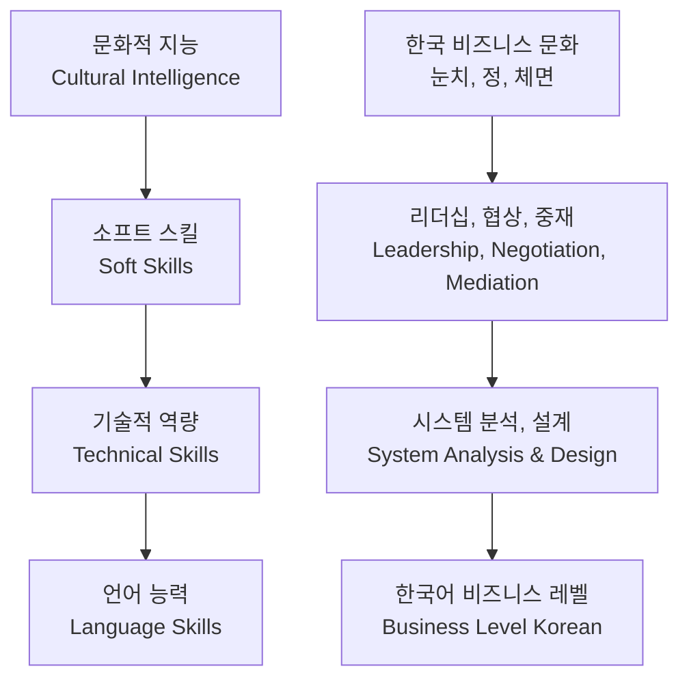
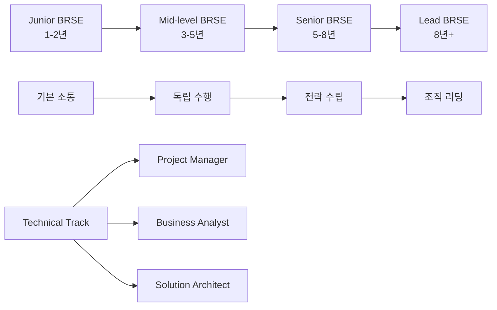

# Bài 1: BRSE là ai và vai trò trong dự án?

*Understanding the Bridge Role in Korean-Vietnamese Software Development*

\---

## 🎯 **학습목표** (Mục tiêu bài học)

Sau khi hoàn thành bài học này, bạn sẽ:
- **정의** (định nghĩa) chính xác BRSE và vai trò **가교 역할** (cầu nối) trong **소프트웨어 개발** (phát triển phần mềm)
- **이해** (hiểu rõ) các **핵심 책임** (trách nhiệm cốt lõi) của BRSE trong **프로젝트 관리** (quản lý dự án)
- **설명** (giải thích) tại sao BRSE là **중요한 연결고리** (mắt xích quan trọng) giữa **고객** (khách hàng) và **개발팀** (đội phát triển)
- **활용** (ứng dụng) các **전문용어** (thuật ngữ chuyên môn) tiếng Hàn trong môi trường làm việc thực tế

\---

## 🚀 **BRSE의 정체성** (Bản sắc của BRSE)

### **정의** (Định nghĩa)
**BRSE** (Bridge System Engineer - **브리지 시스템 엔지니어**) là **기술과 비즈니스를 연결하는 전문가** (chuyên gia kết nối công nghệ và kinh doanh). Trong bối cảnh **한-베 협력 프로젝트** (dự án hợp tác Hàn-Việt), BRSE đóng vai trò then chốt như một **문화적 다리** (cây cầu văn hóa).

### **BRSE 역할 매트릭스** (Ma trận vai trò BRSE)

| **영역** (Lĩnh vực) | **책임** (Trách nhiệm) | **필요 스킬** (Kỹ năng cần thiết) | **성공 지표** (Chỉ số thành công) |
|-------------------|----------------------|------------------------------|--------------------------------|
| **기술 커뮤니케이션**<br>*(Giao tiếp kỹ thuật)* | **요구사항** (yêu cầu) 분석 및 **명세서** (đặc tả) 작성 | 한국어, **기술 문서화** (tài liệu hóa kỹ thuật) | **오해율** (tỷ lệ hiểu lầm) < 5% |
| **비즈니스 분석**<br>*(Phân tích kinh doanh)* | **업무 프로세스** (quy trình nghiệp vụ) 이해 및 **솔루션** (giải pháp) 제안 | **도메인 지식** (kiến thức chuyên ngành), 분석 능력 | **고객 만족도** (độ hài lòng khách hàng) > 8/10 |
| **프로젝트 관리**<br>*(Quản lý dự án)* | **일정** (tiến độ) 추적 및 **위험** (rủi ro) 관리 | 계획 수립, **리더십** (lãnh đạo) | **일정 준수율** (tỷ lệ tuân thủ tiến độ) > 90% |
| **문화적 가교**<br>*(Cầu nối văn hóa)* | 한-베 **문화 차이** (khác biệt văn hóa) 조율 | **문화적 감수성** (nhạy cảm văn hóa), **중재** (hòa giải) | **팀 조화도** (độ hòa hợp team) > 8/10 |

\---

## 🎭 **실제 상황: BRSE의 하루** (Tình huống thực tế: Một ngày của BRSE)

### **배경** (Background)
**회사**: TMA Solutions Vietnam  
**고객**: **삼성전자** (Samsung Electronics)  
**프로젝트**: **스마트TV** (Smart TV) **펌웨어** (firmware) 개발  
**BRSE**: 김민석 (5년 경험)

### **오전 9:00 - 긴급 상황 발생** 
**삼성 PM (박과장)**: 
"어제 **테스트** (kiểm thử)에서 **Netflix 연동** (kết nối Netflix) **오류** (lỗi)가 발견됐어요. **출시일정** (lịch ra mắt) 3주 남았는데 **심각한 문제** (vấn đề nghiêm trọng)네요!"

**베트남 Tech Lead (Duc)**: 
"우리는 **명세서** (đặc tả) 대로 **구현** (triển khai)했는데요. **API 문서** (tài liệu API)에 이런 **케이스** (trường hợp) 없었어요!"

**💥 갈등상황**: 한국측은 **책임 추궁** (truy cứu trách nhiệm), 베트남측은 **억울함** (ức ức)

### **BRSE의 위기 대응** (Ứng phó khủng hoảng của BRSE)

#### **1단계: 상황 파악** (Nắm bắt tình hình)
```korean
BRSE 김민석: "일단 침착하게 상황을 정리해보겠습니다. 
박과장님, 구체적으로 어떤 오류가 발생했는지 보여주시겠어요?"

→ 감정적 대응 방지, 사실 중심 접근
```

#### **2단계: 기술적 분석** (Phân tích kỹ thuật)
- **로그 분석** (phân tích log): Netflix API **응답 코드** (mã phản hồi) 확인
- **테스트 환경** (môi trường test) vs **운영 환경** (môi trường vận hành) 차이점 식별
- **타임라인** (dòng thời gian) 재구성: 언제부터 **문제** (vấn đề) 시작되었나?

#### **3단계: 해결책 제시** (Đưa ra giải pháp)
```korean
"분석 결과, Netflix 측에서 API 버전을 업데이트했는데 
저희가 미처 파악하지 못했네요. 

해결방안:
1. 단기: 기존 API 버전 유지 (2일)
2. 중기: 신규 API 적용 및 테스트 (1주)  
3. 장기: API 변경 모니터링 시스템 구축"
```

#### **4단계: 관계 회복** (Phục hồi mối quan hệ)
```korean
한국측: "신속한 분석과 해결책 감사합니다"
베트남측: "앞으로는 API 변경 알림을 더 주의깊게 보겠습니다"

→ Win-Win 상황으로 전환 성공
```

\---

## 📊 **BRSE 역량 모델** (Mô hình năng lực BRSE)

### **핵심 역량 피라미드** (Kim tự tháp năng lực cốt lõi)



### **레벨별 성장 경로** (Lộ trình phát triển theo cấp độ)

| **레벨** | **경력** (Kinh nghiệm) | **핵심 역량** | **연봉 범위** (Mức lương) | **주요 업무** (Công việc chính) |
|---------|---------------------|-------------|----------------------|-------------------------|
| **주니어 BRSE**<br>*(Junior BRSE)* | 1-2년 | **기본 한국어** (tiếng Hàn cơ bản), **문서 번역** (dịch tài liệu) | 1,000-1,500만원 | **요구사항 수집** (thu thập yêu cầu), **회의 참석** (tham gia họp) |
| **미드 레벨 BRSE**<br>*(Mid-level BRSE)* | 3-5년 | **비즈니스 한국어** (tiếng Hàn kinh doanh), **프로젝트 관리** (quản lý dự án) | 1,500-2,500만원 | **독립적 고객 대응** (ứng phó khách hàng độc lập), **팀 리딩** (dẫn dắt team) |
| **시니어 BRSE**<br>*(Senior BRSE)* | 5-8년 | **전략적 사고** (tư duy chiến lược), **복잡한 협상** (đàm phán phức tạp) | 2,500-4,000만원 | **사업 개발** (phát triển kinh doanh), **대형 프로젝트** (dự án lớn) 총괄 |
| **리드 BRSE**<br>*(Lead BRSE)* | 8년+ | **조직 관리** (quản lý tổ chức), **전략 수립** (xây dựng chiến lược) | 4,000만원+ | **부서 운영** (vận hành bộ phận), **신사업** (kinh doanh mới) 기획 |

\---

## 🎪 **실전 시뮬레이션** (Mô phỏng thực tế)

### **시나리오**: E-commerce 플랫폼 개발

#### **등장인물**
- **고객**: 롯데온라인 **디지털마케팅팀장** (팀장 김상훈)
- **BRSE**: 당신 (3년 경험)
- **개발팀**: 베트남 5명 (Tech Lead: Minh)

#### **상황 전개**
**김팀장**: "**모바일앱** (ứng dụng di động)에서 **구매전환율** (tỷ lệ chuyển đổi mua hàng)이 너무 낮아요. **경쟁사** (đối thủ cạnh tranh) 대비 30% 떨어져 있어서 **매출** (doanh thu) 타격이 심각합니다."

**당신의 미션**: 
1. **문제 분석** (phân tích vấn đề): 전환율 저하의 **근본 원인** (nguyên nhân căn bản) 파악
2. **해결책 도출** (đưa ra giải pháp): 기술적, 비즈니스적 **개선방안** (phương án cải thiện) 제시
3. **팀 조율** (điều phối team): 한국-베트남팀 간 **의견 통합** (thống nhất ý kiến)

#### **분석 프레임워크**

**사용자 여정 분석** (Phân tích hành trình người dùng)
```korean
1. 앱 진입 → 95% (문제없음)
2. 상품 검색 → 78% (개선 필요)  
3. 상품 상세 → 45% (심각한 문제)
4. 장바구니 → 32% (매우 심각)
5. 결제 완료 → 28% (치명적)
```

**기술적 이슈** (Vấn đề kỹ thuật)
- **로딩 속도** (tốc độ tải): 평균 4.2초 (목표: 2초 이하)
- **UI/UX 문제** (vấn đề giao diện): 한국 사용자 **사용 패턴** (pattern sử dung) 미반영
- **결제 시스템** (hệ thống thanh toán): **간편결제** (thanh toán đơn giản) 미지원

\---

## 🛠️ **핵심 업무 도구** (Công cụ làm việc cốt lõi)

### **커뮤니케이션 도구** (Công cụ giao tiếp)
- **Slack**: 일상 소통 및 **즉시 피드백** (phản hồi tức thì)
- **Teams**: **공식 회의** (họp chính thức) 및 **화면 공유** (chia sẻ màn hình)
- **Email**: **공식 문서** (tài liệu chính thức) 및 **보고서** (báo cáo)

### **프로젝트 관리 도구** (Công cụ quản lý dự án)
- **Jira**: **이슈 트래킹** (theo dõi vấn đề) 및 **스프린트** (sprint) 관리
- **Confluence**: **문서 관리** (quản lý tài liệu) 및 **지식 공유** (chia sẻ kiến thức)
- **Figma**: **UI/UX 디자인** (thiết kế giao diện) **검토** (rà soát)

### **분석 및 모니터링** (Phân tích và giám sát)
- **Google Analytics**: **사용자 행동** (hành vi người dùng) 분석
- **DataDog**: **시스템 성능** (hiệu năng hệ thống) 모니터링
- **Mixpanel**: **전환율 분석** (phân tích tỷ lệ chuyển đổi)

\---

## 🏆 **실전 연습 문제** (Bài tập thực hành)

### **상황**: 온라인 교육 플랫폼 구축

#### **고객 요청사항**
**클라이언트**: **YBM교육** (YBM Education)  
**담당자**: 이사업본부장 (본부장 최정호)

**최본부장**: "**코로나19** (Covid-19) 이후 **온라인 수업** (lớp học trực tuyến) **수요** (nhu cầu)가 폭증했어요. 현재 **시스템** (hệ thống)으로는 **동시접속자** (người truy cập đồng thời) 1,000명도 버티기 어려워서 **서버 다운** (sập server)이 자주 발생합니다. **확장성** (khả năng mở rộng) 있는 새로운 플랫폼이 시급해요."

#### **당신의 분석 과제**

**1단계: 문제점 식별** (Xác định vấn đề)
```markdown
현재 시스템 분석:
- 서버 용량: ___________
- 데이터베이스: __________  
- 네트워크: ____________
- 사용자 경험: __________
```

**2단계: 요구사항 명확화** (Làm rõ yêu cầu)
다음 영역에 대한 **구체적 질문** (câu hỏi cụ thể) 3개씩 만들어보세요:

**기술적 요구사항** (Yêu cầu kỹ thuật):
1. "**동시접속자** (số người truy cập đồng thời) **목표** (mục tiêu)는 정확히 몇 명인가요?"
2. "**비디오 품질** (chất lượng video)은 어느 정도로 원하시나요? (720p, 1080p, 4K)"
3. "**모바일 지원** (hỗ trợ di động)은 필수인가요, 아니면 **웹 브라우저** (trình duyệt web)만으로도 충분한가요?"

**비즈니스 요구사항** (Yêu cầu kinh doanh):
1. ________________________________
2. ________________________________  
3. ________________________________

**사용자 경험 요구사항** (Yêu cầu trải nghiệm người dùng):
1. ________________________________
2. ________________________________
3. ________________________________

### **해결책 제안 템플릿** (Template đề xuất giải pháp)

```korean
## 기술 아키텍처 제안

### 1. 클라우드 인프라
- AWS/Azure 기반 **Auto Scaling** (tự động mở rộng)
- CDN 적용으로 **글로벌 성능** (hiệu năng toàn cầu) 최적화
- **로드밸런싱** (cân bằng tải)으로 **안정성** (tính ổn định) 확보

### 2. 개발 일정
- Phase 1 (2개월): **기본 플랫폼** (nền tảng cơ bản) 구축
- Phase 2 (1개월): **고급 기능** (tính năng nâng cao) 추가  
- Phase 3 (1개월): **성능 최적화** (tối ưu hóa hiệu năng) 및 **테스트** (kiểm thử)

### 3. 예상 비용
- **개발비용** (chi phí phát triển): _______만원
- **운영비용** (chi phí vận hành): 월 _____만원
- **유지보수** (bảo trì): 연 _____만원
```

\---

## 📈 **성공 지표 및 KPI** (Chỉ số thành công và KPI)

### **BRSE 개인 성과 측정** (Đo lường thành tích cá nhân BRSE)

| **영역** | **KPI** | **목표치** | **측정 방법** |
|---------|---------|-----------|-------------|
| **고객 만족도**<br>*(Sự hài lòng khách hàng)* | 고객 평가 점수 | 4.5/5.0 이상 | **분기별** (hàng quý) 설문조사 |
| **프로젝트 성공률**<br>*(Tỷ lệ thành công dự án)* | 일정/예산 준수 | 90% 이상 | **월간** (hàng tháng) 프로젝트 리뷰 |
| **커뮤니케이션 효율성**<br>*(Hiệu quả giao tiếp)* | **오해로 인한** (do hiểu lầm) 재작업율 | 5% 미만 | **이슈 트래킹** (theo dõi vấn đề) 시스템 |
| **팀 협업 지수**<br>*(Chỉ số hợp tác team)* | 팀 만족도 조사 | 4.0/5.0 이상 | **반기별** (6 tháng một lần) 360도 평가 |

### **경력 발전 로드맵** (Lộ trình phát triển sự nghiệp)



\---

## 🎯 **자가진단 체크리스트** (Danh sách tự đánh giá)

### **현재 역량 점검** (Kiểm tra năng lực hiện tại)

**기술적 역량** (Năng lực kỹ thuật) - 각 항목을 1-5점으로 평가하세요:

- [ ] **시스템 분석** (phân tích hệ thống) 능력: ___점
- [ ] **요구사항 정의** (định nghĩa yêu cầu) 능력: ___점  
- [ ] **기술 문서 작성** (viết tài liệu kỹ thuật): ___점
- [ ] **데이터베이스** (cơ sở dữ liệu) 이해: ___점

**소프트 스킬** (Kỹ năng mềm):

- [ ] **한국어 비즈니스** (tiếng Hàn kinh doanh) 커뮤니케이션: ___점
- [ ] **프레젠테이션** (thuyết trình) 스킬: ___점
- [ ] **갈등 해결** (giải quyết xung đột) 능력: ___점  
- [ ] **문화적 이해도** (hiểu biết văn hóa): ___점

**개선 계획 수립** (Lập kế hoạch cải thiện):
```markdown
가장 약한 영역: ________________
구체적 개선 방법: ______________
목표 달성 시기: _______________
```

\---

*"BRSE는 단순한 **번역가** (người dịch)가 아니라, 두 세계를 **연결하는 창조자** (người sáng tạo kết nối)입니다."*  
*- 성공한 BRSE의 철학 -*

---

*Post ID: 05gz1ikklwvxjez*  
*Category: BRSE*  
*Created: 2/9/2025*  
*Updated: 2/9/2025*
