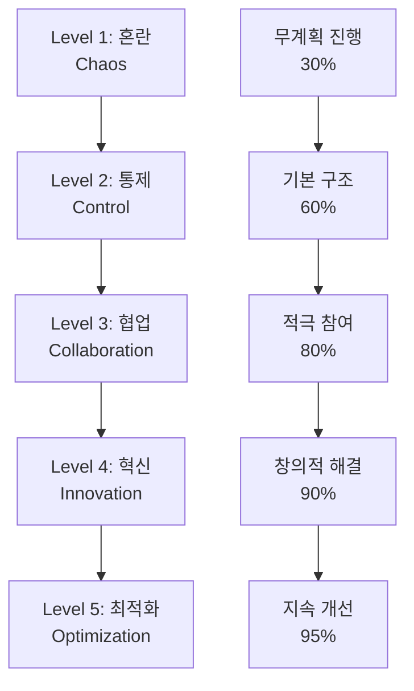
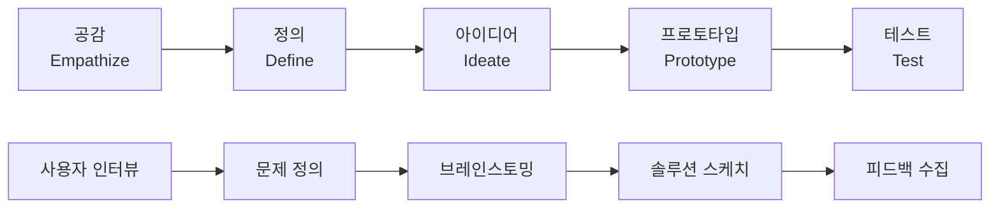
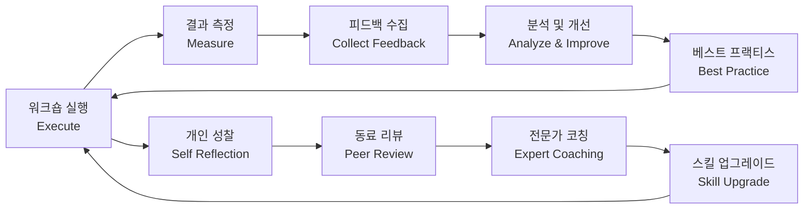

# Bài 15: Thực hành workshop thu thập yêu cầu

*Mastering Requirements Gathering Workshops in Korean Business Environment*

\---

## 🎯 **학습목표** (Mục tiêu học tập)

Sau khi hoàn thành bài học này, bạn sẽ:
- Thành thạo **요구사항 수집 워크숍** (workshop thu thập yêu cầu) thiết계 và **진행** (điều hành)
- Áp dụng **퍼실리테이션** (facilitation) chuyên nghiệp trong môi trường đa văn hóa
- Quản lý **이해관계자 갈등** (xung đột stakeholder) và **의견 조율** (điều phối ý kiến)
- Tài liệu hóa **합의사항** (thỏa thuận) và **액션 아이템** (hành động cụ thể)

\---

## 🚨 **재앙적인 워크숍** (Workshop thảm họa)

### **배경** (Background)
**회사**: TMA Solutions  
**고객**: **KB국민은행** (KB Kookmin Bank)  
**프로젝트**: **디지털뱅킹** (digital banking) 플랫폼 - 500억원  
**참석자**: 15명 (한국 8명 + 베트남 7명)

### **혼돈의 워크숍** (Workshop hỗn loạn)
**🔥 4시간 워크숍 - 목요일 오후 2시**

**베트남 BRSE (준비부족)**: 
"안녕하세요! 오늘 **요구사항** (yêu cầu)에 대해 이야기해보겠습니다."

**KB 디지털혁신부장 (박부장)**: 
"구체적으로 뭘 하려고 하는 거예요? **의제** (chương trình nghị sự)도 없고..."

**KB IT팀장 (김팀장)**: 
"시간이 없는데 **목표** (mục tiêu)가 뭔지 모르겠네요."

**베트남 개발팀**: 
"저희는 **기술적인** (kỹ thuật) 얘기만 하면 되는 거죠?"

**KB 마케팅팀**: 
"**사용자 경험** (trải nghiệm người dùng)이 우선인데 왜 **기술** (công nghệ)부터 얘기해요?"

**💥 1시간 후 결과**:
- **참석자** (người tham gia) 3명 중도 퇴장
- **의견 충돌** (xung đột ý kiến) 지속적 발생  
- **결론** (kết luận) 도출 실패
- **신뢰도** (độ tin cậy) 급락
- **프로젝트 위기** (khủng hoảng dự án)

\---

## 📊 **워크숍 성공 공식** (Workshop Success Formula)

### **한-베 워크숍 문화 차이**

| **문화 요소** | **한국 스타일** | **베트남 스타일** | **통합 전략** |
|-------------|---------------|----------------|-------------|
| **의사결정** (decision-making)<br>*Ra quyết định* | **위계적** (thứ bậc), **빠른** (nhanh) | **합의적** (đồng thuận), **신중** (thận trọng) | **단계적 합의** (thỏa thuận từng bước) |
| **소통방식** (communication)<br>*Cách giao tiếp* | **직접적** (trực tiếp), **결과 중심** (tập trung kết quả) | **간접적** (gián tiếp), **과정 중심** (tập trung quy trình) | **명확한 구조** (cấu trúc rõ ràng) |
| **참여도** (participation)<br>*Mức độ tham gia* | **적극적** (tích cực), **발언 많음** (phát biểu nhiều) | **신중함** (thận trọng), **경청 우선** (ưu tiên lắng nghe) | **균형잡힌 참여** (tham gia cân bằng) |
| **갈등처리** (conflict resolution)<br>*Giải quyết xung đột* | **공개적 토론** (thảo luận công khai) | **조화 추구** (theo đuổi hòa hợp) | **건설적 대화** (đối thoại xây dựng) |

### **워크숍 성숙도 모델** (Workshop Maturity Model)



\---

## 🎯 **5단계 워크숍 마스터리** (5-Stage Workshop Mastery)

### **1단계: 전략적 기획** (Strategic Planning)

#### **🔍 사전 분석 매트릭스**

| **분석 영역** | **조사 항목** | **정보 수집 방법** | **활용 방안** |
|-------------|-------------|----------------|-------------|
| **이해관계자** (Stakeholders)<br>*Bên liên quan* | 역할, 권한, 관심사 | **1:1 인터뷰** (phỏng vấn cá nhân), 조직도 | **참여 전략** (chiến lược tham gia) 수립 |
| **비즈니스 컨텍스트** (Business Context)<br>*Bối cảnh kinh doanh* | 목표, 제약사항, **우선순위** (ưu tiên) | **문서 검토** (rà soát tài liệu), **경영진 미팅** (họp lãnh đạo) | **워크숍 목표** (mục tiêu workshop) 정의 |
| **기술 환경** (Technical Environment)<br>*Môi trường kỹ thuật* | 현재 시스템, **기술스택** (công nghệ sử dụng), **제약사항** (ràng buộc) | **기술팀 인터뷰** (phỏng vấn đội kỹ thuật) | **실현 가능성** (khả năng thực hiện) 평가 |
| **프로젝트 히스토리** (Project History)<br>*Lịch sử dự án* | 이전 결정, **교훈** (bài học), **실패 요인** (yếu tố thất bại) | **회의록 검토** (xem xét biên bản), **인수인계** (bàn giao) 문서 | **위험 요소** (yếu tố rủi ro) 방지 |

#### **📋 워크숍 설계 프레임워크**

**A. 목표 설정** (Goal Setting)
```korean
SMART 원칙 적용:
S - Specific (구체적): "모바일뱅킹 로그인 프로세스 요구사항 도출"
M - Measurable (측정가능): "핵심 요구사항 15개 이상 식별"
A - Achievable (달성가능): "기존 시스템 제약 내에서"
R - Relevant (관련성): "사용자 편의성과 보안 균형"
T - Time-bound (시간제한): "4시간 내 완료"
```

**B. 참여자 매트릭스** (Participant Matrix)
```korean
핵심 참여자 (Core Participants):
- 의사결정권자 (Decision Makers): 3-4명
- 전문가 (Subject Matter Experts): 4-5명  
- 사용자 대표 (User Representatives): 2-3명
- 퍼실리테이터 (Facilitator): BRSE + 보조진행자

최적 규모: 8-12명 (너무 많으면 비효율, 너무 적으면 다양성 부족)
```

### **2단계: 완벽한 사전준비** (Perfect Pre-preparation)

#### **🎨 창의적 워크숍 도구**

**도구 1: Digital Whiteboard** (**디지털 화이트보드**)
```korean
추천 도구: Miro, Mural, Figma
활용법:
- 실시간 협업 (Real-time Collaboration)
- 아이디어 맵핑 (Idea Mapping)
- 우선순위 투표 (Priority Voting)
- 프로세스 플로우 (Process Flow)
```

**도구 2: Sticky Notes & Dot Voting** (**포스트잇 & 도트보팅**)
```korean
Physical Tools:
- 다양한 색상 포스트잇 (Color-coded Sticky Notes)
- 플립차트 (Flip Charts)  
- 마커펜 (Markers)
- 도트 스티커 (Dot Stickers)

활용 전략:
- 색상별 분류 (노랑: 기능, 파랑: 제약, 빨강: 위험)
- 크기별 우선순위 (대형: Must Have, 중형: Should Have)
```

#### **📝 사전 배포 자료**

**A. 워크숍 초대장** (Workshop Invitation)
```korean
제목: [긴급] KB국민은행 디지털뱅킹 요구사항 워크숍 참석 요청

안녕하십니까?

다음과 같이 디지털뱅킹 플랫폼 요구사항 도출을 위한 
워크숍을 개최하오니 참석해주시기 바랍니다.

📅 일시: 2024년 X월 X일 (목) 14:00~18:00
📍 장소: KB타워 20층 대회의실  
🎯 목표: 핵심 요구사항 도출 및 우선순위 설정
👥 참석자: 디지털혁신팀, IT팀, 마케팅팀, 외부 개발사

사전 준비사항:
- 첨부된 현황 분석 자료 검토
- 각 부서별 핵심 니즈 3가지 준비
- 기술적 제약사항 리스트 작성

감사합니다.
```

### **3단계: 역동적인 워크숍 진행** (Dynamic Workshop Facilitation)

#### **🎭 퍼실리테이션 기법**

**A. 아이스브레이킹** (Ice Breaking)
```korean
한-베 문화 융합 활동:

1. 2분 자기소개: "이름 + 역할 + 이 프로젝트에서 기대하는 것"
2. 기대/우려 매핑: "프로젝트 성공시 좋은 점 vs 실패시 걱정되는 점"
3. 공통점 찾기: "모두가 동의하는 성공 기준 3가지"
```

**B. 브레인스토밍** (Brainstorming) **최적화**
```korean
6-3-5 기법:
- 6명이 3개씩 아이디어 작성
- 5분마다 시트를 옆 사람에게 전달
- 총 30분간 진행
- 결과: 90개 아이디어 도출

실라이언트 브레인스토밍:
- 10분간 개별적으로 아이디어 작성
- 발언권 독점 방지
- 내향적 성격도 참여 가능
```

#### **🎯 합의 도출 전략**

**Fist-to-Five 투표**
```korean
각 아이디어에 대해 손가락 개수로 의견 표시:
👊 0개 (주먹): 강력 반대
👆 1개: 심각한 우려
✌️ 2개: 약간의 우려  
👌 3개: 중립적 지지
🖐️ 4개: 적극 지지
🙋 5개: 강력 추천

3점 이하는 구체적 이유 설명 요청
```

### **4단계: 갈등 관리와 합의 도출** (Conflict Management & Consensus)

#### **🔥 실전 갈등 시나리오**

**상황 1: 기술 vs 비즈니스 충돌**
```korean
IT팀: "보안을 위해 2단계 인증이 필수입니다"
마케팅팀: "사용자 편의성이 떨어져서 이탈률이 증가할 것 같은데요"

BRSE 중재 전략:
1. 양측 입장 정리: "보안 vs 편의성, 둘 다 중요합니다"
2. 데이터 기반 토론: "실제 이탈률 데이터가 있나요?"
3. 창의적 대안 모색: "생체인증으로 보안+편의성 둘 다 해결"
4. 테스트 제안: "A/B 테스트로 실제 영향 측정"
```

**상황 2: 문화적 소통 차이**
```korean
한국측: "빨리 결정하고 진행합시다"
베트남측: "좀 더 신중하게 검토가 필요할 것 같습니다"

BRSE 브릿지 전략:
- 시간 압박 인정: "일정이 촉박한 것은 맞습니다"
- 위험 관리 강조: "하지만 잘못된 결정의 비용이 더 클 수 있습니다"  
- 절충안 제시: "핵심 결정은 오늘, 세부사항은 다음 주"
- 구체적 일정: "월요일까지 상세 검토 후 최종 결정"
```

#### **📊 합의 수준 매트릭스**

| **합의 유형** | **참여자 동의율** | **의사결정 방식** | **적용 상황** |
|-------------|----------------|----------------|-------------|
| **완전 합의** (Full Consensus)<br>*Đồng thuận hoàn toàn* | 100% | 만장일치 | **핵심 아키텍처** (kiến trúc cốt lõi) 결정 |
| **다수 합의** (Majority Consensus)<br>*Đồng thuận đa số* | 70-90% | 다수결 + 소수의견 고려 | **기능 우선순위** (ưu tiên chức năng) |
| **조건부 합의** (Conditional Consensus)<br>*Đồng thuận có điều kiện* | 60-80% | 조건부 승인 | **기술 선택** (lựa chọn công nghệ) |
| **임시 합의** (Temporary Consensus)<br>*Đồng thuận tạm thời* | 50-70% | 추후 재검토 | **실험적 기능** (tính năng thử nghiệm) |

### **5단계: 완벽한 마무리와 후속조치** (Perfect Closure & Follow-up)

#### **📋 액션 아이템 관리**

**RACI 매트릭스 적용**
```korean
R - Responsible (실행 담당자): 누가 실제로 할 것인가?
A - Accountable (결과 책임자): 누가 최종 책임을 질 것인가?  
C - Consulted (자문 대상): 누구와 상의해야 하는가?
I - Informed (정보 공유 대상): 누구에게 알려야 하는가?

예시:
- 요구사항 문서화: R(BRSE), A(PM), C(Tech Lead), I(전체팀)
- 기술 검토: R(Tech Lead), A(CTO), C(BRSE), I(고객)
```

\---

## 🎬 **실전 워크숍 시뮬레이션** (Real Workshop Simulation)

### **시나리오**: 네이버페이 경쟁 서비스 개발

#### **상황 설정**
**고객**: **신한은행** (Shinhan Bank)  
**목표**: 네이버페이 경쟁 **간편결제** (thanh toán đơn giản) 앱  
**참석자**: 12명  
**시간**: 6시간 집중 워크숍

#### **복잡한 이해관계자**
- **경영진** (3명): ROI와 **시장점유율** (thị phần) 관심
- **IT팀** (3명): **보안** (bảo mật)과 **시스템 안정성** (tính ổn định hệ thống) 우선
- **마케팅팀** (2명): **사용자 경험** (trải nghiệm người dùng)과 **차별화** (sự khác biệt) 중시
- **컴플라이언스팀** (2명): **규제 준수** (tuân thủ quy định) 필수
- **개발팀** (2명): **개발 용이성** (dễ dàng phát triển)과 **일정** (tiến độ) 고려

#### **6시간 워크숍 설계**

**Phase 1: 현황 분석** (2시간)
```korean
09:00-09:30 | 아이스브레이킹 및 목표 설정
09:30-10:30 | 경쟁사 분석 (네이버페이, 카카오페이, 토스)
10:30-10:45 | 휴식
10:45-11:00 | 우리 은행의 강점/약점 SWOT 분석
```

**Phase 2: 요구사항 발굴** (2.5시간)  
```korean
11:00-12:00 | 사용자 여정 맵핑 (User Journey Mapping)
12:00-13:00 | 점심 휴식
13:00-14:00 | 핵심 기능 브레인스토밍
14:00-14:30 | 기능별 상세 요구사항 정의
```

**Phase 3: 우선순위 및 합의** (1.5시간)
```korean
14:30-14:45 | 휴식
14:45-15:30 | MoSCoW 우선순위 설정
15:30-16:00 | 갈등 조정 및 최종 합의
```

\---

## 🛠️ **고급 퍼실리테이션 도구** (Advanced Facilitation Tools)

### **🎨 창의적 기법 모음**

#### **1. 디자인 씽킹** (Design Thinking) **워크숍**


#### **2. 월드 카페** (World Cafe) **방식**
```korean
진행 방식:
- 4-5개 테이블에 각각 다른 주제 배치
- 참석자들이 20분마다 테이블 이동
- 각 테이블에 호스트 1명 고정
- 마지막에 전체 공유 세션

주제 예시:
- 테이블 1: 사용자 인터페이스
- 테이블 2: 보안 요구사항  
- 테이블 3: 성능 기준
- 테이블 4: 마케팅 전략
```

#### **3. 피쉬볼** (Fishbowl) **토론**
```korean
구조:
- 중앙에 4-5개 의자 (토론 참여자)
- 주변에 관찰자들이 원형으로 앉음
- 한 의자는 항상 비워둠 (참여 희망자용)
- 토론 참여는 자유롭게

장점:
- 소수의 집중 토론 + 다수의 경청
- 참여 의향에 따른 자율적 참여
- 논쟁적 주제에 효과적
```

### **📊 워크숍 성과 측정**

#### **실시간 만족도 체크**
```korean
15분마다 체크:
👍 Energy Check: "지금 에너지 레벨은? (1-5)"
🎯 Focus Check: "목표 달성도는? (1-5)"  
⏰ Time Check: "진행 속도는? (빠름/적정/느림)"
💬 Participation Check: "참여도는? (높음/보통/낮음)"
```

#### **최종 성과 지표**

| **측정 영역** | **성공 기준** | **측정 방법** | **개선 액션** |
|-------------|-------------|-------------|-------------|
| **목표 달성** (Goal Achievement)<br>*Đạt mục tiêu* | 계획 대비 90% 이상 | **체크리스트** (danh sách kiểm tra) 완료율 | **미완료 항목** (mục chưa hoàn thành) 후속 처리 |
| **참여 만족도** (Participation Satisfaction)<br>*Sự hài lòng tham gia* | 평균 4.0/5.0 이상 | **익명 설문** (khảo sát ẩn danh) | **불만 요소** (yếu tố không hài lòng) 개선 |
| **합의 수준** (Consensus Level)<br>*Mức độ đồng thuận* | 핵심 결정 80% 합의 | **투표 결과** (kết quả bỏ phiếu) 분석 | **이견** (ý kiến khác) 조율 |
| **실행 가능성** (Actionability)<br>*Khả năng thực hiện* | 액션 아이템 100% 명확 | RACI 매트릭스 완성도 | **모호한 항목** (mục mơ hồ) 구체화 |

\---

## 🎯 **마스터 레벨 도전과제** (Master Level Challenge)

### **미션**: 멀티 사이트 글로벌 워크숍

#### **극한 상황**
**프로젝트**: **삼성페이** (Samsung Pay) 글로벌 확장  
**참석자**: 24명 (서울 8명 + 호치민 8명 + 싱가포르 8명)  
**방식**: **하이브리드 워크숍** (hybrid workshop) (온/오프라인 동시)  
**시간대**: 3개 시간대 고려  
**언어**: 한국어, 영어, 베트남어 혼재

#### **복잡성 요소**
1. **문화적 다양성**: 한국(위계문화) + 베트남(합의문화) + 싱가포르(효율문화)
2. **기술적 도전**: 실시간 협업 도구, 동시통역, 네트워크 안정성
3. **시간 제약**: 각 사이트 근무시간 고려한 3시간 창구
4. **언어 장벽**: 실시간 번역, 문화적 뉘앙스
5. **의사결정 복잡성**: 다양한 법규, 시장 환경, 기술 제약

#### **성공 기준**
- **동시 참여율**: 90% 이상 유지
- **의사소통 효율성**: 번역 지연 5초 이내  
- **결과 도출**: **핵심 합의사항** (thỏa thuận cốt lõi) 15개 이상
- **후속 실행**: **액션 플랜** (kế hoạch hành động) 100% 명확화

\---

## 📚 **워크숍 마스터의 비밀** (Workshop Master's Secrets)

### **🎯 황금 법칙 12가지**

1. **준비가 성공의 80%** (Preparation is 80% of Success)
   ```korean
   "완벽한 준비는 예상치 못한 상황도 기회로 만든다"
   ```

2. **침묵을 두려워하지 마라** (Don't Fear Silence)
   ```korean
   "침묵은 생각할 시간, 강제로 채우지 마라"
   ```

3. **모든 목소리를 들어라** (Hear Every Voice)
   ```korean
   "조용한 사람의 한 마디가 가장 중요할 수 있다"
   ```

4. **에너지를 관리하라** (Manage Energy)
   ```korean
   "참여자의 에너지가 떨어지면 아무리 좋은 아이디어도 나오지 않는다"
   ```

5. **갈등을 기회로 보라** (See Conflict as Opportunity)
   ```korean
   "갈등 없는 워크숍은 새로운 것을 만들어내지 못한다"
   ```

6. **시각화하라** (Visualize Everything)
   ```korean
   "보이지 않는 것은 기억되지 않는다"
   ```

7. **결정을 강요하지 마라** (Don't Force Decisions)
   ```korean
   "억지로 내린 결정은 나중에 뒤집어진다"
   ```

8. **프로세스를 믿어라** (Trust the Process)
   ```korean
   "좋은 프로세스는 자연스럽게 좋은 결과를 만든다"
   ```

9. **문화를 존중하라** (Respect Culture)
   ```korean
   "문화적 차이를 이해해야 진정한 소통이 가능하다"
   ```

10. **완벽을 추구하지 마라** (Don't Seek Perfection)
    ```korean
    "80%의 좋은 결정이 100%의 완벽한 계획보다 낫다"
    ```

11. **후속조치가 핵심이다** (Follow-up is Key)
    ```korean
    "워크숍 후 첫 24시간이 성공을 결정한다"
    ```

12. **즐거움을 잊지 마라** (Don't Forget Fun)
    ```korean
    "즐거운 워크숍에서 창의적 아이디어가 나온다"
    ```

\---

## 📝 **자가진단 체크리스트** (Self-Assessment Checklist)

### **워크숍 기획 역량**
- [ ] **목표 설정** (thiết lập mục tiêu): SMART 기준에 맞는 구체적 목표 수립
- [ ] **참석자 선정** (lựa chọn người tham gia): 적절한 **이해관계자** (stakeholder) 식별 및 초대
- [ ] **의제 구성** (cấu trúc chương trình nghị sự): 논리적이고 시간 효율적인 **프로그램** (chương trình) 설계
- [ ] **자료 준비** (chuẩn bị tài liệu): 사전 배포 자료 및 **워크숍 도구** (công cụ workshop) 완비

### **퍼실리테이션 실행 역량**
- [ ] **분위기 조성** (tạo bầu không khí): 편안하고 **협력적인** (hợp tác) 환경 조성
- [ ] **참여 유도** (khuyến khích tham gia): 모든 참석자의 **적극적 참여** (tham gia tích cực) 이끌어내기
- [ ] **시간 관리** (quản lý thời gian): **의제** (chương trình nghị sự) 준수 및 효율적 진행
- [ ] **갈등 조정** (điều phối xung đột): **의견 차이** (sự khác biệt ý kiến) 발생시 **건설적 해결** (giải quyết xây dựng)

### **결과 도출 및 문서화 역량**
- [ ] **합의 도출** (đạt thỏa thuận): 핵심 사안에 대한 **참석자 합의** (đồng thuận người tham gia) 달성
- [ ] **우선순위 설정** (thiết lập ưu tiên): **요구사항** (yêu cầu)의 **중요도** (mức độ quan trọng) 순서 결정
- [ ] **액션 아이템** (hành động cụ thể) 명확화: 구체적 **실행 계획** (kế hoạch thực hiện) 및 **책임자** (người chịu tr책nhiệm) 지정
- [ ] **문서화** (tài liệu hóa): **회의록** (biên bản) 작성 및 **후속 조치** (hành động tiếp theo) 계획 수립

### **문화적 커뮤니케이션 역량**
- [ ] **한국 비즈니스 매너** (phép lịch sự kinh doanh Hàn Quốc): **예의** (lễ phép) 및 **프로토콜** (quy tắc) 준수
- [ ] **다문화 팀** (đội đa văn hóa) 관리: 한국-베트남 **문화 차이** (khác biệt văn hóa) 이해 및 **조화** (hòa hợp) 추구
- [ ] **언어 활용** (sử dụng ngôn ngữ): 상황에 맞는 **한국어** (tiếng Hàn) 및 **영어** (tiếng Anh) 구사
- [ ] **비언어적 소통** (giao tiếp phi ngôn ngữ): **바디랭귀지** (ngôn ngữ cơ thể) 및 **분위기 파악** (nắm bắt không khí) 능력

\---

## 실전 프로젝트 (Dự án thực tế)

### **최종 미션**: 크로스보더 핀테크 플랫폼

#### **프로젝트 개요**
**고객**: **KB국민은행** (KB Kookmin Bank) + **베트남 투자개발은행** (BIDV)  
**목표**: 한-베 **송금 서비스** (dịch vụ chuyển tiền) 플랫폼 구축  
**예산**: 1,000억원  
**기간**: 18개월

#### **워크숍 시리즈 설계**
```markdown
## 6개월 워크숍 로드맵

### Phase 1: 비전 정렬 (Vision Alignment)
**Week 1-2**: 
- 워크숍 1: 사업 목표 및 **성공 지표** (chỉ số thành công) 정의
- 워크숍 2: **사용자 페르소나** (persona người dùng) 및 **여정 맵핑** (lập bản đồ hành trình)

### Phase 2: 요구사항 상세화 (Detailed Requirements)  
**Week 3-6**:
- 워크숍 3: 핵심 **기능 명세** (đặc tả chức năng) 도출
- 워크숍 4: **보안** (bảo mật) 및 **컴플라이언스** (tuân thủ) 요구사항
- 워크숍 5: **성능** (hiệu năng) 및 **확장성** (khả năng mở rộng) 기준

### Phase 3: 아키텍처 설계 (Architecture Design)
**Week 7-10**:
- 워크숍 6: **시스템 아키텍처** (kiến trúc hệ thống) 설계
- 워크숍 7: **데이터 모델링** (mô hình hóa dữ liệu) 및 **API 설계** (thiết kế API)

### Phase 4: 구현 계획 (Implementation Planning)
**Week 11-12**:
- 워크숍 8: **개발 방법론** (phương pháp phát triển) 및 **일정** (tiến độ) 수립
- 워크숍 9: **위험 관리** (quản lý rủi ro) 및 **품질 보증** (đảm bảo chất lượng) 계획
```

#### **성공 평가 기준**
```yaml
정량적 지표:
  참여율: 평균 95% 이상
  만족도: 4.5/5.0 이상  
  합의율: 핵심 결정 90% 이상
  실행률: 액션 아이템 95% 완료

정성적 지표:
  팀 결속력: 강화됨
  문화 통합: 성공적
  의사소통: 원활함
  혁신성: 높음
```

\---

## 지속적 개선 (Continuous Improvement)

### **워크숍 후 학습 사이클**


### **마스터리 발전 경로**
```korean
초급 (Beginner): 기본 워크숍 진행 가능
- 소규모 팀 (5-8명)
- 단순한 주제
- 구조화된 템플릿 활용

중급 (Intermediate): 복잡한 워크숍 관리
- 중규모 팀 (10-15명)  
- 다양한 이해관계자
- 갈등 상황 해결

고급 (Advanced): 전략적 워크숍 설계
- 대규모 팀 (15-25명)
- 멀티 사이트 진행
- 혁신적 기법 적용

전문가 (Expert): 조직 변화 주도
- 기업 레벨 워크숍
- 문화 변화 촉진  
- 새로운 방법론 창조
```

\---

*"워크숍은 단순한 회의가 아니라, 집단 지성을 발휘하여 혁신을 만들어내는 창조의 공간이다."*  
*- 워크숍 마스터의 철학 -*

### **추가 학습 리소스** (Additional Learning Resources)

**추천 도서**:
- "워크숍 설계의 기술" - 실무 가이드북
- "퍼실리테이션의 힘" - 리더십과 소통  
- "한국 기업문화의 이해" - 문화적 맥락

**온라인 자료**:
- **한국생산성본부** (Korea Productivity Center) 워크숍 가이드
- **삼성경제연구소** (Samsung Economic Research Institute) 보고서
- **LG경영개발원** (LG Management Development Institute) 케이스 스터디

**실습 기회**:
- 사내 **교육 워크숍** (workshop đào tạo) 참여
- **오픈소스 프로젝트** (dự án mã nguồn mở) 기여자 모임
- **스타트업 이벤트** (sự kiện startup) 및 **해커톤** (hackathon) 참가

---

*Post ID: 3dcpxpq6ucsmt29*  
*Category: BRSE*  
*Created: 2/9/2025*  
*Updated: 2/9/2025*
