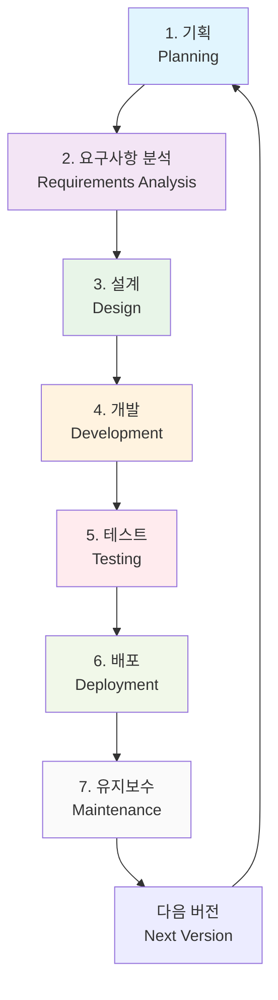
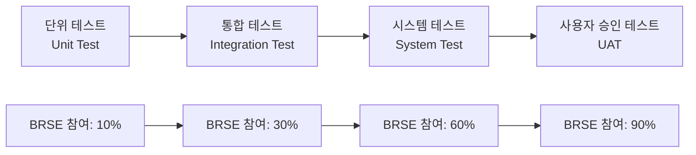
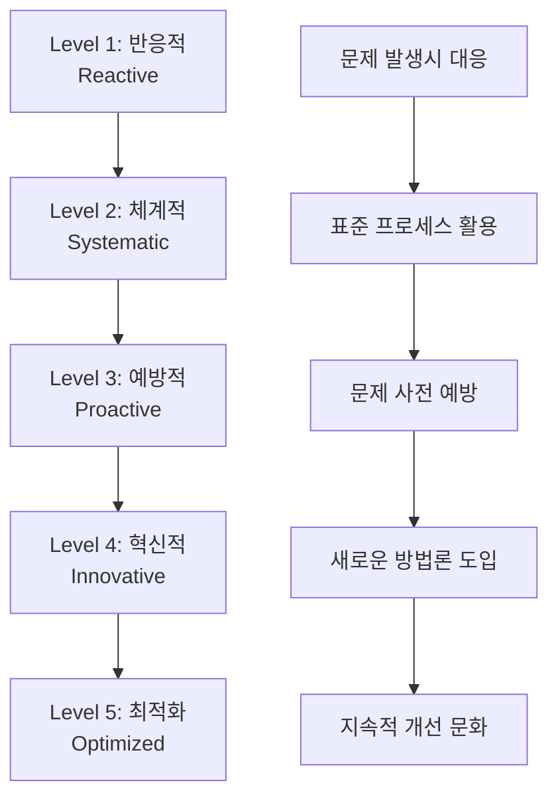
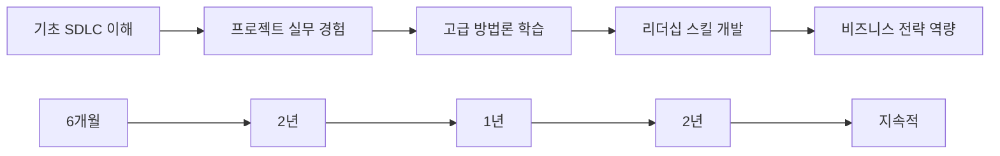

# Bài 3: Vòng đời phát triển phần mềm (SDLC) và vị trí của BRSE

*Software Development Life Cycle and BRSE Role in Korean Projects*

\---

## 🎯 **학습목표** (Mục tiêu bài học)

Sau khi hoàn thành bài học này, bạn sẽ:
- **이해** (hiểu rõ) **소프트웨어 개발 생명주기** (vòng đời phát triển phần mềm) và tầm quan trọng trong **프로젝트 관리** (quản lý dự án)
- **식별** (nhận diện) được **각 단계별** (từng giai đoạn) **핵심 활동** (hoạt động cốt lõi) và **산출물** (sản phẩm đầu ra)
- **분석** (phân tích) **BRSE 역할** (vai trò BRSE) trong **전체 생명주기** (toàn bộ vòng đời)
- **적용** (áp dụng) **한국 기업 환경** (môi trường doanh nghiệp Hàn) vào SDLC **프로세스** (quy trình)

\---

## 🚨 **프로젝트 대혼란** (Dự án đại hỗn loạn - Tình huống thực tế)

### **배경** (Background)
**회사**: Kakao Entertainment Vietnam  
**프로젝트**: **웹툰** (webtoon) **플랫폼** (nền tảng) 글로벌 확장  
**예산**: 800억원  
**기간**: 12개월

### **재앙의 시작** (Bắt đầu thảm họa)
**🔥 6개월 후 - 프로젝트 현황**

**한국 사업팀장 (김이사)**:
"**출시일** (ngày ra mắt)이 3개월 남았는데 **완성도** (độ hoàn thiện)가 30%도 안 돼 보이네요!"

**베트남 개발팀장 (Duc)**:
"저희는 **요구사항** (yêu cầu)대로 **개발** (phát triển)했는데, **테스트** (kiểm thử) 단계에서 **오류** (lỗi)가 너무 많이 나와요!"

**한국 디자이너 (박과장)**:
"**UI/UX 디자인** (thiết kế giao diện)을 **승인** (phê duyệt) 받았는데 **구현된 화면** (màn hình được triển khai)이 완전히 달라요!"

**베트남 QA팀 (Linh)**:
"**테스트 케이스** (test case)를 만들려는데 **명세서** (đặc tả)가 **애매** (mơ hồ)해서 뭘 **검증** (xác minh)해야 할지 모르겠어요!"

**💥 문제 진단**: **체계적인 SDLC 프로세스** (quy trình SDLC có hệ thống) 부재로 인한 **전면적 혼란** (hỗn loạn toàn diện)!

\---

## 📊 **SDLC 전체 구조** (Cấu trúc tổng thể SDLC)

### **소프트웨어 개발 생명주기** (Vòng đời phát triển phần mềm) 개요

**SDLC**는 **품질 높은** (chất lượng cao) **소프트웨어** (phần mềm)를 **효율적** (hiệu quả)이고 **예측 가능한** (có thể dự đoán) 방식으로 만들기 위한 **구조화된 프로세스** (quy trình có cấu trúc)입니다.

### **7단계 SDLC 플로우차트** (Lưu đồ SDLC 7 giai đoạn)



\---

## 🎭 **단계별 BRSE 역할 상세 분석** (Phân tích chi tiết vai trò BRSE từng giai đoạn)

### **1단계: 기획** (Planning) - **전략적 파트너** (Đối tác chiến lược)

#### **주요 활동** (Hoạt động chính)
- **사업성 검토** (xem xét tính khả thi kinh doanh)
- **기술적 타당성** (tính khả thi kỹ thuật) 조사
- **초기 예산** (ngân sách ban đầu) 및 **일정** (lịch trình) 수립

#### **BRSE 핵심 기여** (Đóng góp cốt lõi của BRSE)
```korean
✅ 고객 비즈니스 목표 이해 및 번역
✅ 기술팀과 비즈니스팀 간 초기 정렬
✅ 프로젝트 범위 및 제약사항 명확화
✅ 위험 요소 사전 식별
```

#### **실제 사례** (Ví dụ thực tế)
**상황**: **카카오뱅크** (Kakao Bank) **모바일 앱** (ứng dụng di động) 리뉴얼

**한국 기획팀**: "**사용자 경험** (trải nghiệm người dùng) 혁신이 목표입니다."
**BRSE 번역**: "구체적으로는 **로그인 시간** (thời gian đăng nhập) 50% 단축, **거래 단계** (bước giao dịch) 3단계로 축소를 의미합니다."

### **2단계: 요구사항 분석** (Requirements Analysis) - **BRSE의 메인 스테이지** (Sân khấu chính của BRSE)

#### **BRSE 활동 비중** (Tỷ trọng hoạt động BRSE): **80%** 🔥

| **세부 활동** | **BRSE 책임도** | **산출물** | **한국어 용어** |
|-------------|----------------|-----------|-------------|
| **고객 인터뷰** (phỏng vấn khách hàng) | 100% | **인터뷰 보고서** (báo cáo phỏng vấn) | **고객 면담** |
| **요구사항 문서화** (tài liệu hóa yêu cầu) | 90% | **SRS 문서** (tài liệu SRS) | **요구사항 명세서** |
| **업무 프로세스** (quy trình nghiệp vụ) 분석 | 85% | **프로세스 맵** (bản đồ quy trình) | **업무 흐름도** |
| **기능 우선순위** (ưu tiên chức năng) 결정 | 70% | **우선순위 매트릭스** (ma trận ưu tiên) | **기능 순위표** |

#### **고급 요구사항 수집 기법** (Kỹ thuật thu thập yêu cầu nâng cao)

**A. 5W1H 분석법**
```korean
Who (누가): 사용자 페르소나 정의
What (무엇을): 핵심 기능 식별  
When (언제): 사용 시점 및 빈도
Where (어디서): 사용 환경 및 플랫폼
Why (왜): 비즈니스 가치 및 목적
How (어떻게): 구현 방식 및 제약사항
```

**B. 사용자 스토리 맵핑** (User Story Mapping)
```korean
Epic: 온라인 쇼핑 경험 개선
├── Feature: 상품 검색 및 필터링
│   ├── Story: 키워드로 상품 검색
│   ├── Story: 가격대별 필터링
│   └── Story: 브랜드별 정렬
└── Feature: 결제 프로세스 간소화
    ├── Story: 원클릭 결제
    └── Story: 다중 결제수단 지원
```

### **3단계: 설계** (Design) - **번역가와 검증자** (Người dịch và xác minh)

#### **설계 단계 BRSE 미션** (Nhiệm vụ BRSE trong giai đoạn thiết kế)

**기술 설계 검토** (Rà soát thiết kế kỹ thuật):
- **시스템 아키텍처** (kiến trúc hệ thống) 이해 및 **고객 설명** (giải thích cho khách hàng)
- **데이터베이스 설계** (thiết kế cơ sở dữ liệu) **요구사항 부합성** (tính phù hợp với yêu cầu) 검증
- **API 명세** (đặc tả API) **고객 승인** (phê duyệt khách hàng) 프로세스 관리

**UI/UX 설계 브릿지** (Cầu nối thiết kế UI/UX):
```korean
디자이너 언어: "인터랙티브한 사용자 경험"
BRSE 번역: "클릭 2회 내 목표 달성, 직관적 네비게이션"
고객 이해: "사용자가 쉽고 빠르게 원하는 기능 이용"
```

### **4단계: 개발** (Development) - **실시간 컨설턴트** (Tư vấn viên thời gian thực)

#### **개발 단계 도전과제** (Thách thức giai đoạn phát triển)

**일반적 문제들**:
- **요구사항 해석** (diễn giải yêu cầu) 모호함
- **기술적 제약** (hạn chế kỹ thuật) vs **비즈니스 요구** (nhu cầu kinh doanh) 충돌
- **변경 요청** (yêu cầu thay đổi) 빈발

**BRSE 해결 전략**:
```korean
문제: "이 기능이 정확히 어떻게 동작해야 하나요?"
BRSE 대응: 
1. 요구사항 문서 재검토
2. 고객사 담당자 직접 컨택  
3. 명확한 답변을 개발팀에 전달
4. 문서 업데이트로 재발 방지
```

#### **개발 현황 모니터링** (Giám sát tình hình phát triển)

| **모니터링 영역** | **BRSE 역할** | **주기** | **도구** |
|-----------------|-------------|---------|---------|
| **진척률** (tỷ lệ tiến độ) | 일일 **스탠드업** (daily standup) 참여 | 매일 | **Jira**, **Trello** |
| **품질** (chất lượng) | **코드 리뷰** (review mã) 품질 확인 | 주간 | **GitLab**, **GitHub** |
| **이슈** (vấn đề) | **블로킹 이슈** (vấn đề chặn) 해결 지원 | 실시간 | **Slack**, **Teams** |

### **5단계: 테스트** (Testing) - **품질 보증 파트너** (Đối tác đảm bảo chất lượng)

#### **테스트 유형별** (Theo loại kiểm thử) **BRSE 참여도** (mức độ tham gia BRSE)



#### **UAT (사용자 승인 테스트)** 리더십

**BRSE의 UAT 책임** (Trách nhiệm UAT của BRSE):
- **테스트 시나리오** (kịch bản kiểm thử) 작성 지원
- **고객 테스트** (kiểm thử khách hàng) 환경 준비
- **결함** (khiếm khuyết) 재현 및 **우선순위** (ưu tiên) 조정
- **최종 승인** (phê duyệt cuối cùng) 프로세스 관리

### **6단계: 배포** (Deployment) - **런칭 코디네이터** (Điều phối viên ra mắt)

#### **배포 프로세스** (Quy trình triển khai) 관리

**배포 전 체크리스트**:
- [ ] **운영 환경** (môi trường vận hành) **테스트** (kiểm thử) 완료
- [ ] **사용자 매뉴얼** (hướng dẫn người dùng) 및 **교육 자료** (tài liệu đào tạo) 준비
- [ ] **고객사 IT팀** (đội IT khách hàng) **인수인계** (bàn giao) 완료
- [ ] **장애 대응** (ứng phó sự cố) **체계** (hệ thống) 구축

### **7단계: 유지보수** (Maintenance) - **지속적 파트너** (Đối tác bền vững)

#### **유지보수 유형별** (Theo loại bảo trì) 대응

| **유형** | **예시** | **BRSE 역할** | **대응 시간** |
|---------|---------|-------------|-------------|
| **긴급 수정** (sửa chữa khẩn cấp) | 시스템 다운, **보안 취약점** (lỗ hổng bảo mật) | **즉시 대응** (ứng phó ngay lập tức) 총괄 | 2시간 이내 |
| **기능 개선** (cải tiến tính năng) | **성능 최적화** (tối ưu hóa hiệu năng), UI 개선 | **요구사항 분석** (phân tích yêu cầu) 재수행 | 1-2주 |
| **신규 기능** (tính năng mới) | **추가 모듈** (mô-đun bổ sung) 개발 | 새로운 **SDLC 사이클** (chu kỳ SDLC) 시작 | **프로젝트 규모** (quy mô dự án)에 따라 |

\---

## 🎪 **실전 시나리오 분석** (Phân tích tình huống thực tế)

### **케이스 스터디**: **네이버 쇼핑** (Naver Shopping) **추천 시스템** (hệ thống gợi ý)

#### **프로젝트 배경**
- **목표**: **AI 기반** (dựa trên AI) **개인화** (cá nhân hóa) **상품 추천** (gợi ý sản phẩm)
- **기간**: 8개월
- **팀**: 한국 **데이터 사이언티스트** (data scientist) 5명 + 베트남 **백엔드 개발자** (lập trình viên backend) 8명

#### **각 단계별 실제 상황** (Tình huống thực tế từng giai đoạn)

**1단계 문제**: 
```korean
한국팀: "머신러닝으로 구매 패턴 분석해서 추천해주면 돼"
베트남팀: "구체적인 알고리즘과 데이터 구조는 뭐죠?"
```
**BRSE 해결**: **기술 요구사항** (yêu cầu kỹ thuật) **워크숍** (workshop) 개최

**2단계 문제**:
```korean
고객: "사용자가 좋아할 만한 상품을 보여주세요"  
개발팀: "좋아한다는 기준이 뭐죠? 클릭? 구매? 장바구니?"
```
**BRSE 해결**: **KPI 정의** (định nghĩa KPI) 및 **우선순위 매트릭스** (ma trận ưu tiên) 작성

**5단계 문제**:
```korean
QA: "추천 정확도를 어떻게 테스트하죠?"
AI팀: "최소 70% 정확도면 통과인데..."  
사업팀: "실제 사용자 반응은 어떻게 측정하죠?"
```
**BRSE 해결**: **A/B 테스트** (A/B test) **시나리오** (kịch bản) 설계 및 **성과 지표** (chỉ số thành quả) 정의

\---

## 📊 **BRSE 효율성 측정** (Đo lường hiệu quả BRSE)

### **단계별 성과 지표** (Chỉ số thành quả từng giai đoạn)

| **단계** | **핵심 KPI** | **목표치** | **측정 방법** |
|---------|-------------|-----------|-------------|
| **기획** | **이해관계자** (stakeholder) 정렬도 | 90%+ | **킥오프** (kick-off) 미팅 **만족도** (độ hài lòng) 조사 |
| **요구사항 분석** | **요구사항 변경률** (tỷ lệ thay đổi yêu cầu) | 15% 미만 | **변경 요청** (yêu cầu thay đổi) 횟수 추적 |
| **설계** | **설계 승인** (phê duyệt thiết kế) **재작업률** (tỷ lệ làm lại) | 10% 미만 | **리뷰** (đánh giá) 사이클 측정 |
| **개발** | **블로킹 이슈** (vấn đề chặn) 해결 시간 | 4시간 이내 | **이슈 트래킹** (theo dõi vấn đề) 시스템 |
| **테스트** | **결함** (khiếm khuyết) **재발률** (tỷ lệ tái phát) | 5% 미만 | **버그 트래킹** (theo dõi lỗi) 도구 |
| **배포** | **배포 성공률** (tỷ lệ triển khai thành công) | 95%+ | **배포 로그** (log triển khai) 분석 |
| **유지보수** | **고객 만족도** (độ hài lòng khách hàng) | 4.0/5.0+ | **분기별** (theo quý) **설문조사** (khảo sát) |

### **BRSE 성숙도 모델** (Mô hình trưởng thành BRSE)



\---

## 🎯 **실전 연습 프로젝트** (Dự án luyện tập thực tế)

### **미션**: **K-뷰티** (K-Beauty) **구독 서비스** (dịch vụ đăng ký) 플랫폼

#### **프로젝트 개요**
- **고객**: **올리브영** (Olive Young)
- **목표**: **월간 뷰티박스** (beauty box hàng tháng) **구독 서비스** (dịch vụ đăng ký)
- **특징**: **개인 맞춤형** (cá nhân hóa) **큐레이션** (tuyển chọn)

#### **각 단계별 실습 과제** (Bài tập thực hành từng giai đoạn)

**1단계: 기획 실습**
```markdown
## 기획 단계 체크리스트

### 비즈니스 목표 분석
- [ ] 타겟 고객층: _______________  
- [ ] 예상 매출: ______________
- [ ] 경쟁 우위: ______________

### 기술적 타당성
- [ ] 필요 기술: ______________
- [ ] 개발 기간: ______________  
- [ ] 예상 비용: ______________

### 위험 요소
- [ ] 주요 리스크 3가지: 
  1. _____________________
  2. _____________________  
  3. _____________________
```

**2단계: 요구사항 분석 실습**
```markdown
## 핵심 기능 도출

### 사용자 스토리 작성
Epic: 개인 맞춤형 뷰티박스 서비스

Feature 1: 개인 프로필 관리
- Story: 피부타입 진단 설문
- Story: 선호 브랜드 선택
- Story: 알레르기 정보 입력

Feature 2: _______________
- Story: ________________
- Story: ________________

Feature 3: _______________  
- Story: ________________
- Story: ________________
```

**5단계: 테스트 실습**
```markdown
## UAT 시나리오 설계

### 핵심 사용자 여정
1. 회원가입 → 프로필 설정
2. 첫 박스 주문 → 결제
3. 박스 수령 → 만족도 평가
4. 다음달 박스 자동 발송

### 테스트 케이스
TC001: 신규 사용자 온보딩
- 전제조건: _______________
- 실행 단계: _____________  
- 예상 결과: _____________
```

\---

## 🏆 **SDLC 마스터를 위한 고급 팁** (Tips nâng cao để làm chủ SDLC)

### **한국 기업 특화 전략** (Chiến lược chuyên biệt cho doanh nghiệp Hàn)

**1. 빠른 의사결정 문화** (Văn hóa ra quyết định nhanh) 대응
```korean
✅ 실시간 소통 채널 유지 (카카오톡, 슬랙)
✅ 즉석 프로토타입 제작 능력
✅ 신속한 피드백 수집 및 반영
```

**2. 완벽주의 성향** (Khuynh hướng hoàn hảo chủ nghĩa) 관리
```korean
✅ 점진적 개선 접근법 (MVP → 완성품)
✅ 각 단계별 명확한 완료 기준
✅ 품질 vs 일정의 균형점 찾기
```

**3. 서열 문화** (Văn hóa thứ bậc) 고려
```korean  
✅ 의사결정자 사전 식별
✅ 보고 체계 명확화
✅ 승인 프로세스 간소화
```

### **BRSE 전문성 향상** (Nâng cao chuyên môn BRSE) 로드맵



\---

*"**SDLC는 지도** (bản đồ)이고, **BRSE는 가이드** (hướng dẫn viên)입니다. 좋은 가이드는 목적지까지 안전하고 효율적으로 이끌어줍니다."*  
*- 성공하는 BRSE의 SDLC 철학 -*

---

*Post ID: 7daps9u0jzff41c*  
*Category: BRSE*  
*Created: 2/9/2025*  
*Updated: 2/9/2025*
