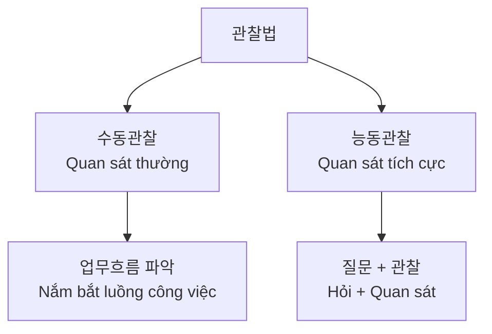
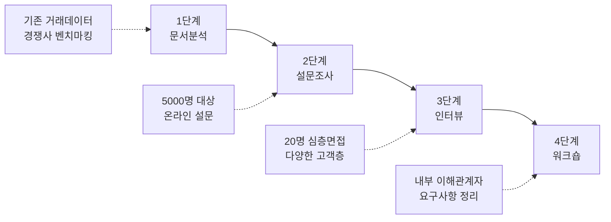

# Bài 17: 요구사항 수집 기법 - Các kỹ thuật thu thập yêu cầu


> **🎯 학습목표 (Mục tiêu học tập):** Thành thạo 4 기법 (kỹ thuật) chính để thu thập 요구사항 (yêu cầu) hiệu quả trong môi trường 프로젝트 (dự án) Hàn Quốc

\---

## 📊 **Tổng quan các 수집기법 (Kỹ thuật thu thập)**

| 기법 (Kỹ thuật) | 시간비용 (Chi phí thời gian) | 정확도 (Độ chính xác) | 적용범위 (Phạm vi áp dụng) | 한국어 (Tiếng Hàn) |
|---|---|---|---|---|
| **인터뷰** (Phỏng vấn) | ⭐⭐⭐ | ⭐⭐⭐⭐⭐ | Nhỏ-Trung bình | 면접, 인터뷰 |
| **관찰** (Quan sát) | ⭐⭐⭐⭐ | ⭐⭐⭐⭐⭐ | Nhỏ | 관찰법 |
| **설문조사** (Khảo sát) | ⭐ | ⭐⭐⭐ | Lớn | 서베이 |
| **문서분석** (Phân tích tài liệu) | ⭐⭐ | ⭐⭐⭐ | Mọi quy mô | 문서검토 |

\---

## 🎬 **시나리오 (Tình huống thực tế): Dự án E-Commerce**

**배경 (Bối cảnh):** Bạn là BRSE của công ty Samsung SDS, được giao phát triển 전자상거래 시스템 (hệ thống thương mại điện tử) cho 중소기업 (doanh nghiệp vừa và nhỏ) có 50 직원 (nhân viên). 고객사 (Khách hàng) muốn chuyển từ bán hàng truyền thống sang online.

\---

## 1️⃣ **인터뷰 (Phỏng vấn) - Kỹ thuật "Đối t화"**

### 🎯 **실무 적용 (Ứng dụng thực tế)**

**📍 상황 (Tình huống):** Bạn cần phỏng vấn 사장님 (chủ tịch), 마케팅 팀장 (trưởng phòng marketing) và 판매직원 (nhân viên bán hàng).

### **구조화 인터뷰 vs 비구조화 인터뷰**

| 구조화 인터뷰 (Phỏng vấn có cấu trúc) | 비구조화 인터뷰 (Phỏng vấn tự do) |
|---|---|
| ✅ Dùng 질문지 (bảng câu hỏi) chuẩn bị sẵn | ✅ 자유로운 대화 (trò chuyện tự do) |
| ✅ Thích hợp với 기술요구사항 (yêu cầu kỹ thuật) | ✅ Khám phá 숨겨진 요구사항 (yêu cầu ẩn) |

### **💼 Ví dụ câu hỏi thực tế:**
- "현재 판매프로세스 (quy trình bán hàng hiện tại)는 어떻게 되나요?"
- "가장 큰 문제점 (vấn đề lớn nhất)은 무엇인가요?"
- "온라인쇼핑몰 (shopping mall online)에서 기대하는 기능 (chức năng mong đợi)은?"

### **📈 장단점 분석**

**👍 장점 (Ưu điểm):**
- 심층정보 수집 (thu thập thông tin sâu)
- 실시간 피드백 (phản hồi thời gian thực)
- 신뢰관계 구축 (xây dựng mối quan hệ tin cậy)

**👎 단점 (Nhược điểm):**
- 시간소모적 (tốn thời gian)
- 주관적 정보 (thông tin chủ quan)
- 인터뷰어 역량의존 (phụ thuộc năng lực người phỏng vấn)

\---

## 2️⃣ **관찰법 (Quan sát) - Kỹ thuật "Thấy tận mắt"**

### 🎯 **현장관찰 시나리오 (Tình huống quan sát thực địa)**

**📍 상황:** Bạn đến 매장 (cửa hàng) quan sát 고객응대과정 (quy trình phục vụ khách hàng) và 재고관리 (quản lý tồn kho).

### **관찰유형 (Các loại quan sát)**



### **🔍 발견사항 (Những phát hiện) ví dụ:**
- 직원 (nhân viên) mất 5 phút tìm kiếm 상품정보 (thông tin sản phẩm)
- 고객 (khách hàng) thường hỏi về 배송시간 (thời gian giao hàng)
- 재고확인 (kiểm tra tồn kho) được thực hiện thủ công

### **⚖️ 호손효과 (Hiệu ứng Hawthorne) - Lưu ý quan trọng**
> 사람들은 관찰받고 있다는 것을 알면 평소와 다르게 행동한다
> (Con người hành xử khác khi biết mình được quan sát)

\---

## 3️⃣ **설문조사 (Khảo sát) - Kỹ thuật "Thu thập số lượng lớn"**

### 🎯 **대량데이터 수집 시나리오**

**📍 상황:** 조사대상 (đối tượng khảo sát): 1000 기존고객 (khách hàng hiện tại) về nhu cầu mua sắm online.

### **📋 설문설계 모범사례 (Mẫu thiết kế khảo sát chuẩn)**

| 질문유형 (Loại câu hỏi) | 예시 (Ví dụ) | 목적 (Mục đích) |
|---|---|---|
| 객관식 (Trắc nghiệm) | "온라인쇼핑 빈도는? A)매일 B)주1회 C)월1회" | 통계분석 (phân tích thống kê) |
| 리커트 척도 | "배송서비스 만족도 1-5점" | 만족도 측정 (đo lường hài lòng) |
| 개방형 질문 (Câu hỏi mở) | "추가로 원하는 기능은?" | 새로운 아이디어 발굴 |

### **💡 설문조사 성공 팁**
- 질문수: 최대 15개 (tối đa 15 câu hỏi)
- 응답시간: 5-7분 이내 (trong vòng 5-7 phút)
- 인센티브 제공: 할인쿠폰 등 (cung cấp ưu đãi như coupon giảm giá)

\---

## 4️⃣ **문서분석 (Phân tích tài liệu) - Kỹ thuật "Đọc hiểu"**

### 🎯 **기존자료 활용 시나리오**

**📍 상황:** Phân tích 사업계획서 (kế hoạch kinh doanh), 매출데이터 (dữ liệu doanh thu), 고객불만사항 (khiếu nại khách hàng).

### **📚 문서유형별 접근법**

| 문서유형 (Loại tài liệu) | 분석포인트 (Điểm phân tích) | 주의사항 (Lưu ý) |
|---|---|---|
| **사업계획서** | 비즈니스 목표, 전략 | 현실성 검토 |
| **기존시스템 문서** | 기능명세, 데이터구조 | 최신성 확인 |
| **고객피드백** | 불만사항, 개선요청 | 객관성 유지 |
| **경쟁사 분석** | 벤치마킹 포인트 | 저작권 주의 |

### **⚠️ 문서분석 함정들**
- **정보노후화 (Thông tin lỗi thời):** 문서가 실제와 다를 수 있음
- **편향된 관점 (Quan điểm thiên lệch):** 작성자의 주관이 개입
- **불완전한 정보 (Thông tin không đầy đủ):** 중요한 내용 누락 가능

\---

## 🏆 **실전 프로젝트: K-Bank 모바일뱅킹 사례**

### **📱 프로젝트 개요**
- **프로젝트명:** "개인예산관리 기능" 추가
- **대상:** 500만 이용자
- **목표:** 사용자의 소비패턴 분석 및 예산 관리 지원

### **🎯 4단계 기법 조합 전략**



### **📊 단계별 성과**

| 단계 | 투입시간 | 주요성과 | 핵심 인사이트 |
|---|---|---|---|
| **문서분석** | 1주 | 시장현황 파악 | 가계부 앱 시장 포화상태 |
| **설문조사** | 2주 | 니즈 정량화 | 78% 사용자가 자동분류 원함 |
| **인터뷰** | 3주 | 세부요구사항 | 알림기능이 핵심 차별화 |
| **워크숍** | 1주 | 최종 스펙 확정 | MVP 기능 13개 선정 |

\---

## 📚 **한국어 전문용어 정리**

| 한국어 | 한자/영어 | 베트남어 | 실무 사용 예시 |
|---|---|---|---|
| **이해관계자** | 利害關係者 | Bên liên quan | "모든 이해관계자와 면담 예정입니다" |
| **업무프로세스** | 業務 Process | Quy trình nghiệp vụ | "현재 업무프로세스를 매핑하겠습니다" |
| **기능요구사항** | 機能要求事項 | Yêu cầu chức năng | "기능요구사항 20개를 도출했습니다" |
| **비기능요구사항** | 非機能要求事項 | Yêu cầu phi chức năng | "성능 관련 비기능요구사항도 중요합니다" |
| **우선순위** | 優先順位 | Mức độ ưu tiên | "요구사항의 우선순위를 정해야 합니다" |

\---

## 🎯 **실습과제: IT 헬프데스크 시스템**

### **📋 과제 상황**
- **회사:** 직원 300명 규모
- **현황:** 이메일로만 IT 지원 요청
- **목표:** 체계적인 헬프데스크 시스템 구축

### **✍️ 과제 요구사항**
다음 template을 사용하여 기법 조합 전략을 수립하세요:

```
1. 선택한 기법들: [ ] 인터뷰 [ ] 관찰 [ ] 설문조사 [ ] 문서분석
2. 적용 순서와 이유:
   1단계: _______ (이유: _______)
   2단계: _______ (이유: _______)
   3단계: _______ (이유: _______)
3. 예상 결과물:
4. 리스크 요소:
```

\---

## 💡 **성공을 위한 BRSE 팁**

### **🎯 한국 비즈니스 문화 고려사항**
- **계층적 의사결정:** 의사결정권자 파악이 중요
- **콘센서스 문화:** 모든 관련자의 동의 필요
- **빨리빨리 문화:** 신속한 의사소통과 피드백

### **📈 기법 조합의 골든룰**
1. **문서분석 → 설문조사 → 인터뷰** 순으로 진행
2. 각 기법의 약점을 다른 기법으로 보완
3. 시간과 비용의 균형점 찾기
4. 한국어 전문용어 숙지로 원활한 소통

\---

**🎓 다음 시간 예고:** "요구사항 명세서 작성 및 관리 기법"
> 수집한 요구사항을 어떻게 체계적으로 문서화하고 관리할지 학습합니다!

---

*Post ID: czzulgqzt4hm7lx*  
*Category: BRSE*  
*Created: 4/9/2025*  
*Updated: 4/9/2025*
