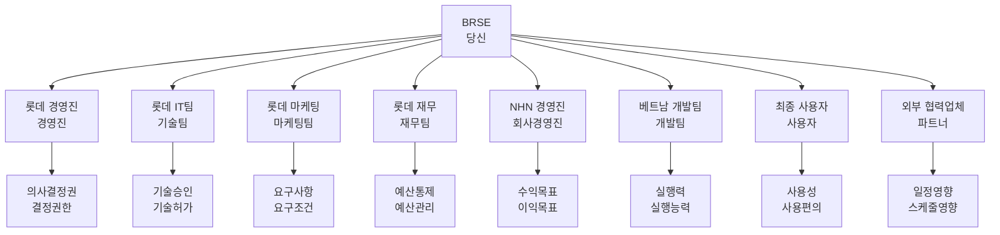
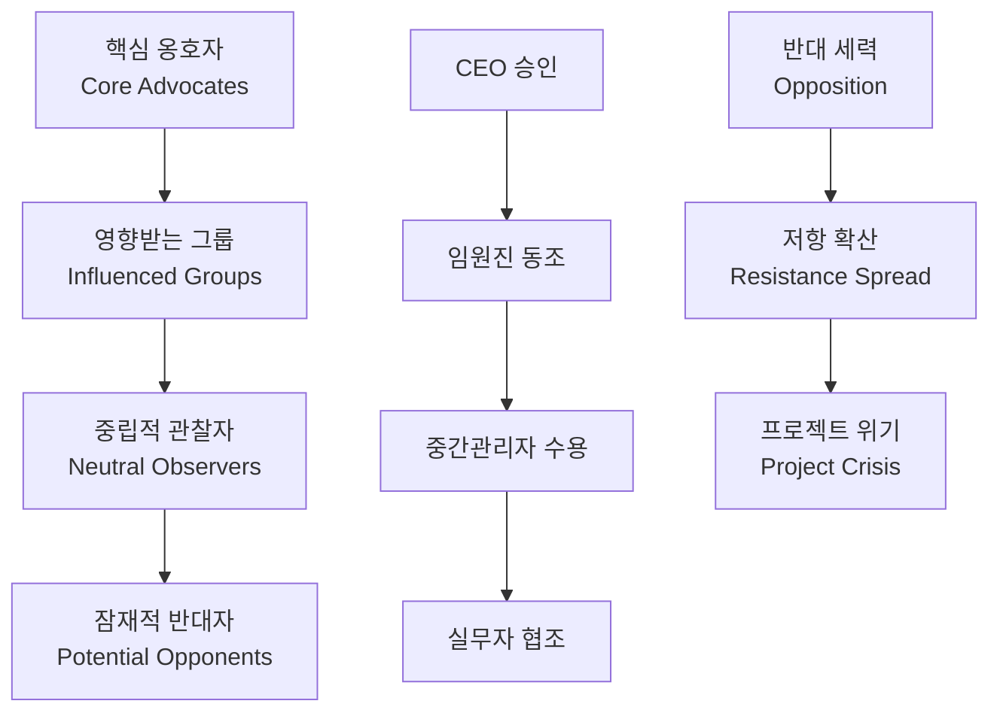

# Bài 13: Phân tích stakeholder (các bên liên quan)

*Mastering Stakeholder Management in Korean Business Environment*

\---

## 🎯 **학습목표** (Mục tiêu học tập)

Sau khi hoàn thành bài học này, bạn sẽ:
- Thành thạo **이해관계자 분석** (phân tích stakeholder) theo phương pháp khoa học
- Áp dụng **영향력-관심도 매트릭스** (ma trận quyền lực-quan tâm) để phân loại stakeholder
- Xây dựng **소통전략** (chiến lược giao tiếp) riêng cho từng **이해관계자 그룹** (nhóm stakeholder)
- Quản lý **기대치** (kỳ vọng) và xử lý **갈등상황** (tình huống xung đột) giữa các bên

\---

## 🚨 **복잡한 이해관계자 상황** (Tình huống stakeholder phức tạp)

### **배경** (Background)
**회사**: NHN Vietnam  
**고객**: 롯데그룹 (Lotte Group)  
**프로젝트**: **통합 쇼핑몰 플랫폼** (nền tảng shopping mall tích hợp) - 300억원  
**기간**: 18개월 개발 + 6개월 **안정화** (ổn định hóa)

### **이해관계자 갈등** (Xung đột stakeholder)
**🔥 12개월째 - 중간 점검 회의**

**롯데 IT본부장 (김전무)**: 
"**기술적 요구사항** (yêu cầu kỹ thuật)이 계속 바뀌는데, **진행상황** (tình hình tiến triển) 파악이 안 돼요!"

**롯데 마케팅팀장 (박부장)**: 
"**사용자 경험** (trải nghiệm người dùng)이 우선입니다. **기능** (tính năng) 추가 없이는 **출시** (ra mắt) 불가능해요!"

**롯데 재무팀 (최과장)**: 
"**예산초과** (vượt ngân sách) 위험해요. **비용통제** (kiểm soát chi phí) 필요합니다!"

**NHN CEO (이사장)**: 
"**고객만족** (sự hài lòng khách hàng)과 **수익성** (tính sinh lời) 모두 중요해요!"

**베트남 개발팀**: 
"**요구사항** (yêu cầu) 변경이 너무 많아서 **일정** (tiến độ) 맞추기 어려워요!"

**💥 결과**: 
- **이해관계자** (stakeholder) 5개 그룹 간 **의견충돌** (xung đột ý kiến)
- **프로젝트 지연** (chậm tiến độ dự án) 위험 80%
- **관계악화** (xấu đi mối quan hệ) 심각 수준

\---

## 📊 **이해관계자 생태계 지도** (Stakeholder Ecosystem Map)

### **복잡한 이해관계자 구조**



### **이해관계자 분류 매트릭스** (Stakeholder Classification Matrix)

| **이해관계자** | **영향력** (Quyền lực) | **관심도** (Quan tâm) | **태도** (Thái độ) | **참여도** (Tham gia) | **관리전략** (Chiến lược quản lý) |
|---------------|----------------------|---------------------|------------------|--------------------|-----------------------------|
| **롯데 경영진**<br>*(Ban lãnh đạo Lotte)* | 9/10 | 8/10 | 중립 (Trung lập) | **의사결정** (Ra quyết định) | **밀접관리** (Quản lý chặt chẽ) |
| **롯데 IT본부**<br>*(Bộ phận IT Lotte)* | 8/10 | 9/10 | 협조적 (Hợp tác) | **기술검토** (Đánh giá kỹ thuật) | **밀접관리** (Quản lý chặt chẽ) |
| **마케팅팀**<br>*(Đội Marketing)* | 6/10 | 10/10 | 요구많음 (Yêu cầu nhiều) | **기능정의** (Định nghĩa tính năng) | **적극소통** (Giao tiếp tích cực) |
| **재무팀**<br>*(Đội Tài chính)* | 7/10 | 5/10 | 보수적 (Bảo thủ) | **예산승인** (Phê duyệt ngân sách) | **만족유지** (Duy trì hài lòng) |
| **NHN 경영진**<br>*(Ban lãnh đạo NHN)* | 8/10 | 7/10 | 지지적 (Ủng hộ) | **자원제공** (Cung cấp tài nguyên) | **밀접관리** (Quản lý chặt chẽ) |
| **개발팀**<br>*(Đội phát triển)* | 4/10 | 8/10 | 적극적 (Tích cực) | **개발실행** (Thực hiện phát triển) | **동기부여** (Tạo động lực) |
| **최종사용자**<br>*(Người dùng cuối)* | 3/10 | 9/10 | 기대높음 (Kỳ vọng cao) | **피드백** (Phản hồi) | **정보제공** (Cung cấp thông tin) |

\---

## 🎯 **영향력-관심도 매트릭스** (Power-Interest Matrix)

### **사분면 분석 및 전략**

#### **🔥 1사분면: 고영향력-고관심도** (High Power - High Interest)
**핵심 이해관계자** (Core Stakeholders)
- **롯데 경영진** (Ban lãnh đạo Lotte)
- **롯데 IT본부** (Bộ phận IT Lotte) 
- **NHN 경영진** (Ban lãnh đạo NHN)

**관리전략**: **밀접관리** (Quản lý chặt chẽ)
```korean
주간회의: "매주 목요일 오후 3시 진행상황 보고드리겠습니다"
일일소통: "매일 오전 이슈사항 간단히 공유드리겠습니다"  
즉시보고: "중요한 문제 발생시 즉시 연락드리겠습니다"
```

#### **⚠️ 2사분면: 고영향력-저관심도** (High Power - Low Interest)
**잠재적 방해요소** (Potential Blockers)
- **재무팀** (Đội Tài chính)
- **법무팀** (Đội Pháp lý)
- **보안팀** (Đội An ninh)

**관리전략**: **만족유지** (Duy trì hài lòng)
```korean
월간보고: "한 달에 한 번 전체 현황 요약 보고드리겠습니다"
승인요청: "중요한 의사결정시 미리 승인 요청드리겠습니다"
문제예방: "이슈가 커지기 전에 미리 상의드리겠습니다"
```

#### **📢 3사분면: 저영향력-고관심도** (Low Power - High Interest)  
**정보 요구자** (Information Seekers)
- **마케팅팀** (Đội Marketing)
- **개발팀** (Đội phát triển)
- **최종사용자** (Người dùng cuối)

**관리전략**: **적극소통** (Giao tiếp tích cực)
```korean
정기업데이트: "2주마다 상세한 진행 현황 공유드리겠습니다"
의견수렴: "중요한 결정 전에 의견 청취하겠습니다"
피드백반영: "제안사항 적극 검토해서 반영하겠습니다"
```

#### **👁️ 4사분면: 저영향력-저관심도** (Low Power - Low Interest)
**모니터링 대상** (Monitoring Targets)  
- **외부 협력업체** (Đối tác bên ngoài)
- **정부기관** (Cơ quan chính phủ)
- **경쟁사** (Đối thủ cạnh tranh)

**관리전략**: **최소모니터링** (Theo dõi tối thiểu)
```korean
분기보고: "3개월마다 전체 요약 공유드리겠습니다"
필요시연락: "관련 이슈 발생시에만 연락드리겠습니다"
```

\---

## 🎭 **이해관계자별 맞춤 소통전략** (Customized Communication Strategy)

### **👔 경영진 소통법** (Executive Communication)

#### **특징 분석**
- **시간 부족**: 바쁜 일정으로 **간결한 정보** (thông tin súc tích) 선호
- **결과 중심**: **성과지표** (chỉ số thành quả)와 **ROI** (lợi nhuận đầu tư) 관심
- **위험 민감**: **리스크** (rủi ro) 및 **완화방안** (biện pháp giảm thiểu) 중시

#### **소통 템플릿**
```korean
제목: [프로젝트명] 주간 현황 보고 (Weekly Status Report)

1. 핵심 성과 (Key Achievements):
   - 이번 주 주요 완료 항목
   - 다음 마일스톤까지 진행률: XX%

2. 주요 이슈 및 해결책 (Issues & Solutions):
   - 문제: 간단한 설명
   - 해결책: 구체적 액션플랜
   - 일정 영향: 없음/경미함/심각함

3. 다음 주 계획 (Next Week Plan):
   - 주요 목표 3가지
   - 필요한 지원사항
```

### **🛠️ 기술팀 소통법** (Technical Team Communication)

#### **특징 분석**
- **세부사항 중요**: **기술적 정확성** (độ chính xác kỹ thuật) 및 **구현 가능성** (khả năng thực hiện) 관심
- **표준 준수**: **코딩 표준** (chuẩn coding) 및 **아키텍처** (kiến trúc) 일관성 중시
- **품질 우선**: **테스트** (kiểm thử) 및 **성능** (hiệu năng) 요구사항 엄격

#### **소통 가이드**
```korean
기술회의 진행방식:
1. 아키텍처 리뷰: "현재 설계가 요구사항을 만족하는지 검토해주세요"
2. 코드 품질: "코딩 가이드라인 준수 상황은 어떤가요?"
3. 성능 테스트: "부하 테스트 결과가 기대치에 맞나요?"
4. 보안 검토: "보안 취약점 점검은 완료되었나요?"
```

### **🎯 마케팅팀 소통법** (Marketing Team Communication)

#### **특징 분석**
- **사용자 중심**: **UX/UI** (trải nghiệm/giao diện người dùng) 및 **고객여정** (hành trình khách hàng) 관심
- **트렌드 민감**: **최신 기술** (công nghệ mới nhất) 및 **시장 동향** (xu hướng thị trường) 추구
- **차별화 추구**: **경쟁우위** (lợi thế cạnh tranh) 및 **혁신기능** (tính năng sáng tạo) 중시

#### **소통 포인트**
```korean
마케팅 관점 고려사항:
- 고객가치: "이 기능이 사용자에게 어떤 가치를 제공하나요?"
- 경쟁차별화: "경쟁사 대비 우리의 장점은 무엇인가요?"
- 시장성: "타겟 고객층이 실제로 원하는 기능인가요?"
- 출시전략: "언제, 어떻게 시장에 소개할 건가요?"
```

\---

## 🔥 **실제 갈등해결 시나리오** (Real Conflict Resolution Scenario)

### **상황**: 기능 우선순위 갈등

#### **갈등 당사자들**
- **마케팅팀**: "**개인화 추천** (gợi ý cá nhân hóa) 기능이 우선이에요!"
- **IT팀**: "**시스템 안정성** (tính ổn định hệ thống)이 더 중요합니다!"  
- **재무팀**: "**비용 효율성** (hiệu quả chi phí)을 고려해야 해요!"

#### **BRSE 중재 프로세스**

**1단계: 이해관계 파악** (Understanding Interests)
```korean
BRSE: "각 팀의 진짜 우려사항이 무엇인지 이해해 보겠습니다"

마케팅팀 진짜 관심사: 
- 사용자 재방문율 증가 → 매출 증가
- 경쟁사 대비 차별화 포인트 필요

IT팀 진짜 관심사:
- 시스템 다운타임 방지 → 평판 보호  
- 기술적 부채 최소화 → 장기 유지보수성

재무팀 진짜 관심사:
- ROI 최대화 → 효율적 투자
- 예산 초과 방지 → 리스크 관리
```

**2단계: 창의적 해결책 도출** (Creative Solution)
```korean
통합 솔루션 제안:
1. 1단계 (4주): 시스템 안정화 우선 → IT팀 만족
2. 2단계 (6주): 기본 추천 기능 구현 → 마케팅팀 부분 만족  
3. 3단계 (8주): 고도화된 개인화 추천 → 마케팅팀 완전 만족

재무적 타당성:
- 단계별 투자로 리스크 분산 → 재무팀 만족
- 각 단계별 ROI 측정 가능 → 투명한 성과관리
```

**3단계: 합의 도출** (Consensus Building)
```korean
최종 합의사항:
✅ 모든 팀이 핵심 관심사 해결 확인
✅ 단계별 성공지표 명확히 정의  
✅ 정기 검토회의로 조정 가능성 보장
✅ 각 팀의 기여도 인정 및 보상 방안 마련
```

\---

## 📊 **이해관계자 관리 대시보드** (Stakeholder Management Dashboard)

### **핵심 성과지표** (Key Performance Indicators)

| **영역** | **지표** | **현재상태** | **목표** | **측정방법** |
|---------|---------|-------------|---------|-------------|
| **참여도** (Engagement) | 회의 참석률 | 75% | 90% | **출석부** (danh sách tham dự) 체크 |
| **만족도** (Satisfaction) | 이해관계자 만족도 | 6.8/10 | 8.0/10 | **월간 설문조사** (khảo sát hàng tháng) |
| **소통 효율성** (Communication) | 응답 시간 | 8시간 | 4시간 | **이메일 추적** (theo dõi email) |
| **갈등 해결** (Conflict Resolution) | 갈등 해결 시간 | 5일 | 2일 | **이슈 트래커** (theo dõi vấn đề) |
| **정보 공유** (Information Sharing) | 정보 접근성 | 70% | 85% | **포털 사용률** (tỷ lệ sử dụng portal) |

### **위험 신호등** (Risk Traffic Light)

#### **🟢 녹색등** (Green Light)
- **의견일치** (Consensus): 95% 이상
- **적극참여** (Active Participation): 주요 회의 90% 참석
- **신속소통** (Quick Response): 4시간 내 응답

#### **🟡 노란등** (Yellow Light)  
- **의견분분** (Mixed Opinions): 70-95% 일치
- **소극참여** (Passive Participation): 주요 회의 70-90% 참석
- **지연소통** (Delayed Response): 4-8시간 응답

#### **🔴 빨간등** (Red Light)
- **강한반대** (Strong Opposition): 70% 미만 일치  
- **불참증가** (Low Attendance): 70% 미만 참석
- **소통두절** (Communication Breakdown): 8시간 이상 무응답

\---

## 🎯 **고급 이해관계자 관리 기법** (Advanced Stakeholder Management Techniques)

### **🎭 페르소나 기반 접근법** (Persona-Based Approach)

#### **경영진 페르소나**: "전략적 사고자" (Strategic Thinker)
```yaml
특성:
  - 시간가치: 매우 높음 (1분 = 10만원)
  - 관심사: 전략, ROI, 위험관리
  - 의사결정: 빠르고 결단력 있음
  - 소통스타일: 간결하고 핵심적

맞춤 전략:
  - Executive Summary 1페이지
  - 핵심 메트릭 3개만 제시
  - 액션 아이템 명확히 정의
  - 다음 단계 구체적 제안
```

#### **기술자 페르소나**: "완벽주의자" (Perfectionist)
```yaml
특성:
  - 세부사항 중시
  - 기술적 정확성 추구  
  - 품질에 대한 높은 기준
  - 논리적 사고

맞춤 전략:
  - 기술적 근거 상세 제공
  - 테스트 결과 및 증거 첨부
  - 대안 솔루션 비교 분석
  - 장단점 객관적 평가
```

#### **마케터 페르소나**: "고객 대변인" (Customer Advocate)
```yaml
특성:
  - 사용자 경험 우선시
  - 트렌드 및 혁신 추구
  - 감정적 어필 선호
  - 창의적 사고

맞춤 전략:
  - 사용자 스토리 활용
  - 시각적 프로토타입 제시
  - 경쟁사 벤치마킹 자료
  - 시장 반응 예측 데이터
```

### **🌊 영향력 파급 모델** (Influence Ripple Model)



\---

## 🛠️ **실전 도구 모음** (Practical Toolkit)

### **🔍 이해관계자 발굴 체크리스트** (Stakeholder Identification Checklist)

#### **내부 이해관계자** (Internal Stakeholders)
- [ ] **프로젝트 스폰서** (Project Sponsor) - 예산 승인자
- [ ] **경영진** (Management) - 전략적 의사결정자  
- [ ] **프로젝트 매니저** (Project Manager) - 실행 책임자
- [ ] **개발팀** (Development Team) - 구현 담당자
- [ ] **QA팀** (QA Team) - 품질 보장자
- [ ] **DevOps팀** (DevOps Team) - 인프라 관리자
- [ ] **보안팀** (Security Team) - 보안 검토자
- [ ] **법무팀** (Legal Team) - 컴플라이언스 담당자

#### **외부 이해관계자** (External Stakeholders)  
- [ ] **최종고객** (End Customers) - 서비스 사용자
- [ ] **비즈니스 사용자** (Business Users) - 업무 담당자
- [ ] **협력업체** (Partners) - 기술/서비스 제공자
- [ ] **규제기관** (Regulatory Bodies) - 승인 기관
- [ ] **투자자** (Investors) - 자금 제공자
- [ ] **미디어** (Media) - 여론 형성자
- [ ] **경쟁사** (Competitors) - 간접 영향자

### **📊 이해관계자 프로파일링 템플릿**

```markdown
## 이해관계자 프로파일

### 기본정보
- 이름/역할: ________________
- 조직: ____________________  
- 연락처: __________________

### 영향력 분석  
- 의사결정 권한: ___/10
- 프로젝트 영향력: ___/10
- 조직 내 위치: _____________

### 관심도 분석
- 프로젝트 관심도: ___/10  
- 참여 의향: _______________
- 기대 수준: _______________

### 관계 분석
- 현재 태도: 지지/중립/반대
- 주요 우려사항: ____________
- 동기 요인: _______________

### 소통 전략
- 선호 소통방식: ____________
- 소통 빈도: _______________
- 핵심 메시지: _____________
```

\---

## 🎬 **실전 시뮬레이션** (Practical Simulation)

### **시나리오**: 프로젝트 위기 상황

#### **상황 설정**
**프로젝트**: 은행 **모바일뱅킹** (mobile banking) 앱 리뉴얼  
**위기**: **보안취약점** (lỗ hổng bảo mật) 발견으로 **출시연기** (hoãn ra mắt) 불가피  
**영향**: 마케팅 캠페인 **손실비용** (chi phí tổn thất) 50억원

#### **이해관계자별 반응**

**은행 임원진** (임원):
```korean
"고객 신뢰가 가장 중요합니다. 보안 문제 완벽히 해결될 때까지 출시 미뤄야 해요."
→ 관심사: 브랜드 이미지, 고객 신뢰
→ 관리전략: 보안 강화 계획 상세 보고
```

**마케팅팀** (마케팅):  
```korean
"이미 광고비 30억 집행했는데... 최소 기능이라도 일정대로 출시할 수 없나요?"
→ 관심사: 마케팅 ROI, 시장 타이밍
→ 관리전략: 대안 출시 전략 제시
```

**개발팀** (개발):
```korean
"보안 이슈 해결하려면 최소 4주 필요해요. 임시방편으로는 불가능합니다."  
→ 관심사: 기술적 완성도, 개발 시간
→ 관리전략: 현실적 일정 협의
```

#### **BRSE 위기관리 전략**

**1단계: 긴급 대응** (Crisis Response)
```korean
즉시 행동:
1. 모든 이해관계자에게 상황 투명하게 공개
2. 각 그룹별 맞춤 설명 및 우려사항 청취  
3. 임시 태스크포스 구성 제안
4. 단계별 해결 로드맵 초안 작성
```

**2단계: 이해관계 조정** (Stakeholder Alignment)
```korean
조정 전략:
- 임원진: "고객 신뢰 = 장기 수익성" 논리로 설득
- 마케팅: "연기된 출시 = 더 강한 차별화 포인트" 리프레이밍
- 개발: "충분한 시간 = 기술적 완성도 보장" 동기 부여
- 재무: "단기 손실 < 장기 리스크 회피" 비용편익 분석
```

**3단계: 통합 솔루션** (Integrated Solution)
```korean
최종 제안:
1. 보안 패치된 기본 기능 먼저 출시 (2주 후)
2. 고도화된 기능은 단계적 업데이트 (4주 후)  
3. 마케팅 메시지를 "보안 강화"로 전환
4. 고객 보상 프로그램으로 신뢰도 회복
```

\---

## 📚 **성공사례 벤치마킹** (Success Case Benchmarking)

### **글로벌 기업 사례분석**

#### **케이스 1: 구글 + LG전자 파트너십**
**프로젝트**: Android TV 플랫폼 개발
**이해관계자 관리 성공요인**:
- **기술팀 vs 디자인팀** 갈등을 **사용자테스트** (user testing) 결과로 해결
- **한국 문화 특성** (collectivism) 고려한 **집단 의사결정** (group decision-making) 프로세스
- **정기적 워크샵** (regular workshops)으로 **크로스팀 이해도** (cross-team understanding) 향상

**결과**: 개발기간 30% 단축, 만족도 9.2/10

#### **케이스 2: 마이크로소프트 + 삼성SDS**  
**프로젝트**: **클라우드 마이그레이션** (cloud migration) 컨설팅
**이해관계자 관리 혁신**:
- **AI 기반 이해관계자 분석** (AI-powered stakeholder analysis) 도구 활용
- **실시간 피드백** (real-time feedback) 시스템으로 **의사결정 속도** (decision speed) 3배 향상  
- **문화적 브릿지** (cultural bridge) 역할 전담 팀 구성

**결과**: ROI 250% 달성, **재계약률** (renewal rate) 95%

### **한국 기업 특화 전략**

#### **삼성전자 글로벌 개발팀 사례**
**특징**: **수직적 조직문화** (vertical hierarchy) + **빠른 의사결정** (rapid decision-making)
**성공전략**:
```korean
계층별 맞춤 소통:
- 임원급: "전략적 임팩트" 중심 보고
- 부장급: "실행 계획" 상세 설명  
- 과장급: "기술적 세부사항" 공유
- 대리/사원급: "실무 협업" 강화
```

**교훈**: **서열 존중** (hierarchy respect) + **효율적 정보 전달** (efficient information flow)

\---

## 🎯 **실전 과제** (Practical Assignment)

### **미션**: 복합 이해관계자 프로젝트 관리

#### **시나리오 설정**
**회사**: Grab Vietnam  
**고객**: **현대자동차** (Hyundai Motors)  
**프로젝트**: **커넥티드카** (connected car) 플랫폼 개발  
**예산**: 500억원  
**기간**: 24개월

#### **복잡한 이해관계자 구조**
1. **현대자동차 본사** (서울) - **전략기획팀**, **IT팀**, **마케팅팀**
2. **현대자동차 베트남** (하노이) - **현지 법인**, **제조팀**  
3. **Grab 경영진** (싱가포르) - **CEO**, **CTO**, **사업개발팀**
4. **베트남 개발센터** (호치민) - **개발팀**, **QA팀**, **DevOps팀**
5. **외부 파트너** - **통신사**, **지도서비스**, **결제업체**
6. **정부기관** - **교통부**, **정보통신부**

#### **당신의 과제**

**1단계: 이해관계자 매핑** (Stakeholder Mapping)
```markdown
## 이해관계자 분석 보고서

### A. 이해관계자 식별 (15개 이상)
- 내부/외부 구분
- 역할 및 책임 정의
- 연락처 및 조직도

### B. 영향력-관심도 매트릭스
- 4사분면 분류
- 각 사분면별 관리전략
- 우선순위 설정

### C. 갈등 예상 지점
- 잠재적 갈등 요소 5가지
- 각각의 완화 전략
- 조기 경보 시스템
```

**2단계: 소통 계획 수립** (Communication Planning)
```markdown
## 소통 매트릭스

| 이해관계자 | 소통 빈도 | 소통 방식 | 핵심 메시지 | 담당자 |
|-----------|----------|----------|------------|--------|
| 현대 임원진 | 월 1회 | Executive Brief | 전략적 성과 | BRSE |
| 개발팀 | 일일 | Standup Meeting | 기술적 이슈 | Tech Lead |
| ... | ... | ... | ... | ... |
```

**3단계: 위기관리 시나리오** (Crisis Management Scenario)
```markdown
## 위기상황 대응 매뉴얼

### 시나리오 1: 데이터 프라이버시 이슈
- 영향받는 이해관계자: 정부기관, 고객, 미디어
- 대응 전략: 투명한 공개, 즉시 개선조치, 재발방지 약속
- 커뮤니케이션 플랜: 24시간 이내 공식 성명, 주요 이해관계자 개별 브리핑

### 시나리오 2: 기술적 지연  
- 영향받는 이해관계자: 경영진, 마케팅팀, 파트너사
- 대응 전략: 대안 일정 제시, 위험 완화 방안, 보상 계획
- 커뮤니케이션 플랜: 단계별 설명, 정기 업데이트, 투명한 진행상황 공유
```

**4단계: 성과 측정 시스템** (Performance Measurement)
```markdown
## KPI 대시보드

### 정량적 지표
- 이해관계자 만족도: 월간 설문 (목표 8.0/10)
- 회의 참석률: 주간 측정 (목표 90%)
- 이슈 해결시간: 일일 추적 (목표 48시간)

### 정성적 지표  
- 갈등 수준: 매주 평가 (Red/Yellow/Green)
- 협업 품질: 월간 리뷰 (5점 척도)
- 신뢰도 변화: 분기별 심화 인터뷰
```

\---

## 🏆 **이해관계자 마스터의 비밀** (Stakeholder Master's Secrets)

### **🎯 골든 룰 7가지**

1. **경청이 우선이다** (Listen First)
   ```korean
   "말하기 전에 들어라. 이해받기 전에 이해하라."
   → 80% 경청, 20% 말하기 원칙
   ```

2. **모든 이해관계자는 중요하다** (Everyone Matters)
   ```korean
   "작은 이해관계자의 반대가 큰 프로젝트를 무너뜨릴 수 있다."
   → 위계에 관계없이 모든 목소리 경청
   ```

3. **조기 참여가 핵심이다** (Early Engagement)
   ```korean
   "시작부터 함께 하면 끝까지 함께 할 수 있다."
   → 프로젝트 기획 단계부터 이해관계자 참여
   ```

4. **투명성이 신뢰를 만든다** (Transparency Builds Trust)
   ```korean
   "숨기면 의심받고, 공개하면 신뢰받는다."
   → 좋은 소식과 나쁜 소식 모두 투명하게 공유
   ```

5. **맞춤형 소통이 효과적이다** (Customized Communication)
   ```korean
   "천편일률적 소통은 아무도 만족시키지 못한다."
   → 이해관계자별 선호하는 소통방식 활용
   ```

6. **갈등은 기회다** (Conflict is Opportunity)
   ```korean
   "갈등 속에서 더 나은 해결책이 나온다."
   → 갈등 회피보다는 건설적 해결 추구
   ```

7. **지속적 관리가 필요하다** (Continuous Management)
   ```korean
   "이해관계자 관리는 마라톤이다, 단거리 달리기가 아니다."
   → 프로젝트 전 기간 동안 일관된 관리
   ```

### **⚡ 위기상황 대응 매뉴얼**

#### **골든타임 대응법**
```
1시간 이내: 상황 파악 및 주요 이해관계자 알림
4시간 이내: 상세 분석 및 임시 대응방안 수립  
24시간 이내: 공식 대응계획 발표 및 실행 시작
1주일 이내: 근본 원인 해결 및 재발 방지책 완료
```

#### **커뮤니케이션 우선순위**
```
Priority 1: 의사결정권자 (임원급)
Priority 2: 직접 영향받는 그룹 (사용자, 고객)  
Priority 3: 간접 영향받는 그룹 (파트너, 협력업체)
Priority 4: 관찰자 그룹 (미디어, 업계 전문가)
```

\---

## 📝 **자가진단 체크리스트** (Self-Assessment Checklist)

### **이해관계자 식별 역량**
- [ ] 프로젝트 관련 모든 이해관계자를 놓치지 않고 식별할 수 있다
- [ ] 숨겨진 이해관계자나 간접 이해관계자까지 파악할 수 있다  
- [ ] 이해관계자 간의 관계와 영향력을 정확히 분석할 수 있다
- [ ] 프로젝트 단계별로 이해관계자 변화를 예측할 수 있다

### **분석 및 전략 수립 역량**
- [ ] **영향력-관심도 매트릭스** (power-interest matrix)를 정확히 작성할 수 있다
- [ ] 각 이해관계자의 진짜 **관심사** (interests)와 **우려사항** (concerns)을 파악할 수 있다
- [ ] 이해관계자별 맞춤형 **소통전략** (communication strategy)을 수립할 수 있다  
- [ ] 잠재적 갈등 지점을 사전에 식별하고 **완화전략** (mitigation strategy)을 준비할 수 있다

### **실행 및 관리 역량**
- [ ] 이해관계자별로 적절한 **소통방식** (communication method)과 **빈도** (frequency)를 선택할 수 있다
- [ ] 갈등 상황에서 **중재자** (mediator) 역할을 효과적으로 수행할 수 있다
- [ ] 이해관계자의 **기대치** (expectations)를 현실적으로 관리할 수 있다
- [ ] 프로젝트 전 기간에 걸쳐 일관되고 지속적인 관리를 할 수 있다

### **문화적 감수성**
- [ ] 한국 기업문화의 **서열의식** (hierarchy consciousness)을 이해하고 적절히 대응할 수 있다
- [ ] **직접적 vs 간접적** (direct vs indirect) 소통방식을 상황에 맞게 선택할 수 있다
- [ ] **정** (jeong), **눈치** (nunchi) 등 한국 문화적 요소를 고려한 관계 구축이 가능하다
- [ ] 다문화팀 환경에서 **문화적 브릿지** (cultural bridge) 역할을 수행할 수 있다

\---

*"이해관계자를 관리하는 것이 아니라, 이해관계자와 함께 성공을 만들어가는 것이다."*  
*- 성공하는 BRSE의 이해관계자 철학 -*

---

*Post ID: kvmslv9yovnbipo*  
*Category: BRSE*  
*Created: 2/9/2025*  
*Updated: 2/9/2025*
