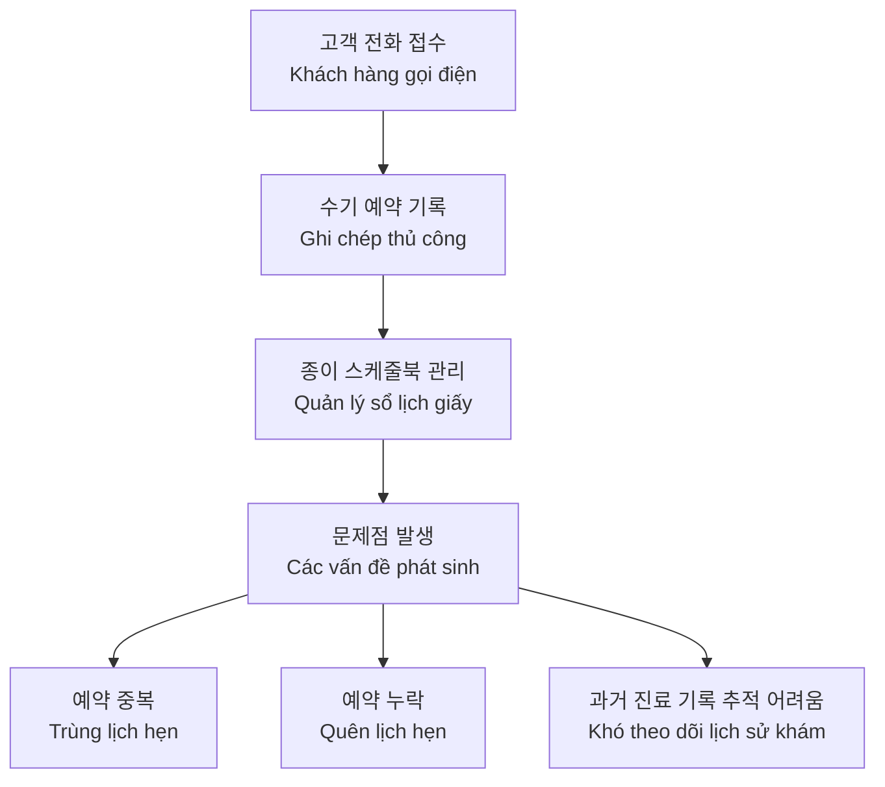
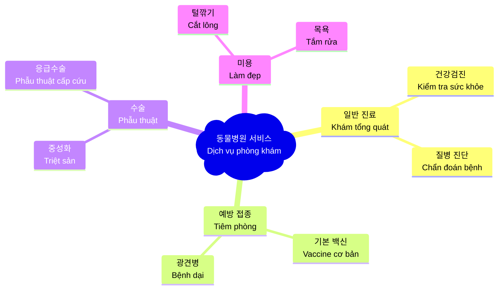
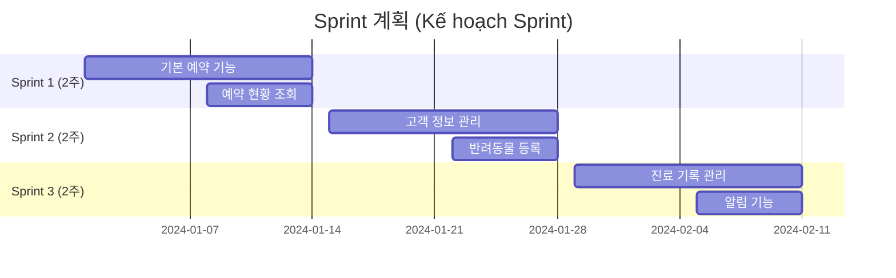

# Bài 5: Case study: Phân tích một dự án thực tế

## Happy Pet 동물병원 (Phòng khám thú y) - 예약 관리 시스템 (Hệ thống quản lý đặt lịch)

\---

### 🎯 학습 목표 (Mục tiêu học tập)

Sau bài học này, 학습자 (học viên) sẽ có khả năng:

| Năng lực | Mô tả chi tiết |
|----------|----------------|
| **실무 적용** (Áp dụng thực tế) | Vận dụng kiến thức từ Bài 1-4 vào 실제 프로젝트 (dự án thực tế) |
| **요구사항 분석** (Phân tích yêu cầu) | Phân tích yêu cầu 고객 (khách hàng) để xác định các yếu tố cốt lõi |
| **이해관계자 식별** (Xác định bên liên quan) | Nhận diện 주요 이해관계자 (các bên liên quan chính) |
| **개발 모델 제안** (Đề xuất mô hình phát triển) | Lựa chọn 개발 방법론 (phương pháp phát triển) phù hợp |
| **질문 기법** (Kỹ thuật đặt câu hỏi) | Thực hành đặt câu hỏi làm rõ 초기 요구사항 (yêu cầu ban đầu) |

\---

### 📋 프로젝트 배경 (Bối cảnh dự án)

#### 🏢 고객사 정보 (Thông tin khách hàng)

**회사명 (Tên công ty):** Happy Pet 동물병원 (Phòng khám thú y Happy Pet)  
**위치 (Địa điểm):** 경기도 화성시 (Hwaseong-si, Gyeonggi-do)  
**업종 (Lĩnh vực):** 반려동물 진료 (Chăm sóc thú cưng)

#### 📊 현황 분석 (Phân tích hiện trạng)

#### 🎤 원장님 요구사항 (Yêu cầu từ Giám đốc)

> *"온라인으로 예약을 관리할 수 있는 시스템이 필요합니다. 고객들이 웹사이트나 모바일 앱으로 직접 예약할 수 있게 하고 싶어요. 저희 직원들은 당일 예약 현황을 보고 고객과 반려동물 정보를 관리할 수 있어야 합니다. 고객 대부분이 IT에 익숙하지 않으니까 사용하기 쉬워야 해요. 빨리 시험해볼 수 있는 제품을 원합니다."*

> *(Chúng tôi cần một hệ thống quản lý đặt lịch online. Muốn khách hàng có thể tự đặt lịch qua website hoặc app di động. Nhân viên cần xem được lịch hẹn trong ngày và quản lý thông tin khách hàng cùng thú cưng. Hệ thống phải dễ dùng vì khách hàng không rành IT. Muốn có sản phẩm sớm để thử nghiệm.)*

\---

### 🔍 BRSE 역할 분석 (Phân tích vai trò BRSE)

#### 1️⃣ **의사소통 교량** (Cầu nối giao tiếp)

| 한국 측 (Phía Hàn Quốc) | BRSE | 베트남 측 (Phía Việt Nam) |
|------------------------|------|--------------------------|
| 원장님/직원들 (Giám đốc/Nhân viên) | ⟷ **언어/문화 번역** (Dịch thuật ngôn ngữ/văn hóa) | 개발팀 (Đội phát triển) |
| 업무 프로세스 (Quy trình nghiệp vụ) | ⟷ **요구사항 분석** (Phân tích yêu cầu) | 기술 구현 (Triển khai kỹ thuật) |

#### 2️⃣ **업무 분석** (Phân tích nghiệp vụ)

**동물병원 주요 서비스** (Các dịch vụ chính của phòng khám thú y):

\---

### 👥 이해관계자 맵핑 (Bản đồ các bên liên quan)

| 이해관계자 (Bên liên quan) | 역할 (Vai trò) | 주요 관심사 (Mối quan tâm chính) |
|---|---|---|
| **원장** (Giám đốc) | 의사결정권자 (Người quyết định) | ROI, 운영 효율성 (Hiệu quả vận hành) |
| **접수 직원** (Nhân viên lễ tân) | 일차 사용자 (Người dùng chính) | 사용 편의성 (Tính dễ sử dụng) |
| **수의사** (Bác sĩ thú y) | 정보 활용자 (Người sử dụng thông tin) | 환자 정보 접근성 (Khả năng tiếp cận thông tin bệnh nhân) |
| **고객** (Khách hàng) | 최종 사용자 (Người dùng cuối) | 편리한 예약 (Đặt lịch tiện lợi) |
| **개발팀** (Đội phát triển) | 구현자 (Người thực hiện) | 명확한 요구사항 (Yêu cầu rõ ràng) |

\---

### ⚙️ 개발 방법론 선택 (Lựa chọn phương pháp phát triển)

#### 🔄 **Agile (Scrum) 방식 제안** (Đề xuất phương pháp Agile)

**선택 근거** (Căn cứ lựa chọn):

| 프로젝트 특성 (Đặc điểm dự án) | Agile 적합성 (Phù hợp với Agile) |
|---|---|
| "빨리 시험해보고 싶다" | ✅ 빠른 MVP 제공 (Cung cấp MVP nhanh) |
| 요구사항 불명확 | ✅ 점진적 개선 (Cải tiến từng bước) |
| 사용자 피드백 중요 | ✅ 스프린트별 검토 (Đánh giá mỗi Sprint) |
| IT 초보 사용자 | ✅ UI/UX 반복 개선 (Cải thiện UI/UX liên tục) |

#### 📅 **스프린트 계획** (Kế hoạch Sprint)

\---

### 💡 실무 질문 기법 (Kỹ thuật đặt câu hỏi thực tế)

#### 📝 **고객 정보 관리 요구사항 명확화** (Làm rõ yêu cầu quản lý thông tin khách hàng)

**현재 모호한 요구사항** (Yêu cầu hiện tại còn mơ hồ):
> "고객과 반려동물 정보를 관리할 수 있어야 합니다"  
> *(Cần quản lý được thông tin khách hàng và thú cưng)*

**핵심 질문들** (Các câu hỏi quan trọng):

| 질문 유형 (Loại câu hỏi) | 한국어 질문 | 베트남어 번역 |
|---|---|---|
| **WHAT** (무엇을) | "고객 정보로 어떤 항목들이 필요하신가요? 이름, 전화번호 외에 주소, 이메일도 필요한가요?" | "Thông tin khách hàng cần những mục nào ạ? Ngoài tên, số điện thoại có cần địa chỉ, email không?" |
| **WHAT** (무엇을) | "반려동물 정보는 이름, 진료 기록 외에 품종, 생년월일, 체중, 접종 현황도 관리해야 할까요?" | "Thông tin thú cưng ngoài tên, lịch sử khám có cần quản lý giống loài, ngày sinh, cân nặng, tình trạng tiêm phòng không?" |
| **HOW** (어떻게) | "한 고객이 여러 마리를 키우는 경우, 하나의 계정에서 모든 반려동물 정보를 볼 수 있게 해야 할까요?" | "Khi khách hàng có nhiều thú cưng, có nên hiển thị tất cả trong một tài khoản không?" |

\---

### 🎯 실습 과제 (Bài tập thực hành)

#### **시나리오**: 서울의 "스마트 도서관" 프로젝트 (Thư viện thông minh Seoul)

**초기 요구사항** (Yêu cầu ban đầu):
> *"학생들이 온라인으로 도서를 검색하고, 대출 가능 여부를 확인하며, 대출 중인 책은 예약할 수 있게 하고 싶습니다. 사서는 대출/반납을 관리할 수 있는 도구가 필요합니다."*

#### **과제** (Nhiệm vụ):

1. **개발 방법론 제안** (Đề xuất phương pháp phát triển)
   - Waterfall vs Agile 중 선택하고 3가지 근거 제시
   
2. **이해관계자 분석** (Phân tích bên liên quan)
   - 최소 5명의 주요 이해관계자 식별
   
3. **질문 작성** (Soạn câu hỏi)
   - "도서 검색" 요구사항을 위한 3개 질문 (한국어 + 베트남어)

\---

### 🔑 핵심 포인트 (Điểm quan trọng)

#### ✅ **BRSE의 성공 전략**

| 전략 (Chiến lược) | 실무 적용 (Áp dụng thực tế) |
|---|---|
| **Why First** | 항상 "왜 이 기능이 필요한지" 먼저 파악 |
| **문화적 이해** | 한국의 비즈니스 문화와 고객 습관 고려 |
| **점진적 접근** | 큰 요구사항을 작은 단위로 분해 |
| **지속적 확인** | 정기적인 피드백과 요구사항 재검토 |

#### ⚠️ **주의사항**

- **언어적 뉘앙스**: 한국어 "필요하다"와 "원한다"의 차이 이해
- **비즈니스 문화**: 한국 고객의 "빨리빨리" 문화 고려
- **기술적 제약**: 현실적인 개발 일정과 예산 한계 인식

\---

### 📚 추가 학습 자료 (Tài liệu học tập bổ sung)

#### **전문 용어집** (Từ điển chuyên ngành)

| 한국어 | 베트남어 | 영어 |
|--------|----------|------|
| 요구사항 분석 | Phân tích yêu cầu | Requirements Analysis |
| 이해관계자 | Bên liên quan | Stakeholder |
| 업무 프로세스 | Quy trình nghiệp vụ | Business Process |
| 시스템 구축 | Xây dựng hệ thống | System Development |
| 사용자 경험 | Trải nghiệm người dùng | User Experience |

\---

*📋 **과제 제출**: 다음 수업 전까지 위 실습 과제를 완성하여 제출하세요.*  
*📞 **질문/문의**: 이해되지 않는 부분은 언제든 문의하세요.*

---

*Post ID: pdd05yrfruq0o48*  
*Category: BRSE*  
*Created: 2/9/2025*  
*Updated: 4/9/2025*
