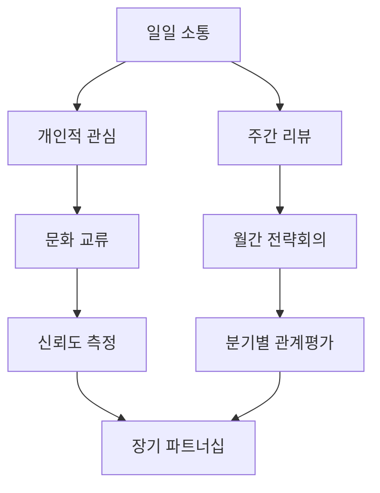

# Bài 12: Xây dựng mối quan hệ tin cậy với khách hàng

*Building Trustworthy Partnerships with Korean Clients*

\---

## 🎯 **학습목표** (Mục tiêu học tập)

Sau khi hoàn thành bài học này, bạn sẽ:
- Thành thạo **신뢰구축** (xây dựng lòng tin) theo văn hóa Hàn Quốc
- Áp dụng **관계경영** (quản lý mối quan hệ) để tạo **장기적 파트너십** (quan hệ đối tác dài hạn)
- Sử dụng **소통전략** (chiến lược giao tiếp) để duy trì **고객만족** (sự hài lòng của khách hàng)
- Xử lý **신뢰위기** (khủng hoảng lòng tin) một cách chuyên nghiệp

\---

## 🚨 **신뢰위기 상황** (Tình huống khủng hoảng lòng tin)

### **배경** (Background)
**회사**: Tiki Vietnam  
**고객**: CJ대한통운 (CJ Logistics)  
**프로젝트**: **물류관리시스템** (hệ thống quản lý logistics) - 150억원  
**기간**: 8개월 개발  

### **위기 상황** (Crisis Situation)
**🔥 5개월째 - 프로젝트 중간 점검**

**한국 PM (박부장)**: 
"베트남팀 **신뢰도** (độ tin cậy)가 떨어져요. **일정지연** (chậm tiến độ) 3주인데 이제서야 말하네요!"

**CJ 임원 (최상무)**: 
"**투명성** (tính minh bạch) 부족해요. **현황파악** (nắm bắt tình hình)이 안 되고, **의사소통** (giao tiếp) 문제 심각합니다."

**베트남 BRSE (당신)**: 
"**기술적 문제** (vấn đề kỹ thuật)가 예상보다 복잡했어요. 하지만 **해결방안** (phương án giải quyết)은 있습니다!"

**💥 결과**: 
- **신뢰지수** (chỉ số tin cậy) 45% → 23% 급락
- **계약해지** (hủy hợp đồng) 위험 90%
- **손해배상** (bồi thường thiệt hại) 50억원 위기
- **평판손상** (tổn hại danh tiếng) 심각

\---

## 📊 **신뢰도 측정 매트릭스** (Trust Measurement Matrix)

### **신뢰의 4가지 구성요소** (4 Components of Trust)

| **구성요소** | **정의** | **현재상태** | **목표** | **핵심액션** |
|------------|----------|-------------|---------|-------------|
| **전문성** (Credibility)<br>*Độ tin cậy chuyên môn* | **기술역량** (năng lực kỹ thuật)과 **지식의 정확성** (độ chính xác kiến thức) | 6/10 | 9/10 | **기술문서 품질향상** (nâng cao chất lượng tài liệu kỹ thuật), **전문지식 증명** (chứng minh kiến thức chuyên môn) |
| **신뢰성** (Reliability)<br>*Độ đáng tin cậy* | **약속이행** (thực hiện lời hứa)과 **일관성 유지** (duy trì tính nhất quán) | 4/10 | 9/10 | **약속준수** (tuân thủ lời hứa), **예측가능성 확보** (đảm bảo tính dự đoán được) |
| **친밀감** (Intimacy)<br>*Độ thân thiết* | **안전하고 편안한 관계** (mối quan hệ an toàn và thoải mái) | 7/10 | 8/10 | **개인적 관심** (quan tâm cá nhân), **문화적 이해** (hiểu biết văn hóa) |
| **이기심** (Self-Orientation)<br>*Mức độ ích kỷ* | **자기중심적 사고 정도** (mức độ suy nghĩ tự cho mình là trung tâm) | 7/10 | 3/10 | **고객우선** (khách hàng là ưu tiên) 사고, **상호이익** (lợi ích chung) 추구 |

### **신뢰도 공식** (Trust Formula)
```
신뢰도 = (전문성 + 신뢰성 + 친밀감) ÷ 이기심

현재: (6 + 4 + 7) ÷ 7 = 2.4/10
목표: (9 + 9 + 8) ÷ 3 = 8.7/10
```

\---

## 🎯 **한국식 신뢰구축 전략** (Korean Trust-Building Strategy)

### **🌸 문화적 접근법** (Cultural Approach)

#### **1. 정 (Jeong) - 감정적 유대감**
**개념**: 이성적 계산을 넘어선 감정적 연결  
**실천방안**:
```korean
- 개인적 관심 표현: "요즘 어떠세요? 건강은 괜찮으시죠?"
- 가족 안부 묻기: "따님 시험 잘 치셨다고 하던데요?"
- 특별한 날 기억: "생신 축하드립니다"
```

#### **2. 의리 (Uiri) - 의무와 충성**
**개념**: 상호간 의무와 책임을 지키는 것  
**실천방안**:
```korean
- 어려울 때 함께하기: "힘든 시기에 저희가 더 도와드리겠습니다"
- 장기적 관점: "단기 이익보다 장기 파트너십이 중요합니다"
- 책임감 표현: "이 프로젝트는 저희 책임입니다"
```

#### **3. 눈치 (Nunchi) - 상황 파악 능력**
**개념**: 분위기와 상대방 마음 읽기  
**실천방안**:
```korean
- 분위기 읽기: "지금 좀 바쁘신 것 같은데, 나중에 말씀드릴까요?"
- 간접 표현 이해: "검토가 필요하다" = "반대한다"
- 타이밍 맞추기: 좋은 소식은 빨리, 나쁜 소식은 신중하게
```

### **📈 신뢰구축 단계별 로드맵** (Trust Building Roadmap)

#### **1단계: 기반 마련** (Foundation - 첫 4주)

| **주차** | **핵심활동** | **한국어 표현** | **성과지표** |
|---------|-------------|-------------|-------------|
| **1주** | 상호 이해 증진 | "서로 알아가는 시간을 가져요" | 팀 소개 완료 |
| **2주** | 업무방식 조율 | "업무 프로세스를 맞춰가요" | SOP 수립 |
| **3주** | 소통채널 구축 | "소통창구를 명확히 해요" | 일일보고 시스템 |
| **4주** | 신뢰관계 점검 | "지금까지 어떠셨나요?" | 만족도 7/10 |

#### **2단계: 관계 심화** (Development - 다음 8주)



#### **3단계: 파트너십 완성** (Partnership - 지속적)

**핵심 지표**:
- **재계약률**: 95% 이상
- **추천지수**: 9/10 이상  
- **소통만족도**: 8.5/10 이상
- **문제해결시간**: 24시간 이내

\---

## 💼 **실제 신뢰회복 사례** (Real Trust Recovery Case)

### **사례: 네이버 쇼핑몰 프로젝트**

#### **상황**
- **고객**: 네이버 커머스
- **문제**: **보안취약점** 발견으로 **서비스중단** 3일
- **손실**: **매출손실** 20억원, **브랜드 이미지** 타격

#### **위기대응 프로세스**

**🚨 1단계: 즉시대응** (24시간 이내)
```korean
CEO 직접 사과: "저희의 실수로 큰 피해를 드려 정말 죄송합니다"
임시방편 제공: "우선 이 방법으로 서비스를 재개하겠습니다"  
전담팀 구성: "24시간 모니터링팀을 배치했습니다"
```

**🔍 2단계: 원인분석** (48시간 이내)  
```korean
투명한 공개: "정확한 원인을 투명하게 공개드립니다"
책임인정: "저희 테스트 과정에서 놓친 부분입니다"
재발방지책: "이런 일이 다시 일어나지 않도록 하겠습니다"
```

**🛠️ 3단계: 시스템개선** (2주 이내)
```korean
보안강화: "보안시스템을 전면 업그레이드했습니다"
프로세스개선: "테스트 절차를 3단계로 강화했습니다"  
모니터링: "실시간 모니터링 시스템을 도입했습니다"
```

**🤝 4단계: 관계회복** (1개월)
```korean
추가서비스: "추가 비용 없이 보안컨설팅을 제공하겠습니다"
정기점검: "매주 보안점검 리포트를 드리겠습니다"
장기계약: "3년 장기계약으로 안정적 서비스를 보장하겠습니다"
```

#### **결과**
- ✅ **신뢰도 회복**: 2개월 만에 8.5/10 달성
- ✅ **계약연장**: 3년 → 5년으로 확대  
- ✅ **추가수주**: 관련 프로젝트 3건 추가
- ✅ **레퍼런스**: 다른 네이버 계열사 진출

\---

## 📧 **신뢰구축 커뮤니케이션 가이드** (Trust-Building Communication Guide)

### **🎭 상황별 한국어 표현법**

#### **좋은 소식 전달시**
```korean
공식적: "좋은 소식을 말씀드리겠습니다"
비공식적: "기쁜 소식이 있어요"
겸손한 표현: "다행히 좋은 결과가 나왔습니다"
```

#### **나쁜 소식 전달시**  
```korean
책임인정: "저희 실수로 문제가 발생했습니다"
사과표현: "정말 죄송합니다"
해결의지: "반드시 해결하겠습니다"
```

#### **불확실한 상황**
```korean
솔직한 표현: "현재로서는 확답하기 어렵습니다"
추가정보: "더 자세히 알아보고 답변드리겠습니다"  
시간요청: "내일까지 정확한 답변 드리겠습니다"
```

### **📊 이메일 신뢰도 체크리스트**

| **요소** | **신뢰도 높음** | **신뢰도 낮음** | **개선방안** |
|---------|-------------|-------------|-------------|
| **제목** | 구체적, 명확 | 모호, 일반적 | "프로젝트명 + 구체적 내용" |
| **인사** | 정중, 개인화 | 형식적, 일반적 | "안녕하세요, 김부장님" |
| **본문** | 체계적, 논리적 | 산만, 불명확 | 번호 매기기, 구조화 |
| **결론** | 액션아이템 명시 | 결론 없음 | "다음 단계: ..." |
| **마무리** | 감사 표현 | 형식적 마무리 | "항상 감사드립니다" |

\---

## 🎬 **신뢰위기 시뮬레이션** (Trust Crisis Simulation)

### **시나리오: API 보안 문제**

#### **배경정보**
- **프로젝트**: 카카오페이 결제시스템
- **문제**: API **보안취약점** 발견  
- **영향**: 결제서비스 **일시중단** 필요
- **시간**: 금요일 오후 6시 발견

#### **당신의 선택**

**상황 1: 발견 즉시 대응**
```
A) 월요일까지 기다렸다가 보고 (안전한 선택)
B) 즉시 고객에게 전화로 알림 (적극적 선택)  
C) 해결책 마련 후 보고 (신중한 선택)

💡 최적 답안: B (즉시 알림)
이유: 한국 비즈니스에서 "빠른 보고"는 신뢰의 핵심
```

**상황 2: 보고 방식 선택**
```  
A) 이메일로 간단히 보고
B) 전화 + 이메일 상세보고
C) 직접 방문하여 보고

💡 최적 답안: C (직접 방문)  
이유: 심각한 문제는 "얼굴을 보고" 해결하는 것이 한국 문화
```

**상황 3: 책임소재 설명**
```
A) "시스템 문제입니다" (책임회피)
B) "저희 검토가 부족했습니다" (책임인정)
C) "예측하기 어려운 문제였습니다" (중립적)

💡 최적 답안: B (책임인정)
이유: 솔직한 책임인정이 장기적 신뢰 구축에 유리
```

\---

## 🔧 **신뢰관리 도구상자** (Trust Management Toolkit)

### **🎯 일일 신뢰관리 체크리스트**

#### **매일 할 일** (Daily Tasks)
- [ ] **아침인사**: "좋은 아침입니다" 메시지
- [ ] **진행상황** 업데이트 (간단한 1-2줄)
- [ ] **질문/요청** 24시간 이내 응답
- [ ] **문제상황** 즉시 보고

#### **매주 할 일** (Weekly Tasks)  
- [ ] **주간보고서** 발송 (성과 + 이슈 + 계획)
- [ ] **1:1 미팅** 주요 이해관계자와
- [ ] **팀워크** 상황 점검
- [ ] **고객만족도** 간접 측정

#### **매월 할 일** (Monthly Tasks)
- [ ] **관계평가** 설문조사 실시  
- [ ] **개선방안** 도출 및 적용
- [ ] **성과공유** 및 축하
- [ ] **다음달 목표** 설정

### **💬 신뢰구축 대화 템플릿**

#### **프로젝트 시작시**
```korean
"이번 프로젝트를 통해 좋은 파트너십을 만들어가고 싶습니다.
혹시 저희에게 특별히 바라시는 점이나 우려사항이 있으시다면
언제든 편하게 말씀해주세요."
```

#### **문제 발생시**
```korean  
"예상치 못한 문제가 발생했습니다.
먼저 사과드리고, 해결방안을 즉시 말씀드리겠습니다.
앞으로는 이런 일이 없도록 예방책을 마련하겠습니다."
```

#### **성과 달성시**
```korean
"목표를 달성할 수 있었던 것은 
고객님의 적극적인 협조 덕분입니다.
정말 감사드립니다."
```

### **📈 신뢰도 측정 도구**

#### **정량적 지표** (Quantitative Metrics)
```yaml
응답속도: 
  - 이메일: 4시간 이내
  - 전화: 2시간 이내  
  - 긴급사안: 1시간 이내

회의참석률:
  - 정기회의: 100%
  - 임시회의: 95%
  - 사전준비: 완벽

약속이행률:
  - 마감일 준수: 95%
  - 품질기준: 90% 
  - 예산준수: 100%
```

#### **정성적 지표** (Qualitative Metrics)
```yaml
관계만족도:
  - 소통편의성: 8/10
  - 문제해결력: 8.5/10
  - 전문성: 9/10

장기관계의향:
  - 재계약 의향: 85%
  - 추천 의향: 90%
  - 확장 의향: 80%
```

\---

## 🏆 **성공 벤치마킹** (Success Benchmarking)

### **글로벌 기업 사례분석**

#### **케이스 1: 토요타 + 덴소**
**신뢰의 비결**: **카이젠** (개선) 문화
- 작은 문제도 즉시 공유
- 지속적 개선 제안
- 상호 성장 지원

#### **케이스 2: 애플 + 폭스콘**  
**신뢰의 비결**: **품질 집착**
- 완벽한 품질 기준
- 투명한 소통
- 장기적 투자

#### **케이스 3: 삼성 + TSMC**
**신뢰의 비결**: **기술 파트너십**
- 기술정보 공유
- 공동 R&D 투자  
- 리스크 공동분담

### **한국 기업 특성 분석**

| **특성** | **중요도** | **실천방법** | **주의사항** |
|---------|-----------|-------------|-------------|
| **빠른 의사결정** | 매우높음 | 신속한 응답, 즉석 결정 | 성급한 판단 금지 |
| **관계 중시** | 높음 | 개인적 관심, 지속적 접촉 | 과도한 사적관계 금지 |
| **체면 문화** | 높음 | 존중 표현, 공개 칭찬 | 공개 비판 금지 |
| **결과 지향** | 매우높음 | 명확한 성과, 수치 제시 | 과정 무시 금지 |

\---

## 🎯 **실전 과제** (Practical Assignment)

### **미션: 신뢰회복 프로젝트**

#### **배경**
**고객**: 신세계 I&C  
**문제**: 프로젝트 지연 + 품질이슈로 **신뢰도 급락**  
**현재상황**: 계약해지 검토 중  
**목표**: 3개월 내 신뢰도 회복

#### **당신의 과제**
1. **신뢰회복 전략서** 작성 (A4 3페이지)
2. **실행계획** 수립 (주차별 액션플랜)  
3. **성과측정** 방법 설계
4. **위험관리** 계획 수립

#### **제출물**
```markdown
## 신뢰회복 전략서

### 1. 현황분석
- 신뢰도 저하 원인 분석
- 이해관계자 영향도 분석  
- 경쟁사 벤치마킹

### 2. 회복전략
- 단기 회복방안 (1개월)
- 중기 안정화방안 (2-3개월)
- 장기 강화방안 (6개월+)

### 3. 실행계획
- Week 1-4: 신뢰기반 재구축
- Week 5-8: 성과 가시화  
- Week 9-12: 관계 심화

### 4. 성과측정
- KPI 설정
- 측정방법
- 개선사이클
```

\---

## 💡 **신뢰마스터의 비밀** (Trust Master's Secrets)

### **🎯 핵심 원칙**
> **"신뢰는 걸어서 오지만 뛰어서 간다"**  
> *- 신뢰 구축은 오래 걸리지만 파괴는 순식간*

### **🔑 성공 공식**
1. **일관성** > 완벽성
2. **투명성** > 전문성  
3. **신속성** > 정확성
4. **겸손** > 자신감

### **⚡ 긴급상황 대응법**
```
골든타임 법칙:
- 첫 1시간: 상황파악 및 임시대응
- 첫 24시간: 근본원인 분석 및 해결방안
- 첫 1주일: 재발방지 시스템 구축
- 첫 1개월: 관계회복 및 신뢰재구축
```

\---

*"신뢰는 비즈니스의 화폐이며, BRSE의 가장 소중한 자산입니다."*  
*- 성공하는 BRSE의 신조 -*

---

*Post ID: q6ylwbc5xp4k3g5*  
*Category: BRSE*  
*Created: 2/9/2025*  
*Updated: 2/9/2025*
