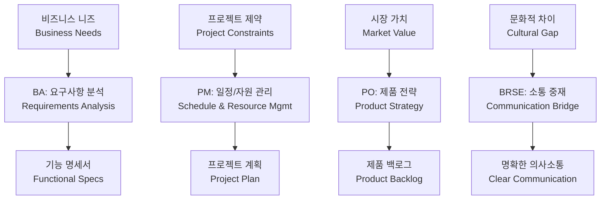
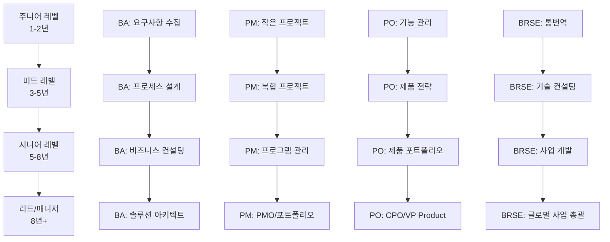

# Bài 2: Phân biệt BA, PM, PO và BRSE

*Understanding Key Roles in Korean Software Development Projects*

\---

## 🎯 **학습목표** (Mục tiêu bài học)

Sau khi hoàn thành bài học này, bạn sẽ:
- **구분** (phân biệt) rõ ràng 4 **핵심 역할** (vai trò cốt lõi): BA, PM, PO, BRSE
- **파악** (nắm bắt) được **책임 영역** (phạm vi trách nhiệm) và **상호 작용** (tương tác) giữa các vai trò
- **적용** (áp dụng) **한국 기업 문화** (văn hóa doanh nghiệp Hàn) vào việc **역할 수행** (thực hiện vai trò)
- **활용** (sử dụng) **전문 용어** (thuật ngữ chuyên môn) tiếng Hàn trong **프로젝트 환경** (môi trường dự án)

\---

## 🚨 **혼란스러운 회의실** (Phòng họp hỗn loạn - Tình huống thực tế)

### **배경** (Background)
**회사**: Naver Labs Vietnam  
**프로젝트**: **AI 챗봇** (chatbot AI) 플랫폼 개발  
**참석자**: 4 **핵심 인물** (nhân vật chính)  
**상황**: **긴급 회의** (họp khẩn cấp) - **출시** (ra mắt) 2주 전

### **회의 현장** (Hiện trường cuộc họp)
**🔥 월요일 오전 9시 - 네이버 본사 회의실**

**한국 고객 (네이버 AI팀장 이부장)**:
"**사용자 피드백** (phản hồi người dùng)을 보니 **챗봇 응답** (phản hồi chatbot)이 너무 **딱딱** (cứng nhắc)해요. 더 **자연스럽게** (tự nhiên) 만들어야겠어요."

**4명이 동시에 대답**:

**Person A**: "**요구사항 분석** (phân tích yêu cầu)을 다시 해보겠습니다. **사용자 시나리오** (kịch bản người dùng) 조사가 필요해요."

**Person B**: "**일정** (tiến độ) 상 문제가 있습니다. **추가 개발** (phát triển thêm)하면 **출시 연기** (hoãn ra mắt) 불가피해요."

**Person C**: "이 **기능** (tính năng)보다는 **핵심 가치** (giá trị cốt lõi)에 집중해야 합니다. **우선순위** (ưu tiên) **재조정** (điều chỉnh lại) 필요해요."

**Person D**: "**한국 고객** (khách hàng Hàn)의 **의도** (ý định)를 **개발팀** (đội phát triển)에게 정확히 전달하겠습니다."

**💥 문제**: 누가 누구인지 구분이 안 된다! 각자 **역할** (vai trò)이 **중복** (trùng lặp)되고 **책임** (trách nhiệm)이 **불분명** (không rõ ràng)!

\---

## 📊 **4대 핵심 역할 비교 매트릭스** (Ma trận so sánh 4 vai trò cốt lõi)

### **역할별 DNA 분석** (Phân tích DNA theo vai trò)

| **역할** | **핵심 질문** | **관심 영역** | **성공 지표** | **한국어 명칭** |
|---------|-------------|-------------|-------------|---------------|
| **BA**<br>*Business Analyst* | "**무엇을** (cái gì) 만들어야 하는가?" | **비즈니스 요구사항**<br>(yêu cầu kinh doanh) | **요구사항 정확도** (độ chính xác yêu cầu) 95%+ | **비즈니스 분석가**<br>(nhà phân tích nghiệp vụ) |
| **PM**<br>*Project Manager* | "**언제** (khi nào) 완료할 것인가?" | **프로젝트 일정** (tiến độ dự án) & **예산** (ngân sách) | **일정 준수율** (tỷ lệ tuân thủ tiến độ) 90%+ | **프로젝트 관리자**<br>(người quản lý dự án) |
| **PO**<br>*Product Owner* | "**왜** (tại sao) 이것이 중요한가?" | **제품 가치** (giá trị sản phẩm) & **사용자 경험**<br>(trải nghiệm người dùng) | **사용자 만족도** (độ hài lòng người dùng) 4.5/5+ | **제품 책임자**<br>(người chủ sản phẩm) |
| **BRSE**<br>*Bridge SE* | "**어떻게** (như thế nào) 소통할 것인가?" | **의사소통** (giao tiếp) & **문화적 가교** (cầu nối văn hóa) | **의사소통 효율성** (hiệu quả giao tiếp) 95%+ | **브리지 엔지니어**<br>(kỹ sư cầu nối) |

### **역할별 책임 영역** (Phạm vi trách nhiệm theo vai trò)



\---

## 🎭 **역할별 심층 분석** (Phân tích sâu từng vai trò)

### **1. BA (비즈니스 분석가)** - The Requirements Detective

#### **핵심 미션**: "**정확한 요구사항** (yêu cầu chính xác) 발굴"

**전형적인 하루**:
```korean
오전: 고객 인터뷰 → "정확히 어떤 기능을 원하시나요?"
오후: 업무 프로세스 분석 → 플로우차트 작성  
저녁: 요구사항 명세서 업데이트
```

**사용하는 도구들**:
- **요구사항 추적 매트릭스** (requirements traceability matrix)
- **업무 프로세스 모델링** (business process modeling) - BPMN
- **사용자 스토리** (user stories) 작성
- **프로토타이핑** (prototyping) 도구

**성공하는 BA의 특징**:
- **세부사항에 대한 집착** (ám ảnh chi tiết)
- **질문하는 능력** (khả năng đặt câu hỏi): "정말로 그게 필요한가요?"
- **문서화 스킬** (kỹ năng tài liệu hóa): 모호함을 명확함으로 전환

### **2. PM (프로젝트 관리자)** - The Orchestra Conductor

#### **핵심 미션**: "**프로젝트 성공** (thành công dự án) 보장"

**전형적인 하루**:
```korean
오전: 일일 스탠드업 미팅 → 진척 상황 점검
오후: 리스크 관리 → 일정 조정
저녁: 상부 보고서 작성
```

**관리하는 **제약 조건** (ràng buộc)**:
- **시간** (thời gian): **데드라인** (deadline) 준수
- **예산** (ngân sách): **비용** (chi phí) **통제** (kiểm soát)
- **범위** (phạm vi): **스코프 크리프** (scope creep) 방지
- **품질** (chất lượng): **QA 기준** (tiêu chuẩn QA) 충족

**PM의 **딜레마** (tình huống khó xử)**:
```korean
고객: "기능 하나만 더 추가해주세요" (빠른 vs 완벽)
개발팀: "시간이 더 필요합니다" (일정 vs 품질)  
경영진: "예산을 줄여야 합니다" (비용 vs 성과)
```

### **3. PO (제품 책임자)** - The Value Maximizer

#### **핵심 미션**: "**최대 가치** (giá trị tối đa) 창출"

**특별한 권한**:
- **백로그 우선순위** (ưu tiên backlog) 결정권
- **기능 승인/거부** (phê duyệt/từ chối tính năng) 권한
- **출시 시점** (thời điểm ra mắt) 결정

**PO의 **고민** (nỗi lo)**:
```korean
"이 기능이 정말 사용자에게 가치를 줄까?"
"경쟁사 대비 우리의 차별점은 무엇인가?"
"ROI가 가장 높은 기능은 어떤 것일까?"
```

**애자일 환경에서의 PO**:
- **스프린트 목표** (mục tiêu sprint) 설정
- **데모 리뷰** (review demo) 주관
- **스토리 포인트** (story points) 평가 참여

### **4. BRSE (브리지 엔지니어)** - The Cultural Translator

#### **핵심 미션**: "**완벽한 소통** (giao tiếp hoàn hảo) 실현"

**특별한 도전**:
```korean
한국 문화: 빠른 의사결정, 직설적 표현
베트남 문화: 신중한 접근, 조화로운 관계

→ 두 문화를 연결하는 브릿지 역할
```

**BRSE만의 **스킬셋** (bộ kỹ năng)**:
- **언어적 번역** (dịch thuật ngôn ngữ): 한국어 ↔ 베트남어
- **기술적 번역** (dịch thuật kỹ thuật): 비즈니스 언어 ↔ 기술 언어  
- **문화적 번역** (dịch thuật văn hóa): 서로 다른 업무 방식 조율

\---

## 🎪 **실전 시뮬레이션: 4명의 전문가** (Mô phỏng thực tế: 4 chuyên gia)

### **프로젝트**: **K-뷰티** (K-Beauty) **이커머스** (thương mại điện tử) 플랫폼

#### **위기 상황**: **사용자 이탈률** (tỷ lệ người dùng rời bỏ) 급증

**데이터**: 
- **페이지 이탈률** (tỷ lệ rời trang): 75% (목표: 30%)
- **구매 전환율** (tỷ lệ chuyển đổi mua hàng): 1.2% (목표: 3.5%)
- **고객 불만** (khiếu nại khách hàng): **결제 과정** (quy trình thanh toán) 복잡함

#### **각 역할별 대응 방식**:

**BA의 접근**:
```korean
"사용자 여정 맵핑을 다시 해보겠습니다.
- 어느 단계에서 이탈이 가장 많이 발생하나?
- 사용자들이 실제로 무엇을 원하나?
- 경쟁사 대비 우리 프로세스의 문제점은?"

→ 상세한 사용자 리서치 및 요구사항 재정의
```

**PM의 접근**:
```korean
"긴급 태스크포스를 구성하겠습니다.
- 우선순위: 결제 프로세스 간소화 (2주)
- 리소스 재배치: UI/UX팀 집중 투입
- 일정 조정: 다른 기능 개발 연기"

→ 프로젝트 계획 전면 재검토
```

**PO의 접근**:
```korean
"제품 전략을 재고해야 합니다.
- 핵심 가치: 간편한 쇼핑 경험
- 우선 기능: 원클릭 결제, 간편가입
- 성과 지표: 전환율 3.5% 달성이 최우선"

→ 제품 백로그 우선순위 전면 재조정
```

**BRSE의 접근**:
```korean
"한국 고객의 진짜 의도를 파악해보겠습니다.
- 한국 소비자의 온라인 쇼핑 패턴은?
- '간편함'의 한국적 의미는 무엇인가?
- 개발팀이 놓치고 있는 문화적 요소는?"

→ 한-베 팀 간 문화적 이해 증진 세션
```

\---

## 📊 **협업 매트릭스** (Ma trận cộng tác)

### **역할 간 상호작용** (Tương tác giữa các vai trò)

| **협업 관계** | **소통 빈도** | **주요 협력 영역** | **잠재적 갈등** | **해결 방안** |
|-------------|-------------|-----------------|-------------|-------------|
| **BA ↔ PO** | 매일 | **요구사항** vs **제품 비전** | 세부사항 vs 큰 그림 | **정기 동기화** (đồng bộ định kỳ) 미팅 |
| **PM ↔ PO** | 매일 | **일정** vs **기능 우선순위** | 시간 vs 가치 | **스프린트 계획** (kế hoạch sprint) 회의 |
| **BA ↔ PM** | 주 2-3회 | **요구사항 완성도** vs **개발 일정** | 완벽 vs 속도 | **점진적 개발** (phát triển từng bước) |
| **BRSE ↔ 모든 역할** | 수시 | **의사소통 지원** | 번역의 정확성 | **문서화** (tài liệu hóa) 및 **확인** (xác nhận) |

### **의사결정 매트릭스** (Ma trận ra quyết định)

| **의사결정 영역** | **최종 결정자** | **자문 역할** | **정보 제공** | **실행 담당** |
|-----------------|-------------|-------------|-------------|-------------|
| **기능 우선순위** | **PO** | BA, PM | BRSE | **개발팀** (đội phát triển) |
| **일정 변경** | **PM** | PO, BA | BRSE | **전체팀** (toàn bộ team) |
| **요구사항 해석** | **BA** | PO, BRSE | PM | **개발팀** |
| **고객 소통** | **BRSE** | BA, PM, PO | **개발팀** | **BRSE** |

\---

## 🎯 **실전 연습** (Bài tập thực hành nâng cao)

### **시나리오**: **핀테크** (fintech) 앱 **보안** (bảo mật) 강화

#### **상황 설정**
**고객**: **신한은행** (Shinhan Bank)  
**요구사항**: "**해킹 사고** (sự cố hack) 이후 **보안** 강화 필수"  
**제약조건**: **출시 일정** (lịch ra mắt) 변경 불가, **사용성** (tính khả dụng) 저하 금지

#### **각 역할별 미션**

**BA 미션**:
```markdown
다음 질문들에 답하여 요구사항을 명확화하세요:

1. "보안 강화"의 구체적 기준은?
   - [ ] 2단계 인증 필수화
   - [ ] 생체인증 도입  
   - [ ] 세션 타임아웃 단축
   - [ ] 기타: _______________

2. 어떤 데이터가 가장 민감한가?
   - [ ] 계좌 정보
   - [ ] 거래 내역
   - [ ] 개인정보
   - [ ] 기타: _______________

3. 사용자 불편 허용 수준은?
   - [ ] 로그인 시간 2배 증가 OK
   - [ ] 추가 인증 단계 1개 OK
   - [ ] 기타: _______________
```

**PM 미션**:
```markdown
보안 강화 프로젝트 계획을 수립하세요:

일정 계획:
- Phase 1 (2주): _______________
- Phase 2 (3주): _______________  
- Phase 3 (1주): _______________

리소스 배치:
- 보안 전문가: ___명
- 백엔드 개발자: ___명
- 프론트엔드 개발자: ___명

위험 요소:
1. ___________________________
2. ___________________________
3. ___________________________
```

**PO 미션**:
```markdown
제품 가치 관점에서 우선순위를 정하세요:

Must Have (필수):
- [ ] ______________________
- [ ] ______________________

Should Have (중요):
- [ ] ______________________  
- [ ] ______________________

Could Have (선택):
- [ ] ______________________
- [ ] ______________________

성공 지표:
- 보안 사고 0건 유지
- 사용자 이탈률 5% 이하
- 기타: ___________________
```

**BRSE 미션**:
```markdown
한국 고객과 베트남 개발팀 사이 소통 계획:

고객 우려사항 파악:
1. 가장 걱정하는 부분: ___________
2. 절대 타협할 수 없는 것: _______
3. 유연하게 조정 가능한 것: _____

개발팀 전달사항:
1. 보안의 중요성: ______________
2. 한국 금융업계 특성: __________
3. 문화적 맥락: _______________

소통 일정:
- 일일 체크인: ___시
- 주간 리뷰: 매주 ___요일  
- 긴급 연락체계: ______________
```

\---

## 📈 **역할별 성장 경로** (Lộ trình phát triển theo vai trò)

### **경력 발전 매트릭스**



### **한국 기업에서의 **선호 스킬** (kỹ năng được ưa chuộng)**

| **역할** | **기술 스킬** | **소프트 스킬** | **문화적 스킬** | **연봉 프리미엄** |
|---------|-------------|-------------|-------------|-----------------|
| **BA** | **데이터 분석** (phân tích dữ liệu), **프로세스 모델링** (mô hình hóa quy trình) | **논리적 사고** (tư duy logic), **문서화** | **비즈니스 매너** (phép lịch sự kinh doanh) | +15% |
| **PM** | **프로젝트 도구** (công cụ dự án), **리스크 관리** (quản lý rủi ro) | **리더십** (lãnh đạo), **협상** (đàm phán) | **서열 문화** (văn hóa thứ bậc) 이해 | +20% |
| **PO** | **데이터 기반** (dựa trên dữ liệu) 의사결정, **UX/UI** | **전략적 사고** (tư duy chiến lược), **고객 중심** (tập trung khách hàng) | **시장 감각** (cảm giác thị trường) | +25% |
| **BRSE** | **기술 + 비즈니스** (công nghệ + kinh doanh) 융합 | **문화적 감수성** (nhạy cảm văn hóa), **중재** | **한국어 + 전문성** (tiếng Hàn + chuyên môn) | +30% |

\---

## 🎓 **마스터 레벨 도전** (Thử thách cấp độ Master)

### **복합 시나리오**: **AI 기반** (dựa trên AI) **HR 플랫폼** (nền tảng nhân sự)

#### **프로젝트 복잡성**
- **다국적 팀**: 한국 기획 + 베트남 개발 + 인도 AI
- **규제 이슈**: **개인정보보호법** (luật bảo vệ thông tin cá nhân), **노동법** (luật lao động)
- **기술적 도전**: **머신러닝** (machine learning) **알고리즘** (thuật toán) 적용
- **비즈니스 압박**: **경쟁사** 출시 3개월 앞서감

#### **통합 미션**: 4개 역할을 **동시에** (đồng thời) 고려한 **전략 수립** (xây dựng chiến lược)

**문제**: 
한국 고객이 "**AI가 채용 추천** (gợi ý tuyển dụng)을 해줬으면 좋겠다"고 요청했지만, 베트남 개발팀은 "**기술적으로 불가능** (không khả thi về kỹ thuật)하다", 인도 AI팀은 "**6개월** 필요하다"고 함.

**당신의 통합 솔루션**:
```markdown
## 4-Role 통합 접근법

### BA 관점 분석:
- 실제 니즈: _________________
- 대안 기능: _________________
- 성공 기준: _________________

### PM 관점 계획:  
- 단계별 일정: _______________
- 리스크 완화: _______________
- 리소스 조정: _______________

### PO 관점 전략:
- 핵심 가치: _________________
- 시장 차별화: _______________  
- 사용자 경험: _______________

### BRSE 관점 소통:
- 문화적 조율: _______________
- 기대치 관리: _______________
- 합의 도출: _________________
```

\---

*"성공하는 팀은 각자의 **전문성** (chuyên môn)을 존중하면서도 **공동 목표** (mục tiêu chung)를 위해 **협력** (hợp tác)하는 팀입니다."*  
*- 효과적인 프로젝트 팀의 철학 -*

---

*Post ID: q8sqm3vpb7f18sg*  
*Category: BRSE*  
*Created: 2/9/2025*  
*Updated: 2/9/2025*
