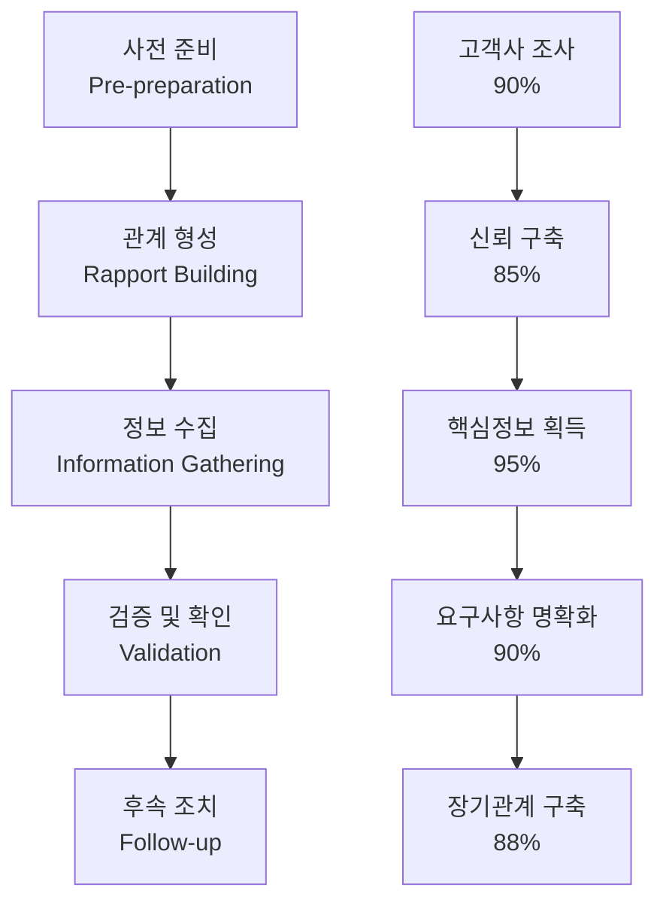
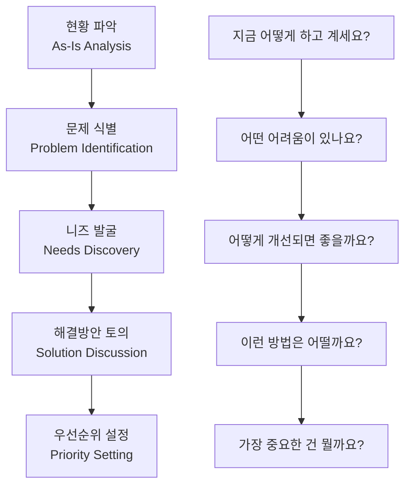
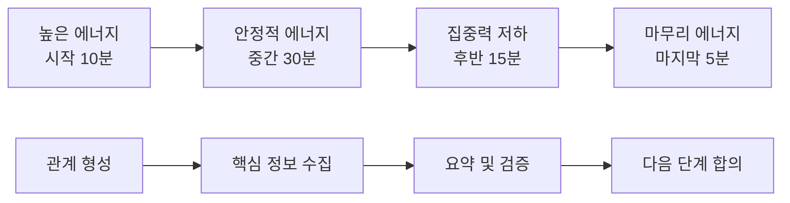

# Bài 14: Thực hành phỏng vấn khách hàng

*Mastering Customer Interview Skills in Korean Business Environment*

\---

## 🎯 **학습목표** (Mục tiêu học tập)

Sau khi hoàn thành bài học này, bạn sẽ:
- Thành thạo **고객 인터뷰** (phỏng vấn khách hàng) để **요구사항 수집** (thu thập yêu cầu)
- Áp dụng **질문 기법** (kỹ thuật đặt câu hỏi) hiệu quả theo văn hóa Hàn Quốc
- Xây dựng **신뢰관계** (mối quan hệ tin cậy) qua **전문적 소통** (giao tiếp chuyên nghiệp)
- Quản lý **정보 수집** (thu thập thông tin) và **문서화** (tài liệu hóa) chính xác

\---

## 🚨 **실패한 인터뷰 상황** (Tình huống phỏng vấn thất bại)

### **배경** (Background)
**회사**: FPT Software  
**고객**: **신한은행** (Shinhan Bank)  
**프로젝트**: **모바일뱅킹** (mobile banking) 앱 리뉴얼  
**예산**: 200억원  

### **재앙적인 인터뷰** (Cuộc phỏng vấn thảm họa)
**🔥 첫 번째 고객 인터뷰 - 화요일 오전 10시**

**신한은행 디지털금융부장 (김부장)**:
"바쁜 시간에 30분만 드리겠습니다. **요구사항** (yêu cầu) 빨리 정리해주세요."

**베트남 BRSE (미숙한 접근)**:
"네, **사용자** (người dùng)들이 뭘 원하는지 알고 싶어요. 어떤 **기능** (tính năng) 넣을까요?"

**김부장** (짜증):
"그런 건 당신들이 **조사** (điều tra)해서 **제안** (đề xuất)해야죠! **현재 시스템** (hệ thống hiện tại) **문제점** (vấn đề)도 모르고 와요?"

**베트남 BRSE** (당황):
"아... 그럼... 지금 **시스템** (hệ thống)에서 뭐가 **불편** (bất tiện)하세요?"

**김부장** (화남):
"**구체적인 질문** (câu hỏi cụ thể) 준비 안 하고 왔네요. **시간 낭비** (lãng phí thời gian)입니다!"

**💥 결과**:
- **인터뷰 조기종료** (kết thúc sớm): 10분 만에 끝
- **정보 수집 실패** (thất bại thu thập thông tin): 0%
- **관계 악화** (xấu đi mối quan hệ): 심각
- **프로젝트 신뢰도** (độ tin cậy dự án) 급락

\---

## 📊 **고객 인터뷰 성공 공식** (Customer Interview Success Formula)

### **한국 비즈니스 문화 고려사항**

| **문화적 특성** | **인터뷰 영향** | **대응 전략** | **주의사항** |
|---------------|---------------|-------------|-------------|
| **시간 엄수** (punctuality)<br>*Đúng giờ* | 약속 시간 정확히 지켜야 함 | **5분 전** (5 phút trước) 도착, **사전 준비** (chuẩn bị trước) 철저 | 늦으면 **신뢰도 하락** (mất lòng tin) |
| **위계 의식** (hierarchy consciousness)<br>*Ý thức thứ bậc* | **높임말** (kính ngữ) 사용 필수 | **존댓말** (lời nói lịch sự) 일관성 유지 | **반말** (nói thường) 절대 금지 |
| **체면 문화** (face-saving culture)<br>*Văn hóa thể diện* | 직접적 **비판** (phê bình) 회피 | **우회적 표현** (diễn đạt gián tiếp) 사용 | **공개 질책** (khiển trách công khai) 금지 |
| **완벽주의** (perfectionism)<br>*Chủ nghĩa hoàn hảo* | **세부사항** (chi tiết) 중시 | **철저한 사전조사** (điều tra kỹ lưỡng trước) | **대충** (qua loa) 준비하면 실패 |
| **관계 중시** (relationship-oriented)<br>*Coi trọng mối quan hệ* | **신뢰관계** (mối quan hệ tin cậy) 우선 | **개인적 관심** (quan tâm cá nhân) 표현 | **업무만** (chỉ công việc) 얘기하면 차갑게 느껴짐 |

### **인터뷰 성공률 매트릭스**



\---

## 🎯 **5단계 인터뷰 마스터리** (5-Stage Interview Mastery)

### **1단계: 철저한 사전준비** (Thorough Pre-preparation)

#### **🔍 고객사 리서치 체크리스트**
- [ ] **회사 개요** (tổng quan công ty): 업종, 규모, **주요사업** (hoạt động chính)
- [ ] **조직도** (sơ đồ tổ chức): **의사결정권자** (người ra quyết định) 파악
- [ ] **기존 시스템** (hệ thống hiện có): **현재 솔루션** (giải pháp hiện tại), **기술스택** (công nghệ sử dụng)
- [ ] **경쟁사** (đối thủ cạnh tranh): **시장 위치** (vị trí thị trường), **차별화 포인트** (điểm khác biệt)
- [ ] **최근 뉴스** (tin tức gần đây): **사업 동향** (xu hướng kinh doanh), **이슈** (vấn đề)

#### **📋 질문 준비 프레임워크**
```korean
기본 질문 구조:
1. 현황 파악: "현재 상황이 어떻게 되나요?"
2. 문제 식별: "어떤 어려움이 있으신가요?"  
3. 니즈 발굴: "어떤 부분이 개선되면 좋겠나요?"
4. 우선순위: "가장 시급한 것은 무엇인가요?"
5. 성공 기준: "어떻게 되면 성공이라고 보시나요?"
```

### **2단계: 전문적 관계형성** (Professional Rapport Building)

#### **첫 5분이 승부**
```korean
완벽한 시작 스크립트:
"안녕하십니까? [회사명] [본인이름]입니다. 
오늘 귀한 시간 내주셔서 진심으로 감사드립니다.
[고객사명]의 [관련업무]에 대해 많이 알아보았는데,
특히 [구체적인 칭찬포인트]가 인상적이었습니다."

예시:
"신한은행의 디지털 혁신 노력을 보니 
특히 '디지털 퍼스트' 전략이 매우 앞서가고 계시네요."
```

#### **신뢰구축 대화법**
| **단계** | **목적** | **대화 예시** | **주의점** |
|---------|---------|-------------|----------|
| **아이스브레이킹** (Ice-breaking)<br>*Phá băng* | 긴장 완화 | "오늘 날씨가 좋네요. 오시는 길은 괜찮으셨나요?" | 너무 길게 하지 않기 |
| **전문성 어필** (Expertise Appeal)<br>*Thể hiện chuyên môn* | 신뢰도 구축 | "저희가 **금융권** (ngành tài chính)에서 5년간..." | **자만** (kiêu ngạo) 금지 |
| **관심사 공유** (Interest Sharing)<br>*Chia sẻ mối quan tâm* | 공감대 형성 | "고객 **편의성** (tiện lợi) 향상이 가장 중요하다고 생각합니다" | **진정성** (tính chân thành) 중요 |

### **3단계: 전략적 정보수집** (Strategic Information Gathering)

#### **🎨 질문 기법 마스터리**

**A. 개방형 질문** (Open-ended Questions)
```korean
템플릿: "~에 대해 말씀해 주시겠어요?"

강력한 시작 질문들:
- "현재 [업무프로세스]가 어떻게 진행되는지 설명해주시겠어요?"
- "고객들이 가장 자주 불편해하는 부분이 무엇인가요?"
- "이상적인 시스템이라면 어떤 모습이어야 할까요?"
- "경쟁사 대비 우리의 차별화 포인트는 무엇인가요?"
```

**B. 탐색 질문** (Probing Questions)  
```korean
템플릿: "조금 더 구체적으로..."

심화 질문들:
- "그 문제가 업무에 구체적으로 어떤 영향을 미치나요?"
- "예를 들어 어떤 상황인가요?"
- "그렇게 생각하시는 특별한 이유가 있나요?"
- "다른 부서에서는 어떻게 반응하시나요?"
```

**C. 확인 질문** (Confirmation Questions)
```korean
템플릿: "제가 이해한 바로는..."

검증 질문들:
- "정리하면 핵심은 [요약내용]이 맞나요?"
- "우선순위는 A > B > C 순서로 이해했는데 맞나요?"
- "예산 범위는 대략 [금액] 정도로 생각하시나요?"
- "언제까지 완료되기를 원하시나요?"
```

#### **🎪 고난이도 상황 대처법**

**상황 1: 과묵한 고객** (Silent Customer)
```korean
대응전략:
❌ 잘못된 접근: "왜 말씀을 안 하시죠?"
✅ 올바른 접근: 
- "혹시 제가 놓친 부분이 있을까요?"
- "다른 관점에서 보면 어떨까요?"  
- "구체적인 예시로 설명드리면..."
```

**상황 2: 화난 고객** (Angry Customer)
```korean
대응전략:
1. 감정 수용: "충분히 이해됩니다"
2. 문제 분리: "문제를 차근차근 정리해볼까요?"
3. 해결 집중: "어떻게 하면 개선될까요?"
```

**상황 3: 기술적 무지한 고객** (Non-technical Customer)
```korean
대응전략:
❌ 피해야 할 것: 전문용어 남발
✅ 해야 할 것:
- 일상 언어로 설명
- 시각적 자료 활용
- 단계별 점진적 설명
```

### **4단계: 정보 검증 및 우선순위** (Information Validation & Prioritization)

#### **📊 요구사항 분류 매트릭스**

| **범주** | **중요도** | **긴급도** | **구현난이도** | **예시** |
|---------|-----------|-----------|-------------|---------|
| **Must Have**<br>*필수 기능* | 높음 | 높음 | 다양 | 로그인, 계좌조회 |
| **Should Have**<br>*중요 기능* | 높음 | 낮음 | 다양 | **푸시알림** (thông báo push), **즐겨찾기** (yêu thích) |
| **Could Have**<br>*선택 기능* | 낮음 | 낮음 | 낮음 | **테마변경** (đổi giao diện), **위젯** (widget) |
| **Won't Have**<br>*제외 기능* | 낮음 | 낮음 | 높음 | **게임** (trò chơi), **SNS연동** (kết nối mạng xã hội) |

#### **🎯 우선순위 결정 기법**
```korean
MoSCoW 방법 적용:
"고객님 관점에서 이 기능들을 분류하면:
- Must: 없으면 서비스가 불가능한 것
- Should: 있으면 크게 도움이 되는 것  
- Could: 있으면 좋지만 없어도 괜찮은 것
- Won't: 이번 버전에서는 제외할 것

어떻게 생각하시나요?"
```

### **5단계: 완벽한 마무리** (Perfect Closure)

#### **📝 인터뷰 종료 체크리스트**
```korean
마무리 스크립트:
1. 감사 표현: "귀한 시간 내주셔서 정말 감사합니다"
2. 요약 확인: "정리하면 핵심은 다음과 같습니다..."
3. 다음 단계: "다음 주까지 상세 제안서를 보내드리겠습니다"
4. 연락처 교환: "추가 질문이 있으시면 언제든 연락주세요"
5. 재확인: "혹시 빠뜨린 부분이나 강조하고 싶은 점이 있나요?"
```

\---

## 🎬 **실전 시나리오 시뮬레이션** (Real Scenario Simulation)

### **시나리오**: 카카오페이 경쟁 서비스 개발

#### **상황 설정**
**고객**: **우리은행** (Woori Bank) **디지털금융팀** (đội tài chính số)  
**목표**: 카카오페이 경쟁 **간편결제** (thanh toán đơn giản) 서비스  
**예산**: 300억원  
**제약**: 6개월 내 **출시** (ra mắt) 필수

#### **복잡한 이해관계자 상황**
- **IT팀**: **보안** (bảo mật) 최우선  
- **마케팅팀**: **사용자경험** (trải nghiệm người dùng) 최우선
- **경영진**: **비용효율** (hiệu quả chi phí) 최우선
- **고객**: **차별화** (sự khác biệt) 최우선

#### **BRSE 인터뷰 전략**

**1단계: 사전 정보 수집**
```korean
카카오페이 분석:
- 강점: 간편함, 높은 사용률  
- 약점: 수수료, 보안 우려
- 기회: 은행 신뢰도, 금융 전문성
- 위협: 네이버페이, 토스 경쟁
```

**2단계: 맞춤형 질문 전략**
```korean
IT팀장 대상:
"보안 관점에서 카카오페이와 차별화할 수 있는 
기술적 방안이 있을까요?"

마케팅팀장 대상:  
"고객들이 우리 은행을 선택하는 이유와
간편결제에 대한 기대가 어떻게 다른가요?"

경영진 대상:
"ROI 관점에서 투자 대비 기대효과를 
어떻게 측정하시겠나요?"
```

**3단계: 통합 솔루션 도출**
```korean
각 팀의 핵심 니즈 통합:
- 보안: 생체인증 + 은행 보안 시스템 연동
- UX: 3클릭 이내 결제 완료
- 비용: 단계적 출시로 리스크 분산  
- 차별화: 은행만의 신뢰도 + 금융상품 연계
```

\---

## 🛠️ **실전 도구 모음** (Practical Toolkit)

### **🎤 인터뷰 진행 템플릿**

#### **시간 배분 가이드** (60분 기준)
```
0-5분: 인사 및 아이스브레이킹
5-10분: 회사/프로젝트 소개  
10-45분: 핵심 질문 및 정보 수집
45-55분: 요약 및 확인
55-60분: 다음 단계 및 마무리
```

#### **질문 흐름도**


### **📊 정보 수집 매트릭스**

| **영역** | **수집 정보** | **질문 방법** | **검증 방법** |
|---------|-------------|-------------|-------------|
| **업무 프로세스** (Business Process)<br>*Quy trình nghiệp vụ* | 현재 업무 흐름 | "단계별로 설명해주세요" | **플로우차트** (lưu đồ) 그려서 확인 |
| **기능 요구사항** (Functional Requirements)<br>*Yêu cầu chức năng* | 필요한 기능들 | "어떤 기능이 필요한가요?" | **기능목록** (danh sách tính năng) 우선순위 |
| **비기능 요구사항** (Non-functional Requirements)<br>*Yêu cầu phi chức năng* | 성능, 보안 등 | "얼마나 빨라야 하나요?" | **수치** (số liệu)로 구체화 |
| **제약사항** (Constraints)<br>*Ràng buộc* | 예산, 일정, 기술 | "어떤 제약이 있나요?" | **문서** (tài liệu)로 확인 |
| **이해관계자** (Stakeholders)<br>*Bên liên quan* | 관련 부서/담당자 | "누가 관련되어 있나요?" | **조직도** (sơ đồ tổ chức) 확인 |

### **📝 인터뷰 기록 템플릿**

```markdown
# 고객 인터뷰 기록

## 기본 정보
- 날짜/시간: ___________
- 참석자: _____________  
- 장소: ______________

## 주요 내용
### 1. 현황 (As-Is)
- 현재 시스템: _________
- 주요 업무: __________
- 문제점: ____________

### 2. 요구사항 (To-Be)  
- 핵심 니즈: __________
- 기능 요구사항: _______
- 비기능 요구사항: _____

### 3. 제약사항
- 예산: ______________
- 일정: ______________
- 기술: ______________

### 4. 우선순위
1. 최우선: ___________
2. 중요: _____________  
3. 선택: _____________

## 액션 아이템
- [ ] 추가 조사: ________
- [ ] 제안서 작성: ______
- [ ] 다음 미팅: ________
```

\---

## 📚 **고급 인터뷰 기법** (Advanced Interview Techniques)

### **🎭 페르소나별 접근법**

#### **임원급 인터뷰** (Executive Interview)
```korean
특징: 시간 부족, 큰 그림 중시, 결과 지향
전략:
- 핵심만 간단명료하게
- ROI, 경쟁력에 집중
- 구체적 수치 제시
- 리스크 완화 방안 강조

예시 질문:
"이 프로젝트의 성공을 어떤 지표로 측정하시겠나요?"
"경쟁사 대비 우리의 차별화 포인트는 무엇인가요?"
```

#### **실무진 인터뷰** (Working-level Interview)
```korean
특징: 세부사항 중시, 실행 가능성 관심, 업무 효율성
전략:  
- 구체적 업무 시나리오 질문
- 현재 불편사항 구체적 파악
- 해결책 실행 방법 토의
- 교육/훈련 필요성 확인

예시 질문:
"하루에 이 업무를 몇 번 정도 하시나요?"
"가장 시간이 많이 걸리는 단계는 어디인가요?"
```

### **🌊 인터뷰 흐름 관리법**

#### **에너지 관리**


#### **어려운 순간 돌파법**
```korean
상황별 대응:

침묵이 길어질 때:
"혹시 다른 관점에서 생각해볼 점이 있을까요?"

너무 기술적일 때:  
"사용자 입장에서 보면 어떨까요?"

의견이 나뉠 때:
"양쪽 의견을 모두 고려한 방안이 있을까요?"

시간이 부족할 때:
"가장 우선순위가 높은 것부터 말씀해주시겠어요?"
```

\---

## 🎯 **실전 과제** (Practical Assignment)

### **미션**: 완벽한 고객 인터뷰 실행

#### **시나리오 설정**
**고객**: **LG유플러스** (LG U+)  
**프로젝트**: **5G 기반 스마트홈** (smart home dựa trên 5G) 플랫폼  
**당신의 역할**: BRSE  
**목표**: **요구사항 수집** (thu thập yêu cầu) 완료

#### **복잡한 도전 과제**
1. **다양한 이해관계자**: 기술팀, 마케팅팀, **사업개발팀** (đội phát triển kinh doanh)
2. **기술적 복잡성**: 5G, IoT, AI 융합
3. **시장 불확실성**: **신규 서비스** (dịch vụ mới) 영역
4. **경쟁 상황**: **삼성** (Samsung), **KT** (KT) 경쟁 치열

#### **당신의 과제**

**1단계: 인터뷰 계획 수립**
```markdown
## 인터뷰 마스터플랜

### A. 사전 조사 계획
- LG유플러스 5G 현황 분석
- 경쟁사 스마트홈 서비스 벤치마킹  
- 기술 트렌드 조사
- 잠재 고객 니즈 파악

### B. 인터뷰 대상별 전략
| 대상 | 목표 | 핵심 질문 | 접근 방식 |
|------|------|----------|----------|
| CTO | 기술 비전 | 5G 활용 방안 | 기술 리더십 관점 |
| 마케팅 | 시장성 | 고객 니즈 | 시장 기회 관점 |
| 사업개발 | 수익성 | ROI 모델 | 비즈니스 관점 |

### C. 질문 설계
- 개방형: 70% (탐색적)
- 폐쇄형: 20% (확인용)  
- 가정형: 10% (창의적)
```

**2단계: 실전 인터뷰 스크립트**
```korean
## 60분 인터뷰 스크립트

### 도입부 (5분)
"안녕하십니까? 오늘 LG유플러스의 혁신적인 5G 스마트홈 
비전에 대해 이야기 나눌 수 있어서 영광입니다."

### 현황 파악 (15분)
"현재 5G 인프라를 어떻게 활용하고 계신가요?"
"기존 스마트홈 시장의 한계는 무엇이라고 보시나요?"

### 비전 탐색 (20분)  
"5G 기반 스마트홈의 차별화 포인트는 무엇인가요?"
"어떤 고객 경험을 만들어가고 싶으신가요?"

### 구체화 (15분)
"구체적으로 어떤 디바이스들이 연동되어야 할까요?"
"사용자들이 가장 자주 사용할 기능은 무엇일까요?"
"보안과 프라이버시는 어떻게 보장하시겠나요?"

### 마무리 (5분)
"오늘 말씀해주신 내용을 정리하면..."
"다음 주까지 상세 제안서를 준비해드리겠습니다."
```

**3단계: 위기상황 대응 매뉴얼**
```markdown
## 인터뷰 중 돌발상황 대응

### 상황 1: "너무 기술적이야, 이해 못하겠어"
대응: "죄송합니다. 좀 더 쉽게 설명드리겠습니다.
예를 들어 집에서..."

### 상황 2: "경쟁사는 이미 출시했는데?"
대응: "맞습니다. 하지만 저희는 5G의 진정한 장점을
활용한 차별화된 접근을..."

### 상황 3: "예산이 너무 많이 들 것 같은데?"
대응: "투자 대비 효과를 단계별로 보여드리겠습니다.
1단계에서는..."
```

**4단계: 성과 측정 계획**
```yaml
성공 지표:
  정보수집률: 95% 이상
  고객만족도: 8.5/10 이상  
  요구사항명확도: 90% 이상
  후속미팅성사: 100%

위험요소:
  기술복잡성: 높음 → 시각자료 준비
  시장불확실성: 중간 → 시나리오 기반 접근
  경쟁압박: 높음 → 차별화 포인트 강조
```

\---

## 🏆 **인터뷰 마스터의 비밀** (Interview Master's Secrets)

### **🎯 황금 법칙 10가지**

1. **준비가 90%다** (Preparation is 90%)
   ```korean
   "완벽한 준비는 운을 만든다"
   → 고객사 조사, 질문 설계, 시나리오 대비
   ```

2. **듣기가 말하기보다 중요하다** (Listening > Speaking)
   ```korean
   "말하려면 2배, 들으려면 1배의 시간을 써라"
   → 70% 경청, 30% 질문
   ```

3. **Why가 What보다 강력하다** (Why > What)
   ```korean
   "무엇을 원하는지보다 왜 원하는지가 핵심"
   → 근본 니즈 파악이 해결책의 시작
   ```

4. **침묵을 두려워하지 마라** (Don't Fear Silence)
   ```korean
   "침묵 속에서 진실이 나온다"
   → 고객이 생각할 시간을 주어라
   ```

5. **감정을 읽어라** (Read Emotions)
   ```korean
   "말보다 표정과 몸짓이 더 많은 것을 말한다"
   → 비언어적 신호에 주목하라
   ```

6. **구체적으로 질문하라** (Be Specific)
   ```korean
   "모호한 질문은 모호한 답을 만든다"
   → 언제, 어디서, 누가, 얼마나
   ```

7. **검증을 게을리하지 마라** (Always Validate)
   ```korean
   "이해했다고 가정하지 말고 확인하라"
   → 요약하고 재확인하라
   ```

8. **관계가 정보보다 중요하다** (Relationship > Information)
   ```korean
   "신뢰 없이는 진정한 정보를 얻을 수 없다"
   → 장기적 관점에서 접근하라
   ```

9. **메모는 필수, 기록은 생명** (Notes are Essential)
   ```korean
   "기록되지 않은 것은 일어나지 않은 것"
   → 실시간 기록과 즉시 정리
   ```

10. **후속조치가 신뢰를 만든다** (Follow-up Creates Trust)
    ```korean
    "약속한 것은 반드시 지켜라"
    → 24시간 내 요약 이메일 발송
    ```

### **⚡ 위기상황 골든 대응법**

#### **고객이 화났을 때**
```korean
STOP 기법:
S - Stop: 일단 멈추고
T - Think: 상황을 파악하고  
O - Organize: 대응을 정리하고
P - Proceed: 신중하게 진행

실제 대응:
"고객님의 불편하심을 충분히 이해합니다. 
구체적으로 어떤 부분이 문제인지 들어보겠습니다."
```

#### **기술적 오해가 있을 때**
```korean
재프레이밍 기법:
"제가 설명을 잘못한 것 같습니다. 
다시 쉽게 설명드리겠습니다."

시각화 활용:
화이트보드, 그림, 예시로 설명
```

#### **시간이 부족할 때**
```korean
우선순위 집중:
"시간이 제한적이니 가장 중요한 3가지부터 
이야기해보겠습니다."
```

\---

## 📊 **자가진단 체크리스트** (Self-Assessment Checklist)

### **인터뷰 준비 역량**
- [ ] 고객사 **기본정보** (thông tin cơ bản) 조사 완료 (업종, 규모, 주요사업)
- [ ] 프로젝트 관련 **배경지식** (kiến thức nền tảng) 충분히 습득
- [ ] **질문리스트** (danh sách câu hỏi) 체계적으로 준비 (개방형/폐쇄형/탐색형)
- [ ] 예상되는 **어려운 상황** (tình huống khó khăn)에 대한 대응방안 준비

### **인터뷰 진행 역량**
- [ ] **첫인상** (ấn tượng đầu tiên) 관리 및 **라포형성** (tạo mối quan hệ) 능력
- [ ] **경청스킬** (kỹ năng lắng nghe): 70% 듣기, 30% 말하기 비율 유지
- [ ] **질문기법** (kỹ thuật đặt câu hỏi): 상황에 맞는 적절한 질문 선택
- [ ] **시간관리** (quản lý thời gian): 정해진 시간 내 목표 달성

### **정보 수집 및 관리 역량**  
- [ ] **핵심정보** (thông tin cốt lõi) 놓치지 않고 수집
- [ ] **실시간 기록** (ghi chép thời gian thực) 및 **요약정리** (tóm tắt) 능력
- [ ] **모호한 내용** (nội dung mơ hồ) 즉시 **명확화** (làm rõ) 요청
- [ ] **우선순위** (ưu tiên) 분류 및 **검증** (xác minh) 프로세스

### **문화적 커뮤니케이션 역량**
- [ ] 한국 비즈니스 **예의** (phép lịch sự) 및 **프로토콜** (quy tắc) 준수
- [ ] **높임말** (kính ngữ) 및 **존댓말** (lời nói tôn trọng) 자연스러운 사용
- [ ] **간접적 표현** (diễn đạt gián tiếp) 이해 및 **눈치** (sự tinh tế) 파악
- [ ] **갈등상황** (tình huống xung đột)에서 **조화** (hòa hợp) 추구 능력

\---

## 🎓 **마스터 레벨 도전과제** (Master Level Challenge)

### **최종 미션**: 멀티 이해관계자 복합 인터뷰

#### **극한 상황 설정**
**프로젝트**: **자율주행차** (xe tự lái) **인포테인먼트** (infotainment) 시스템  
**고객**: **현대자동차** (Hyundai Motor) 컨소시엄  
**복잡성**: 7개 부서 + 3개 협력사 + 2개 정부기관  
**제약**: 120분 **집단 인터뷰** (phỏng vấn nhóm) 1회로 완료

#### **당신의 극한 도전**
```markdown
## 미션 임파서블: 복합 이해관계자 인터뷰

### 참석자 (12명)
- 현대차 임원진 (3명): CEO, CTO, CMO
- 현대차 실무진 (4명): 개발팀장, 디자인팀장, 품질팀장, 마케팅팀장  
- 협력사 (3명): 반도체업체, 소프트웨어업체, 통신업체
- 정부기관 (2명): 교통부, 방통위

### 도전과제
1. 상충하는 이해관계 조정
2. 기술적 복잡성 관리  
3. 규제 요구사항 충족
4. 시간 제약 하에서 합의 도출

### 성공 조건
- 모든 이해관계자 만족도 8.0/10 이상
- 핵심 요구사항 90% 이상 수집  
- 다음 단계 합의 100% 달성
- 갈등 상황 0건 유지
```

**평가 기준**:
- **전략적 사고** (30%): 복잡한 이해관계 통합 능력
- **실행 역량** (25%): 인터뷰 진행 및 시간 관리
- **소통 능력** (25%): 문화적 감수성 및 언어 구사
- **위기 관리** (20%): 돌발 상황 대응 및 갈등 조정

\---

*"완벽한 인터뷰는 정보를 얻는 것이 아니라, 신뢰를 쌓는 것이다."*  
*- 인터뷰 마스터의 철학 -*

## 🔗 **추가 학습 자료** (Additional Learning Resources)

### **추천 도서**
- "한국인의 대화법" - 문화적 소통 이해
- "질문의 힘" - 효과적 질문 기법
- "경청의 기술" - 액티브 리스닝 마스터

### **실습 기회**  
- 사내 **동료 인터뷰** (phỏng vấn đồng nghiệp) 연습
- **고객사 방문** (thăm khách hàng) 시 관찰 학습
- **온라인 모의 인터뷰** (phỏng vấn mô phỏng) 플랫폼 활용

### **지속적 개선**
- 매 인터뷰 후 **회고** (nhìn lại) 및 **개선점** (điểm cần cải thiện) 도출
- **피드백** (phản hồi) 수집 및 반영
- **베스트 프랙티스** (thực tiễn tốt nhất) 공유 및 학습

---

*Post ID: utrd57cpox5902x*  
*Category: BRSE*  
*Created: 2/9/2025*  
*Updated: 2/9/2025*
