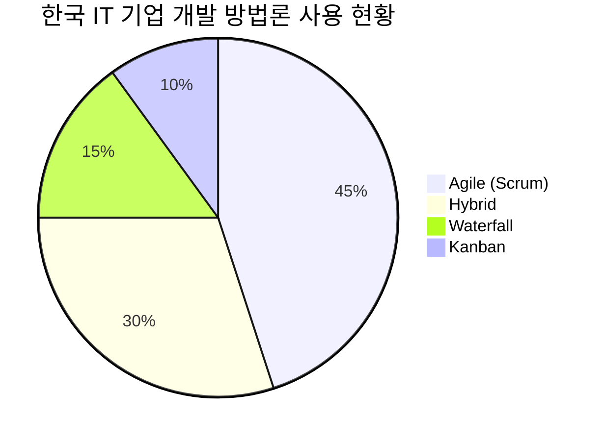
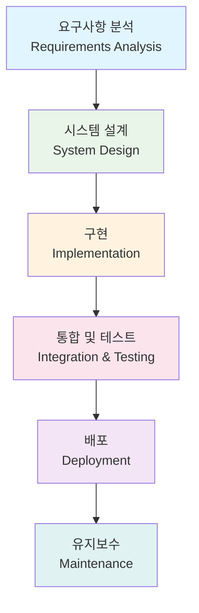
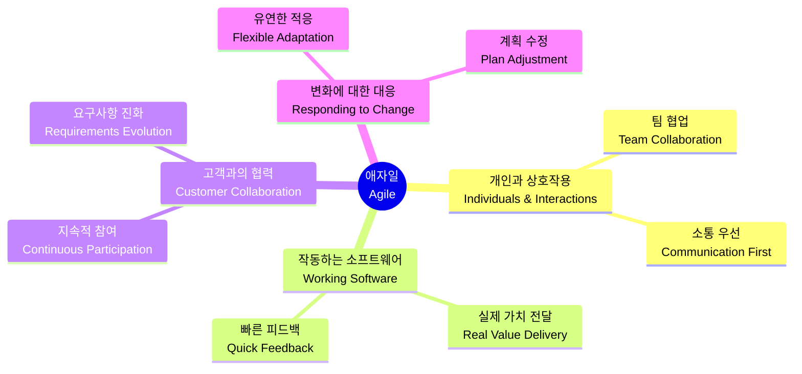
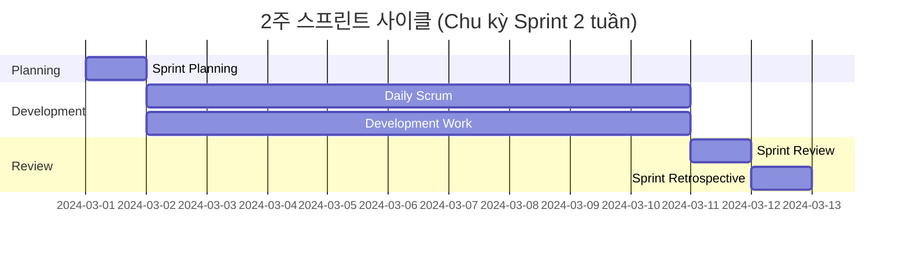
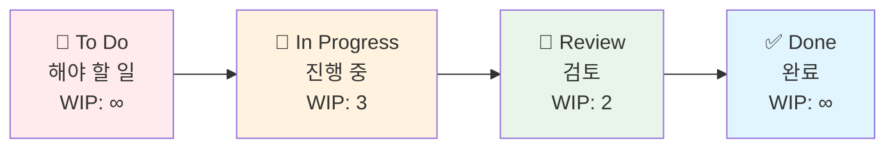
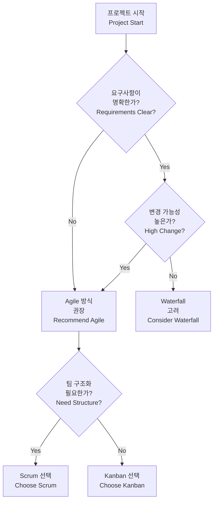
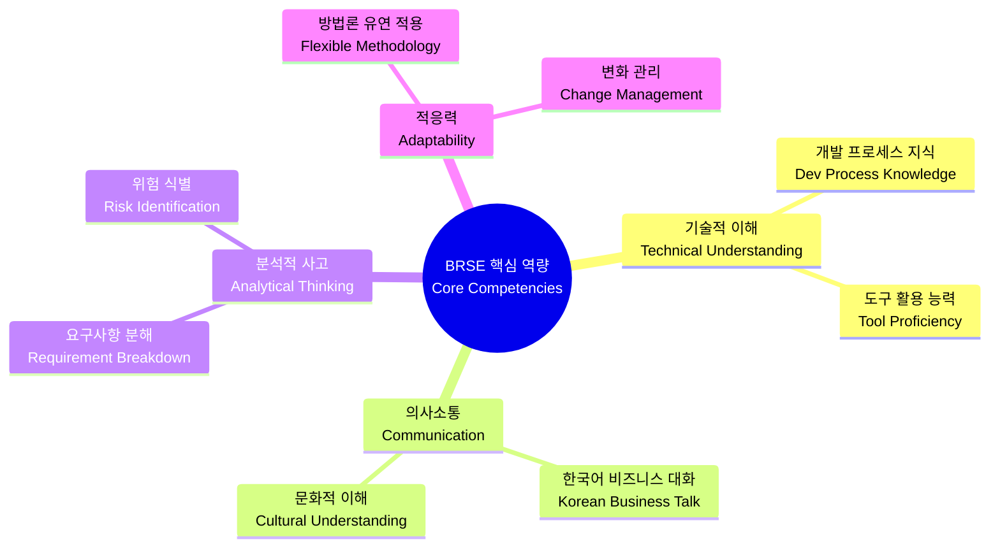

# Bài 4: Các mô hình phát triển phần mềm: Waterfall, Agile, Scrum, Kanban

## Waterfall, Agile, Scrum, Kanban - 실무 적용 가이드 (Hướng dẫn ứng dụng thực tế)

\---

### 🎯 학습 목표 (Mục tiêu học tập)

| 역량 (Năng lực) | 학습 성과 (Kết quả học tập) |
|---|---|
| **분석 및 설명** (Phân tích và giải thích) | 4가지 개발 방법론 (phương pháp luận phát triển) 의 특성, 장단점 파악 |
| **구분하기** (Phân biệt) | Waterfall 전통 방식 (phương pháp truyền thống) vs Agile 철학 (triết lý) 차이점 이해 |
| **적용하기** (Áp dụng) | Scrum/Kanban framework를 실제 프로젝트 (dự án thực tế) 에 활용 |
| **수행하기** (Thực hiện) | 각 개발 환경 (môi trường phát triển) 에서 BRSE 역할 효과적 수행 |

\---

### 🏢 실무 시나리오 (Tình huống thực tế)

#### 📍 **배경** (Bối cảnh): 
**삼성SDS 신규 프로젝트 미팅** (Cuộc họp dự án mới tại Samsung SDS)

> 💼 **상황** (Tình huống): 베트남 출신 BRSE Minh씨가 한국 고객사와의 첫 미팅에 참석합니다. 
> 
> **고객** (Khách hàng): *"이번 프로젝트는 언제 완료될 수 있을까요? 정확한 일정과 비용을 알고 싶습니다."*
> 
> **팀장** (Trưởng nhóm): *"고객 요구사항이 자주 변경될 가능성이 높아 보이는데, 어떤 개발 방식으로 진행하는 게 좋을까요?"*
> 
> **개발자** (Lập trình viên): *"기술 스택이 새로워서 시행착오가 있을 것 같은데..."*

**➡️ Minh씨는 어떤 개발 방법론 (개발 방법론) 을 제안해야 할까요?**

\---

## 📊 개발 방법론 전체 비교 (So sánh tổng quan các phương pháp luận)

### 🔍 **선택 기준 매트릭스** (Ma trận tiêu chí lựa chọn)

| 프로젝트 특성 (Đặc điểm dự án) | Waterfall | Scrum | Kanban |
|---|---|---|---|
| **요구사항 명확도** (Độ rõ ràng yêu cầu) | 매우 높음 ✅ | 중간 ⚡ | 낮음-중간 🔄 |
| **변경 빈도** (Tần suất thay đổi) | 거의 없음 ✅ | 자주 있음 ⚡ | 매우 자주 🔄 |
| **고객 참여도** (Mức độ tham gia khách hàng) | 초기만 ✅ | 적극적 ⚡ | 필요시 🔄 |
| **프로젝트 규모** (Quy mô dự án) | 소규모 ✅ | 중대규모 ⚡ | 모든 규모 🔄 |
| **위험 관리** (Quản lý rủi ro) | 높은 위험 ❌ | 낮은 위험 ⚡ | 중간 위험 🔄 |

### 📈 **실무 채택률** (Tỷ lệ áp dụng thực tế) - 2024년 한국 IT 업계



\---

## 1️⃣ 폭포수 모델 (Mô hình Thác nước - Waterfall)

### 🌊 **개념 및 특징** (Khái niệm và đặc điểm)

**정의** (Định nghĩa): 각 개발 단계 (giai đoạn phát triển) 를 순차적으로 완료하는 전통적 방법론



### 💼 **실무 사례** (Case Study): 한국 정부 전자정부 시스템 (Hệ thống chính phủ điện tử Hàn Quốc)

| 단계 (Giai đoạn) | 기간 (Thời gian) | BRSE 주요 업무 (Công việc chính của BRSE) |
|---|---|---|
| **요구사항 정의** (Định nghĩa yêu cầu) | 3개월 | 공무원 인터뷰, 업무 프로세스 분석 |
| **시스템 설계** (Thiết kế hệ thống) | 2개월 | 기능 명세서 작성, UI/UX 검토 |
| **개발** (Phát triển) | 8개월 | 진행 상황 모니터링, 이슈 해결 |
| **테스트** (Kiểm thử) | 2개월 | 테스트 케이스 검증, 사용자 교육 |
| **배포** (Triển khai) | 1개월 | 운영 준비, 문제 대응 |

### 📊 **장단점 분석** (Phân tích ưu-nhược điểm)

| 👍 **강점** (Điểm mạnh) | 👎 **약점** (Điểm yếu) | 
|---|---|
| **명확한 단계별 목표** (Mục tiêu rõ ràng từng giai đoạn) | **늦은 피드백** (Phản hồi muộn) |
| **정확한 비용 산정** (Tính toán chi phí chính xác) | **높은 프로젝트 실패 위험** (Rủi ro thất bại dự án cao) |
| **체계적인 문서화** (Tài liệu hóa có hệ thống) | **변경 요구 대응 어려움** (Khó ứng phó thay đổi) |

### 🎯 **적용 시나리오** (Kịch bản áp dụng)

**✅ 적합한 프로젝트** (Dự án phù hợp):
- 정부 시스템 (Hệ thống chính phủ)
- 금융 규제 시스템 (Hệ thống quy định tài chính)
- 안전 중요 시스템 (Hệ thống an toàn quan trọng)

**❌ 부적합한 프로젝트** (Dự án không phù hợp):
- 스타트업 MVP (MVP startup)
- 소셜 미디어 플랫폼 (Nền tảng mạng xã hội)
- 실험적 기술 프로젝트 (Dự án công nghệ thử nghiệm)

\---

## 2️⃣ 애자일 철학 (Triết lý Agile)

### 🎨 **핵심 가치** (Giá trị cốt lõi) - Agile Manifesto



### 🔄 **반복적 개발 사이클** (Chu kỳ phát triển lặp lại)

| 주차 (Tuần) | 활동 (Hoạt động) | 결과물 (Sản phẩm) | 고객 피드백 (Phản hồi khách hàng) |
|---|---|---|---|
| 1-2주 | 기본 로그인 기능 개발 | 동작하는 로그인 화면 | "비밀번호 찾기 추가 필요" |
| 3-4주 | 사용자 프로필 관리 | 프로필 CRUD 기능 | "프로필 사진 업로드 원함" |
| 5-6주 | 게시물 작성 기능 | 기본 포스팅 시스템 | "이미지 첨부 기능 필요" |

\---

## 3️⃣ 스크럼 (Scrum) Framework

### 🏃‍♂️ **스프린트 구조** (Cấu trúc Sprint)



### 👥 **스크럼 팀 구성** (Cấu trúc đội Scrum)

| 역할 (Vai trò) | 책임 (Trách nhiệm) | BRSE와의 관계 (Mối quan hệ với BRSE) |
|---|---|---|
| **Product Owner** | 제품 비전, 백로그 관리 | 요구사항 명확화 협력 |
| **Scrum Master** | 프로세스 촉진, 장애물 제거 | 의사소통 지원 |
| **Development Team** | 제품 개발, 품질 보장 | 기술적 협의 |

### 📋 **백로그 관리 실무** (Thực tế quản lý Backlog)

#### **User Story 작성 템플릿** (Template viết User Story):

```
As a [사용자 유형] (loại người dùng)
I want [기능] (chức năng) 
So that [목적/가치] (mục đích/giá trị)

예시 (Ví dụ):
As a 고객 (khách hàng)
I want 온라인으로 예약을 취소할 수 있기를 (có thể hủy đặt chỗ online)
So that 갑작스런 일정 변경에 대응할 수 있다 (có thể ứng phó thay đổi lịch trình đột xuất)
```

#### **우선순위 매트릭스** (Ma trận ưu tiên):

| 중요도 (Mức độ quan trọng) | 긴급도 (Tính khẩn cấp) | 우선순위 (Thứ tự ưu tiên) | 행동 (Hành động) |
|---|---|---|---|
| 높음 (Cao) | 높음 (Cao) | 1 | 즉시 처리 (Xử lý ngay) |
| 높음 (Cao) | 낮음 (Thấp) | 2 | 계획적 처리 (Xử lý có kế hoạch) |
| 낮음 (Thấp) | 높음 (Cao) | 3 | 위임/간소화 (Ủy quyền/đơn giản hóa) |
| 낮음 (Thấp) | 낮음 (Thấp) | 4 | 제거 고려 (Cân nhắc loại bỏ) |

\---

## 4️⃣ 칸반 (Kanban) System

### 📊 **칸반 보드 구성** (Cấu trúc bảng Kanban)



### 📈 **WIP 제한의 효과** (Hiệu quả giới hạn WIP)

| 상황 (Tình huống) | WIP 제한 없음 (Không giới hạn WIP) | WIP 제한 있음 (Có giới hạn WIP) |
|---|---|---|
| **동시 작업 수** (Số công việc đồng thời) | 10개 작업 동시 진행 | 3개 작업 집중 |
| **완료 속도** (Tốc độ hoàn thành) | 느린 완료 | 빠른 완료 |
| **품질** (Chất lượng) | 실수 증가 | 높은 품질 유지 |
| **팀 스트레스** (Căng thẳng nhóm) | 높음 | 낮음 |

### 🔍 **실무 적용 사례** (Case thực tế áp dụng): IT 서비스 운영팀 (Đội vận hành dịch vụ IT)

**문제 상황** (Tình huống vấn đề): 고객 문의가 쌓여서 응답 지연

**칸반 도입 결과** (Kết quả triển khai Kanban):

| 지표 (Chỉ số) | 도입 전 (Trước triển khai) | 도입 후 (Sau triển khai) | 개선율 (Tỷ lệ cải thiện) |
|---|---|---|---|
| **평균 처리 시간** (Thời gian xử lý trung bình) | 3일 | 1.5일 | 50% ↓ |
| **고객 만족도** (Độ hài lòng khách hàng) | 60% | 85% | 25% ↑ |
| **팀 효율성** (Hiệu quả nhóm) | 70% | 90% | 20% ↑ |

\---

## 🎯 실무 선택 가이드 (Hướng dẫn lựa chọn thực tế)

### 🤔 **의사결정 트리** (Cây quyết định)



### 💡 **BRSE 실무 팁** (Mẹo thực tế cho BRSE)

#### **프로젝트 킥오프 미팅 체크리스트** (Checklist cuộc họp khởi động dự án)

| 확인 사항 (Mục kiểm tra) | Waterfall | Scrum | Kanban |
|---|---|---|---|
| **팀 구성 확인** (Xác nhận cấu trúc nhóm) | ✅ 역할별 명확 분담 | ✅ PO/SM/Dev 역할 | ✅ 유연한 역할 분담 |
| **소통 방식 정의** (Định nghĩa cách giao tiếp) | 📅 정기 보고서 | 📅 Daily Scrum | 📅 필요시 미팅 |
| **문서화 수준** (Mức độ tài liệu hóa) | 📋 상세 문서 | 📋 필수 문서만 | 📋 최소한 문서 |
| **고객 참여 빈도** (Tần suất tham gia khách hàng) | 🎯 단계별 승인 | 🎯 스프린트 리뷰 | 🎯 필요시 참여 |

\---

## 🏆 실무 연습 문제 (Bài tập thực hành)

### 📝 **상황별 방법론 선택** (Lựa chọn phương pháp theo tình huống)

#### **시나리오 A**: 한국 대기업 ERP 시스템 구축 (Xây dựng hệ thống ERP tập đoàn lớn Hàn Quốc)

**프로젝트 정보** (Thông tin dự án):
- 예산 (Ngân sách): 50억원 (khoảng 100 triệu USD)
- 기간 (Thời gian): 18개월
- 팀 규모 (Quy mô nhóm): 30명
- 요구사항 (Yêu cầu): 법적 규제 준수 필수

**질문** (Câu hỏi): 어떤 방법론을 선택하고 그 이유는?

#### **시나리오 B**: 스타트업 모바일 앱 개발 (Phát triển app mobile startup)

**프로젝트 정보** (Thông tin dự án):
- 예산 (Ngân sách): 5천만원 (khoảng 100,000 USD) 
- 기간 (Thời gian): 6개월
- 팀 규모 (Quy mô nhóm): 5명
- 요구사항 (Yêu cầu): 시장 반응에 따라 피벗 가능성 높음

**질문** (Câu hỏi): 어떤 방법론을 선택하고 그 이유는?

### 💭 **토론 주제** (Chủ đề thảo luận)

1. **하이브리드 접근법** (Phương pháp lai): 대형 프로젝트에서 Waterfall과 Agile을 조합하는 방법은?

2. **문화적 고려사항** (Yếu tố văn hóa): 한국 기업 문화에서 Agile 도입시 주의할 점은?

3. **BRSE 역할 진화** (Tiến hóa vai trò BRSE): 각 방법론에서 BRSE의 역할은 어떻게 달라지는가?

\---

## 🔑 핵심 정리 (Tóm tắt trọng tâm)

### 📊 **방법론별 BRSE 핵심 역할** (Vai trò chính BRSE theo từng phương pháp)

| 방법론 (Phương pháp) | 주요 활동 (Hoạt động chính) | 성공 지표 (Chỉ số thành công) |
|---|---|---|
| **Waterfall** | 완벽한 요구사항 문서화 | 변경 요청 최소화 |
| **Scrum** | 백로그 정제, 스프린트 지원 | 속도(Velocity) 향상 |
| **Kanban** | 병목 지점 식별, 흐름 최적화 | 리드타임 단축 |

### 🎯 **성공을 위한 핵심 역량** (Năng lực cốt lõi cho thành công)



\---

### 📚 추가 학습 자료 (Tài liệu học tập bổ sung)

#### **전문 용어 사전** (Từ điển thuật ngữ chuyên môn)

| 한국어 | 베트남어 | 영어 | 설명 (Giải thích) |
|--------|----------|------|-------------------|
| 방법론 | Phương pháp luận | Methodology | 개발 접근 방식 |
| 반복 개발 | Phát triển lặp lại | Iterative Development | 점진적 구현 방식 |
| 백로그 관리 | Quản lý backlog | Backlog Management | 작업 목록 우선순위 관리 |
| 지속적 통합 | Tích hợp liên tục | Continuous Integration | 코드 병합 자동화 |

#### **권장 도구** (Công cụ đề xuất)

| 방법론 (Phương pháp) | 한국 기업 선호 도구 (Công cụ ưa chuộng tại Hàn Quốc) | 대안 (Phương án thay thế) |
|---|---|---|
| **Scrum** | Jira + Confluence | Azure DevOps, Monday.com |
| **Kanban** | Trello, Asana | Notion, ClickUp |
| **Documentation** | Notion, Sharepoint | GitBook, Slab |

\---

*📋 **다음 수업 예고**: Bài 5에서는 실제 한국 기업 프로젝트 케이스 스터디를 통해 오늘 학습한 방법론들을 어떻게 적용하는지 실습해보겠습니다!*

*🎯 **과제**: 본인이 경험한 프로젝트나 관심 있는 서비스를 선택하여 가장 적합한 개발 방법론을 선택하고 그 근거를 3가지 이상 제시해보세요.*

---

*Post ID: volmg4i6luo0g91*  
*Category: BRSE*  
*Created: 2/9/2025*  
*Updated: 4/9/2025*
