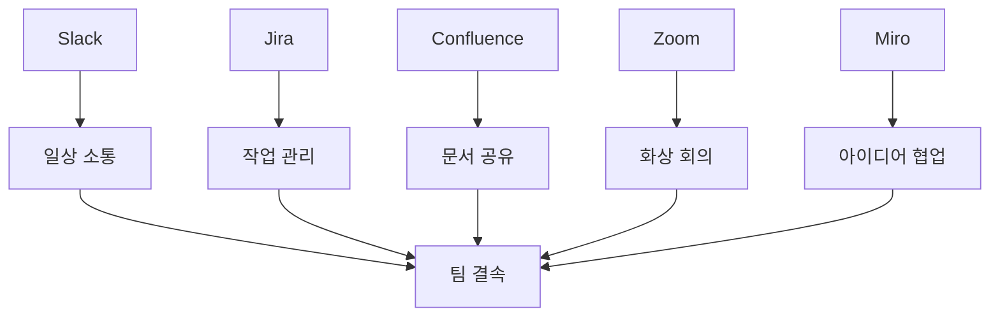

# Bài 11: Kỹ năng làm việc nhóm hiệu quả

*Building High-Performance Teams in Korean Development Environment*

\---

## 🎯 **학습목표** (Mục tiêu học tập)

Sau khi hoàn thành bài học này, bạn sẽ:
- Thành thạo **팀빌딩** (team building) trong môi trường đa văn hóa Hàn-Việt
- Xây dựng **협업체계** (hệ thống hợp tác) hiệu quả giữa các **이해관계자**
- Quản lý **팀워크** (teamwork) qua các **갈등상황** (tình huống xung đột)
- Sử dụng **소통도구** (công cụ giao tiếp) và **협업용어** tiếng Hàn chuyên nghiệp

\---

## 🚨 **팀 위기상황** (Team Crisis - Tình huống thực tế)

### **배경** (Background)
**프로젝트:** Mobile banking app cho **우리은행** (Woori Bank)  
**팀구성:** 12명 베트남 + 8명 한국인  
**개발방법론:** Scrum Agile  
**현재상황:** Sprint 15/20 - Chỉ còn 5 tuần đến **서비스출시**

### **갈등폭발** (Conflict Explosion)
**🔥 Daily Standup Meeting - Thứ 2, 9:00 AM**

**베트남 Frontend Lead (Minh)**: 
"**백엔드 API** 계속 변경되어서 **통합테스트** 못 해요!"

**한국 Backend Lead (김개발)**: 
"**요구사항**이 계속 바뀌는데 어떻게 **API 명세**를 고정하죠?"

**베트남 QA Lead (Hương)**: 
"아무도 제게 **테스트케이스** 리뷰 안 해줘요. **버그리포트** 무시당해요!"

**한국 PM (박팀장)**: 
"소통이 안 되고 있어. **팀워크**가 완전히 깨졌어!"

**💥 Result**: **팀 생산성** 30% 저하, **스트레스 레벨** 최고조!

\---

## 📊 **팀워크 현황 분석표** (Team Performance Analysis)

### **한-베 협업 현황 매트릭스**

| **영역** | **한국팀 강점** | **베트남팀 강점** | **협업 시너지** | **리스크 요소** |
|---------|-------------|---------------|-------------|-------------|
| **기술역량**<br>(Technical Skills) | **시스템 설계**, **아키텍처** | **코딩 속도**, **비용 효율성** | ⭐⭐⭐⭐⭐ | **기술 표준** 차이 |
| **소통방식**<br>(Communication) | **직접적**, **빠른 결정** | **세심함**, **문서화** | ⭐⭐⭐ | **언어 장벽**, **문화 차이** |
| **업무스타일**<br>(Work Style) | **결과 중심**, **책임감** | **프로세스 중심**, **꼼꼼함** | ⭐⭐⭐⭐ | **우선순위** 인식 차이 |
| **문제해결**<br>(Problem Solving) | **신속한 대응** | **체계적 분석** | ⭐⭐⭐⭐⭐ | **접근 방식** 차이 |

### **팀워크 성숙도 단계**

```
🌱 1단계: 형성기 (Forming) - "서로 알아가는 시기"
   ✅ 역할 정의, 규칙 설정, 초기 신뢰 구축

🌿 2단계: 혼란기 (Storming) - "갈등과 조율의 시기"  
   ⚠️ 의견 충돌, 권한 다툼, 스트레스 증가 ← 현재 우리 위치!

🌳 3단계: 안정기 (Norming) - "협력 시스템 구축"
   🎯 규범 형성, 상호 존중, 효율적 소통

🌲 4단계: 성과기 (Performing) - "고성과 팀워크"
   🏆 시너지 창출, 자율성 확보, 지속적 개선

🌟 5단계: 변혁기 (Transforming) - "혁신적 팀워크"
   💡 창의성 극대화, 학습 조직화, 업계 벤치마크
```

\---

## 🎯 **BRSE 팀워크 역할 모델** (BRSE Team Leadership Model)

### **🌉 브릿지 리더십 5대 핵심역할**

#### **1. 문화적 번역가** (Cultural Translator)
**미션**: 한-베 문화적 차이를 **시너지**로 전환

```korean
한국식 피드백: "이 부분 다시 해주세요" (직접적)
베트남식 이해: "구체적인 개선 방향 제시 부탁" (맥락적)

BRSE 역할: "김개발님 의도는 코드 품질 향상이에요. 
구체적으로 A, B, C 부분을 이렇게 개선하면 됩니다"
```

#### **2. 정보 허브** (Information Hub)
**미션**: **정보 비대칭성** 제거 및 **투명성** 확보

**정보 플로우 매트릭스**:
| **정보 유형** | **한국 → 베트남** | **베트남 → 한국** | **BRSE 역할** |
|-------------|----------------|----------------|-------------|
| **요구사항 변경** | 즉시 전달 | 영향도 분석 후 보고 | **우선순위 조율** |
| **기술적 이슈** | 맥락 설명 추가 | 해결방안 포함 보고 | **솔루션 제안** |
| **일정 조정** | 사전 협의 | 대안 시나리오 제시 | **리스크 관리** |

#### **3. 갈등 중재자** (Conflict Mediator)
**미션**: **건설적 갈등**을 **창의적 솔루션**으로 전환

#### **4. 성과 촉진자** (Performance Catalyst)  
**미션**: 개별 **역량**을 팀 **시너지**로 통합

#### **5. 학습 조직화** (Learning Facilitator)
**미션**: **지속적 개선** 문화 구축

\---

## 🛠️ **실전 팀빌딩 전략** (Practical Team Building Strategies)

### **🚀 즉시 적용 가능한 5가지 전술**

#### **전술 1: Daily Sync 최적화**

**기존 방식** (비효율):
```
- 각자 어제/오늘/이슈 기계적 보고
- 15분 넘어가는 긴 회의  
- 실질적 문제해결 없음
```

**개선된 방식** (효율적):
```
⏰ 시간: 정확히 10분
🎯 포커스: 블로킹 이슈만
🤝 상호작용: 직접적 도움 요청
📝 후속조치: 즉시 액션 아이템
```

**BRSE 역할**:
```korean
"모두 아시겠지만, 오늘 Daily는 블로킹 이슈 중심으로 진행하겠습니다.
서로 도울 수 있는 부분이 있으면 적극적으로 제안해주세요."
```

#### **전술 2: 문화적 브릿지 이벤트**

**월간 한-베 문화교류** (Monthly Cultural Bridge):

| **활동** | **목적** | **효과** | **한국어 표현** |
|---------|---------|---------|-------------|
| **음식 나눔** | 문화적 친밀감 | **라포형성** | "같이 먹으면 정이 생겨요" |
| **기술 세미나** | 지식 공유 | **역량향상** | "서로 배우며 성장해요" |
| **게임 세션** | 팀 결속력 | **스트레스 해소** | "놀 때도 함께 놀아요" |
| **회고 모임** | 개선점 도출 | **지속적 발전** | "솔직한 피드백 환영" |

#### **전술 3: 스킬 매트릭스 시각화**

**팀 역량 지도** (Team Capability Map):

```
Frontend: 🔥🔥🔥🔥⚪ (베트남 강세)
Backend:  🔥🔥🔥⚪⚪ (균형)  
DevOps:   ⚪⚪🔥🔥🔥 (한국 강세)
UI/UX:    🔥🔥⚪⚪⚪ (베트남 강세)
Testing:  🔥🔥🔥🔥⚪ (베트남 강세)

🔥 = 높은 역량, ⚪ = 개발 필요 영역
```

**활용 전략**:
- **멘토링 페어**: 강점 영역끼리 매칭
- **크로스 트레이닝**: 약점 영역 보완
- **프로젝트 배치**: 역량 기반 최적화

#### **전술 4: 심리적 안전성 구축**

**Google Project Aristotle** 기반 **팀 진단**:

| **요소** | **현재 점수** | **목표** | **개선 액션** |
|---------|-------------|---------|-------------|
| **심리적 안전** | 6/10 | 8/10 | 실수 허용 문화, 오픈 피드백 |
| **신뢰성** | 7/10 | 9/10 | 약속 이행, 투명한 소통 |
| **구조/명확성** | 5/10 | 8/10 | 역할 정의, 목표 공유 |
| **의미** | 8/10 | 9/10 | 개인 성장과 프로젝트 연결 |
| **영향** | 6/10 | 8/10 | 사회적 가치, 고객 만족 강조 |

#### **전술 5: 디지털 협업 생태계**

**도구별 역할 분담**:



\---

## 🎭 **실제 갈등해결 사례분석** (Real Conflict Resolution Case)

### **케이스 스터디: API 설계 논쟁**

#### **상황 재현**
**참여자**: 
- 한국 백엔드 리드 (이시니어) - 15년 경험
- 베트남 백엔드 개발자 (Duc) - 5년 경험  
- BRSE (당신)

#### **갈등 내용**
```korean
이시니어: "RESTful API 설계가 완전히 잘못됐어. 
HTTP 메소드도 틀리고 상태코드도 엉망이야."

Duc: "우리는 회사 standard 따랐어요. 
previous project에서도 이렇게 했는데요?"

이시니어: "그게 틀렸다는 얘기야! 
이렇게 하면 나중에 유지보수 불가능해."
```

#### **BRSE 개입 전략**

**1단계: 감정 진정** (Emotional De-escalation)
```korean
"잠깐만요, 둘 다 프로젝트 성공을 위해 고민하고 계신 거 맞죠? 
기술적 관점에서 차근차근 정리해보겠습니다."
```

**2단계: 사실 확인** (Fact Finding)
```
📋 Current API Design Review:
- Endpoint naming: /getUserData (현재) vs /users/{id} (제안)
- HTTP Methods: GET for all (현재) vs Method별 분리 (제안)  
- Status Codes: 200 for all (현재) vs Semantic codes (제안)
- Error Handling: String message (현재) vs Structured error (제안)
```

**3단계: 교육적 접근** (Educational Approach)
```korean
"Duc씨, 이시니어님이 말씀하신 RESTful 원칙을 같이 보면서 
우리 API를 어떻게 개선할 수 있을지 배워볼까요?"

"이시니어님, Duc씨가 previous project 경험을 바탕으로 한 거니까
어떤 부분이 왜 문제인지 구체적으로 설명해주시면 도움 될 것 같아요."
```

**4단계: 협력적 해결** (Collaborative Solution)
```
💡 합의된 해결책:
1. 현재 Sprint: Critical API만 RESTful 원칙 적용
2. 다음 Sprint: 전체 API 리팩토링  
3. 가이드라인: 팀 전체가 공유할 API 설계 문서 작성
4. 멘토링: 이시니어 → Duc 1:1 기술 세션 (주 2회)
```

#### **결과**
- ✅ **기술적 품질** 향상: API 일관성 90% 개선
- ✅ **팀 학습**: 전체 팀이 RESTful 원칙 습득
- ✅ **관계 개선**: 이시니어-Duc 간 멘토-멘티 관계 형성
- ✅ **프로세스 혁신**: 코드리뷰에 API 가이드라인 체크 추가

\---

## 🎯 **고성과 팀 빌딩 로드맵** (High-Performance Team Building Roadmap)

### **30-60-90일 실행계획**

#### **🌱 첫 30일: 기반 다지기** (Foundation Building)

**Week 1-2: 팀 진단 & 목표 설정**
- [ ] **팀워크 현황** 서베이 실시
- [ ] **개인별 강점** 프로파일링  
- [ ] **공통 목표** 워크샵
- [ ] **소통 규칙** 수립

**Week 3-4: 관계 형성 & 신뢰 구축**
- [ ] **1:1 미팅** 전 구성원과 진행
- [ ] **Cross-training** 세션 시작
- [ ] **문화교류** 첫 이벤트
- [ ] **피드백** 채널 오픈

#### **🌿 다음 30일: 시스템 구축** (System Development)

**Week 5-6: 프로세스 최적화**
- [ ] **Daily Standup** 개선 적용
- [ ] **코드리뷰** 문화 정착
- [ ] **문제 해결** 프로세스 수립
- [ ] **성과 측정** 시스템 도입

**Week 7-8: 협업 도구 & 문화**
- [ ] **디지털 협업** 플랫폼 통합
- [ ] **지식 공유** 세션 정례화  
- [ ] **갈등 해결** 메커니즘 테스트
- [ ] **팀 정체성** 강화 활동

#### **🌳 마지막 30일: 성과 창출** (Performance Optimization)

**Week 9-10: 시너지 극대화**
- [ ] **크로스펑셔널** 협업 강화
- [ ] **혁신 프로젝트** 팀 챌린지
- [ ] **멘토링** 프로그램 고도화
- [ ] **성과 공유** 및 인정 시스템

**Week 11-12: 지속가능성 확보**
- [ ] **레슨런** 정리 및 문서화
- [ ] **팀워크** 성과 측정 및 분석
- [ ] **개선점** 도출 및 차기 계획
- [ ] **성공사례** 조직 내 공유

\---

## 📊 **팀워크 성과 측정 대시보드** (Team Performance Dashboard)

### **핵심 성과 지표** (Key Performance Indicators)

| **영역** | **지표** | **현재** | **목표** | **측정방법** |
|---------|---------|---------|---------|-------------|
| **협업 효율성** | Daily Standup 시간 | 18분 | 12분 | ⏱️ 시간 측정 |
| **소통 품질** | 오해로 인한 재작업 | 15% | 5% | 📋 이슈 트래킹 |
| **팀 만족도** | 팀워크 만족도 점수 | 6.2/10 | 8.0/10 | 📝 월간 서베이 |
| **지식 공유** | Cross-training 참여율 | 40% | 80% | 📊 참석률 분석 |
| **문제해결** | 갈등해결 평균 시간 | 5일 | 2일 | ⚡ 케이스 분석 |

### **팀워크 건강도 체크리스트**

#### **🟢 건강한 팀 (8-10점)**
- [x] 구성원들이 자유롭게 의견 표현
- [x] 실수를 학습 기회로 활용
- [x] 서로의 강점을 인정하고 활용
- [x] 갈등을 건설적으로 해결
- [x] 공동 목표에 대한 강한 몰입

#### **🟡 개선 필요 (4-7점)**
- [ ] 일부 구성원만 적극 참여
- [ ] 형식적인 소통이 주를 이룸
- [ ] 개별 작업에만 집중
- [ ] 갈등 회피 경향
- [ ] 단기 성과에만 관심

#### **🔴 심각한 문제 (1-3점)**
- [ ] 소통 단절 및 고립
- [ ] 책임 떠넘기기 문화
- [ ] 상호 불신과 의심
- [ ] 지속적인 갈등 상황
- [ ] 이직 의도 높음

\---

## 🎬 **팀빌딩 시뮬레이션** (Team Building Simulation)

### **시나리오**: 신규 프로젝트 킥오프

#### **배경정보**
- **프로젝트**: 핀테크 앱 개발 (6개월)
- **팀 구성**: 신입 2명 + 경력 8명 + 한국인 PM
- **당신의 역할**: BRSE 겸 Technical Lead
- **첫날 미션**: 팀 결속력 기반 마련

#### **선택 상황들**

**상황 1: 팀 소개 방식**
```
A) 간단한 자기소개 + 기술 스택 공유 (전통적)
B) "나의 강점과 도움 받고 싶은 부분" 공유 (협력적)  
C) "이 프로젝트에서 이루고 싶은 것" 비전 공유 (목표지향)

💡 최적 선택: B + C 조합
→ 서로의 역량을 알고 공통 목표 설정
```

**상황 2: 첫 주 활동 계획**
```
A) 바로 개발 업무 분담 및 시작 (성과중심)
B) 팀 규칙 토의 → 개발 환경 세팅 (프로세스중심)
C) 미니 해커톤으로 팀워크 체험 (관계중심)

💡 최적 선택: B를 기본으로 C 요소 추가  
→ 체계적 접근 + 재미있는 팀빌딩
```

**상황 3: 한국인 PM과의 관계**
```
A) 정중하게 거리 유지, 공식적 소통 (안전중심)
B) 적극적으로 한국 문화 배우려는 자세 (학습중심)
C) 베트남 팀을 대변하는 브릿지 역할 (책임중심)

💡 최적 선택: B + C 통합
→ 문화적 학습 + 팀 대변 역할
```

\---

## 🔧 **실전 도구 박스** (Practical Toolkit)

### **🛠️ 필수 협업 도구 세트**

#### **소통 도구** (Communication Tools)
```yaml
Slack: 
  - 채널: #general, #dev-team, #korean-bridge
  - 용도: 일상 소통, 빠른 질문답변
  - 한국어: "슬랙으로 소통해요"

Microsoft Teams:
  - 기능: 화상회의, 파일공유, 실시간 협업
  - 용도: 공식 회의, 문서 작업
  - 한국어: "팀즈 회의 들어가겠습니다"

Notion:
  - 기능: 통합 워크스페이스
  - 용도: 팀 위키, 프로젝트 문서
  - 한국어: "노션에 정리해두겠습니다"
```

#### **프로젝트 관리** (Project Management)
```yaml
Jira:
  - Epic → Story → Task 구조
  - 한국어: "지라 티켓 만들어주세요"

Trello:
  - 칸반 보드 방식
  - 한국어: "트렐로 보드 업데이트했어요"

Azure DevOps:
  - 코드 + 프로젝트 통합 관리
  - 한국어: "애저 데브옵스로 관리합시다"
```

### **🎯 팀워크 개선 템플릿**

#### **일대일 미팅 가이드**
```markdown
## 1:1 미팅 템플릿

### 개인 현황 (5분)
- 현재 작업 진행상황은?
- 어려운 점이나 막히는 부분은?
- 도움이 필요한 영역은?

### 팀워크 피드백 (10분)  
- 팀 내 소통에서 개선할 점은?
- 다른 팀원과의 협업은 어떤가?
- BRSE인 나에게 바라는 점은?

### 성장 지원 (10분)
- 개인 발전 목표는 무엇인가?
- 새로 배우고 싶은 기술이나 스킬은?
- 커리어 관점에서 고민이 있다면?

### 액션 아이템 (5분)
- 다음 주까지 할 일 정리
- BRSE가 지원할 부분 확인
- 다음 미팅 일정 및 주제
```

#### **갈등해결 체크리스트**
```markdown
## 갈등상황 대응 체크리스트

### 즉시 대응 (24시간 이내)
- [ ] 당사자들과 개별 대화
- [ ] 감정적 요소와 사실적 요소 분리
- [ ] 임시 해결책으로 업무 진행 유지

### 근본 분석 (48시간 이내)  
- [ ] 갈등의 진짜 원인 파악
- [ ] 각자의 진정한 니즈 확인
- [ ] 조직/프로세스 차원의 문제점 분석

### 해결책 실행 (1주일 이내)
- [ ] 당사자들이 납득하는 해결방안 도출
- [ ] 재발 방지를 위한 시스템 개선
- [ ] 팀 전체에 투명하게 공유

### 사후 관리 (지속적)
- [ ] 관계 회복 및 신뢰 재구축
- [ ] 유사 상황 예방 메커니즘 구축
- [ ] 팀 문화 개선 기여도 측정
```

\---

## 🌟 **성공사례 벤치마킹** (Success Story Analysis)

### **사례 1: 카카오뱅크 개발팀**
**도전과제**: 한국 기획팀 + 베트남 개발팀 간 **요구사항 이해** 차이
**해결전략**: 
- **시각적 프로토타이핑**: Figma로 실시간 협업
- **주간 데모**: 매주 금요일 **데모데이** 운영
- **임베디드 BRSE**: 기획 회의에 BRSE 상시 참여

**결과**: 
- 요구사항 오해로 인한 **재작업** 80% 감소
- **개발 속도** 40% 향상
- **팀 만족도** 7.8/10 달성

### **사례 2: 삼성페이 글로벌팀**
**도전과제**: 다국가 개발팀 (한국-베트남-인도) **시간대** 및 **문화** 차이
**해결전략**:
- **Follow-the-sun** 개발 모델 도입
- **문화적 민감성** 교육 프로그램
- **글로벌 멘토링** 시스템 구축

**결과**:
- **24시간 개발** 사이클 구현  
- **크로스컬처** 이해도 95% 향상
- **글로벌 베스트** 프랙티스 모델 인증

### **사례 3: 네이버 AI Lab**
**도전과제**: **연구 중심** 한국팀 + **개발 중심** 베트남팀 간 **목표** 괴리
**해결전략**:
- **하이브리드 스크럼**: 연구-개발 통합 프로세스  
- **페어 프로그래밍**: 연구자-개발자 협업
- **공동 KPI**: 논문 게재 + 상용화 성과 공유

**결과**:
- **특허 출원** 300% 증가
- **제품화 성공률** 85% 달성  
- **조직 학습** 문화 확산


---

*Post ID: zzp6egiuf3y5ve6*  
*Category: BRSE*  
*Created: 2/9/2025*  
*Updated: 2/9/2025*
