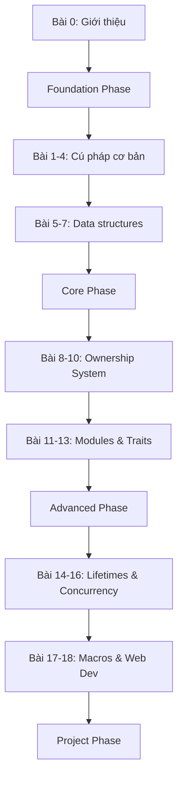
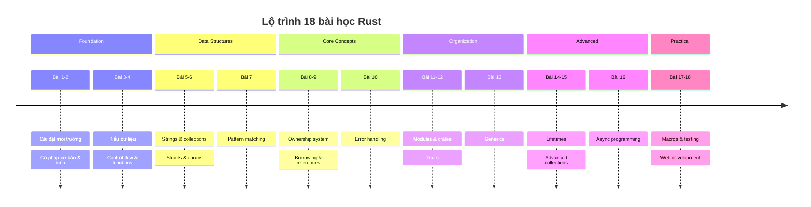
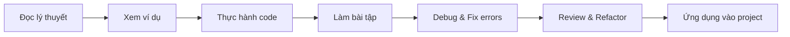

# Bài 0: Giới thiệu khóa học

  <h2 className="text-3xl font-bold mb-4">🦀 Chào mừng đến với thế giới Rust!</h2>
  
Hành trình khám phá ngôn ngữ lập trình an toàn, nhanh chóng và hiện đại nhất hiện nay

## 📚 Lộ trình học tập

  {/* Foundation Phase */}
  

    

      

        🏗️ Giai đoạn 1: Nền tảng
      

      
Bài 1-4 • 2-3 tuần

    

    

      <a href="/desktop-docs/soft-skills/rust/bai-1" className="group relative bg-white p-6 rounded-xl shadow-sm border border-blue-100 hover:shadow-lg hover:border-blue-300 transition-all duration-300">
        

          Bài 1
          →
        

        <h4 className="font-semibold text-gray-900 mb-2">Giới thiệu và cài đặt môi trường</h4>
        
Cài đặt Rust toolchain, Hello World, Cargo basics

      </a>
      <a href="/desktop-docs/soft-skills/rust/bai-2" className="group relative bg-white p-6 rounded-xl shadow-sm border border-blue-100 hover:shadow-lg hover:border-blue-300 transition-all duration-300">
        

          Bài 2
          →
        

        <h4 className="font-semibold text-gray-900 mb-2">Cú pháp cơ bản và biến</h4>
        
Variables, mutability, constants, shadowing

      </a>
      <a href="/desktop-docs/soft-skills/rust/bai-3" className="group relative bg-white p-6 rounded-xl shadow-sm border border-blue-100 hover:shadow-lg hover:border-blue-300 transition-all duration-300">
        

          Bài 3
          →
        

        <h4 className="font-semibold text-gray-900 mb-2">Kiểu dữ liệu</h4>
        
Scalar types, compound types, type inference

      </a>
      <a href="/desktop-docs/soft-skills/rust/bai-4" className="group relative bg-white p-6 rounded-xl shadow-sm border border-blue-100 hover:shadow-lg hover:border-blue-300 transition-all duration-300">
        

          Bài 4
          →
        

        <h4 className="font-semibold text-gray-900 mb-2">Control flow và functions</h4>
        
if/else, loops, functions, return values

      </a>
    

  

  {/* Data & Control Phase */}
  

    

      

        📦 Giai đoạn 2: Cấu trúc dữ liệu
      

      
Bài 5-7 • 2 tuần

    

    

      <a href="/desktop-docs/soft-skills/rust/bai-5" className="group relative bg-white p-6 rounded-xl shadow-sm border border-green-100 hover:shadow-lg hover:border-green-300 transition-all duration-300">
        

          Bài 5
          →
        

        <h4 className="font-semibold text-gray-900 mb-2">Strings và collections</h4>
        
String, Vec, HashMap basics

      </a>
      <a href="/desktop-docs/soft-skills/rust/bai-6" className="group relative bg-white p-6 rounded-xl shadow-sm border border-green-100 hover:shadow-lg hover:border-green-300 transition-all duration-300">
        

          Bài 6
          →
        

        <h4 className="font-semibold text-gray-900 mb-2">Structs và enums</h4>
        
Custom types, methods, associated functions

      </a>
      <a href="/desktop-docs/soft-skills/rust/bai-7" className="group relative bg-white p-6 rounded-xl shadow-sm border border-green-100 hover:shadow-lg hover:border-green-300 transition-all duration-300">
        

          Bài 7
          →
        

        <h4 className="font-semibold text-gray-900 mb-2">Pattern matching</h4>
        
match expressions, if let, while let

      </a>
    

  

  {/* Core Rust Phase */}
  

    

      

        🦀 Giai đoạn 3: Core Rust
      

      
Bài 8-10 • 3-4 tuần

    

    

      <a href="/desktop-docs/soft-skills/rust/bai-8" className="group relative bg-white p-6 rounded-xl shadow-sm border border-orange-100 hover:shadow-lg hover:border-orange-300 transition-all duration-300">
        

          Bài 8
          →
        

        <h4 className="font-semibold text-gray-900 mb-2">Ownership system</h4>
        
Move semantics, stack vs heap

      </a>
      <a href="/desktop-docs/soft-skills/rust/bai-9" className="group relative bg-white p-6 rounded-xl shadow-sm border border-orange-100 hover:shadow-lg hover:border-orange-300 transition-all duration-300">
        

          Bài 9
          →
        

        <h4 className="font-semibold text-gray-900 mb-2">Borrowing và references</h4>
        
References, borrowing rules, slices

      </a>
      <a href="/desktop-docs/soft-skills/rust/bai-10" className="group relative bg-white p-6 rounded-xl shadow-sm border border-orange-100 hover:shadow-lg hover:border-orange-300 transition-all duration-300">
        

          Bài 10
          →
        

        <h4 className="font-semibold text-gray-900 mb-2">Error handling</h4>
        
Result, Option, panic!, error propagation

      </a>
    

  

  {/* Organization Phase */}
  

    

      

        🏗️ Giai đoạn 4: Tổ chức code
      

      
Bài 11-13 • 2-3 tuần

    

    

      <a href="/desktop-docs/soft-skills/rust/bai-11" className="group relative bg-white p-6 rounded-xl shadow-sm border border-purple-100 hover:shadow-lg hover:border-purple-300 transition-all duration-300">
        

          Bài 11
          →
        

        <h4 className="font-semibold text-gray-900 mb-2">Modules và crates</h4>
        
Project organization, visibility, use statements

      </a>
      <a href="/desktop-docs/soft-skills/rust/bai-12" className="group relative bg-white p-6 rounded-xl shadow-sm border border-purple-100 hover:shadow-lg hover:border-purple-300 transition-all duration-300">
        

          Bài 12
          →
        

        <h4 className="font-semibold text-gray-900 mb-2">Traits</h4>
        
Shared behavior, trait bounds, trait objects

      </a>
      <a href="/desktop-docs/soft-skills/rust/bai-13" className="group relative bg-white p-6 rounded-xl shadow-sm border border-purple-100 hover:shadow-lg hover:border-purple-300 transition-all duration-300">
        

          Bài 13
          →
        

        <h4 className="font-semibold text-gray-900 mb-2">Generics</h4>
        
Generic types, functions, implementations

      </a>
    

  

  {/* Advanced Phase */}
  

    

      

        🚀 Giai đoạn 5: Nâng cao
      

      
Bài 14-16 • 3-4 tuần

    

    

      <a href="/desktop-docs/soft-skills/rust/bai-14" className="group relative bg-white p-6 rounded-xl shadow-sm border border-indigo-100 hover:shadow-lg hover:border-indigo-300 transition-all duration-300">
        

          Bài 14
          →
        

        <h4 className="font-semibold text-gray-900 mb-2">Lifetimes</h4>
        
Lifetime annotations, lifetime elision

      </a>
      <a href="/desktop-docs/soft-skills/rust/bai-15" className="group relative bg-white p-6 rounded-xl shadow-sm border border-indigo-100 hover:shadow-lg hover:border-indigo-300 transition-all duration-300">
        

          Bài 15
          →
        

        <h4 className="font-semibold text-gray-900 mb-2">Advanced collections</h4>
        
Iterator patterns, closure, functional programming

      </a>
      <a href="/desktop-docs/soft-skills/rust/bai-16" className="group relative bg-white p-6 rounded-xl shadow-sm border border-indigo-100 hover:shadow-lg hover:border-indigo-300 transition-all duration-300">
        

          Bài 16
          →
        

        <h4 className="font-semibold text-gray-900 mb-2">Async programming</h4>
        
async/await, Futures, concurrency

      </a>
    

  

  {/* Practical Phase */}
  

    

      

        💼 Giai đoạn 6: Thực hành
      

      
Bài 17-18 • 2-3 tuần

    

    

      <a href="/desktop-docs/soft-skills/rust/bai-17" className="group relative bg-white p-6 rounded-xl shadow-sm border border-teal-100 hover:shadow-lg hover:border-teal-300 transition-all duration-300">
        

          Bài 17
          →
        

        <h4 className="font-semibold text-gray-900 mb-2">Macros và testing</h4>
        
Declarative macros, unit tests, integration tests

      </a>
      <a href="/desktop-docs/soft-skills/rust/bai-18" className="group relative bg-white p-6 rounded-xl shadow-sm border border-teal-100 hover:shadow-lg hover:border-teal-300 transition-all duration-300">
        

          Bài 18
          →
        

        <h4 className="font-semibold text-gray-900 mb-2">Web development</h4>
        
Web frameworks, REST APIs, database integration

      </a>
    

  

---

## 1. Tổng quan về khóa học

### 🎯 Mục tiêu khóa học

  

    <h4 className="font-semibold text-blue-800 mb-2">Kiến thức cơ bản</h4>
    
Nắm vững syntax, ownership system và type system của Rust

  

  

    <h4 className="font-semibold text-green-800 mb-2">Ứng dụng thực tế</h4>
    
Xây dựng ứng dụng web, CLI tools và hiểu ecosystem Rust

  

  

    <h4 className="font-semibold text-purple-800 mb-2">Tư duy lập trình</h4>
    
Phát triển mindset về memory safety và zero-cost abstractions

  

  

    <h4 className="font-semibold text-yellow-800 mb-2">Kỹ năng chuyên sâu</h4>
    
Async programming, concurrency và advanced patterns

  

---

## 2. Cấu trúc khóa học

```mermaid
graph TD
    A[Bài 0: Giới thiệu] --> B[Foundation Phase]
    B --> C[Bài 1-4: Cú pháp cơ bản]
    C --> D[Bài 5-7: Data structures]
    D --> E[Core Phase]
    E --> F[Bài 8-10: Ownership System]
    F --> G[Bài 11-13: Modules & Traits]
    G --> H[Advanced Phase]
    H --> I[Bài 14-16: Lifetimes & Concurrency]
    I --> J[Bài 17-18: Macros & Web Dev]
    J --> K[Project Phase]
```

### 📚 Phân chia giai đoạn học tập

| Giai đoạn | Bài học | Trọng tâm | Thời gian ước tính |
|-----------|---------|-----------|-------------------|
| **Foundation** | 1-4 | Cú pháp cơ bản, biến, functions | 2-3 tuần |
| **Data & Control** | 5-7 | Collections, structs, enums, pattern matching | 2 tuần |
| **Core Rust** | 8-10 | Ownership, borrowing, error handling | 3-4 tuần |
| **Organization** | 11-13 | Modules, traits, generics | 2-3 tuần |
| **Advanced** | 14-16 | Lifetimes, collections, concurrency | 3-4 tuần |
| **Practical** | 17-18 | Macros, testing, web development | 2-3 tuần |

---

## 3. Lộ trình học tập chi tiết

```mermaid
timeline
    title Lộ trình 18 bài học Rust
    
    section Foundation
        Bài 1-2    : Cài đặt môi trường
                   : Cú pháp cơ bản & biến
        Bài 3-4    : Kiểu dữ liệu
                   : Control flow & functions
    
    section Data Structures  
        Bài 5-6    : Strings & collections
                   : Structs & enums
        Bài 7      : Pattern matching
    
    section Core Concepts
        Bài 8-9    : Ownership system
                   : Borrowing & references
        Bài 10     : Error handling
    
    section Organization
        Bài 11-12  : Modules & crates
                   : Traits
        Bài 13     : Generics
    
    section Advanced
        Bài 14-15  : Lifetimes
                   : Advanced collections
        Bài 16     : Async programming
    
    section Practical
        Bài 17-18  : Macros & testing
                   : Web development
```

---

## 4. Tại sao học Rust?

### 🚀 Ưu điểm nổi bật của Rust

  

    

      
🛡️

      <h4 className="font-semibold mb-2">Memory Safety</h4>
      
Ngăn ngừa buffer overflow, null pointer dereference

    

    

      
⚡

      <h4 className="font-semibold mb-2">Zero-cost Abstractions</h4>
      
Performance cao như C/C++ với code dễ đọc

    

    

      
🔧

      <h4 className="font-semibold mb-2">Modern Tooling</h4>
      
Cargo package manager, rustfmt, clippy

    

  

### 📊 So sánh Rust với các ngôn ngữ khác

| Đặc điểm | Rust | C++ | Go | Python |
|----------|------|-----|----|----|
| **Memory Safety** | ✅ Compile-time | ❌ Manual | ✅ GC | ✅ GC |
| **Performance** | ⭐⭐⭐⭐⭐ | ⭐⭐⭐⭐⭐ | ⭐⭐⭐⭐ | ⭐⭐ |
| **Concurrency** | ⭐⭐⭐⭐⭐ | ⭐⭐⭐ | ⭐⭐⭐⭐⭐ | ⭐⭐⭐ |
| **Learning Curve** | ⭐⭐ | ⭐ | ⭐⭐⭐⭐ | ⭐⭐⭐⭐⭐ |
| **Ecosystem** | ⭐⭐⭐⭐ | ⭐⭐⭐⭐⭐ | ⭐⭐⭐⭐ | ⭐⭐⭐⭐⭐ |

---

## 5. Yêu cầu và chuẩn bị

### 💻 Yêu cầu hệ thống

| Thành phần | Yêu cầu tối thiểu | Khuyến nghị |
|------------|-------------------|-------------|
| **OS** | Windows 7+, macOS 10.7+, Linux | Latest stable |
| **RAM** | 2GB | 4GB+ |
| **Storage** | 2GB free space | 5GB+ |
| **Internet** | Để download crates | Stable connection |

### 🎓 Kiến thức nền tảng

  <h4 className="font-semibold text-blue-800 mb-3">Cần có:</h4>
  <ul className="list-disc list-inside text-blue-700 space-y-1">
    <li>Hiểu biết cơ bản về lập trình (variables, functions, loops)</li>
    <li>Kinh nghiệm với ít nhất một ngôn ngữ lập trình</li>
    <li>Quen thuộc với command line/terminal</li>
  </ul>

  <h4 className="font-semibold text-green-800 mb-3">Có thì tốt:</h4>
  <ul className="list-disc list-inside text-green-700 space-y-1">
    <li>Kinh nghiệm với C/C++ (để hiểu memory management)</li>
    <li>Biết về functional programming concepts</li>
    <li>Hiểu về version control (Git)</li>
  </ul>

---

## 6. Phương pháp học tập

### 🎯 Chiến lược học hiệu quả

```mermaid
graph LR
    A[Đọc lý thuyết] --> B[Xem ví dụ]
    B --> C[Thực hành code]
    C --> D[Làm bài tập]
    D --> E[Debug & Fix errors]
    E --> F[Review & Refactor]
    F --> G[Ứng dụng vào project]
```

### 📝 Cấu trúc mỗi bài học

  

    1
    Mục tiêu bài học (5 phút)
  

  

    2
    Lý thuyết & concepts (15-20 phút)
  

  

    3
    Ví dụ thực tế (10-15 phút)
  

  

    4
    Hands-on practice (20-30 phút)
  

  

    5
    Tổng kết & homework (5 phút)
  

---

## 7. Dự án thực tế trong khóa học

### 🏗️ Roadmap các project

```mermaid
gantt
    title Các dự án thực hành trong khóa học
    dateFormat  X
    axisFormat %d
    
    section Foundation Projects
    Hello World & Calculator    :done, p1, 0, 2
    Text Processing Tools       :done, p2, 2, 4
    
    section Core Projects  
    Employee Management         :active, p3, 4, 7
    File I/O & Error Handling   :p4, 7, 10
    
    section Advanced Projects
    Multi-threaded Processor    :p5, 10, 15
    Async Web Client           :p6, 15, 17
    
    section Final Project
    REST API + Database        :crit, p7, 17, 18
```

### 💼 Mô tả các project chính

| Project | Bài học | Công nghệ sử dụng | Kỹ năng đạt được |
|---------|---------|-------------------|-------------------|
| **Calculator** | 1-4 | Basic syntax, functions | Control flow, error handling cơ bản |
| **Text Processor** | 5-7 | Strings, collections, pattern matching | Data manipulation |
| **Employee System** | 8-10 | Structs, enums, ownership | Object modeling, memory management |
| **File Manager** | 11-13 | Modules, traits, generics | Code organization |
| **Concurrent Processor** | 14-16 | Lifetimes, threading, async | Advanced concurrency |
| **REST API** | 17-18 | Web frameworks, databases | Full-stack development |

---

## 8. Tài nguyên học tập

### 📖 Tài liệu tham khảo chính

  

    <h4 className="font-semibold mb-2">📚 Documentation</h4>
    <ul className="text-sm space-y-1">
      <li>• The Rust Programming Language Book</li>
      <li>• Rust by Example</li>
      <li>• Standard Library Documentation</li>
    </ul>
  

  

    <h4 className="font-semibold mb-2">🛠️ Tools & Playground</h4>
    <ul className="text-sm space-y-1">
      <li>• Rust Playground (online)</li>
      <li>• VS Code + rust-analyzer</li>
      <li>• Cargo package manager</li>
    </ul>
  

  

    <h4 className="font-semibold mb-2">🎯 Practice Platforms</h4>
    <ul className="text-sm space-y-1">
      <li>• Rustlings exercises</li>
      <li>• Exercism Rust track</li>
      <li>• LeetCode Rust solutions</li>
    </ul>
  

  

    <h4 className="font-semibold mb-2">👥 Community</h4>
    <ul className="text-sm space-y-1">
      <li>• Rust Users Forum</li>
      <li>• r/rust subreddit</li>
      <li>• Rust Discord server</li>
    </ul>
  

---

## 9. Lời khuyên cho người mới bắt đầu

  <h3 className="text-lg font-semibold text-amber-800 mb-4">🎓 Tips để thành công với Rust</h3>
  
  

    

      🧠
      

        <h4 className="font-semibold">Đừng nản lòng với Borrow Checker</h4>
        
Compiler errors là bạn, không phải kẻ thù. Rust compiler rất tốt trong việc giải thích lỗi.

      

    

    
    

      ⏰
      

        <h4 className="font-semibold">Học từ từ, thực hành nhiều</h4>
        
Dành thời gian hiểu ownership system thay vì rush qua các concepts.

      

    

    
    

      💡
      

        <h4 className="font-semibold">Đọc và viết nhiều code</h4>
        
Xem source code của các crates phổ biến để học best practices.

      

    

    
    

      🤝
      

        <h4 className="font-semibold">Tham gia cộng đồng</h4>
        
Rust community rất thân thiện và sẵn sàng giúp đỡ newcomers.

      

    

  

---

## 10. Chuẩn bị cho bài học tiếp theo

### ✅ Checklist chuẩn bị

- [ ] Đọc kỹ overview khóa học
- [ ] Chuẩn bị mindset học một ngôn ngữ có learning curve cao
- [ ] Bookmark các tài liệu tham khảo
- [ ] Chuẩn bị môi trường: terminal, text editor
- [ ] Tham gia Rust community channels

### 🚀 Bài học tiếp theo: **Bài 1 - Giới thiệu về Rust và cài đặt môi trường**

Trong bài học tiếp theo, chúng ta sẽ:
- Cài đặt Rust toolchain qua rustup
- Thiết lập development environment 
- Viết chương trình "Hello, World!" đầu tiên
- Làm quen với Cargo package manager
- Hiểu cấu trúc project Rust cơ bản

---

  <h3 className="text-2xl font-bold mb-2">🎉 Sẵn sàng bắt đầu hành trình Rust!</h3>
  
Rust sẽ thay đổi cách bạn nghĩ về lập trình. Hãy kiên nhẫn và tận hưởng quá trình học!

