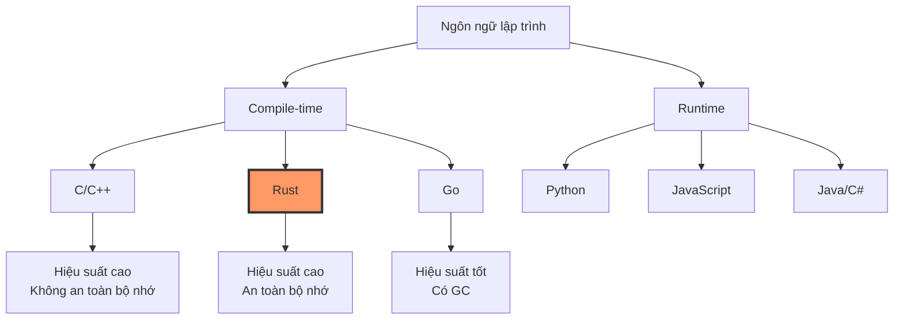
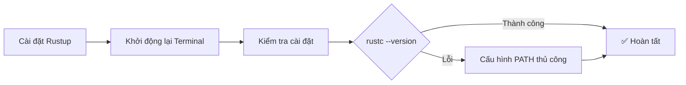
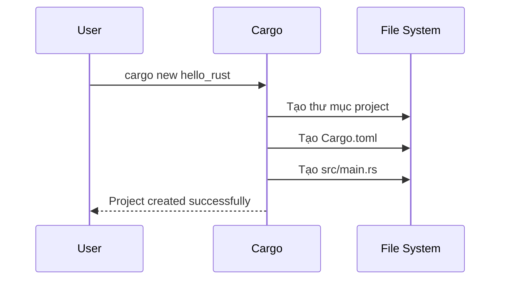
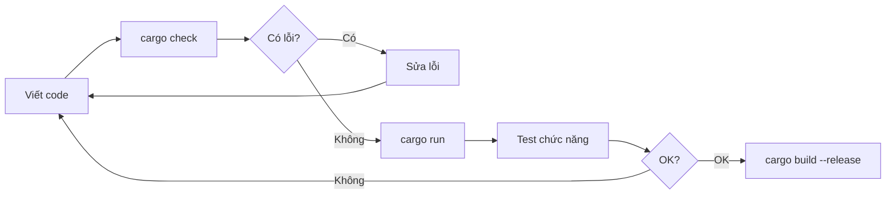

# BÀI 1: GIỚI THIỆU VỀ RUST VÀ CÀI ĐẶT MÔI TRƯỜNG

<div className="border-l-4 border-blue-500 pl-4 mb-6">
<h2 className="text-xl font-bold text-blue-600 mb-2">🎯 MỤC TIÊU BÀI HỌC</h2>
<p className="text-gray-700">Sau bài học này, bạn sẽ hiểu được Rust là gì, tại sao nên học Rust và có thể thiết lập môi trường phát triển hoàn chỉnh để bắt đầu lập trình Rust.</p>
</div>

## 1. RUST LÀ GÌ?

<div className="bg-gradient-to-r from-orange-100 to-red-100 p-4 rounded-lg mb-4">
<h3 className="font-semibold text-lg mb-2">📚 Định nghĩa</h3>
<p><strong>Rust</strong> là ngôn ngữ lập trình hệ thống hiện đại, được phát triển bởi Mozilla, tập trung vào <em>an toàn bộ nhớ</em>, <em>hiệu suất cao</em> và <em>xử lý đồng thời</em> mà không cần garbage collector.</p>
</div>

### Đặc điểm nổi bật của Rust

| Đặc điểm                   | Mô tả                                             | Lợi ích                         |
| -------------------------- | ------------------------------------------------- | ------------------------------- |
| **Memory Safety**          | Ngăn chặn lỗi segmentation fault, buffer overflow | Ứng dụng ổn định, bảo mật cao   |
| **Zero-cost Abstractions** | Tối ưu hóa compile-time, không ảnh hưởng runtime  | Hiệu suất cao như C/C++         |
| **Concurrency**            | Hỗ trợ mạnh mẽ lập trình đa luồng                 | Ứng dụng có thể mở rộng tốt     |
| **Cross-platform**         | Chạy trên nhiều nền tảng khác nhau                | Phát triển ứng dụng đa nền tảng |

## 2. TẠI SAO NÊN HỌC RUST?

<div className="grid grid-cols-1 md:grid-cols-2 gap-4 mb-6">
<div className="border border-green-300 rounded-lg p-4">
<h4 className="font-bold text-green-700 mb-2">✅ Ưu điểm</h4>
<ul className="text-sm text-gray-700 list-disc list-inside space-y-1">
<li>Hiệu suất cao, tương đương C/C++</li>
<li>An toàn bộ nhớ mà không cần GC</li>
<li>Hệ thống type mạnh mẽ</li>
<li>Cộng đồng năng động</li>
<li>Toolchain xuất sắc (Cargo)</li>
</ul>
</div>
<div className="border border-yellow-300 rounded-lg p-4">
<h4 className="font-bold text-yellow-700 mb-2">⚠️ Thử thách</h4>
<ul className="text-sm text-gray-700 list-disc list-inside space-y-1">
<li>Đường cong học tập dốc</li>
<li>Compile time có thể chậm</li>
<li>Hệ sinh thái còn non trẻ</li>
<li>Cú pháp phức tạp ban đầu</li>
</ul>
</div>
</div>

## 3. SO SÁNH RUST VỚI CÁC NGÔN NGỮ KHÁC



### Bảng so sánh chi tiết

| Tiêu chí           | C++        | Rust       | Go         | Python     |
| ------------------ | ---------- | ---------- | ---------- | ---------- |
| **Hiệu suất**      | ⭐⭐⭐⭐⭐ | ⭐⭐⭐⭐⭐ | ⭐⭐⭐⭐   | ⭐⭐       |
| **An toàn bộ nhớ** | ⭐⭐       | ⭐⭐⭐⭐⭐ | ⭐⭐⭐⭐   | ⭐⭐⭐⭐   |
| **Dễ học**         | ⭐⭐       | ⭐⭐       | ⭐⭐⭐⭐   | ⭐⭐⭐⭐⭐ |
| **Concurrency**    | ⭐⭐⭐     | ⭐⭐⭐⭐⭐ | ⭐⭐⭐⭐⭐ | ⭐⭐       |
| **Ecosystem**      | ⭐⭐⭐⭐⭐ | ⭐⭐⭐     | ⭐⭐⭐⭐   | ⭐⭐⭐⭐⭐ |

## 4. CÀI ĐẶT RUST

### Bước 1: Cài đặt Rustup

<div className="bg-blue-50 border border-blue-200 rounded-lg p-4 mb-4">
<h4 className="font-semibold text-blue-800 mb-2">🔧 Windows</h4>
<p className="text-sm text-gray-700 mb-2">Tải và chạy <code className="bg-gray-100 px-1 rounded">rustup-init.exe</code> từ <a href="https://rustup.rs/" className="text-blue-600 underline">rustup.rs</a></p>
</div>

<div className="bg-green-50 border border-green-200 rounded-lg p-4 mb-4">
<h4 className="font-semibold text-green-800 mb-2">🐧 Linux/macOS</h4>
<pre className="bg-gray-800 text-green-400 p-3 rounded text-sm">curl --proto '=https' --tlsv1.2 -sSf https://sh.rustup.rs | sh</pre>
</div>

### Bước 2: Cấu hình PATH



### Bước 3: Kiểm tra cài đặt

| Lệnh               | Mục đích                   | Kết quả mong đợi           |
| ------------------ | -------------------------- | -------------------------- |
| `rustc --version`  | Kiểm tra compiler          | `rustc 1.x.x (hash date)`  |
| `cargo --version`  | Kiểm tra build tool        | `cargo 1.x.x (hash date)`  |
| `rustup --version` | Kiểm tra toolchain manager | `rustup 1.x.x (hash date)` |

## 5. THIẾT LẬP IDE

### VS Code (Khuyên dùng)

<div className="border border-purple-300 rounded-lg p-4 mb-4">
<h4 className="font-bold text-purple-700 mb-2">🚀 Extensions cần thiết:</h4>
<div className="grid grid-cols-1 md:grid-cols-2 gap-2">
<div className="bg-purple-50 p-2 rounded">
<strong>rust-analyzer</strong><br/>
<small className="text-gray-600">IntelliSense cho Rust</small>
</div>
<div className="bg-purple-50 p-2 rounded">
<strong>CodeLLDB</strong><br/>
<small className="text-gray-600">Debugging support</small>
</div>
</div>
</div>

### Các IDE khác

| IDE               | Ưu điểm             | Nhược điểm             |
| ----------------- | ------------------- | ---------------------- |
| **IntelliJ IDEA** | Tính năng phong phú | Nặng, tốn RAM          |
| **Vim/Neovim**    | Nhanh, tùy biến cao | Đường cong học tập cao |
| **Emacs**         | Mạnh mẽ, linh hoạt  | Phức tạp cấu hình      |

## 6. TẠO PROJECT ĐẦU TIÊN

### Sử dụng Cargo



### Cấu trúc project cơ bản

```
hello_rust/
├── Cargo.toml          # Metadata và dependencies
├── src/
│   └── main.rs        # Entry point
├── target/            # Build artifacts (được tạo sau)
└── Cargo.lock         # Lock dependencies (được tạo sau)
```

### Nội dung Cargo.toml

```toml
[package]
name = "hello_rust"
version = "0.1.0"
edition = "2021"

[dependencies]
# Dependencies sẽ được thêm ở đây
```

### Chương trình Hello World

```rust copy
fn main() {
    println!("Hello, World!");
    println!("Chào mừng đến với Rust! 🦀");
}
```

## 7. BIÊN DỊCH VÀ CHẠY

<div className="bg-gray-50 border rounded-lg p-4 mb-4">
<h4 className="font-semibold mb-2">📋 Các lệnh Cargo cơ bản:</h4>

| Lệnh                    | Chức năng          | Khi nào sử dụng        |
| ----------------------- | ------------------ | ---------------------- |
| `cargo new <name>`      | Tạo project mới    | Bắt đầu project        |
| `cargo build`           | Biên dịch debug    | Kiểm tra lỗi           |
| `cargo run`             | Biên dịch + chạy   | Phát triển thường ngày |
| `cargo build --release` | Biên dịch tối ưu   | Production build       |
| `cargo check`           | Kiểm tra lỗi nhanh | Kiểm tra syntax        |

</div>

### Quy trình phát triển



## 8. RUST PLAYGROUND VÀ REPL

<div className="border-l-4 border-green-500 pl-4 mb-4">
<h4 className="font-semibold text-green-700">🌐 Rust Playground</h4>
<p className="text-sm text-gray-700">Truy cập <a href="https://play.rust-lang.org/" className="text-blue-600 underline">play.rust-lang.org</a> để thử nghiệm Rust online mà không cần cài đặt.</p>
</div>

### Tính năng của Playground

| Tính năng           | Mô tả                       |
| ------------------- | --------------------------- |
| **Chia sẻ code**    | Tạo link chia sẻ code       |
| **Multiple crates** | Thử nghiệm với dependencies |
| **Assembly output** | Xem code assembly được tạo  |
| **Formatting**      | Tự động format code         |

## 9. BÀI TẬP THỰC HÀNH

<div className="bg-yellow-50 border border-yellow-300 rounded-lg p-4">
<h4 className="font-bold text-yellow-800 mb-2">🎯 Thực hành ngay:</h4>
<ol className="list-decimal list-inside text-sm text-gray-700 space-y-1">
<li>Tạo project mới tên "my_first_rust"</li>
<li>Chỉnh sửa main.rs để in tên và tuổi của bạn</li>
<li>Chạy chương trình với cargo run</li>
<li>Thử build release version</li>
<li>Thử chạy code trên Rust Playground</li>
</ol>
</div>

### Code mẫu cho bài tập

```rust copy
fn main() {
    let name = "Bạn tên gì?";
    let age = 25;

    println!("Xin chào, tôi là {}!", name);
    println!("Tôi {} tuổi.", age);
    println!("Đây là chương trình Rust đầu tiên của tôi! 🎉");
}
```

## 10. TÓM TẮT BÀI HỌC

<div className="bg-blue-50 border border-blue-200 rounded-lg p-4">
<h4 className="font-semibold text-blue-800 mb-2">📝 Những điều đã học:</h4>
<ul className="text-sm text-gray-700 list-disc list-inside space-y-1">
<li>Rust là ngôn ngữ hệ thống an toàn và hiệu suất cao</li>
<li>Cài đặt Rust thông qua Rustup</li>
<li>Thiết lập môi trường phát triển với VS Code</li>
<li>Tạo và chạy project đầu tiên với Cargo</li>
<li>Hiểu cấu trúc project Rust cơ bản</li>
</ul>
</div>

## 11. CHUẨN BỊ CHO BÀI TIẾP THEO

<div className="border-l-4 border-orange-500 pl-4">
<h4 className="font-semibold text-orange-700 mb-2">🔜 Bài 2: Cú pháp cơ bản và Biến</h4>
<p className="text-sm text-gray-700">Chúng ta sẽ tìm hiểu về cú pháp Rust, cách khai báo biến, và khái niệm immutability - một đặc trưng quan trọng của Rust.</p>
</div>

---

<div className="text-center text-gray-500 text-sm mt-8">
<p>🦀 <em>Happy Coding with Rust!</em> 🦀</p>
</div>
