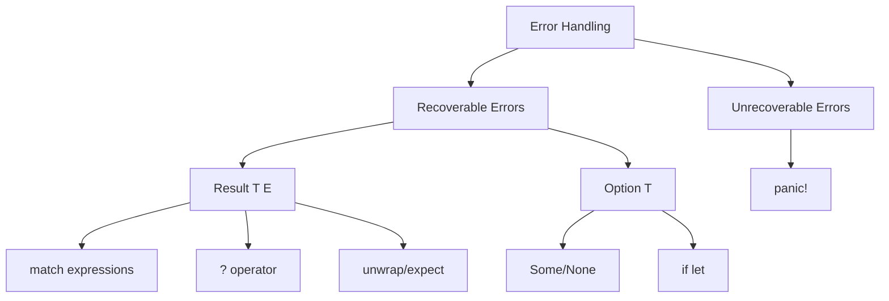
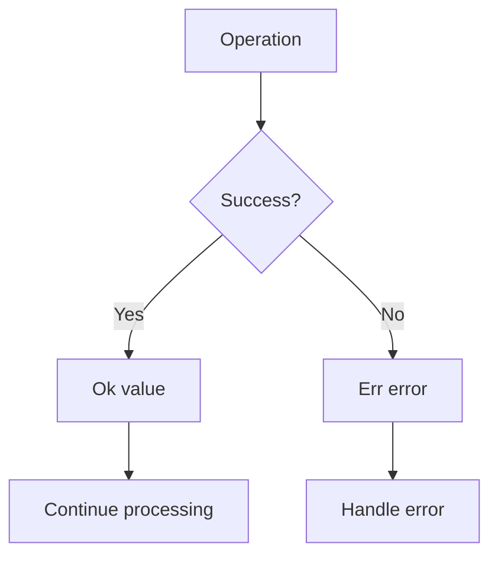
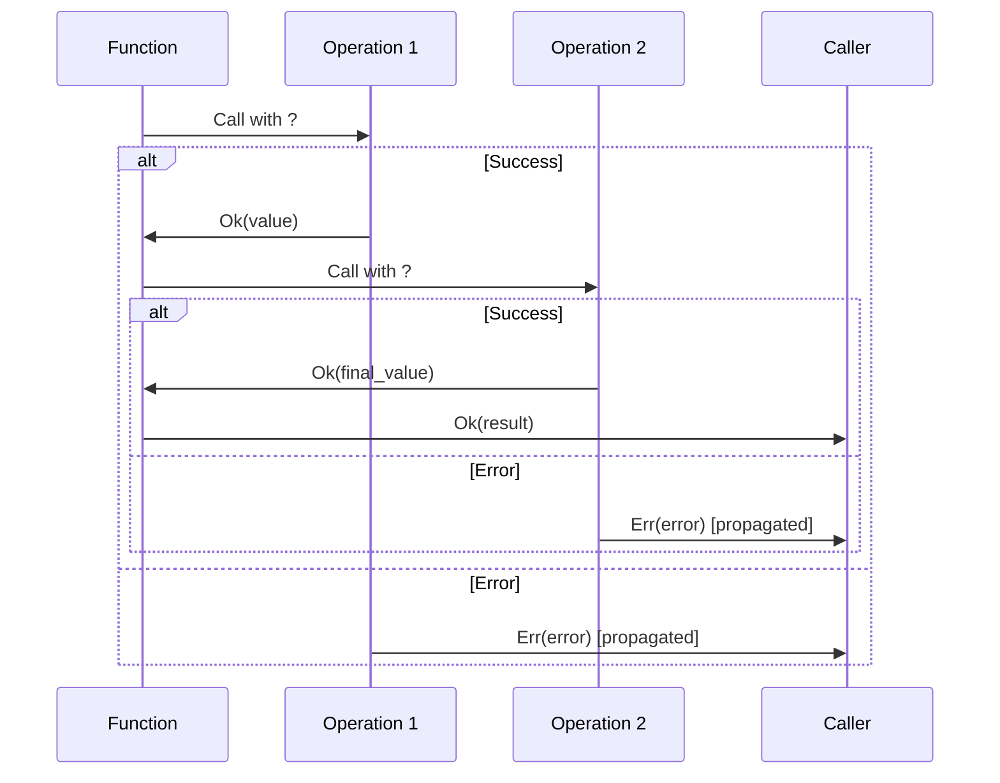
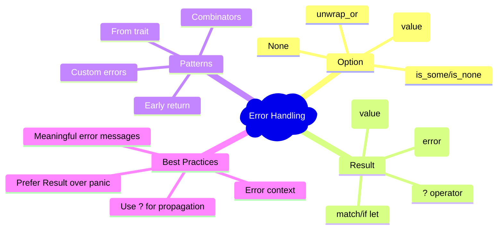

# BÀI 10: ERROR HANDLING TRONG RUST

<div className="bg-gradient-to-r from-blue-50 to-indigo-50 p-6 rounded-lg border-l-4 border-blue-500 mb-6">
  <h2 className="text-2xl font-bold text-blue-800 mb-2">🎯 MỤC TIÊU BÀI HỌC</h2>
  <div className="text-gray-700">Xử lý errors một cách an toàn và hiệu quả trong Rust thông qua hệ thống type-safe error handling</div>
</div>

## 📋 NỘI DUNG CHÍNH



---

## 1. TỔNG QUAN VỀ ERROR HANDLING

<div className="bg-yellow-50 border border-yellow-200 rounded-lg p-4 mb-4">
  <h3 className="text-lg font-semibold text-yellow-800">⚡ Đặc điểm của Rust Error Handling</h3>
  <div className="mt-2 text-gray-700">
    <div>• No null pointers - sử dụng <code>Option&lt;T&gt;</code></div>
    <div>• No exceptions - sử dụng <code>Result&lt;T, E&gt;</code></div>
    <div>• Compile-time guarantee về error handling</div>
    <div>• Explicit error propagation</div>
  </div>
</div>

### So sánh với các ngôn ngữ khác

| Ngôn ngữ | Error Handling | Nhược điểm |
|----------|----------------|------------|
| Java/C# | Exceptions | Runtime overhead, có thể bị bỏ qua |
| C | Return codes | Dễ bị ignore, không type-safe |
| Go | Multiple return values | Verbose, có thể bỏ qua |
| **Rust** | **Result/Option** | **Compile-time safe, explicit** |

---

## 2. OPTION&lt;T&gt; ENUM

### Định nghĩa và cách sử dụng

```rust
enum Option<T> {
    Some(T),
    None,
}
```

<div className="bg-green-50 border border-green-200 rounded-lg p-4">
  <h4 className="font-semibold text-green-800">✅ Khi nào sử dụng Option&lt;T&gt;?</h4>
  <div className="text-gray-700 mt-2">Khi một giá trị có thể tồn tại hoặc không (thay thế cho null/nil)</div>
</div>

```rust
fn find_user(id: u32) -> Option<String> {
    if id == 1 {
        Some("Alice".to_string())
    } else {
        None
    }
}

fn main() {
    // Cách 1: Sử dụng match
    match find_user(1) {
        Some(name) => println!("Found user: {}", name),
        None => println!("User not found"),
    }
    
    // Cách 2: Sử dụng if let
    if let Some(name) = find_user(1) {
        println!("User found: {}", name);
    }
    
    // Cách 3: Sử dụng unwrap_or
    let name = find_user(2).unwrap_or("Unknown".to_string());
    println!("Name: {}", name);
}
```

### Các phương thức hữu ích của Option

| Method | Mô tả | Ví dụ |
|--------|-------|-------|
| `is_some()` | Kiểm tra có giá trị | `opt.is_some()` |
| `is_none()` | Kiểm tra không có giá trị | `opt.is_none()` |
| `unwrap()` | Lấy giá trị (panic nếu None) | `opt.unwrap()` |
| `unwrap_or(default)` | Lấy giá trị hoặc default | `opt.unwrap_or(0)` |
| `map(f)` | Transform giá trị nếu Some | `opt.map(|x| x * 2)` |

---

## 3. RESULT&lt;T, E&gt; ENUM

### Định nghĩa và ứng dụng

```rust
enum Result<T, E> {
    Ok(T),
    Err(E),
}
```



### Ví dụ thực tế với file I/O

```rust
use std::fs::File;
use std::io::{self, Read};

fn read_file_content(filename: &str) -> Result<String, io::Error> {
    let mut file = File::open(filename)?;
    let mut contents = String::new();
    file.read_to_string(&mut contents)?;
    Ok(contents)
}

fn main() {
    match read_file_content("example.txt") {
        Ok(content) => println!("File content: {}", content),
        Err(error) => println!("Error reading file: {}", error),
    }
}
```

### Bảng so sánh các cách xử lý Result

| Phương pháp | Cú pháp | Khi nào sử dụng | An toàn |
|-------------|---------|-----------------|---------|
| `match` | `match result { Ok(v) => ..., Err(e) => ... }` | Cần xử lý cả 2 trường hợp | ✅ |
| `unwrap()` | `result.unwrap()` | Chắc chắn không có lỗi | ❌ (panic) |
| `expect()` | `result.expect("message")` | Debug, với thông báo rõ ràng | ❌ (panic) |
| `?` operator | `let value = operation()?;` | Propagate lỗi lên caller | ✅ |

---

## 4. TOÁN TỬ ? (QUESTION MARK OPERATOR)

<div className="bg-blue-50 border border-blue-200 rounded-lg p-4 mb-4">
  <h3 className="text-lg font-semibold text-blue-800">🚀 Tính năng nổi bật</h3>
  <div className="text-gray-700">Toán tử <code>?</code> giúp code ngắn gọn và dễ đọc hơn khi xử lý chuỗi operations có thể fail</div>
</div>

### Trước và sau khi sử dụng ?

```rust
// Cách cũ - verbose
fn read_username_from_file() -> Result<String, io::Error> {
    let mut file = match File::open("username.txt") {
        Ok(file) => file,
        Err(e) => return Err(e),
    };
    
    let mut username = String::new();
    match file.read_to_string(&mut username) {
        Ok(_) => Ok(username),
        Err(e) => Err(e),
    }
}

// Cách mới - với ? operator
fn read_username_from_file_v2() -> Result<String, io::Error> {
    let mut file = File::open("username.txt")?;
    let mut username = String::new();
    file.read_to_string(&mut username)?;
    Ok(username)
}

// Ngắn gọn nhất
fn read_username_from_file_v3() -> Result<String, io::Error> {
    std::fs::read_to_string("username.txt")
}
```



---

## 5. CUSTOM ERROR TYPES

### Tạo Error Type đơn giản

```rust
#[derive(Debug)]
enum MathError {
    DivisionByZero,
    NegativeSquareRoot,
}

impl std::fmt::Display for MathError {
    fn fmt(&self, f: &mut std::fmt::Formatter) -> std::fmt::Result {
        match self {
            MathError::DivisionByZero => write!(f, "Cannot divide by zero"),
            MathError::NegativeSquareRoot => write!(f, "Cannot calculate square root of negative number"),
        }
    }
}

impl std::error::Error for MathError {}

fn divide(a: f64, b: f64) -> Result<f64, MathError> {
    if b == 0.0 {
        Err(MathError::DivisionByZero)
    } else {
        Ok(a / b)
    }
}

fn sqrt(x: f64) -> Result<f64, MathError> {
    if x < 0.0 {
        Err(MathError::NegativeSquareRoot)
    } else {
        Ok(x.sqrt())
    }
}
```

### Error conversion và From trait

```rust
use std::fs::File;
use std::io;

#[derive(Debug)]
enum AppError {
    Io(io::Error),
    Math(MathError),
}

impl From<io::Error> for AppError {
    fn from(error: io::Error) -> Self {
        AppError::Io(error)
    }
}

impl From<MathError> for AppError {
    fn from(error: MathError) -> Self {
        AppError::Math(error)
    }
}

fn complex_operation() -> Result<String, AppError> {
    let file = File::open("data.txt")?; // io::Error -> AppError
    let result = divide(10.0, 0.0)?;    // MathError -> AppError
    Ok(format!("Result: {}", result))
}
```

---

## 6. PANIC! VÀ UNRECOVERABLE ERRORS

<div className="bg-red-50 border border-red-200 rounded-lg p-4 mb-4">
  <h3 className="text-lg font-semibold text-red-800">⚠️ Khi nào sử dụng panic!</h3>
  <div className="mt-2 text-gray-700">
    <div>• Bugs trong code (array out of bounds)</div>
    <div>• Invariants bị vi phạm</div>
    <div>• Prototype/testing</div>
    <div>• Không thể recover được</div>
  </div>
</div>

```rust
fn main() {
    // Panic với message
    panic!("Something went terribly wrong!");
    
    // Panic từ unwrap
    let result: Result<i32, &str> = Err("error");
    let value = result.unwrap(); // Panic!
    
    // Panic với expect (better message)
    let value = result.expect("Failed to get value"); // Panic with custom message
}
```

### Panic vs Result - Khi nào dùng gì?

| Tình huống | Sử dụng | Lý do |
|------------|---------|--------|
| File không tồn tại | `Result` | Có thể recover (tạo file mới, dùng default) |
| Array index out of bounds | `panic!` | Bug trong code |
| Network timeout | `Result` | Có thể retry |
| Out of memory | `panic!` | Không thể continue |
| Invalid config | `Result` | Có thể dùng default config |

---

## 7. BEST PRACTICES VÀ PATTERNS

### Pattern 1: Early Return với ?

```rust
fn process_data() -> Result<String, Box<dyn std::error::Error>> {
    let data = read_file("input.txt")?;
    let parsed = parse_data(&data)?;
    let processed = transform_data(parsed)?;
    let result = format_output(processed)?;
    Ok(result)
}
```

### Pattern 2: Combinator Methods

```rust
fn main() {
    let result = read_file("config.json")
        .and_then(|content| parse_json(&content))
        .and_then(|config| validate_config(config))
        .map(|config| format!("Config loaded: {:?}", config))
        .unwrap_or_else(|e| format!("Error: {}", e));
    
    println!("{}", result);
}
```

### Pattern 3: Error Context với thư viện anyhow

```rust
// Cargo.toml
// [dependencies]
// anyhow = "1.0"

use anyhow::{Context, Result};

fn read_config() -> Result<Config> {
    let content = std::fs::read_to_string("config.toml")
        .context("Failed to read config file")?;
    
    let config: Config = toml::from_str(&content)
        .context("Failed to parse config file")?;
    
    Ok(config)
}
```

---

## 8. THỰC HÀNH: FILE PROCESSING SYSTEM

<div className="bg-purple-50 border border-purple-200 rounded-lg p-4 mb-4">
  <h3 className="text-lg font-semibold text-purple-800">🛠️ BÀI TẬP THỰC HÀNH</h3>
  <div className="text-gray-700">Xây dựng hệ thống xử lý file với error handling hoàn chỉnh</div>
</div>

```rust
use std::fs::File;
use std::io::{self, BufRead, BufReader, Write};
use std::path::Path;

#[derive(Debug)]
enum ProcessError {
    Io(io::Error),
    Parse(std::num::ParseIntError),
    Validation(String),
}

impl From<io::Error> for ProcessError {
    fn from(error: io::Error) -> Self {
        ProcessError::Io(error)
    }
}

impl From<std::num::ParseIntError> for ProcessError {
    fn from(error: std::num::ParseIntError) -> Self {
        ProcessError::Parse(error)
    }
}

struct FileProcessor;

impl FileProcessor {
    fn process_numbers_file(input_path: &Path, output_path: &Path) -> Result<usize, ProcessError> {
        let input_file = File::open(input_path)?;
        let reader = BufReader::new(input_file);
        
        let mut output_file = File::create(output_path)?;
        let mut processed_count = 0;
        
        for (line_num, line) in reader.lines().enumerate() {
            let line = line?;
            
            // Skip empty lines
            if line.trim().is_empty() {
                continue;
            }
            
            // Parse number
            let number: i32 = line.trim().parse()
                .map_err(|e| ProcessError::Validation(
                    format!("Invalid number at line {}: {}", line_num + 1, e)
                ))?;
            
            // Validate positive numbers only
            if number <= 0 {
                return Err(ProcessError::Validation(
                    format!("Negative number at line {}: {}", line_num + 1, number)
                ));
            }
            
            // Process (square the number)
            let result = number * number;
            writeln!(output_file, "{}", result)?;
            processed_count += 1;
        }
        
        Ok(processed_count)
    }
    
    fn create_sample_file(path: &Path) -> Result<(), ProcessError> {
        let mut file = File::create(path)?;
        writeln!(file, "1")?;
        writeln!(file, "2")?;
        writeln!(file, "3")?;
        writeln!(file, "4")?;
        writeln!(file, "5")?;
        Ok(())
    }
}

fn main() -> Result<(), Box<dyn std::error::Error>> {
    let input_path = Path::new("input.txt");
    let output_path = Path::new("output.txt");
    
    // Create sample input file
    FileProcessor::create_sample_file(input_path)?;
    println!("✅ Created sample input file");
    
    // Process file
    match FileProcessor::process_numbers_file(input_path, output_path) {
        Ok(count) => {
            println!("✅ Successfully processed {} numbers", count);
            
            // Read and display results
            let results = std::fs::read_to_string(output_path)?;
            println!("Results:\n{}", results);
        }
        Err(ProcessError::Io(e)) => {
            eprintln!("❌ IO Error: {}", e);
        }
        Err(ProcessError::Parse(e)) => {
            eprintln!("❌ Parse Error: {}", e);
        }
        Err(ProcessError::Validation(e)) => {
            eprintln!("❌ Validation Error: {}", e);
        }
    }
    
    Ok(())
}
```

---

## 9. TÓM TẮT VÀ KIỂM TRA

### Checklist kiến thức

<div className="grid grid-cols-1 md:grid-cols-2 gap-4 mt-4">
  <div className="bg-gray-50 p-4 rounded-lg">
    <h4 className="font-semibold text-gray-800">✅ Cần nắm vững:</h4>
    <ul className="mt-2 space-y-1 text-sm text-gray-700">
      <li>□ Option&lt;T&gt; cho nullable values</li>
      <li>□ Result&lt;T, E&gt; cho recoverable errors</li>
      <li>□ ? operator cho error propagation</li>
      <li>□ match vs if let vs unwrap</li>
      <li>□ Custom error types</li>
      <li>□ panic! cho unrecoverable errors</li>
    </ul>
  </div>
  
  <div className="bg-gray-50 p-4 rounded-lg">
    <h4 className="font-semibold text-gray-800">🎯 Mục tiêu tiếp theo:</h4>
    <ul className="mt-2 space-y-1 text-sm text-gray-700">
      <li>• Modules và crate organization</li>
      <li>• Advanced error handling patterns</li>
      <li>• Testing error conditions</li>
      <li>• Async error handling</li>
    </ul>
  </div>
</div>

### Key Takeaways



---

<div className="bg-green-100 border border-green-300 rounded-lg p-4 mt-6">
  <h3 className="text-lg font-semibold text-green-800">🎉 HOÀN THÀNH BÀI 10</h3>
  <div className="text-gray-700 mt-2">
    Bạn đã học xong error handling trong Rust! Đây là một trong những tính năng quan trọng nhất giúp Rust trở thành ngôn ngữ an toàn và đáng tin cậy. 
    <br /><br />
    <strong>Bài tiếp theo:</strong> Modules và Crates - Tổ chức code hiệu quả
  </div>
</div>