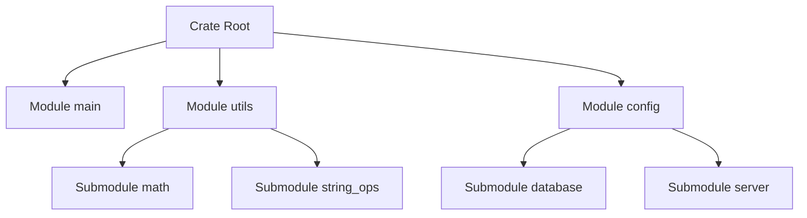
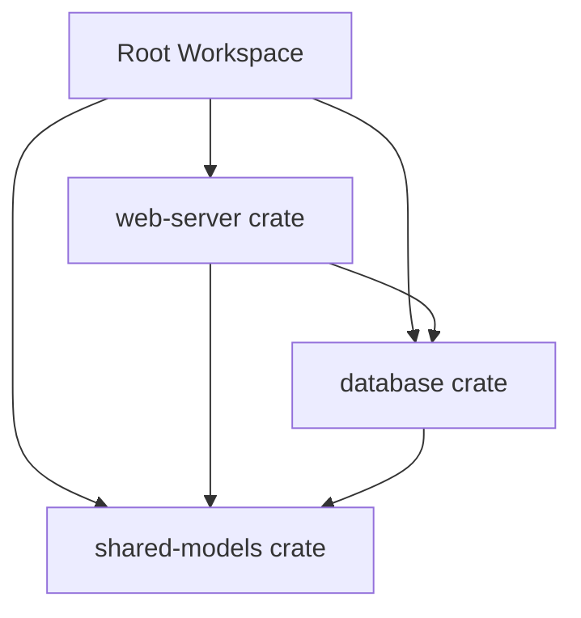

# Bài 11: MODULES VÀ CRATES

<div className="bg-gradient-to-r from-orange-400 to-red-500 text-white p-6 rounded-lg mb-6">
  <h2 className="text-2xl font-bold mb-2">🎯 MỤC TIÊU BÀI HỌC</h2>
  <p className="text-lg">Tổ chức code hiệu quả với modules và quản lý dependencies thông qua crate system</p>
</div>

---

## 📚 NỘI DUNG CHÍNH

### 1. Module System Overview

<div className="bg-blue-50 border-l-4 border-blue-400 p-4 mb-4">
  <h4 className="font-bold text-blue-800">Khái niệm Module</h4>
  <p>Module trong Rust giúp tổ chức code thành các namespace logic, kiểm soát visibility và tạo ra cấu trúc dự án rõ ràng.</p>
</div>



### 2. Cú pháp Module cơ bản

| Từ khóa | Chức năng | Ví dụ |
|---------|-----------|-------|
| `mod` | Định nghĩa module | `mod utils;` |
| `pub` | Công khai visibility | `pub fn hello() {}` |
| `use` | Import items | `use std::collections::HashMap;` |
| `super` | Tham chiếu module cha | `super::function()` |
| `self` | Tham chiếu module hiện tại | `self::function()` |

#### Ví dụ Module cơ bản:

```rust
// src/lib.rs hoặc src/main.rs
mod math_operations {
    pub fn add(a: i32, b: i32) -> i32 {
        a + b
    }
    
    fn multiply(a: i32, b: i32) -> i32 { // private function
        a * b
    }
    
    pub fn square(x: i32) -> i32 {
        multiply(x, x) // có thể gọi private function trong cùng module
    }
}

fn main() {
    let result = math_operations::add(5, 3);
    println!("5 + 3 = {}", result);
    
    let squared = math_operations::square(4);
    println!("4² = {}", squared);
}
```

### 3. File-based Modules

<div className="bg-yellow-50 border-l-4 border-yellow-400 p-4 mb-4">
  <h4 className="font-bold text-yellow-800">Cấu trúc Project với nhiều file</h4>
</div>

| Cấu trúc thư mục | Module path | Cách import |
|------------------|-------------|-------------|
| `src/lib.rs` | crate root | - |
| `src/utils.rs` | `crate::utils` | `mod utils;` |
| `src/utils/mod.rs` | `crate::utils` | `mod utils;` |
| `src/utils/math.rs` | `crate::utils::math` | `pub mod math;` in utils/mod.rs |

#### Ví dụ cấu trúc project:

```
my_project/
├── Cargo.toml
└── src/
    ├── main.rs
    ├── utils.rs
    └── config/
        ├── mod.rs
        ├── database.rs
        └── server.rs
```

**src/utils.rs:**
```rust
pub fn format_output(value: i32) -> String {
    format!("Result: {}", value)
}

pub fn validate_input(input: &str) -> bool {
    !input.is_empty() && input.len() <= 100
}
```

**src/config/mod.rs:**
```rust
pub mod database;
pub mod server;

pub use database::DatabaseConfig;
pub use server::ServerConfig;
```

### 4. Visibility Rules


| Visibility | Phạm vi truy cập | Ví dụ |
|------------|------------------|-------|
| (không có) | Private trong module | `fn private_func()` |
| `pub` | Public cho tất cả | `pub fn public_func()` |
| `pub(crate)` | Public trong crate | `pub(crate) fn crate_func()` |
| `pub(super)` | Public cho module cha | `pub(super) fn parent_func()` |
| `pub(self)` | Public trong module hiện tại | `pub(self) fn self_func()` |

```rust
mod outer {
    pub mod inner {
        pub fn public_function() {}
        pub(crate) fn crate_function() {}
        pub(super) fn parent_function() {}
        fn private_function() {}
    }
    
    pub fn call_functions() {
        inner::public_function();    // ✅ OK
        inner::crate_function();     // ✅ OK  
        inner::parent_function();    // ✅ OK (outer là parent của inner)
        // inner::private_function(); // ❌ Error - private
    }
}
```

### 5. Use Statements và Paths

<div className="bg-green-50 border-l-4 border-green-400 p-4 mb-4">
  <h4 className="font-bold text-green-800">Các cách import</h4>
</div>

| Loại import | Cú pháp | Mô tả |
|-------------|---------|-------|
| Absolute path | `use crate::utils::math;` | Từ crate root |
| Relative path | `use super::utils;` | Từ module cha |
| Multiple imports | `use std::collections::{HashMap, HashSet};` | Import nhiều items |
| Rename | `use std::io::Result as IoResult;` | Đổi tên khi import |
| Re-export | `pub use utils::math;` | Export lại từ module khác |

```rust
// Ví dụ sử dụng use statements
use std::collections::HashMap;
use std::fs::{File, OpenOptions};
use std::io::Result as IoResult;

// Re-export để tạo API đơn giản hơn
pub use crate::utils::math::Calculator;
pub use crate::config::{DatabaseConfig, ServerConfig};

// Import với nested path
use crate::{
    utils::{format_output, validate_input},
    config::database::connect
};
```

### 6. Crates và Dependencies

#### Cấu trúc Cargo.toml:

```toml
[package]
name = "my_awesome_project"
version = "0.1.0"
edition = "2021"
authors = ["Your Name <email@example.com>"]
description = "A sample Rust project demonstrating modules and crates"

[dependencies]
serde = { version = "1.0", features = ["derive"] }
tokio = { version = "1.0", features = ["full"] }
clap = "4.0"

[dev-dependencies]
criterion = "0.4"

[lib]
name = "my_awesome_lib"
crate-type = ["lib"]
```

#### Phân loại Crates:

| Loại Crate | Mô tả | File entry point | Mục đích |
|------------|-------|------------------|----------|
| Binary crate | Executable program | `src/main.rs` | Chương trình chính |
| Library crate | Reusable code | `src/lib.rs` | Thư viện chia sẻ |
| Workspace | Multiple crates | `Cargo.toml` với `[workspace]` | Quản lý multi-project |

### 7. Workspace Management



**Cấu trúc Workspace:**

```
my_workspace/
├── Cargo.toml          # Root workspace config
├── web-server/
│   ├── Cargo.toml
│   └── src/
│       └── main.rs
├── shared-models/
│   ├── Cargo.toml
│   └── src/
│       └── lib.rs
└── database/
    ├── Cargo.toml
    └── src/
        └── lib.rs
```

**Root Cargo.toml:**
```toml
[workspace]
members = ["web-server", "shared-models", "database"]
resolver = "2"

[workspace.dependencies]
serde = { version = "1.0", features = ["derive"] }
tokio = { version = "1.0", features = ["full"] }
```

### 8. Publishing Crates

| Bước | Lệnh | Mô tả |
|------|------|-------|
| 1 | `cargo login` | Đăng nhập crates.io |
| 2 | `cargo package` | Tạo package để kiểm tra |
| 3 | `cargo publish --dry-run` | Thử publish (không thực sự) |
| 4 | `cargo publish` | Publish lên crates.io |

<div className="bg-red-50 border-l-4 border-red-400 p-4 mb-4">
  <h4 className="font-bold text-red-800">⚠️ Lưu ý khi publish</h4>
  <ul className="mt-2 list-disc list-inside">
    <li>Tên crate phải unique trên crates.io</li>
    <li>Version theo semantic versioning (MAJOR.MINOR.PATCH)</li>
    <li>Không thể unpublish version đã publish</li>
    <li>Cần license và documentation tốt</li>
  </ul>
</div>

## 🛠️ THỰC HÀNH

### Bài tập 1: Tạo Library Crate

Tạo một thư viện tính toán với cấu trúc sau:

```rust
// src/lib.rs
pub mod basic_math {
    pub fn add(a: f64, b: f64) -> f64 {
        a + b
    }
    
    pub fn subtract(a: f64, b: f64) -> f64 {
        a - b
    }
}

pub mod advanced_math {
    pub fn power(base: f64, exp: f64) -> f64 {
        base.powf(exp)
    }
    
    pub fn factorial(n: u64) -> u64 {
        match n {
            0 | 1 => 1,
            _ => n * factorial(n - 1)
        }
    }
}

// Re-export để API đơn giản hơn
pub use basic_math::*;
pub use advanced_math::{power, factorial};
```

### Bài tập 2: Multi-module Project

<div className="bg-indigo-100 p-4 rounded-lg">
  <h4 className="font-bold text-indigo-800 mb-2">🎯 Tạo một hệ thống quản lý sinh viên</h4>
  <p>Chia thành các module: student, course, grade, utils</p>
</div>

**Cấu trúc dự án:**
```
student_management/
├── Cargo.toml
└── src/
    ├── main.rs
    ├── lib.rs
    ├── student/
    │   ├── mod.rs
    │   └── model.rs
    ├── course/
    │   ├── mod.rs
    │   └── model.rs
    ├── grade/
    │   ├── mod.rs
    │   └── calculator.rs
    └── utils/
        ├── mod.rs
        └── validators.rs
```

## 📊 BẢNG TỔNG KẾT

### So sánh Module vs Crate

| Khía cạnh | Module | Crate |
|-----------|--------|-------|
| **Scope** | Namespace trong crate | Unit compilation độc lập |
| **File** | Có thể nhiều modules/file | Một crate root |
| **Visibility** | pub/private trong crate | pub cho external crates |
| **Dependencies** | Không có | Quản lý qua Cargo.toml |
| **Distribution** | Không thể | Có thể publish lên crates.io |

### Best Practices

<div className="bg-green-100 p-4 rounded-lg mb-4">
  <h4 className="font-bold text-green-800 mb-2">✅ Nên làm</h4>
  <ul className="list-disc list-inside space-y-1">
    <li>Tổ chức modules theo chức năng logic</li>
    <li>Sử dụng <code>pub use</code> để tạo API sạch</li>
    <li>Giữ modules nhỏ và tập trung</li>
    <li>Đặt tên modules rõ ràng, mô tả chức năng</li>
  </ul>
</div>

<div className="bg-red-100 p-4 rounded-lg">
  <h4 className="font-bold text-red-800 mb-2">❌ Tránh</h4>
  <ul className="list-disc list-inside space-y-1">
    <li>Tạo modules quá sâu (deep nesting)</li>
    <li>Làm public mọi thứ không cần thiết</li>
    <li>Đặt tất cả code trong một file lớn</li>
    <li>Ignore compiler warnings về unused imports</li>
  </ul>
</div>

---

<div className="bg-gradient-to-r from-purple-400 to-pink-500 text-white p-6 rounded-lg mt-6">
  <h3 className="text-xl font-bold mb-2">🎉 KẾT LUẬN</h3>
  <p>Module system là một trong những tính năng mạnh mẽ nhất của Rust, giúp tổ chức code hiệu quả và tạo ra các thư viện có thể tái sử dụng. Việc thành thạo modules và crates sẽ giúp bạn xây dựng các dự án Rust lớn một cách chuyên nghiệp.</p>
</div>

**Bài tiếp theo:** Traits - Shared Behavior 🚀