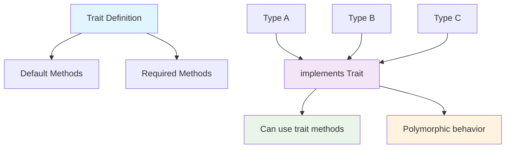
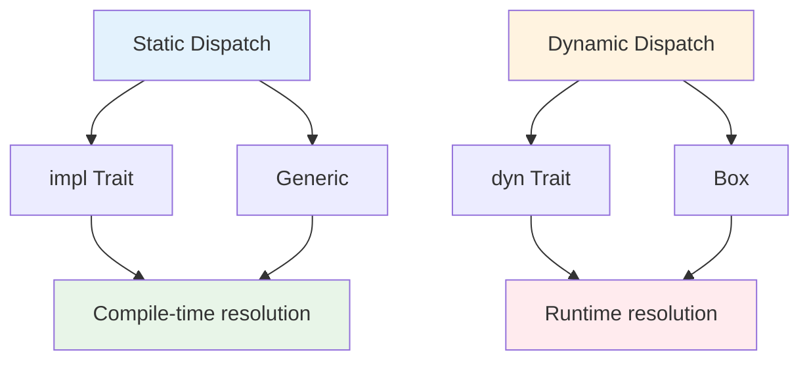

# Bài 12: Traits - Shared Behavior

<div className="bg-gradient-to-r from-blue-500 to-purple-600 text-white p-6 rounded-lg mb-8">
  <h2 className="text-2xl font-bold mb-2">🎯 Mục tiêu học tập</h2>
  <p className="text-lg">Định nghĩa shared behavior với traits và sử dụng chúng để tạo code linh hoạt, có thể tái sử dụng</p>
</div>

## 📚 Giới thiệu về Traits

**Traits** trong Rust là cách để định nghĩa shared behavior (hành vi chung) giữa các types khác nhau. Traits tương tự như interfaces trong các ngôn ngữ khác nhưng mạnh mẽ hơn.

<div className="bg-yellow-100 border-l-4 border-yellow-500 p-4 mb-6">
  <p className="font-semibold text-yellow-800">💡 Khái niệm quan trọng:</p>
  <p className="text-yellow-700">Trait định nghĩa một tập hợp các method signatures mà các type có thể implement để chia sẻ behavior chung.</p>
</div>

## 🔍 Cú pháp cơ bản của Traits

### Định nghĩa Trait

```rust
trait Summary {
    fn summarize(&self) -> String;
}
```

### Implementing Trait cho Struct

```rust
struct NewsArticle {
    pub headline: String,
    pub location: String,
    pub author: String,
    pub content: String,
}

impl Summary for NewsArticle {
    fn summarize(&self) -> String {
        format!("{}, by {} ({})", self.headline, self.author, self.location)
    }
}
```

## 📊 So sánh Traits với các khái niệm khác

| Khái niệm | Rust Traits | Java Interfaces | C++ Abstract Classes |
|-----------|-------------|-----------------|---------------------|
| **Multiple Implementation** | ✅ Có | ✅ Có | ❌ Không |
| **Default Methods** | ✅ Có | ✅ Có (Java 8+) | ✅ Có |
| **Associated Types** | ✅ Có | ❌ Không | ❌ Không |
| **Static Dispatch** | ✅ Có | ❌ Không | ✅ Có |
| **Dynamic Dispatch** | ✅ Có (trait objects) | ✅ Có | ✅ Có |

## 🎨 Default Trait Implementations

Traits có thể cung cấp default implementations cho methods:

```rust
trait Summary {
    fn summarize_author(&self) -> String;

    fn summarize(&self) -> String {
        format!("(Read more from {}...)", self.summarize_author())
    }
}

struct Tweet {
    pub username: String,
    pub content: String,
    pub reply: bool,
    pub retweet: bool,
}

impl Summary for Tweet {
    fn summarize_author(&self) -> String {
        format!("@{}", self.username)
    }
    // summarize() method sử dụng default implementation
}
```

## 📈 Sơ đồ quan hệ Traits



## 🔧 Trait Bounds trong Functions

### Function Parameters với Traits

```rust
pub fn notify(item: &impl Summary) {
    println!("Breaking news! {}", item.summarize());
}

// Tương đương với:
pub fn notify<T: Summary>(item: &T) {
    println!("Breaking news! {}", item.summarize());
}
```

### Multiple Trait Bounds

| Cú pháp | Mô tả | Ví dụ |
|---------|-------|--------|
| `T: Trait1 + Trait2` | Type T phải implement cả Trait1 và Trait2 | `fn func<T: Display + Clone>(t: T)` |
| `where` clause | Syntax rõ ràng hơn cho complex bounds | `fn func<T>(t: T) where T: Display + Clone` |

```rust
use std::fmt::Display;

pub fn notify_and_return<T>(item: &T) -> String 
where 
    T: Summary + Display,
{
    format!("Item: {}, Summary: {}", item, item.summarize())
}
```

## 🏗️ Associated Types trong Traits

Associated types làm cho trait definitions linh hoạt hơn:

```rust
pub trait Iterator {
    type Item;

    fn next(&mut self) -> Option<Self::Item>;
}

struct Counter {
    current: usize,
    max: usize,
}

impl Iterator for Counter {
    type Item = usize;

    fn next(&mut self) -> Option<Self::Item> {
        if self.current < self.max {
            let current = self.current;
            self.current += 1;
            Some(current)
        } else {
            None
        }
    }
}
```

## 📋 Common Standard Library Traits

<div className="bg-gray-50 p-4 rounded-lg mb-6">

### Danh sách Traits quan trọng

| Trait | Mục đích | Method chính | Auto-derive |
|-------|----------|---------------|-------------|
| `Debug` | Format debugging | `fmt(&self, f: &mut Formatter)` | ✅ |
| `Clone` | Deep copying | `clone(&self) -> Self` | ✅ |
| `Copy` | Bit-wise copying | (marker trait) | ✅ |
| `PartialEq` | Equality comparison | `eq(&self, other: &Self) -> bool` | ✅ |
| `Ord` | Total ordering | `cmp(&self, other: &Self) -> Ordering` | ✅ |
| `Display` | User-facing format | `fmt(&self, f: &mut Formatter)` | ❌ |

</div>

### Ví dụ sử dụng Derive Macros

```rust
#[derive(Debug, Clone, PartialEq)]
struct Point {
    x: i32,
    y: i32,
}

fn main() {
    let p1 = Point { x: 1, y: 2 };
    let p2 = p1.clone();
    
    println!("p1: {:?}", p1);  // Debug trait
    println!("p1 == p2: {}", p1 == p2);  // PartialEq trait
}
```

## 🎵 Thực hành: Media Player System

Xây dựng hệ thống media player với traits:

```rust
// Định nghĩa trait chung cho media
trait Playable {
    fn play(&self);
    fn pause(&self);
    fn stop(&self);
    
    // Default implementation
    fn get_info(&self) -> String {
        String::from("Media file")
    }
}

trait Metadata {
    fn duration(&self) -> u32;
    fn title(&self) -> &str;
    fn artist(&self) -> &str;
}

// Audio file implementation
struct AudioFile {
    title: String,
    artist: String,
    duration: u32,
    file_path: String,
}

impl Playable for AudioFile {
    fn play(&self) {
        println!("🎵 Playing audio: {}", self.title);
    }
    
    fn pause(&self) {
        println!("⏸️ Pausing audio: {}", self.title);
    }
    
    fn stop(&self) {
        println!("⏹️ Stopping audio: {}", self.title);
    }
    
    fn get_info(&self) -> String {
        format!("Audio: {} by {}", self.title, self.artist)
    }
}

impl Metadata for AudioFile {
    fn duration(&self) -> u32 { self.duration }
    fn title(&self) -> &str { &self.title }
    fn artist(&self) -> &str { &self.artist }
}

// Video file implementation
struct VideoFile {
    title: String,
    duration: u32,
    resolution: String,
    file_path: String,
}

impl Playable for VideoFile {
    fn play(&self) {
        println!("🎬 Playing video: {} ({})", self.title, self.resolution);
    }
    
    fn pause(&self) {
        println!("⏸️ Pausing video: {}", self.title);
    }
    
    fn stop(&self) {
        println!("⏹️ Stopping video: {}", self.title);
    }
    
    fn get_info(&self) -> String {
        format!("Video: {} ({})", self.title, self.resolution)
    }
}
```

## 🔄 Trait Objects và Dynamic Dispatch



### Sử dụng Trait Objects

```rust
// Function nhận trait objects
fn play_media(media: &dyn Playable) {
    println!("{}", media.get_info());
    media.play();
}

// Collection của trait objects
fn create_playlist() -> Vec<Box<dyn Playable>> {
    vec![
        Box::new(AudioFile {
            title: "Bohemian Rhapsody".to_string(),
            artist: "Queen".to_string(),
            duration: 355,
            file_path: "music/queen.mp3".to_string(),
        }),
        Box::new(VideoFile {
            title: "Inception".to_string(),
            duration: 8880,
            resolution: "1080p".to_string(),
            file_path: "movies/inception.mp4".to_string(),
        }),
    ]
}
```

## ⚡ Performance: Static vs Dynamic Dispatch

<div className="bg-blue-50 border border-blue-200 p-4 rounded-lg mb-6">

### So sánh Performance

| Loại Dispatch | Ưu điểm | Nhược điểm | Khi nào sử dụng |
|---------------|---------|------------|-----------------|
| **Static** | • Zero-cost abstraction<br />• Compiler optimization<br />• No runtime overhead | • Code duplication<br />• Larger binary size | • Performance critical<br />• Known types at compile time |
| **Dynamic** | • Flexible at runtime<br />• Smaller binary size<br />• Heterogeneous collections | • Runtime overhead<br />• Virtual function calls | • Unknown types at runtime<br />• Plugin systems |

</div>

## 🎯 Bài tập thực hành

<div className="bg-green-50 border-l-4 border-green-500 p-4 mb-6">
  <h3 className="text-lg font-semibold text-green-800">🏆 Challenge: Hoàn thiện Media Player</h3>
  <div className="text-green-700">
    <p><strong>Yêu cầu:</strong></p>
    <ul className="list-disc list-inside mt-2 space-y-1">
      <li>Thêm trait <code>Seekable</code> với methods <code>seek_to(position: u32)</code></li>
      <li>Implement trait <code>Display</code> cho các media types</li>
      <li>Tạo struct <code>PlaylistManager</code> quản lý danh sách media</li>
      <li>Sử dụng generic functions với trait bounds</li>
    </ul>
  </div>
</div>

## 🔍 Debugging Traits

### Common Errors và Solutions

| Error | Nguyên nhân | Giải pháp |
|-------|-------------|-----------|
| `trait bound not satisfied` | Type chưa implement required trait | Implement trait hoặc thêm trait bound |
| `cannot be made into an object` | Trait không object-safe | Remove generic methods hoặc Self parameters |
| `conflicting implementations` | Multiple implementations cho same type | Use newtype pattern hoặc different trait |

## 📝 Tóm tắt chương

<div className="bg-gray-900 text-white p-6 rounded-lg">
  <h3 className="text-xl font-bold mb-4">🔑 Điểm quan trọng cần nhớ</h3>
  <ul className="space-y-2">
    <li>• <strong>Traits</strong> định nghĩa shared behavior giữa các types</li>
    <li>• <strong>Default implementations</strong> giúp tái sử dụng code</li>
    <li>• <strong>Trait bounds</strong> enable generic programming</li>
    <li>• <strong>Associated types</strong> làm traits linh hoạt hơn</li>
    <li>• <strong>Static dispatch</strong> vs <strong>Dynamic dispatch</strong> có trade-offs khác nhau</li>
    <li>• <strong>Standard library traits</strong> cung cấp functionality cơ bản</li>
  </ul>
</div>

## 🚀 Chuẩn bị cho bài tiếp theo

Bài 13 sẽ tập trung vào **Generics và Type-level Programming**, nơi bạn sẽ học cách kết hợp traits với generics để tạo ra code cực kỳ linh hoạt và mạnh mẽ.

---

<div className="text-center text-gray-600 mt-8">
  <p>📚 <strong>Khóa học Rust - Bài 12/18</strong></p>
  <p>Prepared with ❤️ for Rust learners</p>
</div>