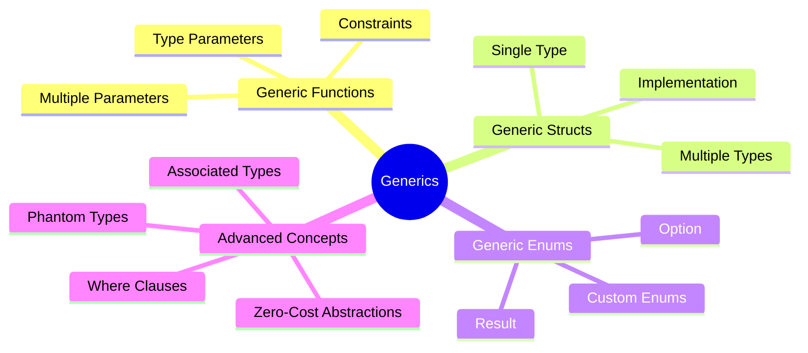
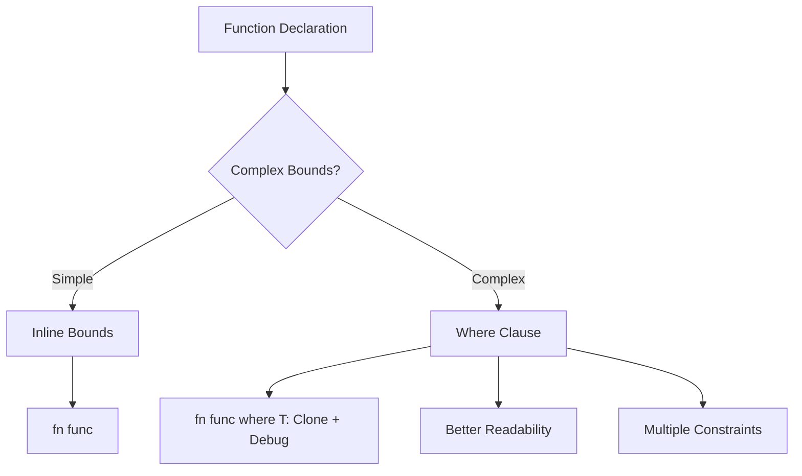
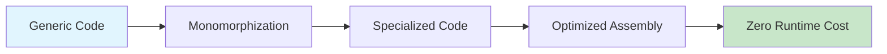

# BÀI 13: GENERICS VÀ TYPE-LEVEL PROGRAMMING

<div className="bg-gradient-to-r from-blue-100 to-purple-100 p-6 rounded-lg shadow-md mb-8">
  <h2 className="text-2xl font-bold text-blue-800 mb-2">🎯 MỤC TIÊU BÀI HỌC</h2>
  <p className="text-gray-700">Viết code linh hoạt và có thể tái sử dụng với generics, hiểu cách Rust thực hiện type-level programming để tạo ra các abstractions mạnh mẽ mà không ảnh hưởng đến performance.</p>
</div>

## 📋 NỘI DUNG CHÍNH



---

## 1. GENERIC FUNCTIONS

### 1.1 Khái niệm cơ bản

Generic functions cho phép viết một function có thể hoạt động với nhiều kiểu dữ liệu khác nhau:

```rust
// Function không generic - chỉ hoạt động với i32
fn largest_i32(list: &[i32]) -> i32 {
    let mut largest = list[0];
    for &item in list {
        if item > largest {
            largest = item;
        }
    }
    largest
}

// Generic function - hoạt động với bất kỳ type nào có thể so sánh
fn largest<T: PartialOrd + Copy>(list: &[T]) -> T {
    let mut largest = list[0];
    for &item in list {
        if item > largest {
            largest = item;
        }
    }
    largest
}
```

### 1.2 So sánh Approach

| Aspect | Specific Types | Generic Types |
|--------|----------------|---------------|
| **Code Duplication** | Cao - phải viết lại cho mỗi type | Thấp - một implementation cho nhiều types |
| **Compile Time** | Nhanh | Chậm hơn (monomorphization) |
| **Runtime Performance** | Tối ưu | Tối ưu (zero-cost abstraction) |
| **Type Safety** | Cao | Cao |
| **Flexibility** | Thấp | Cao |

### 1.3 Ví dụ thực tế

```rust
// Generic function cho việc swap
fn swap<T>(a: &mut T, b: &mut T) {
    std::mem::swap(a, b);
}

// Generic function với multiple type parameters
fn zip_with<T, U, R, F>(vec1: Vec<T>, vec2: Vec<U>, f: F) -> Vec<R>
where
    F: Fn(T, U) -> R,
{
    vec1.into_iter()
        .zip(vec2.into_iter())
        .map(|(a, b)| f(a, b))
        .collect()
}

fn main() {
    let mut x = 5;
    let mut y = 10;
    swap(&mut x, &mut y);
    println!("x: {}, y: {}", x, y); // x: 10, y: 5
    
    let numbers = vec![1, 2, 3];
    let strings = vec!["a", "b", "c"];
    let combined = zip_with(numbers, strings, |n, s| format!("{}{}", n, s));
    println!("{:?}", combined); // ["1a", "2b", "3c"]
}
```

---

## 2. GENERIC STRUCTS

### 2.1 Single Generic Parameter

```rust
struct Point<T> {
    x: T,
    y: T,
}

impl<T> Point<T> {
    fn new(x: T, y: T) -> Self {
        Point { x, y }
    }
    
    fn x(&self) -> &T {
        &self.x
    }
}

// Specific implementation cho f64
impl Point<f64> {
    fn distance_from_origin(&self) -> f64 {
        (self.x.powi(2) + self.y.powi(2)).sqrt()
    }
}
```

### 2.2 Multiple Generic Parameters

```rust
struct Pair<T, U> {
    first: T,
    second: U,
}

impl<T, U> Pair<T, U> {
    fn new(first: T, second: U) -> Self {
        Pair { first, second }
    }
    
    fn into_tuple(self) -> (T, U) {
        (self.first, self.second)
    }
}

// Mixed implementation
impl<T> Pair<T, T> {
    fn same_type(&self) -> bool
    where
        T: PartialEq,
    {
        self.first == self.second
    }
}
```

### 2.3 Generic Struct Patterns

| Pattern | Use Case | Example |
|---------|----------|---------|
| **Container** | Lưu trữ dữ liệu | `Vec<T>`, `Option<T>` |
| **Wrapper** | Thêm behavior | `Box<T>`, `Rc<T>` |
| **Builder** | Tạo objects | `Builder<T>` |
| **State Machine** | Quản lý state | `State<T>` |

---

## 3. GENERIC ENUMS

### 3.1 Standard Library Examples

```rust
// Option<T> - có thể có hoặc không có value
enum Option<T> {
    Some(T),
    None,
}

// Result<T, E> - thành công hoặc lỗi
enum Result<T, E> {
    Ok(T),
    Err(E),
}

// Custom generic enum
enum Either<L, R> {
    Left(L),
    Right(R),
}

impl<L, R> Either<L, R> {
    fn is_left(&self) -> bool {
        matches!(self, Either::Left(_))
    }
    
    fn is_right(&self) -> bool {
        matches!(self, Either::Right(_))
    }
    
    fn map_left<F, T>(self, f: F) -> Either<T, R>
    where
        F: FnOnce(L) -> T,
    {
        match self {
            Either::Left(l) => Either::Left(f(l)),
            Either::Right(r) => Either::Right(r),
        }
    }
}
```

---

## 4. TRAIT BOUNDS VÀ WHERE CLAUSES

### 4.1 Basic Trait Bounds

```rust
// Inline trait bounds
fn compare_and_display<T: PartialOrd + std::fmt::Display>(a: T, b: T) {
    if a > b {
        println!("{} is greater than {}", a, b);
    } else {
        println!("{} is less than or equal to {}", a, b);
    }
}

// Multiple bounds with +
fn process<T: Clone + Default + std::fmt::Debug>(item: T) -> T {
    let mut result = item.clone();
    println!("Processing: {:?}", result);
    result
}
```

### 4.2 Where Clauses



```rust
// Where clause cho better readability
fn complex_function<T, U, V>(a: T, b: U, c: V) -> String
where
    T: std::fmt::Display + Clone,
    U: std::fmt::Debug + Default,
    V: PartialEq + std::hash::Hash,
{
    format!("a: {}, b: {:?}, c equals itself: {}", 
            a, b, c == c)
}

// Where clause với conditional implementations
impl<T> Point<T>
where
    T: std::fmt::Display + Copy + std::ops::Add<Output = T>,
{
    fn sum(&self) -> T {
        self.x + self.y
    }
    
    fn describe(&self) {
        println!("Point at ({}, {})", self.x, self.y);
    }
}
```

---

## 5. ASSOCIATED TYPES VS GENERIC PARAMETERS

### 5.1 So sánh Approaches

<div className="bg-yellow-50 border-l-4 border-yellow-400 p-4 mb-6">
  <div className="flex">
    <div className="ml-3">
      <p className="text-sm text-yellow-700">
        <strong>Associated Types:</strong> Sử dụng khi có một relationship duy nhất giữa implementer và associated type.<br />
        <strong>Generic Parameters:</strong> Sử dụng khi implementer có thể có nhiều relationships với different types.
      </p>
    </div>
  </div>
</div>

| Feature | Associated Types | Generic Parameters |
|---------|------------------|-------------------|
| **Flexibility** | Một type per implementation | Multiple types possible |
| **Syntax** | `Iterator::Item` | `Iterator<Item>` |
| **Use Case** | One-to-one relationship | One-to-many relationship |
| **Example** | `Iterator` trait | `From<T>` trait |

### 5.2 Associated Types Example

```rust
trait Iterator {
    type Item;  // Associated type
    
    fn next(&mut self) -> Option<Self::Item>;
}

struct Counter {
    current: usize,
    max: usize,
}

impl Iterator for Counter {
    type Item = usize;  // Concrete associated type
    
    fn next(&mut self) -> Option<Self::Item> {
        if self.current < self.max {
            let current = self.current;
            self.current += 1;
            Some(current)
        } else {
            None
        }
    }
}
```

### 5.3 Generic Parameters Example

```rust
trait From<T> {  // Generic parameter
    fn from(value: T) -> Self;
}

// Multiple implementations for same struct
struct Number(i32);

impl From<i32> for Number {
    fn from(value: i32) -> Self {
        Number(value)
    }
}

impl From<String> for Number {
    fn from(value: String) -> Self {
        Number(value.parse().unwrap_or(0))
    }
}
```

---

## 6. PHANTOM TYPES VÀ ZERO-COST ABSTRACTIONS

### 6.1 Phantom Types

```rust
use std::marker::PhantomData;

// State machine với phantom types
struct Locked;
struct Unlocked;

struct Door<State> {
    _state: PhantomData<State>,
}

impl Door<Locked> {
    fn new() -> Self {
        Door { _state: PhantomData }
    }
    
    fn unlock(self) -> Door<Unlocked> {
        Door { _state: PhantomData }
    }
}

impl Door<Unlocked> {
    fn lock(self) -> Door<Locked> {
        Door { _state: PhantomData }
    }
    
    fn open(&self) {
        println!("Door is opening!");
    }
}

// Compile-time safety
fn main() {
    let door = Door::new();  // Door<Locked>
    // door.open();  // ❌ Compile error!
    
    let unlocked_door = door.unlock();  // Door<Unlocked>
    unlocked_door.open();  // ✅ OK!
}
```

### 6.2 Zero-Cost Abstractions



```rust
// Generic iterator chain
fn process_numbers(numbers: Vec<i32>) -> Vec<i32> {
    numbers
        .into_iter()
        .filter(|&x| x > 0)
        .map(|x| x * 2)
        .collect()
}

// Compiler generates equivalent to:
fn process_numbers_specialized(numbers: Vec<i32>) -> Vec<i32> {
    let mut result = Vec::new();
    for num in numbers {
        if num > 0 {
            result.push(num * 2);
        }
    }
    result
}
```

---

## 7. THỰC HÀNH: GENERIC DATA STRUCTURES

### 7.1 Generic Stack Implementation

```rust
#[derive(Debug)]
pub struct Stack<T> {
    items: Vec<T>,
}

impl<T> Stack<T> {
    pub fn new() -> Self {
        Stack {
            items: Vec::new(),
        }
    }
    
    pub fn push(&mut self, item: T) {
        self.items.push(item);
    }
    
    pub fn pop(&mut self) -> Option<T> {
        self.items.pop()
    }
    
    pub fn peek(&self) -> Option<&T> {
        self.items.last()
    }
    
    pub fn is_empty(&self) -> bool {
        self.items.is_empty()
    }
    
    pub fn len(&self) -> usize {
        self.items.len()
    }
}

impl<T> Default for Stack<T> {
    fn default() -> Self {
        Self::new()
    }
}

// Usage
fn main() {
    let mut int_stack = Stack::new();
    int_stack.push(1);
    int_stack.push(2);
    int_stack.push(3);
    
    println!("Stack: {:?}", int_stack);
    println!("Popped: {:?}", int_stack.pop());
    println!("Peek: {:?}", int_stack.peek());
    
    let mut string_stack = Stack::new();
    string_stack.push("hello".to_string());
    string_stack.push("world".to_string());
    
    println!("String stack length: {}", string_stack.len());
}
```

### 7.2 Generic Result Wrapper

```rust
#[derive(Debug)]
pub struct ResultWrapper<T, E> {
    inner: Result<T, E>,
}

impl<T, E> ResultWrapper<T, E> {
    pub fn new(result: Result<T, E>) -> Self {
        Self { inner: result }
    }
    
    pub fn is_ok(&self) -> bool {
        self.inner.is_ok()
    }
    
    pub fn is_err(&self) -> bool {
        self.inner.is_err()
    }
    
    pub fn unwrap_or_default(self) -> T 
    where 
        T: Default 
    {
        self.inner.unwrap_or_default()
    }
    
    pub fn map_both<U, F, G>(self, success_fn: F, error_fn: G) -> (Option<U>, Option<F::Output>)
    where
        F: FnOnce(T) -> U,
        G: FnOnce(E) -> F::Output,
        F::Output: std::fmt::Debug,
    {
        match self.inner {
            Ok(value) => (Some(success_fn(value)), None),
            Err(error) => (None, Some(error_fn(error))),
        }
    }
}

// Usage example
fn divide(a: f64, b: f64) -> ResultWrapper<f64, String> {
    if b == 0.0 {
        ResultWrapper::new(Err("Division by zero".to_string()))
    } else {
        ResultWrapper::new(Ok(a / b))
    }
}
```

---

## 8. BEST PRACTICES

### 8.1 Design Guidelines

<div className="bg-green-50 border border-green-200 rounded-lg p-6 mb-6">
  <h3 className="text-lg font-semibold text-green-800 mb-4">✅ Generics Best Practices</h3>
  <ul className="space-y-2 text-green-700">
    <li>• Sử dụng descriptive type parameter names (`Item` thay vì `T` khi appropriate)</li>
    <li>• Prefer trait bounds over concrete types</li>
    <li>• Use where clauses cho complex bounds</li>
    <li>• Consider associated types vs generic parameters</li>
    <li>• Don't over-generalize - start concrete, then generalize when needed</li>
  </ul>
</div>

### 8.2 Common Patterns

| Pattern | Description | Example Use Case |
|---------|-------------|------------------|
| **Newtype** | Wrapper cho type safety | `UserId(u32)` |
| **Builder** | Step-by-step construction | `HttpRequestBuilder<T>` |
| **State Machine** | Type-safe state transitions | `Connection<State>` |
| **Generic Container** | Data storage | `Cache<K, V>` |

---

## 📝 BÀI TẬP THỰC HÀNH

### Bài tập 1: Generic Binary Tree
Implement một generic binary search tree với các operations cơ bản (insert, search, delete).

### Bài tập 2: Generic Cache
Tạo một generic cache system với LRU eviction policy.

### Bài tập 3: State Machine
Build một generic state machine cho modeling workflow states.

---

## 🔗 CHUẨN BỊ CHO BÀI TIẾP THEO

Bài học tiếp theo sẽ đi sâu vào **Lifetimes và Borrow Checker** - những concepts quan trọng để ensure memory safety trong Rust. Generics và lifetimes thường được sử dụng cùng nhau để tạo ra các APIs mạnh mẽ và an toàn.

<div className="bg-blue-50 border border-blue-200 rounded-lg p-4">
  <p className="text-blue-800 font-medium">
    💡 <strong>Tip:</strong> Generics trong Rust được compile thành specialized code, nên không có runtime overhead. Đây là một trong những lý do Rust có thể achieve zero-cost abstractions.
  </p>
</div>