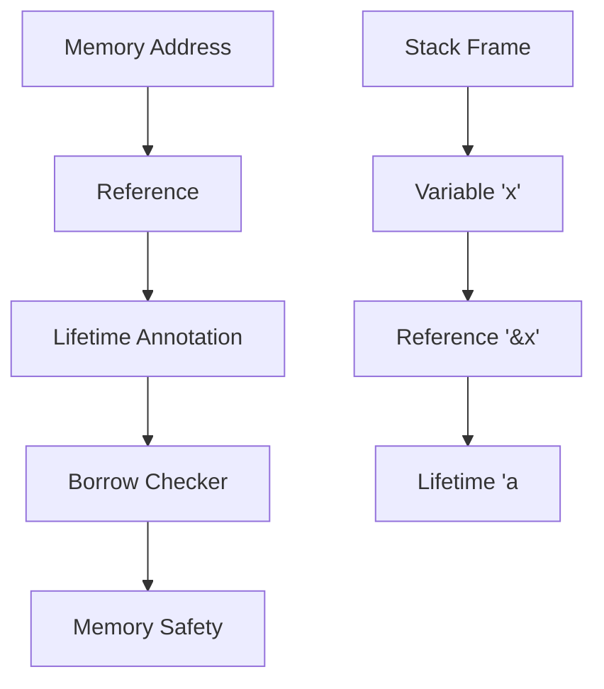
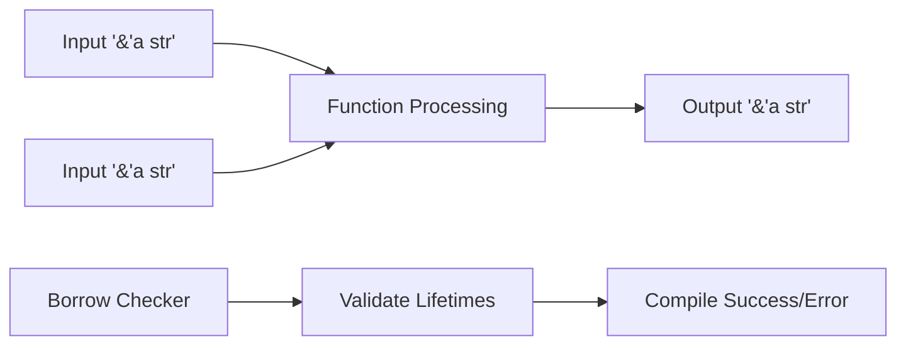
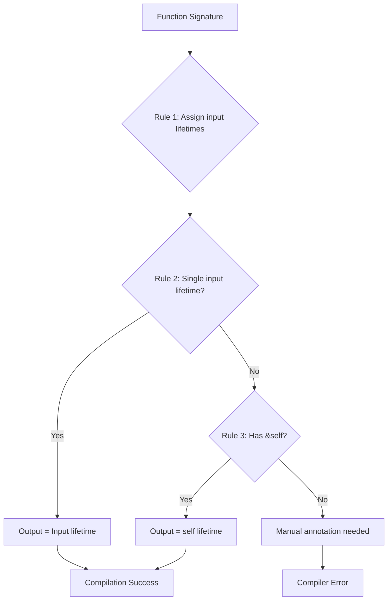
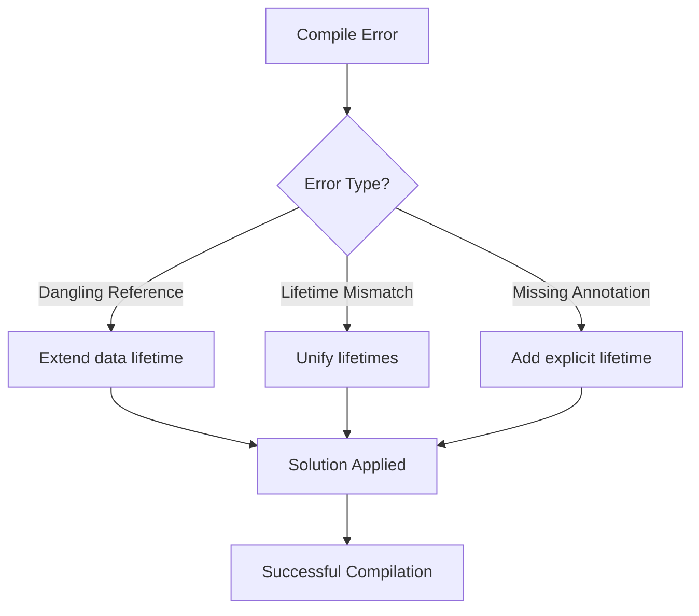

# BÀI 14: LIFETIMES VÀ BORROW CHECKER

<div className="bg-gradient-to-r from-orange-500 to-red-600 text-white p-6 rounded-lg shadow-lg mb-8">
  <h2 className="text-2xl font-bold mb-3">🎯 MỤC TIÊU BÀI HỌC</h2>
  <p className="text-lg">Làm chủ lifetimes để ensure memory safety và hiểu sâu về cách Rust's borrow checker hoạt động</p>
</div>

## 📋 NỘI DUNG CHÍNH

<div className="grid grid-cols-1 md:grid-cols-2 gap-4 mb-6">
  <div className="bg-blue-50 p-4 rounded-lg border-l-4 border-blue-500">
    <h3 className="font-bold text-blue-800">Phần 1: Cơ bản</h3>
    <ul className="text-blue-700 mt-2">
      <li>• Lifetime annotations syntax</li>
      <li>• Function signatures với lifetime parameters</li>
    </ul>
  </div>
  <div className="bg-green-50 p-4 rounded-lg border-l-4 border-green-500">
    <h3 className="font-bold text-green-800">Phần 2: Nâng cao</h3>
    <ul className="text-green-700 mt-2">
      <li>• Struct definitions với lifetimes</li>
      <li>• Lifetime elision rules</li>
    </ul>
  </div>
</div>

---

## 🎯 1. GIỚI THIỆU VỀ LIFETIMES

### Lifetimes là gì?

**Lifetime** trong Rust là một khái niệm để chỉ định **phạm vi sống** của một reference. Mọi reference trong Rust đều có một lifetime, nhưng hầu hết thời gian chúng ta không cần viết rõ ra nhờ **lifetime elision**.



### Tại sao cần Lifetimes?

| Vấn đề | Không có Lifetimes | Với Lifetimes |
|--------|-------------------|---------------|
| **Dangling Reference** | Có thể xảy ra | Được ngăn chặn compile-time |
| **Memory Safety** | Không đảm bảo | Đảm bảo 100% |
| **Performance** | Runtime checks | Zero-cost abstraction |

---

## 📝 2. CÚ PHÁP LIFETIME ANNOTATIONS

### Syntax Cơ bản

Lifetime annotations được viết với dấu apostrophe (`'`) theo sau bởi tên lifetime:

```rust
// Lifetime annotation syntax
'a          // lifetime tên 'a'
'static     // special static lifetime
'_          // anonymous lifetime (lifetime elision)
```

### Ví dụ cơ bản

```rust
// Function với lifetime annotation
fn longest<'a>(x: &'a str, y: &'a str) -> &'a str {
    if x.len() > y.len() {
        x
    } else {
        y
    }
}

fn main() {
    let string1 = "Hello";
    let string2 = "World!";
    
    let result = longest(string1, string2);
    println!("Longest string: {}", result);
}
```

<div className="bg-yellow-50 border-l-4 border-yellow-400 p-4 my-4">
  <p className="text-yellow-800"><strong>💡 Lưu ý:</strong> Lifetime annotation không thay đổi thời gian sống của reference, mà chỉ mô tả mối quan hệ giữa các lifetimes.</p>
</div>

---

## 🔧 3. FUNCTION SIGNATURES VỚI LIFETIME PARAMETERS

### Các Pattern Thường Gặp

| Pattern | Syntax | Ý nghĩa |
|---------|--------|---------|
| **Single Input** | `fn foo<'a>(x: &'a str) -> &'a str` | Output lifetime bằng input |
| **Multiple Inputs** | `fn foo<'a>(x: &'a str, y: &'a str) -> &'a str` | Tất cả cùng lifetime |
| **Mixed Lifetimes** | `fn foo<'a, 'b>(x: &'a str, y: &'b str) -> &'a str` | Output lifetime = 'a |

### Ví dụ thực tế

```rust
// Hàm so sánh và trả về reference đến string dài hơn
fn get_longer<'a>(s1: &'a str, s2: &'a str) -> &'a str {
    if s1.len() >= s2.len() { s1 } else { s2 }
}

// Hàm lấy phần đầu của string
fn get_first_word<'a>(text: &'a str) -> &'a str {
    let bytes = text.as_bytes();
    
    for (i, &item) in bytes.iter().enumerate() {
        if item == b' ' {
            return &text[0..i];
        }
    }
    
    text
}

// Hàm với multiple lifetime parameters
fn announce_and_return_part<'a, 'b>(
    announcement: &'a str, 
    part: &'b str
) -> &'b str {
    println!("Attention please: {}", announcement);
    part
}
```



---

## 🏗️ 4. STRUCT DEFINITIONS VỚI LIFETIME PARAMETERS

### Struct với References

Khi một struct chứa references, ta cần specify lifetimes:

```rust
// Struct chứa reference
struct ImportantExcerpt<'a> {
    part: &'a str,
}

impl<'a> ImportantExcerpt<'a> {
    // Method với cùng lifetime
    fn level(&self) -> i32 {
        3
    }
    
    // Method trả về reference với lifetime khác
    fn announce_and_return_part(&self, announcement: &str) -> &str {
        println!("Attention please: {}", announcement);
        self.part
    }
}

fn main() {
    let novel = String::from("Call me Ishmael. Some years ago...");
    let first_sentence = novel.split('.').next().expect("Could not find a '.'");
    
    let i = ImportantExcerpt {
        part: first_sentence,
    };
    
    println!("Important part: {}", i.part);
}
```

### Struct với Multiple Lifetimes

```rust
// Struct với multiple lifetime parameters
struct DoubleRef<'a, 'b> {
    first: &'a str,
    second: &'b str,
}

impl<'a, 'b> DoubleRef<'a, 'b> {
    fn get_first(&self) -> &'a str {
        self.first
    }
    
    fn get_second(&self) -> &'b str {
        self.second
    }
}
```

---

## 🔄 5. LIFETIME ELISION RULES

### Ba Quy Tắc Elision

Rust compiler tự động suy luận lifetimes theo **3 quy tắc elision**:

| Quy tắc | Mô tả | Ví dụ |
|---------|--------|-------|
| **Rule 1** | Mỗi reference parameter có lifetime riêng | `fn foo(x: &str, y: &str)` → `fn foo<'a, 'b>(x: &'a str, y: &'b str)` |
| **Rule 2** | Nếu có 1 input lifetime, output lifetime = input | `fn foo(x: &str) -> &str` → `fn foo<'a>(x: &'a str) -> &'a str` |
| **Rule 3** | Nếu có `&self` hoặc `&mut self`, output lifetime = self | `fn method(&self) -> &str` → `fn method<'a>(&'a self) -> &'a str` |



### Ví dụ Elision

```rust
// Trước elision (tường minh)
fn first_word_explicit<'a>(s: &'a str) -> &'a str {
    let bytes = s.as_bytes();
    for (i, &item) in bytes.iter().enumerate() {
        if item == b' ' {
            return &s[0..i];
        }
    }
    s
}

// Sau elision (ngắn gọn)
fn first_word(s: &str) -> &str {
    let bytes = s.as_bytes();
    for (i, &item) in bytes.iter().enumerate() {
        if item == b' ' {
            return &s[0..i];
        }
    }
    s
}
```

---

## 🔍 6. MULTIPLE LIFETIME PARAMETERS

### Khi nào cần Multiple Lifetimes?

```rust
// Function với 2 lifetime parameters khác nhau
fn longest_with_an_announcement<'a, 'b>(
    x: &'a str,
    y: &'a str,
    ann: &'b str,
) -> &'a str {
    println!("Announcement! {}", ann);
    if x.len() > y.len() {
        x
    } else {
        y
    }
}
```

### Lifetime Subtyping

```rust
// Lifetime subtyping example
fn choose_str<'a>(first: &'a str, _second: &str) -> &'a str {
    first
}

fn main() {
    let string1 = String::from("long string");
    let result;
    {
        let string2 = String::from("short");
        result = choose_str(&string1, &string2);
        // string2 bị drop ở đây nhưng không sao vì result chỉ reference string1
    }
    println!("Result: {}", result);
}
```

---

## 🧪 7. LIFETIME CONSTRAINTS VÀ BOUNDS

### Lifetime Bounds

```rust
// Struct với lifetime bound
struct Ref<'a, T: 'a> {
    data: &'a T,
}

// Generic function với lifetime constraint
fn create_ref<'a, T>(data: &'a T) -> Ref<'a, T>
where
    T: 'a,
{
    Ref { data }
}
```

### Higher-Ranked Trait Bounds (HRTB)

```rust
// Closure với higher-ranked lifetime
fn call_with_str<F>(f: F) -> String
where
    F: for<'a> Fn(&'a str) -> String,
{
    f("hello")
}
```

---

## ⚠️ 8. COMMON LIFETIME PATTERNS VÀ LỖI THƯỜNG GẶP

### Bảng Lỗi Thường Gặp

| Lỗi | Nguyên nhân | Giải pháp |
|-----|-------------|-----------|
| **Dangling Reference** | Reference outlives data | Adjust scope hoặc clone data |
| **Lifetime Mismatch** | Incompatible lifetimes | Unify lifetimes hoặc restructure |
| **Missing Annotation** | Elision không áp dụng được | Add explicit lifetime |

### Ví dụ Debug Lifetime Errors

```rust
// ❌ Lỗi: Dangling reference
fn dangle() -> &str { // Missing lifetime specifier
    let s = String::from("hello");
    &s // s will be dropped, leaving dangling reference
}

// ✅ Sửa: Return owned data
fn no_dangle() -> String {
    let s = String::from("hello");
    s // Transfer ownership
}

// ❌ Lỗi: Reference outlives borrowed value
fn main() {
    let r;
    {
        let x = 5;
        r = &x; // x doesn't live long enough
    }
    println!("r: {}", r);
}

// ✅ Sửa: Extend lifetime của data
fn main() {
    let x = 5;
    let r = &x;
    println!("r: {}", r);
}
```



---

## 🛠️ 9. THỰC HÀNH: XÂY DỰNG TEXT PARSER

Chúng ta sẽ xây dựng một text parser trả về references đến input data:

```rust
// Text parser với lifetime annotations
#[derive(Debug)]
struct TextParser<'a> {
    content: &'a str,
    position: usize,
}

impl<'a> TextParser<'a> {
    fn new(content: &'a str) -> Self {
        TextParser {
            content,
            position: 0,
        }
    }
    
    // Parse next word, return reference to original content
    fn next_word(&mut self) -> Option<&'a str> {
        self.skip_whitespace();
        
        if self.position >= self.content.len() {
            return None;
        }
        
        let start = self.position;
        while self.position < self.content.len() {
            if self.content.chars().nth(self.position).unwrap().is_whitespace() {
                break;
            }
            self.position += 1;
        }
        
        Some(&self.content[start..self.position])
    }
    
    // Skip whitespace characters
    fn skip_whitespace(&mut self) {
        while self.position < self.content.len() {
            if !self.content.chars().nth(self.position).unwrap().is_whitespace() {
                break;
            }
            self.position += 1;
        }
    }
    
    // Get remaining content
    fn remaining(&self) -> &'a str {
        &self.content[self.position..]
    }
}

// Usage example
fn main() {
    let text = "Hello world Rust programming";
    let mut parser = TextParser::new(text);
    
    println!("Parsing text: '{}'", text);
    
    while let Some(word) = parser.next_word() {
        println!("Found word: '{}'", word);
    }
    
    println!("Remaining: '{}'", parser.remaining());
}
```

### Advanced Parser với Error Handling

```rust
use std::fmt;

#[derive(Debug)]
enum ParseError {
    EndOfInput,
    InvalidToken,
}

impl fmt::Display for ParseError {
    fn fmt(&self, f: &mut fmt::Formatter) -> fmt::Result {
        match self {
            ParseError::EndOfInput => write!(f, "End of input reached"),
            ParseError::InvalidToken => write!(f, "Invalid token encountered"),
        }
    }
}

#[derive(Debug)]
struct AdvancedParser<'a> {
    input: &'a str,
    position: usize,
    line: usize,
    column: usize,
}

impl<'a> AdvancedParser<'a> {
    fn new(input: &'a str) -> Self {
        AdvancedParser {
            input,
            position: 0,
            line: 1,
            column: 1,
        }
    }
    
    fn parse_identifier(&mut self) -> Result<&'a str, ParseError> {
        self.skip_whitespace();
        
        if self.position >= self.input.len() {
            return Err(ParseError::EndOfInput);
        }
        
        let start = self.position;
        let first_char = self.current_char().ok_or(ParseError::EndOfInput)?;
        
        if !first_char.is_alphabetic() && first_char != '_' {
            return Err(ParseError::InvalidToken);
        }
        
        self.advance();
        
        while let Some(ch) = self.current_char() {
            if ch.is_alphanumeric() || ch == '_' {
                self.advance();
            } else {
                break;
            }
        }
        
        Ok(&self.input[start..self.position])
    }
    
    fn current_char(&self) -> Option<char> {
        self.input.chars().nth(self.position)
    }
    
    fn advance(&mut self) {
        if let Some(ch) = self.current_char() {
            self.position += ch.len_utf8();
            if ch == '\n' {
                self.line += 1;
                self.column = 1;
            } else {
                self.column += 1;
            }
        }
    }
    
    fn skip_whitespace(&mut self) {
        while let Some(ch) = self.current_char() {
            if ch.is_whitespace() {
                self.advance();
            } else {
                break;
            }
        }
    }
    
    fn get_position(&self) -> (usize, usize) {
        (self.line, self.column)
    }
}
```

---

## 📚 10. LIFETIME BEST PRACTICES

### Do's and Don'ts

<div className="grid grid-cols-1 md:grid-cols-2 gap-6 my-6">
  <div className="bg-green-50 p-4 rounded-lg border-l-4 border-green-500">
    <h3 className="font-bold text-green-800 mb-3">✅ DO's</h3>
    <ul className="text-green-700 space-y-2">
      <li>• Rely on lifetime elision khi possible</li>
      <li>• Use meaningful lifetime names ('input, 'output)</li>
      <li>• Keep lifetime relationships simple</li>
      <li>• Document complex lifetime constraints</li>
    </ul>
  </div>
  <div className="bg-red-50 p-4 rounded-lg border-l-4 border-red-500">
    <h3 className="font-bold text-red-800 mb-3">❌ DON'Ts</h3>
    <ul className="text-red-700 space-y-2">
      <li>• Don't over-annotate khi elision works</li>
      <li>• Avoid complex lifetime hierarchies</li>
      <li>• Don't fight the borrow checker</li>
      <li>• Don't use 'static unnecessarily</li>
    </ul>
  </div>
</div>

### Performance Guidelines

| Technique | Use Case | Performance Impact |
|-----------|----------|-------------------|
| **Zero-copy parsing** | Text processing | ⚡ Excellent |
| **Reference counting** | Shared ownership | 🔄 Good |
| **Cloning** | Simple ownership | 💾 Moderate |

---

## 🎯 11. BÀI TẬP THỰC HÀNH

### Bài tập 1: Configuration Parser

Viết một configuration parser trả về references đến original data:

```rust
#[derive(Debug)]
struct Config<'a> {
    name: &'a str,
    version: &'a str,
    description: &'a str,
}

impl<'a> Config<'a> {
    fn parse(input: &'a str) -> Option<Self> {
        // TODO: Implement config parsing
        todo!()
    }
}
```

### Bài tập 2: Memory-Safe Iterator

```rust
struct WordIterator<'a> {
    text: &'a str,
    position: usize,
}

impl<'a> WordIterator<'a> {
    fn new(text: &'a str) -> Self {
        // TODO: Implement constructor
        todo!()
    }
}

impl<'a> Iterator for WordIterator<'a> {
    type Item = &'a str;
    
    fn next(&mut self) -> Option<Self::Item> {
        // TODO: Implement iterator
        todo!()
    }
}
```

---

## 📝 12. TÓM TẮT VÀ ĐIỂM QUAN TRỌNG

<div className="bg-blue-50 p-6 rounded-lg border border-blue-200 mb-6">
  <h3 className="text-xl font-bold text-blue-800 mb-4">🎯 Những điểm cốt lõi</h3>
  <div className="grid grid-cols-1 md:grid-cols-2 gap-4">
    <div>
      <h4 className="font-semibold text-blue-700 mb-2">Lifetimes:</h4>
      <ul className="text-blue-600 space-y-1">
        <li>• Ensure memory safety</li>
        <li>• Zero runtime cost</li>
        <li>• Prevent dangling references</li>
      </ul>
    </div>
    <div>
      <h4 className="font-semibold text-blue-700 mb-2">Best Practices:</h4>
      <ul className="text-blue-600 space-y-1">
        <li>• Trust lifetime elision</li>
        <li>• Use descriptive names</li>
        <li>• Keep it simple</li>
      </ul>
    </div>
  </div>
</div>

### Công thức quan trọng

```rust
// Template cho function với lifetimes
fn function_name<'a>(param: &'a Type) -> &'a ReturnType {
    // Implementation
}

// Template cho struct với lifetimes  
struct StructName<'a> {
    field: &'a Type,
}
```

---

## 🚀 13. CHUẨN BỊ CHO BÀI TIẾP THEO

Bài 15 sẽ học về **Advanced Collections & Concurrency Basics**:

- 📚 BTreeMap, BTreeSet cho ordered data
- 🔗 `Rc<T>`, `Arc<T>` cho shared ownership  
- 🧵 Basic threading với std::thread
- 📨 Message passing với channels

<div className="bg-gradient-to-r from-purple-500 to-pink-500 text-white p-4 rounded-lg mt-8">
  <p className="font-bold text-center">🎉 Chúc mừng! Bạn đã hoàn thành Bài 14 về Lifetimes và Borrow Checker! 🎉</p>
</div>