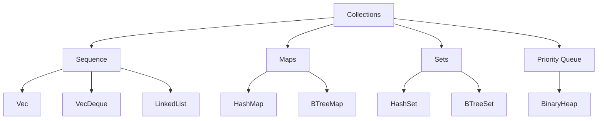
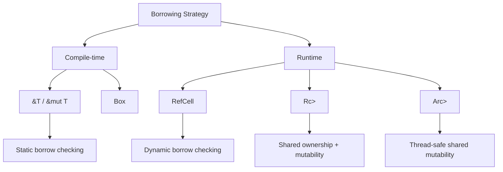
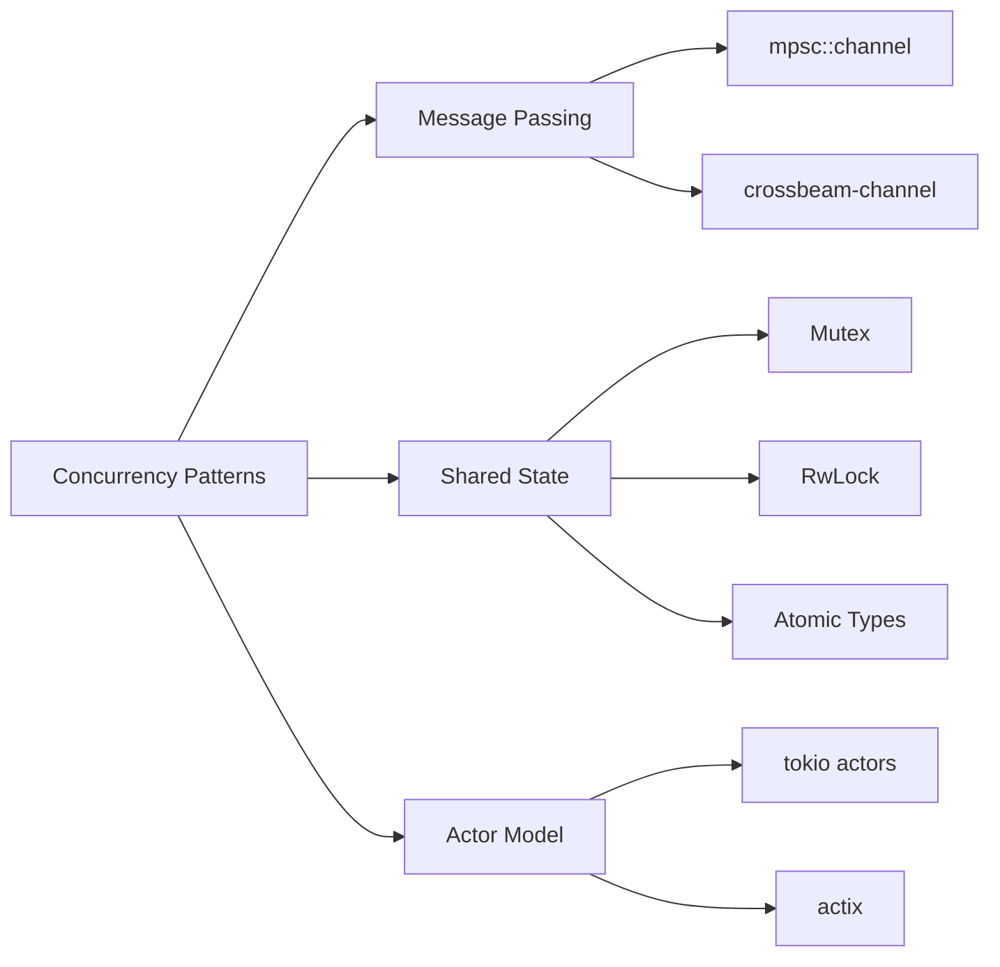

# BÀI 15: ADVANCED COLLECTIONS VÀ CONCURRENCY BASICS

<div className="bg-gradient-to-r from-blue-600 to-purple-600 text-white p-6 rounded-lg mb-8">
  <h2 className="text-2xl font-bold mb-2">🎯 Mục tiêu bài học</h2>
  <p className="text-lg">Sử dụng advanced collections và introduction to concurrency</p>
</div>

## 📚 Nội dung bài học

Trong bài học này, chúng ta sẽ tìm hiểu về các collection nâng cao trong Rust và những khái niệm cơ bản về lập trình đồng thời (concurrency).

---

## 🗂️ ADVANCED COLLECTIONS

### 1. BTreeMap và BTreeSet

<div className="bg-green-50 border-l-4 border-green-400 p-4 mb-4">
  <h4 className="font-bold text-green-800">💡 Khái niệm:</h4>
  <p className="text-green-700">BTreeMap và BTreeSet là các collection được sắp xếp tự động, sử dụng cây B (B-tree) để lưu trữ dữ liệu.</p>
</div>

| Loại Collection | Đặc điểm | Use Case |
|---|---|---|
| **HashMap** | O(1) trung bình, không sắp xếp | Truy xuất nhanh, không cần thứ tự |
| **BTreeMap** | O(log n), luôn sắp xếp | Cần duyệt theo thứ tự, range queries |
| **HashSet** | O(1) trung bình, không sắp xếp | Kiểm tra membership nhanh |
| **BTreeSet** | O(log n), luôn sắp xếp | Set có thứ tự, range operations |

```rust
use std::collections::{BTreeMap, BTreeSet};

fn btree_collections_demo() {
    // BTreeMap - Key-value pairs được sắp xếp
    let mut scores = BTreeMap::new();
    scores.insert("Alice", 85);
    scores.insert("Bob", 92);
    scores.insert("Charlie", 78);
    scores.insert("David", 95);
    
    // Duyệt theo thứ tự alphabet
    for (name, score) in &scores {
        println!("{}: {}", name, score);
    }
    
    // Range queries
    let range: Vec<_> = scores.range("Bob"..).collect();
    println!("From Bob onwards: {:?}", range);
    
    // BTreeSet - Set có thứ tự
    let mut numbers = BTreeSet::new();
    numbers.insert(5);
    numbers.insert(2);
    numbers.insert(8);
    numbers.insert(1);
    
    // Tự động sắp xếp: 1, 2, 5, 8
    println!("Sorted numbers: {:?}", numbers);
}
```

### 2. Các Collection Đặc Biệt Khác



#### VecDeque (Double-ended Queue)

<div className="bg-yellow-50 border-l-4 border-yellow-400 p-4 mb-4">
  <h4 className="font-bold text-yellow-800">⚡ Ưu điểm:</h4>
  <p className="text-yellow-700">Thêm/xóa phần tử ở cả hai đầu với độ phức tạp O(1)</p>
</div>

```rust
use std::collections::VecDeque;

fn vecdeque_demo() {
    let mut deque = VecDeque::new();
    
    // Thêm vào cuối
    deque.push_back(1);
    deque.push_back(2);
    
    // Thêm vào đầu
    deque.push_front(0);
    
    println!("Deque: {:?}", deque); // [0, 1, 2]
    
    // Lấy từ cả hai đầu
    let front = deque.pop_front(); // Some(0)
    let back = deque.pop_back();   // Some(2)
    
    println!("Front: {:?}, Back: {:?}", front, back);
}
```

#### BinaryHeap (Priority Queue)

```rust
use std::collections::BinaryHeap;

fn binary_heap_demo() {
    let mut heap = BinaryHeap::new();
    
    heap.push(3);
    heap.push(1);
    heap.push(4);
    heap.push(2);
    
    // Luôn lấy phần tử lớn nhất
    while let Some(max) = heap.pop() {
        println!("Max: {}", max); // 4, 3, 2, 1
    }
}
```

---

## 🔗 SHARED OWNERSHIP VỚI RC VÀ ARC

### Reference Counting với Rc&lt;T&gt;

<div className="bg-blue-50 border-l-4 border-blue-400 p-4 mb-4">
  <h4 className="font-bold text-blue-800">📖 Định nghĩa:</h4>
  <p className="text-blue-700">Rc (Reference Counted) cho phép multiple owners cho cùng một dữ liệu trong single-threaded context.</p>
</div>

```rust
use std::rc::Rc;

#[derive(Debug)]
struct Node {
    value: i32,
    children: Vec<Rc<Node>>,
}

fn rc_demo() {
    let leaf = Rc::new(Node {
        value: 3,
        children: vec![],
    });
    
    println!("Leaf reference count: {}", Rc::strong_count(&leaf));
    
    let branch = Rc::new(Node {
        value: 5,
        children: vec![Rc::clone(&leaf)],
    });
    
    println!("Leaf reference count after branch: {}", Rc::strong_count(&leaf));
    
    let root = Rc::new(Node {
        value: 10,
        children: vec![Rc::clone(&branch), Rc::clone(&leaf)],
    });
    
    println!("Final leaf reference count: {}", Rc::strong_count(&leaf));
}
```

### Atomic Reference Counting với Arc&lt;T&gt;

| Rc&lt;T&gt; | Arc&lt;T&gt; |
|---|---|
| Single-threaded | Multi-threaded |
| Không thread-safe | Thread-safe |
| Overhead thấp hơn | Overhead cao hơn (atomic operations) |

```rust
use std::sync::Arc;
use std::thread;

fn arc_demo() {
    let data = Arc::new(vec![1, 2, 3, 4, 5]);
    let mut handles = vec![];
    
    for i in 0..3 {
        let data_clone = Arc::clone(&data);
        let handle = thread::spawn(move || {
            let sum: i32 = data_clone.iter().sum();
            println!("Thread {}: Sum = {}", i, sum);
        });
        handles.push(handle);
    }
    
    for handle in handles {
        handle.join().unwrap();
    }
}
```

---

## 🔒 INTERIOR MUTABILITY VỚI REFCELL

<div className="bg-red-50 border-l-4 border-red-400 p-4 mb-4">
  <h4 className="font-bold text-red-800">⚠️ Lưu ý:</h4>
  <p className="text-red-700">RefCell cho phép mutable borrow checking tại runtime thay vì compile time.</p>
</div>

```rust
use std::cell::RefCell;
use std::rc::Rc;

#[derive(Debug)]
struct Counter {
    value: RefCell<i32>,
}

impl Counter {
    fn new(initial: i32) -> Self {
        Counter {
            value: RefCell::new(initial),
        }
    }
    
    fn increment(&self) {
        *self.value.borrow_mut() += 1;
    }
    
    fn get(&self) -> i32 {
        *self.value.borrow()
    }
}

fn refcell_demo() {
    let counter = Rc::new(Counter::new(0));
    let counter1 = Rc::clone(&counter);
    let counter2 = Rc::clone(&counter);
    
    counter1.increment();
    counter2.increment();
    
    println!("Final count: {}", counter.get()); // 2
}
```

### So sánh Borrowing Strategies



---

## 🧵 CONCURRENCY BASICS

### Basic Threading

<div className="bg-purple-50 border-l-4 border-purple-400 p-4 mb-4">
  <h4 className="font-bold text-purple-800">🔄 Threading:</h4>
  <p className="text-purple-700">Rust cung cấp 1:1 threading model với native OS threads.</p>
</div>

```rust
use std::thread;
use std::time::Duration;

fn basic_threading() {
    let handle = thread::spawn(|| {
        for i in 1..10 {
            println!("Thread: {}", i);
            thread::sleep(Duration::from_millis(1));
        }
    });
    
    for i in 1..5 {
        println!("Main: {}", i);
        thread::sleep(Duration::from_millis(1));
    }
    
    handle.join().unwrap();
}
```

### Message Passing với Channels

```rust
use std::sync::mpsc;
use std::thread;

fn channel_demo() {
    let (tx, rx) = mpsc::channel();
    
    thread::spawn(move || {
        let values = vec![
            String::from("Hello"),
            String::from("from"),
            String::from("thread"),
        ];
        
        for val in values {
            tx.send(val).unwrap();
            thread::sleep(Duration::from_secs(1));
        }
    });
    
    for received in rx {
        println!("Received: {}", received);
    }
}
```

### Shared State với Mutex

| Approach | Use Case | Thread Safety |
|---|---|---|
| **mpsc::channel** | Producer-Consumer | ✅ |
| **Mutex&lt;T&gt;** | Shared mutable state | ✅ |
| **RwLock&lt;T&gt;** | Many readers, few writers | ✅ |

```rust
use std::sync::{Arc, Mutex};
use std::thread;

fn mutex_demo() {
    let counter = Arc::new(Mutex::new(0));
    let mut handles = vec![];
    
    for _ in 0..10 {
        let counter = Arc::clone(&counter);
        let handle = thread::spawn(move || {
            let mut num = counter.lock().unwrap();
            *num += 1;
        });
        handles.push(handle);
    }
    
    for handle in handles {
        handle.join().unwrap();
    }
    
    println!("Result: {}", *counter.lock().unwrap());
}
```

---

## 🎯 THỰC HÀNH: MULTI-THREADED FILE PROCESSOR

```rust
use std::sync::{Arc, Mutex, mpsc};
use std::thread;
use std::fs;
use std::io;

struct FileProcessor {
    results: Arc<Mutex<Vec<String>>>,
}

impl FileProcessor {
    fn new() -> Self {
        FileProcessor {
            results: Arc::new(Mutex::new(Vec::new())),
        }
    }
    
    fn process_files(&self, file_paths: Vec<String>) -> io::Result<()> {
        let (tx, rx) = mpsc::channel();
        let results = Arc::clone(&self.results);
        
        // Worker threads
        let mut handles = vec![];
        for _ in 0..4 {
            let rx = rx.clone();
            let results = Arc::clone(&results);
            
            let handle = thread::spawn(move || {
                while let Ok(path) = rx.recv() {
                    match fs::read_to_string(&path) {
                        Ok(content) => {
                            let word_count = content.split_whitespace().count();
                            let result = format!("{}: {} words", path, word_count);
                            results.lock().unwrap().push(result);
                        }
                        Err(e) => {
                            let error = format!("{}: Error - {}", path, e);
                            results.lock().unwrap().push(error);
                        }
                    }
                }
            });
            handles.push(handle);
        }
        
        // Send work to threads
        for path in file_paths {
            tx.send(path).unwrap();
        }
        drop(tx); // Close channel
        
        // Wait for completion
        for handle in handles {
            handle.join().unwrap();
        }
        
        Ok(())
    }
    
    fn get_results(&self) -> Vec<String> {
        self.results.lock().unwrap().clone()
    }
}

fn main() -> io::Result<()> {
    let processor = FileProcessor::new();
    let files = vec![
        "file1.txt".to_string(),
        "file2.txt".to_string(),
        "file3.txt".to_string(),
    ];
    
    processor.process_files(files)?;
    
    for result in processor.get_results() {
        println!("{}", result);
    }
    
    Ok(())
}
```

---

## 📊 PERFORMANCE COMPARISON

<div className="overflow-x-auto">
  <table className="min-w-full bg-white border border-gray-300">
    <thead className="bg-gray-100">
      <tr>
        <th className="px-4 py-2 border-b">Collection</th>
        <th className="px-4 py-2 border-b">Insert</th>
        <th className="px-4 py-2 border-b">Lookup</th>
        <th className="px-4 py-2 border-b">Iteration</th>
        <th className="px-4 py-2 border-b">Memory</th>
      </tr>
    </thead>
    <tbody>
      <tr>
        <td className="px-4 py-2 border-b font-mono">Vec</td>
        <td className="px-4 py-2 border-b">O(1) amortized</td>
        <td className="px-4 py-2 border-b">O(n)</td>
        <td className="px-4 py-2 border-b">O(n)</td>
        <td className="px-4 py-2 border-b">Compact</td>
      </tr>
      <tr className="bg-gray-50">
        <td className="px-4 py-2 border-b font-mono">HashMap</td>
        <td className="px-4 py-2 border-b">O(1) average</td>
        <td className="px-4 py-2 border-b">O(1) average</td>
        <td className="px-4 py-2 border-b">O(n)</td>
        <td className="px-4 py-2 border-b">Overhead</td>
      </tr>
      <tr>
        <td className="px-4 py-2 border-b font-mono">BTreeMap</td>
        <td className="px-4 py-2 border-b">O(log n)</td>
        <td className="px-4 py-2 border-b">O(log n)</td>
        <td className="px-4 py-2 border-b">O(n) sorted</td>
        <td className="px-4 py-2 border-b">Balanced</td>
      </tr>
      <tr className="bg-gray-50">
        <td className="px-4 py-2 border-b font-mono">VecDeque</td>
        <td className="px-4 py-2 border-b">O(1) both ends</td>
        <td className="px-4 py-2 border-b">O(n)</td>
        <td className="px-4 py-2 border-b">O(n)</td>
        <td className="px-4 py-2 border-b">Ring buffer</td>
      </tr>
    </tbody>
  </table>
</div>

---

## 🔍 CONCURRENCY PATTERNS



### Best Practices cho Concurrency

<div className="bg-gray-50 p-6 rounded-lg">
  <h4 className="font-bold mb-4">✅ DOs:</h4>
  <ul className="space-y-2 mb-4">
    <li>• Ưu tiên message passing hơn shared state</li>
    <li>• Sử dụng Arc&lt;Mutex&lt;T&gt;&gt; cho shared mutable data</li>
    <li>• Handle panics trong threads</li>
    <li>• Use thread pools cho CPU-intensive tasks</li>
  </ul>
  
  <h4 className="font-bold mb-4">❌ DON'Ts:</h4>
  <ul className="space-y-2">
    <li>• Avoid sharing raw pointers between threads</li>
    <li>• Don't ignore join() results</li>
    <li>• Avoid excessive lock contention</li>
    <li>• Don't create too many threads</li>
  </ul>
</div>

---

## 💡 KEY TAKEAWAYS

<div className="bg-gradient-to-r from-green-400 to-blue-500 text-white p-6 rounded-lg">
  <h3 className="text-xl font-bold mb-4">Điểm quan trọng:</h3>
  <ul className="space-y-2">
    <li>🗂️ <strong>Advanced Collections:</strong> Chọn collection phù hợp cho từng use case</li>
    <li>🔗 <strong>Rc/Arc:</strong> Enable shared ownership khi cần thiết</li>
    <li>🔒 <strong>RefCell:</strong> Interior mutability với runtime borrow checking</li>
    <li>🧵 <strong>Threading:</strong> Rust đảm bảo thread safety tại compile time</li>
    <li>📨 <strong>Channels:</strong> An toàn cho communication between threads</li>
    <li>🔐 <strong>Mutex:</strong> Synchronize access to shared mutable data</li>
  </ul>
</div>

---

## 🎓 BÀI TẬP VỀ NHÀ

1. **Thực hành Collections**: Implement một URL shortener sử dụng BTreeMap
2. **Concurrency Project**: Tạo web crawler sử dụng multiple threads
3. **Performance Testing**: So sánh hiệu suất của các collections khác nhau
4. **Thread Pool**: Implement custom thread pool cho task processing

---

<div className="bg-blue-100 border border-blue-400 text-blue-700 px-4 py-3 rounded mt-8">
  <strong>📚 Chuẩn bị cho bài tiếp theo:</strong> Trong bài 16, chúng ta sẽ tìm hiểu về Async Programming với futures và async/await syntax.
</div>