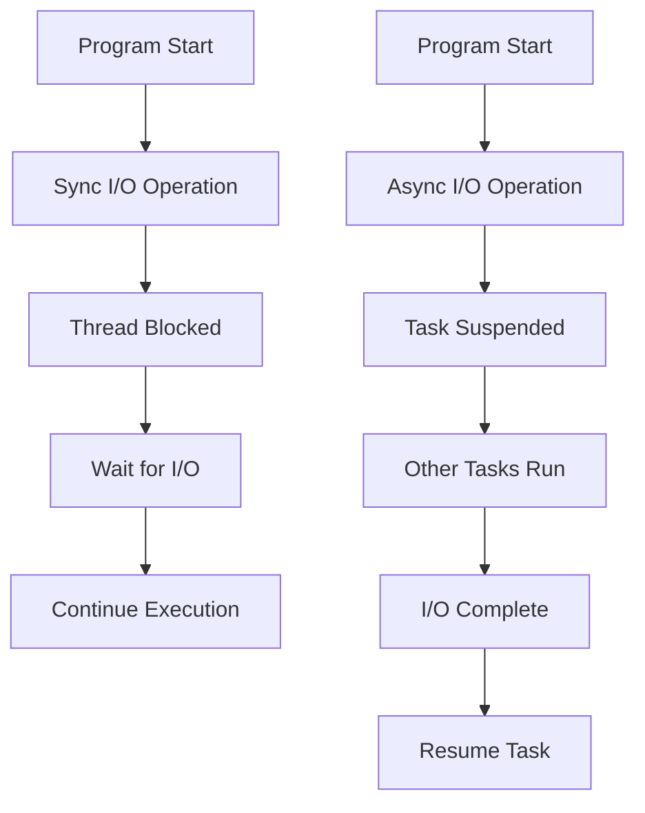
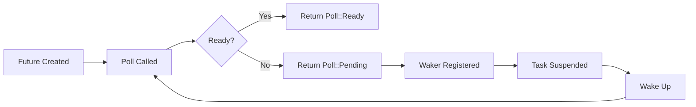
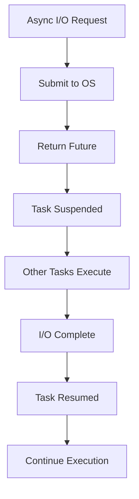

# Bài 16: Async Programming trong Rust

<div className="bg-gradient-to-r from-blue-50 to-indigo-100 p-6 rounded-lg shadow-md mb-8">
  <div className="text-2xl font-bold text-indigo-800 mb-4">🎯 Mục tiêu học tập</div>
  <div className="text-gray-700 text-lg">Nắm vững lập trình bất đồng bộ (asynchronous programming) với futures và async/await pattern, có khả năng xây dựng các ứng dụng hiệu suất cao với I/O không đồng bộ.</div>
</div>

## 📋 Nội dung chính

| **Chủ đề** | **Khái niệm chính** | **Thời gian** |
|-----------|-------------------|---------------|
| Async Functions | `async fn`, `await` keyword | 30 phút |
| Futures & Tasks | Future trait, task execution | 25 phút |
| Async Blocks | Async closures, blocks | 20 phút |
| Tokio Runtime | Runtime basics, spawning | 35 phút |
| Async I/O | File & Network operations | 30 phút |
| Error Handling | Async context errors | 20 phút |

---

## 🔍 1. Giới thiệu Async Programming

<div className="bg-yellow-50 border-l-4 border-yellow-400 p-4 mb-6">
  <h3 className="text-lg font-semibold text-yellow-800 mb-2">💡 Tại sao cần Async Programming?</h3>
  <div className="text-yellow-700">
    Async programming cho phép chương trình thực hiện nhiều tác vụ cùng lúc mà không cần tạo nhiều threads, 
    đặc biệt hữu ích cho I/O operations như network requests, file reading, database queries.
  </div>
</div>



### So sánh Sync vs Async

| **Đặc điểm** | **Synchronous** | **Asynchronous** |
|-------------|----------------|------------------|
| **Blocking** | Có - thread bị block | Không - task suspended |
| **Resource Usage** | Cao - mỗi task = 1 thread | Thấp - nhiều task/thread |
| **Scalability** | Thấp (1000s connections) | Cao (100,000s connections) |
| **Complexity** | Đơn giản | Phức tạp hơn |

---

## 🚀 2. Async Functions và Await

### Cú pháp cơ bản

```rust
// Async function
async fn fetch_data() -> Result<String, Box<dyn std::error::Error>> {
    // Simulate network request
    tokio::time::sleep(std::time::Duration::from_secs(1)).await;
    Ok("Data fetched successfully".to_string())
}

#[tokio::main]
async fn main() {
    match fetch_data().await {
        Ok(data) => println!("Received: {}", data),
        Err(e) => println!("Error: {}", e),
    }
}
```

<div className="bg-blue-50 border border-blue-200 rounded-lg p-4 mb-4">
  <div className="font-semibold text-blue-800 mb-2">🔧 Giải thích chi tiết:</div>
  <ul className="text-blue-700 space-y-1">
    <li><strong>async fn:</strong> Khai báo function bất đồng bộ</li>
    <li><strong>.await:</strong> Chờ đợi async operation hoàn thành</li>
    <li><strong>#[tokio::main]:</strong> Macro tạo async runtime</li>
  </ul>
</div>

### Async Function Signatures

```rust
// Trả về Future<Output = i32>
async fn compute() -> i32 {
    42
}

// Tương đương với:
fn compute_sync() -> impl std::future::Future<Output = i32> {
    async { 42 }
}

// Async function với parameters
async fn process_data(input: &str) -> String {
    format!("Processed: {}", input)
}
```

---

## ⚙️ 3. Future Trait và Task Execution



### Future Trait cơ bản

```rust
use std::future::Future;
use std::pin::Pin;
use std::task::{Context, Poll};

struct MyFuture {
    value: Option<i32>,
}

impl Future for MyFuture {
    type Output = i32;
    
    fn poll(mut self: Pin<&mut Self>, _cx: &mut Context<'_>) -> Poll<Self::Output> {
        if let Some(val) = self.value.take() {
            Poll::Ready(val)
        } else {
            self.value = Some(42);
            Poll::Pending
        }
    }
}

// Sử dụng
#[tokio::main]
async fn main() {
    let future = MyFuture { value: None };
    let result = future.await;
    println!("Result: {}", result); // Result: 42
}
```

---

## 🧩 4. Async Blocks và Closures

### Async Blocks

```rust
#[tokio::main]
async fn main() {
    // Async block
    let future = async {
        tokio::time::sleep(std::time::Duration::from_millis(100)).await;
        "Hello from async block"
    };
    
    let result = future.await;
    println!("{}", result);
}
```

### Async Closures

```rust
use tokio::time::{sleep, Duration};

#[tokio::main]
async fn main() {
    let numbers = vec![1, 2, 3, 4, 5];
    
    // Async closure với move
    let process = move |x: i32| async move {
        sleep(Duration::from_millis(x as u64 * 100)).await;
        x * 2
    };
    
    // Sử dụng trong async context
    for num in numbers {
        let result = process(num).await;
        println!("Processed {}: {}", num, result);
    }
}
```

---

## 🏃‍♂️ 5. Tokio Runtime và Task Spawning

<div className="bg-green-50 border border-green-200 rounded-lg p-4 mb-4">
  <div className="font-semibold text-green-800 mb-2">🌟 Tokio Runtime</div>
  <div className="text-green-700">
    Tokio là async runtime phổ biến nhất cho Rust, cung cấp task scheduler, 
    async I/O primitives, và timing utilities.
  </div>
</div>

### Runtime Configuration

```rust
// Cargo.toml
// [dependencies]
// tokio = { version = "1.0", features = ["full"] }

use tokio::time::{sleep, Duration};

#[tokio::main]
async fn main() {
    println!("Starting async program");
    
    // Spawn concurrent tasks
    let task1 = tokio::spawn(async {
        for i in 1..=3 {
            println!("Task 1: {}", i);
            sleep(Duration::from_millis(500)).await;
        }
        "Task 1 completed"
    });
    
    let task2 = tokio::spawn(async {
        for i in 1..=3 {
            println!("Task 2: {}", i);
            sleep(Duration::from_millis(300)).await;
        }
        "Task 2 completed"
    });
    
    // Wait for both tasks
    let (result1, result2) = tokio::join!(task1, task2);
    println!("Results: {:?}, {:?}", result1, result2);
}
```

### Task Management

| **Function** | **Mục đích** | **Return Type** |
|-------------|-------------|----------------|
| `tokio::spawn` | Tạo independent task | `JoinHandle<T>` |
| `tokio::join!` | Chờ multiple futures | `(T1, T2, ...)` |
| `tokio::select!` | Race multiple futures | First completed |
| `tokio::try_join!` | Join với error propagation | `Result<(T1, T2, ...), E>` |

```rust
use tokio::time::{timeout, Duration};

#[tokio::main]
async fn main() {
    // Timeout example
    let slow_task = async {
        sleep(Duration::from_secs(5)).await;
        "Completed"
    };
    
    match timeout(Duration::from_secs(2), slow_task).await {
        Ok(result) => println!("Task completed: {}", result),
        Err(_) => println!("Task timed out!"),
    }
}
```

---

## 🌐 6. Async I/O Operations



### File I/O

```rust
use tokio::fs::File;
use tokio::io::{AsyncReadExt, AsyncWriteExt};

async fn file_operations() -> Result<(), Box<dyn std::error::Error>> {
    // Async file write
    let mut file = File::create("async_example.txt").await?;
    file.write_all(b"Hello, async world!").await?;
    file.flush().await?;
    
    // Async file read
    let mut file = File::open("async_example.txt").await?;
    let mut contents = String::new();
    file.read_to_string(&mut contents).await?;
    
    println!("File contents: {}", contents);
    Ok(())
}

#[tokio::main]
async fn main() {
    if let Err(e) = file_operations().await {
        eprintln!("Error: {}", e);
    }
}
```

### Network I/O

```rust
use tokio::net::{TcpListener, TcpStream};
use tokio::io::{AsyncReadExt, AsyncWriteExt};

async fn handle_client(mut socket: TcpStream) -> Result<(), Box<dyn std::error::Error>> {
    let mut buf = [0; 1024];
    
    loop {
        let n = socket.read(&mut buf).await?;
        if n == 0 {
            break;
        }
        
        // Echo back to client
        socket.write_all(&buf[0..n]).await?;
    }
    
    Ok(())
}

#[tokio::main]
async fn main() -> Result<(), Box<dyn std::error::Error>> {
    let listener = TcpListener::bind("127.0.0.1:8080").await?;
    println!("Server listening on 127.0.0.1:8080");
    
    loop {
        let (socket, addr) = listener.accept().await?;
        println!("New client: {}", addr);
        
        // Spawn task for each client
        tokio::spawn(async move {
            if let Err(e) = handle_client(socket).await {
                eprintln!("Error handling client: {}", e);
            }
        });
    }
}
```

---

## ❌ 7. Error Handling trong Async Context

### Async Error Propagation

```rust
use std::error::Error;
use std::fmt;

#[derive(Debug)]
struct NetworkError {
    message: String,
}

impl fmt::Display for NetworkError {
    fn fmt(&self, f: &mut fmt::Formatter) -> fmt::Result {
        write!(f, "Network error: {}", self.message)
    }
}

impl Error for NetworkError {}

async fn fetch_user_data(id: u32) -> Result<String, Box<dyn Error>> {
    if id == 0 {
        return Err(Box::new(NetworkError {
            message: "Invalid user ID".to_string(),
        }));
    }
    
    // Simulate async operation
    tokio::time::sleep(std::time::Duration::from_millis(100)).await;
    Ok(format!("User data for ID: {}", id))
}

async fn process_users(ids: Vec<u32>) -> Result<Vec<String>, Box<dyn Error>> {
    let mut results = Vec::new();
    
    for id in ids {
        let data = fetch_user_data(id).await?; // Error propagation
        results.push(data);
    }
    
    Ok(results)
}

#[tokio::main]
async fn main() {
    let user_ids = vec![1, 2, 0, 3]; // 0 will cause error
    
    match process_users(user_ids).await {
        Ok(data) => println!("All users processed: {:?}", data),
        Err(e) => println!("Error processing users: {}", e),
    }
}
```

### Try-Join Pattern

```rust
async fn concurrent_operations() -> Result<(String, String), Box<dyn Error>> {
    let task1 = async {
        tokio::time::sleep(std::time::Duration::from_millis(100)).await;
        Ok::<String, Box<dyn Error>>("Task 1 result".to_string())
    };
    
    let task2 = async {
        tokio::time::sleep(std::time::Duration::from_millis(200)).await;
        Ok::<String, Box<dyn Error>>("Task 2 result".to_string())
    };
    
    // If any task fails, entire operation fails
    tokio::try_join!(task1, task2)
}
```

---

## 🛠️ 8. Thực hành: Async Web Client

<div className="bg-purple-50 border border-purple-200 rounded-lg p-4 mb-4">
  <div className="font-semibold text-purple-800 mb-2">🎯 Bài tập thực hành</div>
  <div className="text-purple-700">
    Xây dựng async web client có khả năng fetch data từ nhiều URLs đồng thời và xử lý kết quả.
  </div>
</div>

```rust
// Cargo.toml dependencies:
// tokio = { version = "1.0", features = ["full"] }
// reqwest = { version = "0.11", features = ["json"] }
// serde = { version = "1.0", features = ["derive"] }

use reqwest::Client;
use serde::Deserialize;
use std::time::Instant;
use tokio::time::{timeout, Duration};

#[derive(Debug, Deserialize)]
struct Post {
    id: u32,
    title: String,
    body: String,
}

struct WebClient {
    client: Client,
    timeout_duration: Duration,
}

impl WebClient {
    fn new() -> Self {
        Self {
            client: Client::new(),
            timeout_duration: Duration::from_secs(10),
        }
    }
    
    async fn fetch_post(&self, id: u32) -> Result<Post, Box<dyn std::error::Error>> {
        let url = format!("https://jsonplaceholder.typicode.com/posts/{}", id);
        
        let response = timeout(
            self.timeout_duration,
            self.client.get(&url).send()
        ).await??;
        
        let post: Post = response.json().await?;
        Ok(post)
    }
    
    async fn fetch_posts_concurrent(&self, ids: Vec<u32>) -> Vec<Result<Post, Box<dyn std::error::Error>>> {
        let tasks: Vec<_> = ids.into_iter()
            .map(|id| self.fetch_post(id))
            .collect();
        
        // Sử dụng join_all để chạy tất cả tasks đồng thời
        futures::future::join_all(tasks).await
    }
}

#[tokio::main]
async fn main() {
    let client = WebClient::new();
    let post_ids = vec![1, 2, 3, 4, 5];
    
    let start = Instant::now();
    
    // Fetch posts concurrently
    let results = client.fetch_posts_concurrent(post_ids).await;
    
    let duration = start.elapsed();
    
    // Process results
    for (index, result) in results.into_iter().enumerate() {
        match result {
            Ok(post) => println!("Post {}: {}", index + 1, post.title),
            Err(e) => println!("Error fetching post {}: {}", index + 1, e),
        }
    }
    
    println!("Total time: {:?}", duration);
}
```

---

## 📊 9. Performance Comparison

### Sync vs Async Benchmark

```rust
use std::time::{Duration, Instant};
use tokio::time::sleep;

// Sync version (simulated blocking I/O)
fn sync_operation(id: u32) -> String {
    std::thread::sleep(Duration::from_millis(100));
    format!("Sync result {}", id)
}

// Async version
async fn async_operation(id: u32) -> String {
    sleep(Duration::from_millis(100)).await;
    format!("Async result {}", id)
}

async fn benchmark() {
    let tasks = 10;
    
    // Sync benchmark
    let start = Instant::now();
    for i in 0..tasks {
        sync_operation(i);
    }
    let sync_duration = start.elapsed();
    
    // Async benchmark
    let start = Instant::now();
    let futures: Vec<_> = (0..tasks)
        .map(|i| async_operation(i))
        .collect();
    futures::future::join_all(futures).await;
    let async_duration = start.elapsed();
    
    println!("Sync duration: {:?}", sync_duration);
    println!("Async duration: {:?}", async_duration);
    println!("Speedup: {:.2}x", sync_duration.as_millis() as f64 / async_duration.as_millis() as f64);
}
```

| **Metric** | **Sync (10 tasks)** | **Async (10 tasks)** |
|-----------|--------------------|--------------------|
| **Duration** | ~1000ms | ~100ms |
| **Memory Usage** | 10 threads × 2MB | 1 thread + tasks |
| **CPU Usage** | Low (blocked) | High (efficient) |
| **Scalability** | Limited | Excellent |

---

## 🔄 10. Advanced Patterns

### Stream Processing

```rust
use tokio_stream::{self as stream, StreamExt};
use tokio::time::{interval, Duration};

#[tokio::main]
async fn main() {
    // Create a stream that emits every 500ms
    let mut interval_stream = stream::wrappers::IntervalStream::new(
        interval(Duration::from_millis(500))
    );
    
    // Process stream items
    let mut counter = 0;
    while let Some(_) = interval_stream.next().await {
        counter += 1;
        println!("Tick {}", counter);
        
        if counter >= 5 {
            break;
        }
    }
}
```

---

## ✅ Tổng kết

<div className="bg-gradient-to-r from-green-50 to-emerald-100 p-6 rounded-lg shadow-md">
  <h3 className="text-xl font-bold text-green-800 mb-4">🎉 Kiến thức đã học</h3>
  <div className="grid grid-cols-1 md:grid-cols-2 gap-4 text-green-700">
    <div>
      <h4 className="font-semibold mb-2">Core Concepts:</h4>
      <ul className="space-y-1">
        <li>• Async functions và await</li>
        <li>• Future trait mechanics</li>
        <li>• Task spawning và management</li>
      </ul>
    </div>
    <div>
      <h4 className="font-semibold mb-2">Practical Skills:</h4>
      <ul className="space-y-1">
        <li>• Async I/O operations</li>
        <li>• Error handling patterns</li>
        <li>• Performance optimization</li>
      </ul>
    </div>
  </div>
</div>

### 📝 Bài tập về nhà

1. **Web Scraper**: Xây dựng async web scraper thu thập thông tin từ nhiều trang web
2. **Chat Server**: Tạo TCP chat server với multiple concurrent connections  
3. **File Processor**: Xử lý batch files với async I/O và progress tracking

### 🔗 Tài liệu tham khảo

- [Tokio Documentation](https://tokio.rs/)
- [Async Book](https://rust-lang.github.io/async-book/)
- [Reqwest Documentation](https://docs.rs/reqwest/)

---

*Bài tiếp theo: **Bài 17 - Macros và Testing** - Khám phá metaprogramming và comprehensive testing trong Rust*