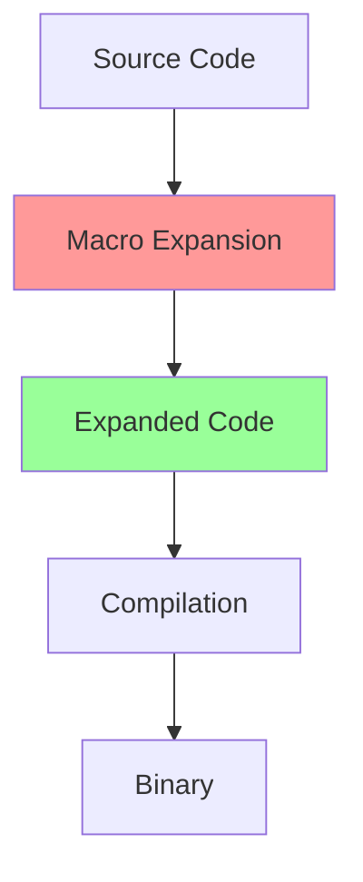
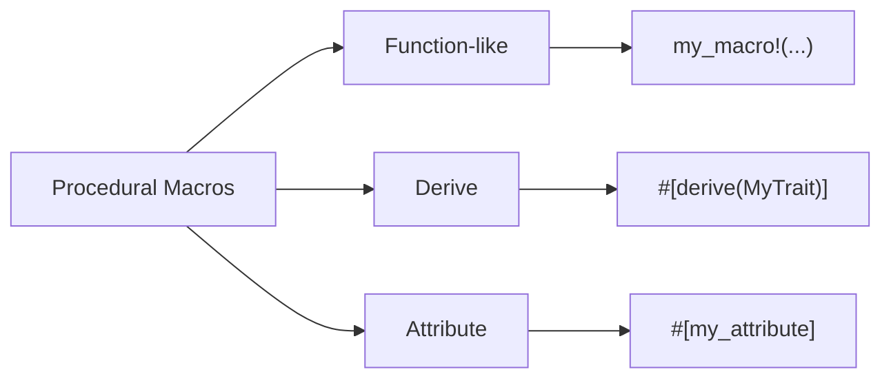
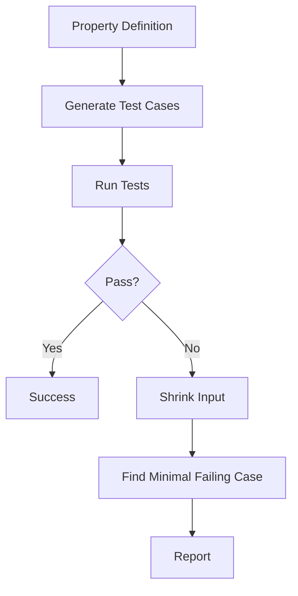

# BÀI 17: MACROS VÀ TESTING
## Metaprogramming với Macros và Comprehensive Testing

<div className="bg-gradient-to-r from-orange-100 to-red-100 border-l-4 border-orange-500 p-4 mb-6">
  <h3 className="text-lg font-semibold text-orange-800 mb-2">🎯 Mục tiêu bài học</h3>
  <ul className="text-orange-700 space-y-1">
    <li>• Hiểu và sử dụng thành thạo declarative macros với <code>macro_rules!</code></li>
    <li>• Nắm vững các khái niệm cơ bản về procedural macros</li>
    <li>• Xây dựng hệ thống testing toàn diện cho Rust applications</li>
    <li>• Áp dụng các patterns testing nâng cao và best practices</li>
  </ul>
</div>

---

## 1. DECLARATIVE MACROS - METAPROGRAMMING CƠ BẢN

### 1.1 Khái niệm Macro trong Rust

**Macro** là một cơ chế metaprogramming mạnh mẽ cho phép tạo code tại compile time. Khác với functions, macros hoạt động trên syntax level và có thể nhận variable number of arguments.



### 1.2 Cú pháp Declarative Macros

<div className="bg-blue-50 border border-blue-200 rounded-lg p-4 mb-4">
  <h4 className="text-blue-800 font-semibold mb-2">📋 Cấu trúc cơ bản của macro_rules!</h4>
</div>

| Thành phần | Mô tả | Ví dụ |
|------------|-------|-------|
| Pattern | Mẫu matching input | `($x:expr)` |
| Expansion | Code được generate | `{ println!("{}", $x) }` |
| Designators | Loại syntax element | `expr`, `ident`, `stmt` |
| Repetition | Lặp lại patterns | `$($x:expr),*` |

### 1.3 Macro đơn giản đầu tiên

```rust
// Macro đơn giản để in debug info
macro_rules! debug_print {
    ($x:expr) => {
        println!("[DEBUG] {} = {:?}", stringify!($x), $x);
    };
}

// Macro với multiple patterns
macro_rules! max {
    ($a:expr) => ($a);
    ($a:expr, $($rest:expr),+) => {
        {
            let rest_max = max!($($rest),+);
            if $a > rest_max { $a } else { rest_max }
        }
    };
}

fn main() {
    let x = 42;
    debug_print!(x); // [DEBUG] x = 42
    
    println!("Max: {}", max!(1, 3, 2, 8, 5)); // Max: 8
}
```

### 1.4 Macro Designators

<div className="overflow-x-auto">

| Designator | Matches | Ví dụ |
|------------|---------|-------|
| `expr` | Expression | `2 + 2`, `vec![1, 2, 3]` |
| `ident` | Identifier | `foo`, `bar` |
| `stmt` | Statement | `let x = 5;` |
| `pat` | Pattern | `Some(x)`, `(a, b)` |
| `ty` | Type | `i32`, `Vec<String>` |
| `literal` | Literal | `42`, `"hello"` |
| `block` | Block | `{ code }` |
| `item` | Item | Function, struct definition |

</div>

### 1.5 Repetition Patterns

```rust
// Vector creation macro
macro_rules! vec_of {
    ($elem:expr; $n:expr) => {
        {
            let mut v = Vec::new();
            for _ in 0..$n {
                v.push($elem);
            }
            v
        }
    };
    ($($x:expr),+ $(,)?) => {
        {
            let mut v = Vec::new();
            $(v.push($x);)+
            v
        }
    };
}

// HashMap creation macro
macro_rules! hashmap {
    ($($key:expr => $value:expr),* $(,)?) => {
        {
            let mut map = std::collections::HashMap::new();
            $(map.insert($key, $value);)*
            map
        }
    };
}

fn main() {
    let v1 = vec_of![1, 2, 3, 4];
    let v2 = vec_of![0; 5];
    
    let map = hashmap! {
        "name" => "Rust",
        "version" => "1.70",
        "type" => "Systems Programming"
    };
}
```

## 2. ADVANCED MACRO PATTERNS

### 2.1 Conditional Compilation Macros

```rust
macro_rules! debug_assert_custom {
    ($condition:expr) => {
        #[cfg(debug_assertions)]
        {
            if !($condition) {
                panic!("Debug assertion failed: {}", stringify!($condition));
            }
        }
    };
    ($condition:expr, $message:expr) => {
        #[cfg(debug_assertions)]
        {
            if !($condition) {
                panic!("Debug assertion failed: {}", $message);
            }
        }
    };
}

// Configuration-based feature macro
macro_rules! feature_gate {
    ($feature:literal, $code:block) => {
        #[cfg(feature = $feature)]
        $code
    };
}
```

### 2.2 Code Generation Macros

```rust
// Generate getter/setter methods
macro_rules! generate_accessors {
    ($struct_name:ident, $($field:ident: $field_type:ty),+) => {
        impl $struct_name {
            $(
                pub fn $field(&self) -> &$field_type {
                    &self.$field
                }
                
                paste::paste! {
                    pub fn [<set_ $field>](&mut self, value: $field_type) {
                        self.$field = value;
                    }
                }
            )+
        }
    };
}

struct Person {
    name: String,
    age: u32,
}

generate_accessors!(Person, name: String, age: u32);
```

### 2.3 Domain-Specific Languages (DSL)

```rust
// Simple SQL-like DSL
macro_rules! query {
    (SELECT $($field:ident),+ FROM $table:ident WHERE $condition:expr) => {
        {
            let mut result = Vec::new();
            for row in $table.iter() {
                if $condition(row) {
                    let selected = ($(row.$field.clone(),)+);
                    result.push(selected);
                }
            }
            result
        }
    };
}

// Usage example (conceptual)
// let results = query!(SELECT name, age FROM users WHERE |user| user.age > 18);
```

## 3. PROCEDURAL MACROS - GIỚI THIỆU

### 3.1 Ba loại Procedural Macros



### 3.2 Setup cho Procedural Macros

**Cargo.toml for proc-macro crate:**

```toml
[lib]
proc-macro = true

[dependencies]
syn = "2.0"
quote = "1.0"
proc-macro2 = "1.0"
```

### 3.3 Simple Derive Macro Example

```rust
// lib.rs
use proc_macro::TokenStream;
use quote::quote;
use syn::{parse_macro_input, DeriveInput};

#[proc_macro_derive(Hello)]
pub fn hello_derive(input: TokenStream) -> TokenStream {
    let input = parse_macro_input!(input as DeriveInput);
    let name = &input.ident;
    
    let expanded = quote! {
        impl #name {
            pub fn hello(&self) {
                println!("Hello from {}!", stringify!(#name));
            }
        }
    };
    
    TokenStream::from(expanded)
}
```

## 4. UNIT TESTING - FOUNDATION

### 4.1 Cấu trúc Testing cơ bản

<div className="bg-green-50 border border-green-200 rounded-lg p-4 mb-4">
  <h4 className="text-green-800 font-semibold mb-2">✅ Testing Organization</h4>
</div>

```rust
#[cfg(test)]
mod tests {
    use super::*;
    
    #[test]
    fn test_basic_functionality() {
        let result = add(2, 3);
        assert_eq!(result, 5);
    }
    
    #[test]
    #[should_panic(expected = "Division by zero")]
    fn test_division_by_zero() {
        divide(10, 0);
    }
    
    #[test]
    #[ignore]
    fn expensive_test() {
        // Test chỉ chạy khi dùng --ignored
    }
}

fn add(a: i32, b: i32) -> i32 {
    a + b
}

fn divide(a: i32, b: i32) -> i32 {
    if b == 0 {
        panic!("Division by zero");
    }
    a / b
}
```

### 4.2 Assertion Macros

| Macro | Mục đích | Ví dụ |
|-------|----------|-------|
| `assert!` | Boolean condition | `assert!(x > 0)` |
| `assert_eq!` | Equality check | `assert_eq!(result, expected)` |
| `assert_ne!` | Inequality check | `assert_ne!(a, b)` |
| `debug_assert!` | Debug-only assertions | `debug_assert!(is_valid())` |

```rust
#[cfg(test)]
mod assertion_tests {
    #[test]
    fn test_various_assertions() {
        let vec = vec![1, 2, 3];
        
        // Basic assertions
        assert!(!vec.is_empty());
        assert_eq!(vec.len(), 3);
        assert_ne!(vec[0], vec[1]);
        
        // Custom error messages
        assert!(vec.contains(&2), "Vector should contain 2");
        
        // Floating point comparisons
        let pi = 3.14159;
        assert!((pi - 3.14).abs() < 0.01, "Pi approximation failed");
    }
}
```

## 5. ADVANCED TESTING PATTERNS

### 5.1 Test Organization và Modules

```rust
// src/lib.rs
pub mod calculator;
pub mod string_utils;

#[cfg(test)]
mod tests {
    use super::*;
    
    mod calculator_tests {
        use super::super::calculator::*;
        
        #[test]
        fn test_addition() {
            assert_eq!(add(2, 3), 5);
        }
    }
    
    mod string_tests {
        use super::super::string_utils::*;
        
        #[test]
        fn test_reverse() {
            assert_eq!(reverse("hello"), "olleh");
        }
    }
}
```

### 5.2 Parameterized Tests

```rust
macro_rules! test_cases {
    ($test_name:ident, $func:expr, [$(($input:expr, $expected:expr)),+ $(,)?]) => {
        #[cfg(test)]
        mod $test_name {
            use super::*;
            
            $(
                paste::paste! {
                    #[test]
                    fn [<test_ $test_name _ $input>]() {
                        assert_eq!($func($input), $expected);
                    }
                }
            )+
        }
    };
}

fn factorial(n: u64) -> u64 {
    match n {
        0 | 1 => 1,
        _ => n * factorial(n - 1),
    }
}

test_cases!(
    factorial_tests,
    factorial,
    [
        (0, 1),
        (1, 1),
        (5, 120),
        (10, 3628800),
    ]
);
```

### 5.3 Mock Objects và Dependency Injection

```rust
trait DataSource {
    fn get_data(&self) -> Result<Vec<String>, String>;
}

struct RealDataSource;

impl DataSource for RealDataSource {
    fn get_data(&self) -> Result<Vec<String>, String> {
        // Real implementation
        Ok(vec!["data1".to_string(), "data2".to_string()])
    }
}

struct MockDataSource {
    should_fail: bool,
    data: Vec<String>,
}

impl MockDataSource {
    fn new() -> Self {
        Self {
            should_fail: false,
            data: vec!["mock1".to_string(), "mock2".to_string()],
        }
    }
    
    fn fail_next_call(mut self) -> Self {
        self.should_fail = true;
        self
    }
}

impl DataSource for MockDataSource {
    fn get_data(&self) -> Result<Vec<String>, String> {
        if self.should_fail {
            Err("Mock error".to_string())
        } else {
            Ok(self.data.clone())
        }
    }
}

struct DataProcessor<T: DataSource> {
    source: T,
}

impl<T: DataSource> DataProcessor<T> {
    fn new(source: T) -> Self {
        Self { source }
    }
    
    fn process(&self) -> Result<usize, String> {
        let data = self.source.get_data()?;
        Ok(data.len())
    }
}

#[cfg(test)]
mod processor_tests {
    use super::*;
    
    #[test]
    fn test_successful_processing() {
        let mock = MockDataSource::new();
        let processor = DataProcessor::new(mock);
        
        assert_eq!(processor.process().unwrap(), 2);
    }
    
    #[test]
    fn test_error_handling() {
        let mock = MockDataSource::new().fail_next_call();
        let processor = DataProcessor::new(mock);
        
        assert!(processor.process().is_err());
    }
}
```

## 6. INTEGRATION TESTING

### 6.1 Cấu trúc Integration Tests

```
my_crate/
├── src/
│   ├── lib.rs
│   └── main.rs
├── tests/
│   ├── integration_test.rs
│   ├── common/
│   │   └── mod.rs
│   └── fixtures/
│       └── test_data.json
└── Cargo.toml
```

### 6.2 Integration Test Example

```rust
// tests/integration_test.rs
use my_crate::*;

mod common;

#[test]
fn test_full_workflow() {
    let config = common::setup_test_config();
    let app = MyApp::new(config);
    
    let result = app.run_full_cycle();
    assert!(result.is_ok());
}

// tests/common/mod.rs
pub fn setup_test_config() -> Config {
    Config {
        database_url: "sqlite::memory:".to_string(),
        debug: true,
    }
}
```

## 7. PROPERTY-BASED TESTING

### 7.1 Khái niệm Property-based Testing



### 7.2 Manual Property Testing

```rust
use rand::Rng;

fn reverse_string(s: &str) -> String {
    s.chars().rev().collect()
}

#[cfg(test)]
mod property_tests {
    use super::*;
    use rand::{thread_rng, Rng};
    use rand::distributions::Alphanumeric;
    
    fn generate_random_string(len: usize) -> String {
        thread_rng()
            .sample_iter(&Alphanumeric)
            .take(len)
            .map(char::from)
            .collect()
    }
    
    #[test]
    fn property_reverse_twice_is_identity() {
        for _ in 0..100 {
            let len = thread_rng().gen_range(1..100);
            let original = generate_random_string(len);
            let double_reversed = reverse_string(&reverse_string(&original));
            
            assert_eq!(original, double_reversed, 
                      "Reverse twice should return original string");
        }
    }
    
    #[test]
    fn property_reverse_preserves_length() {
        for _ in 0..100 {
            let len = thread_rng().gen_range(1..100);
            let original = generate_random_string(len);
            let reversed = reverse_string(&original);
            
            assert_eq!(original.len(), reversed.len(),
                      "Reverse should preserve string length");
        }
    }
}
```

## 8. TEST CONFIGURATION VÀ BEST PRACTICES

### 8.1 Test Configuration

```rust
// Cargo.toml
[dev-dependencies]
tokio-test = "0.4"
tempfile = "3.0"
serde_json = "1.0"

[[bin]]
name = "integration"
required-features = ["integration-tests"]

[features]
default = []
integration-tests = []
```

### 8.2 Environment-specific Tests

```rust
#[cfg(test)]
mod environment_tests {
    use std::env;
    
    #[test]
    fn test_with_env_var() {
        env::set_var("TEST_MODE", "true");
        
        // Test logic here
        let result = my_function_that_checks_env();
        assert!(result);
        
        env::remove_var("TEST_MODE");
    }
    
    #[test]
    fn test_file_operations() {
        use tempfile::tempdir;
        
        let temp_dir = tempdir().unwrap();
        let file_path = temp_dir.path().join("test_file.txt");
        
        // Test file operations
        std::fs::write(&file_path, "test content").unwrap();
        let content = std::fs::read_to_string(&file_path).unwrap();
        
        assert_eq!(content, "test content");
        
        // temp_dir automatically cleaned up
    }
}
```

### 8.3 Async Testing

```rust
#[cfg(test)]
mod async_tests {
    use tokio_test;
    
    async fn async_function() -> Result<String, &'static str> {
        tokio::time::sleep(tokio::time::Duration::from_millis(100)).await;
        Ok("async result".to_string())
    }
    
    #[tokio::test]
    async fn test_async_function() {
        let result = async_function().await;
        assert_eq!(result.unwrap(), "async result");
    }
    
    #[test]
    fn test_async_with_block_on() {
        let rt = tokio::runtime::Runtime::new().unwrap();
        let result = rt.block_on(async_function());
        assert!(result.is_ok());
    }
}
```

## 9. THỰC HÀNH - UTILITY MACROS VÀ TEST SUITE

### 9.1 Logger Macro

```rust
macro_rules! log {
    (INFO, $($arg:tt)*) => {
        println!("[INFO] {}", format!($($arg)*));
    };
    (WARN, $($arg:tt)*) => {
        println!("[WARN] {}", format!($($arg)*));
    };
    (ERROR, $($arg:tt)*) => {
        eprintln!("[ERROR] {}", format!($($arg)*));
    };
    ($level:ident, $($arg:tt)*) => {
        println!("[{}] {}", stringify!($level), format!($($arg)*));
    };
}

#[cfg(test)]
mod logger_tests {
    #[test]
    fn test_logger_macro() {
        log!(INFO, "Application started");
        log!(WARN, "Low memory: {} MB", 128);
        log!(ERROR, "Database connection failed");
        log!(DEBUG, "Custom debug message");
    }
}
```

### 9.2 Configuration Builder Macro

```rust
macro_rules! config_builder {
    (
        $struct_name:ident {
            $(
                $field:ident: $field_type:ty = $default:expr
            ),* $(,)?
        }
    ) => {
        #[derive(Debug, Clone)]
        pub struct $struct_name {
            $(pub $field: $field_type,)*
        }
        
        impl Default for $struct_name {
            fn default() -> Self {
                Self {
                    $($field: $default,)*
                }
            }
        }
        
        impl $struct_name {
            pub fn new() -> Self {
                Self::default()
            }
            
            $(
                paste::paste! {
                    pub fn [<with_ $field>](mut self, value: $field_type) -> Self {
                        self.$field = value;
                        self
                    }
                }
            )*
        }
    };
}

config_builder! {
    ServerConfig {
        host: String = "localhost".to_string(),
        port: u16 = 8080,
        max_connections: usize = 100,
        timeout_seconds: u64 = 30,
    }
}

#[cfg(test)]
mod config_tests {
    use super::*;
    
    #[test]
    fn test_default_config() {
        let config = ServerConfig::default();
        assert_eq!(config.host, "localhost");
        assert_eq!(config.port, 8080);
        assert_eq!(config.max_connections, 100);
    }
    
    #[test]
    fn test_builder_pattern() {
        let config = ServerConfig::new()
            .with_host("0.0.0.0".to_string())
            .with_port(9000)
            .with_max_connections(200);
            
        assert_eq!(config.host, "0.0.0.0");
        assert_eq!(config.port, 9000);
        assert_eq!(config.max_connections, 200);
        assert_eq!(config.timeout_seconds, 30); // default value
    }
}
```

## 10. PERFORMANCE TESTING VÀ BENCHMARKING

### 10.1 Simple Benchmarking

```rust
#[cfg(test)]
mod benchmarks {
    use std::time::Instant;
    
    fn fibonacci_recursive(n: u64) -> u64 {
        match n {
            0 | 1 => n,
            _ => fibonacci_recursive(n - 1) + fibonacci_recursive(n - 2),
        }
    }
    
    fn fibonacci_iterative(n: u64) -> u64 {
        let mut a = 0;
        let mut b = 1;
        for _ in 0..n {
            let temp = a;
            a = b;
            b = temp + b;
        }
        a
    }
    
    #[test]
    #[ignore] // Chỉ chạy khi cần benchmark
    fn benchmark_fibonacci_methods() {
        let n = 30;
        
        let start = Instant::now();
        let result_recursive = fibonacci_recursive(n);
        let time_recursive = start.elapsed();
        
        let start = Instant::now();
        let result_iterative = fibonacci_iterative(n);
        let time_iterative = start.elapsed();
        
        assert_eq!(result_recursive, result_iterative);
        
        println!("Recursive: {:?}", time_recursive);
        println!("Iterative: {:?}", time_iterative);
        println!("Speedup: {:.2}x", 
                time_recursive.as_nanos() as f64 / time_iterative.as_nanos() as f64);
    }
}
```

## 11. TEST COVERAGE VÀ CI/CD

### 11.1 Coverage với tarpaulin

```bash
# Cài đặt
cargo install cargo-tarpaulin

# Chạy coverage
cargo tarpaulin --out html --output-dir coverage/
```

### 11.2 GitHub Actions Example

```yaml
# .github/workflows/test.yml
name: Tests

on: [push, pull_request]

jobs:
  test:
    runs-on: ubuntu-latest
    steps:
    - uses: actions/checkout@v3
    - uses: actions-rs/toolchain@v1
      with:
        toolchain: stable
    - name: Run tests
      run: cargo test --verbose
    - name: Run ignored tests
      run: cargo test -- --ignored
    - name: Check formatting
      run: cargo fmt -- --check
    - name: Run clippy
      run: cargo clippy -- -D warnings
```

---

<div className="bg-gradient-to-r from-blue-100 to-purple-100 border-l-4 border-blue-500 p-6 mt-8">
  <h2 className="text-xl font-bold text-blue-800 mb-4">🎉 Tổng kết bài học</h2>
  <div className="grid md:grid-cols-2 gap-4 text-blue-700">
    <div>
      <h3 className="font-semibold mb-2">✨ Kiến thức đã học:</h3>
      <ul className="space-y-1 text-sm">
        <li>• Declarative macros với macro_rules!</li>
        <li>• Macro patterns và repetition</li>
        <li>• Procedural macros introduction</li>
        <li>• Comprehensive testing strategies</li>
      </ul>
    </div>
    <div>
      <h3 className="font-semibold mb-2">🚀 Kỹ năng thực hành:</h3>
      <ul className="space-y-1 text-sm">
        <li>• Tạo utility macros hữu ích</li>
        <li>• Xây dựng test suite toàn diện</li>
        <li>• Mock và dependency injection</li>
        <li>• Property-based testing concepts</li>
      </ul>
    </div>
  </div>
</div>

### 💡 Lời khuyên cuối:

Macros và Testing là hai công cụ mạnh mẽ giúp code Rust trở nên linh hoạt và đáng tin cậy hơn. Hãy sử dụng macros một cách thận trọng - chỉ khi thực sự cần thiết, và luôn ưu tiên xây dựng test suite comprehensive từ đầu dự án!

---

**Bài tiếp theo:** [Bài 18 - WEB DEVELOPMENT VÀ ECOSYSTEM](link-to-next-lesson)