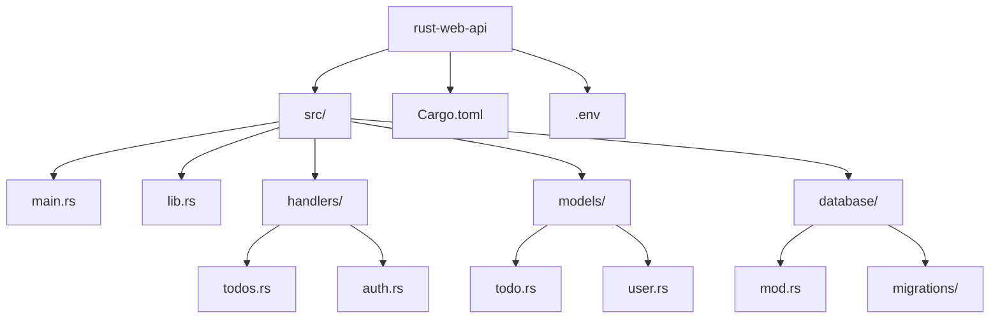
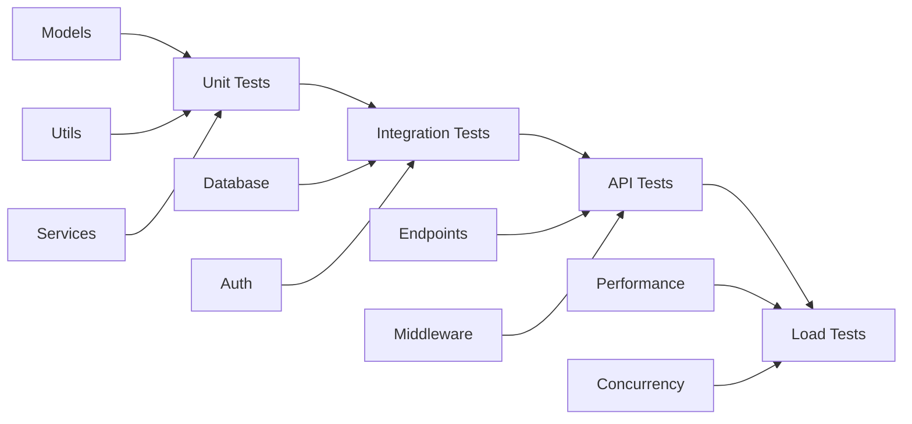

# Bài 18: Web Development và Ecosystem

<div className="bg-gradient-to-r from-blue-50 to-indigo-100 p-6 rounded-lg border-l-4 border-indigo-500 mb-8">
  <h2 className="text-2xl font-bold text-indigo-800 mb-2">🎯 Mục tiêu bài học</h2>
  <div className="text-indigo-700">
    Học cách phát triển web application với Rust và khám phá hệ sinh thái Rust phong phú. 
    Xây dựng REST API hoàn chỉnh với database integration.
  </div>
</div>

## 📚 Tổng quan nội dung

Trong bài học cuối cùng này, chúng ta sẽ:
- So sánh các web framework phổ biến trong Rust
- Xây dựng REST API với Axum framework
- Tích hợp database với SQLx
- Implement authentication và middleware
- Khám phá hệ sinh thái Rust rộng lớn

## 🌐 So sánh các Web Framework

### Bảng so sánh các framework phổ biến

| Framework | Performance | Learning Curve | Ecosystem | Use Case |
|-----------|------------|----------------|-----------|----------|
| **Axum** | Rất cao | Trung bình | Tokio | Modern async APIs |
| **Actix-web** | Rất cao | Khó | Riêng biệt | High-performance apps |
| **Rocket** | Cao | Dễ | Ổn định | Rapid prototyping |
| **Warp** | Cao | Khó | Tokio | Functional style |

<div className="bg-yellow-50 border border-yellow-200 rounded-lg p-4 mb-6">
  <h4 className="text-yellow-800 font-semibold mb-2">💡 Khuyến nghị</h4>
  <div className="text-yellow-700">
    Chúng ta sẽ sử dụng <strong>Axum</strong> trong bài này vì nó có cú pháp đơn giản, 
    performance cao và tích hợp tốt với Tokio ecosystem.
  </div>
</div>

## 🏗️ Thiết lập Project Web API

### Cấu trúc project



### Dependencies trong Cargo.toml

```toml
[package]
name = "rust-web-api"
version = "0.1.0"
edition = "2021"

[dependencies]
# Web framework
axum = "0.7"
tokio = { version = "1.0", features = ["full"] }
tower = "0.4"
tower-http = { version = "0.5", features = ["fs", "cors"] }

# Serialization
serde = { version = "1.0", features = ["derive"] }
serde_json = "1.0"

# Database
sqlx = { version = "0.7", features = ["runtime-tokio-rustls", "postgres", "uuid", "time"] }

# Authentication
jsonwebtoken = "9.0"
bcrypt = "0.15"

# Environment & Logging  
dotenv = "0.15"
tracing = "0.1"
tracing-subscriber = "0.3"

# Error handling
anyhow = "1.0"
thiserror = "1.0"

# UUID
uuid = { version = "1.0", features = ["v4", "serde"] }
```

## 🗄️ Database Models và Schema

### User Model

```rust
use serde::{Deserialize, Serialize};
use sqlx::FromRow;
use uuid::Uuid;

#[derive(Debug, Clone, Serialize, Deserialize, FromRow)]
pub struct User {
    pub id: Uuid,
    pub username: String,
    pub email: String,
    pub password_hash: String,
    pub created_at: chrono::DateTime<chrono::Utc>,
}

#[derive(Debug, Deserialize)]
pub struct CreateUserRequest {
    pub username: String,
    pub email: String,
    pub password: String,
}

#[derive(Debug, Deserialize)]
pub struct LoginRequest {
    pub email: String,
    pub password: String,
}
```

### Todo Model

```rust
use serde::{Deserialize, Serialize};
use sqlx::FromRow;
use uuid::Uuid;

#[derive(Debug, Clone, Serialize, Deserialize, FromRow)]
pub struct Todo {
    pub id: Uuid,
    pub user_id: Uuid,
    pub title: String,
    pub description: Option<String>,
    pub completed: bool,
    pub created_at: chrono::DateTime<chrono::Utc>,
    pub updated_at: chrono::DateTime<chrono::Utc>,
}

#[derive(Debug, Deserialize)]
pub struct CreateTodoRequest {
    pub title: String,
    pub description: Option<String>,
}

#[derive(Debug, Deserialize)]
pub struct UpdateTodoRequest {
    pub title: Option<String>,
    pub description: Option<String>,
    pub completed: Option<bool>,
}
```

## 🔧 Database Integration

### Database Connection Setup

```rust
use sqlx::{PgPool, postgres::PgPoolOptions};
use std::env;

pub async fn create_pool() -> Result<PgPool, sqlx::Error> {
    let database_url = env::var("DATABASE_URL")
        .expect("DATABASE_URL must be set");
    
    PgPoolOptions::new()
        .max_connections(20)
        .connect(&database_url)
        .await
}

pub async fn run_migrations(pool: &PgPool) -> Result<(), sqlx::migrate::MigrateError> {
    sqlx::migrate!("./migrations").run(pool).await
}
```

### Database Migrations

**Migration 001_create_users_table.sql:**
```sql
CREATE EXTENSION IF NOT EXISTS "uuid-ossp";

CREATE TABLE users (
    id UUID PRIMARY KEY DEFAULT uuid_generate_v4(),
    username VARCHAR(100) UNIQUE NOT NULL,
    email VARCHAR(255) UNIQUE NOT NULL,
    password_hash VARCHAR(255) NOT NULL,
    created_at TIMESTAMPTZ DEFAULT NOW()
);
```

**Migration 002_create_todos_table.sql:**
```sql
CREATE TABLE todos (
    id UUID PRIMARY KEY DEFAULT uuid_generate_v4(),
    user_id UUID NOT NULL REFERENCES users(id) ON DELETE CASCADE,
    title VARCHAR(255) NOT NULL,
    description TEXT,
    completed BOOLEAN DEFAULT FALSE,
    created_at TIMESTAMPTZ DEFAULT NOW(),
    updated_at TIMESTAMPTZ DEFAULT NOW()
);

CREATE INDEX idx_todos_user_id ON todos(user_id);
```

## 🔐 Authentication System

### JWT Token Management

```rust
use jsonwebtoken::{decode, encode, DecodingKey, EncodingKey, Header, Validation};
use serde::{Deserialize, Serialize};
use uuid::Uuid;

#[derive(Debug, Serialize, Deserialize)]
pub struct Claims {
    pub sub: String, // user_id
    pub exp: usize,  // expiration time
    pub iat: usize,  // issued at
}

pub struct JwtService {
    encoding_key: EncodingKey,
    decoding_key: DecodingKey,
}

impl JwtService {
    pub fn new(secret: &str) -> Self {
        Self {
            encoding_key: EncodingKey::from_secret(secret.as_bytes()),
            decoding_key: DecodingKey::from_secret(secret.as_bytes()),
        }
    }
    
    pub fn generate_token(&self, user_id: Uuid) -> Result<String, jsonwebtoken::errors::Error> {
        let now = chrono::Utc::now();
        let claims = Claims {
            sub: user_id.to_string(),
            exp: (now + chrono::Duration::hours(24)).timestamp() as usize,
            iat: now.timestamp() as usize,
        };
        
        encode(&Header::default(), &claims, &self.encoding_key)
    }
    
    pub fn verify_token(&self, token: &str) -> Result<Claims, jsonwebtoken::errors::Error> {
        let token_data = decode::<Claims>(token, &self.decoding_key, &Validation::default())?;
        Ok(token_data.claims)
    }
}
```

### Authentication Middleware

```rust
use axum::{
    extract::{Request, State},
    http::{HeaderMap, StatusCode},
    middleware::Next,
    response::Response,
};
use uuid::Uuid;

pub async fn auth_middleware(
    State(jwt_service): State<Arc<JwtService>>,
    mut request: Request,
    next: Next,
) -> Result<Response, StatusCode> {
    let headers = request.headers();
    
    let token = extract_token_from_headers(headers)?;
    let claims = jwt_service
        .verify_token(&token)
        .map_err(|_| StatusCode::UNAUTHORIZED)?;
    
    let user_id = Uuid::parse_str(&claims.sub)
        .map_err(|_| StatusCode::UNAUTHORIZED)?;
    
    // Add user_id to request extensions
    request.extensions_mut().insert(user_id);
    
    Ok(next.run(request).await)
}

fn extract_token_from_headers(headers: &HeaderMap) -> Result<String, StatusCode> {
    headers
        .get("Authorization")
        .and_then(|auth_header| auth_header.to_str().ok())
        .and_then(|auth_str| {
            auth_str.strip_prefix("Bearer ")
        })
        .map(|token| token.to_string())
        .ok_or(StatusCode::UNAUTHORIZED)
}
```

## 🛣️ API Handlers

### Todo Handlers

```rust
use axum::{
    extract::{Path, Query, State},
    http::StatusCode,
    response::Json,
    Extension,
};
use uuid::Uuid;
use std::sync::Arc;

pub async fn create_todo(
    State(pool): State<Arc<PgPool>>,
    Extension(user_id): Extension<Uuid>,
    Json(payload): Json<CreateTodoRequest>,
) -> Result<Json<Todo>, StatusCode> {
    let todo = sqlx::query_as::<_, Todo>(
        r#"
        INSERT INTO todos (user_id, title, description)
        VALUES ($1, $2, $3)
        RETURNING *
        "#,
    )
    .bind(user_id)
    .bind(&payload.title)
    .bind(&payload.description)
    .fetch_one(&**pool)
    .await
    .map_err(|_| StatusCode::INTERNAL_SERVER_ERROR)?;

    Ok(Json(todo))
}

pub async fn get_todos(
    State(pool): State<Arc<PgPool>>,
    Extension(user_id): Extension<Uuid>,
    Query(params): Query<GetTodosQuery>,
) -> Result<Json<Vec<Todo>>, StatusCode> {
    let todos = sqlx::query_as::<_, Todo>(
        r#"
        SELECT * FROM todos 
        WHERE user_id = $1 
        AND ($2::boolean IS NULL OR completed = $2)
        ORDER BY created_at DESC
        LIMIT $3 OFFSET $4
        "#,
    )
    .bind(user_id)
    .bind(params.completed)
    .bind(params.limit.unwrap_or(50))
    .bind(params.offset.unwrap_or(0))
    .fetch_all(&**pool)
    .await
    .map_err(|_| StatusCode::INTERNAL_SERVER_ERROR)?;

    Ok(Json(todos))
}

#[derive(Deserialize)]
pub struct GetTodosQuery {
    completed: Option<bool>,
    limit: Option<i64>,
    offset: Option<i64>,
}
```

## 🌐 Application Setup

### Main Application

```rust
use axum::{
    middleware,
    routing::{get, post, put, delete},
    Router,
};
use tower_http::cors::CorsLayer;
use std::sync::Arc;
use tracing_subscriber;

#[tokio::main]
async fn main() -> Result<(), Box<dyn std::error::Error>> {
    // Initialize tracing
    tracing_subscriber::init();
    
    // Load environment variables
    dotenv::dotenv().ok();
    
    // Create database pool
    let pool = Arc::new(create_pool().await?);
    run_migrations(&pool).await?;
    
    // Create JWT service
    let jwt_secret = std::env::var("JWT_SECRET")?;
    let jwt_service = Arc::new(JwtService::new(&jwt_secret));
    
    // Build application routes
    let app = create_router(pool, jwt_service);
    
    // Start server
    let listener = tokio::net::TcpListener::bind("0.0.0.0:3000").await?;
    println!("Server running on http://0.0.0.0:3000");
    
    axum::serve(listener, app).await?;
    
    Ok(())
}

fn create_router(
    pool: Arc<PgPool>, 
    jwt_service: Arc<JwtService>
) -> Router {
    // Public routes
    let public_routes = Router::new()
        .route("/auth/register", post(handlers::auth::register))
        .route("/auth/login", post(handlers::auth::login))
        .with_state((pool.clone(), jwt_service.clone()));
    
    // Protected routes  
    let protected_routes = Router::new()
        .route("/todos", get(handlers::todos::get_todos))
        .route("/todos", post(handlers::todos::create_todo))
        .route("/todos/:id", put(handlers::todos::update_todo))
        .route("/todos/:id", delete(handlers::todos::delete_todo))
        .layer(middleware::from_fn_with_state(
            jwt_service.clone(),
            auth_middleware
        ))
        .with_state(pool);
    
    Router::new()
        .merge(public_routes)
        .merge(protected_routes)
        .layer(CorsLayer::permissive())
        .route("/health", get(health_check))
}

async fn health_check() -> &'static str {
    "OK"
}
```

## 🎨 API Response Patterns

### Standardized Response Types

| Status Code | Usage | Response Format |
|-------------|-------|----------------|
| 200 | Success | `{"data": {...}}` |
| 201 | Created | `{"data": {...}, "message": "Created"}` |
| 400 | Bad Request | `{"error": "Invalid input"}` |
| 401 | Unauthorized | `{"error": "Authentication required"}` |
| 404 | Not Found | `{"error": "Resource not found"}` |
| 500 | Server Error | `{"error": "Internal server error"}` |

```rust
use serde::Serialize;

#[derive(Serialize)]
pub struct ApiResponse<T> {
    pub data: Option<T>,
    pub message: Option<String>,
    pub error: Option<String>,
}

impl<T> ApiResponse<T> {
    pub fn success(data: T) -> Self {
        Self {
            data: Some(data),
            message: None,
            error: None,
        }
    }
    
    pub fn error(message: String) -> ApiResponse<()> {
        ApiResponse {
            data: None,
            message: None,
            error: Some(message),
        }
    }
}
```

## 🧪 Testing Strategy

### API Testing Flow



### Test Example

```rust
#[cfg(test)]
mod tests {
    use super::*;
    use axum_test::TestServer;
    
    #[tokio::test]
    async fn test_create_todo() {
        let app = create_test_app().await;
        let server = TestServer::new(app).unwrap();
        
        // Register and login user
        let login_response = server
            .post("/auth/login")
            .json(&serde_json::json!({
                "email": "test@example.com",
                "password": "password123"
            }))
            .await;
        
        let token = login_response
            .json::<serde_json::Value>()
            .data["token"].as_str().unwrap();
        
        // Create todo
        let response = server
            .post("/todos")
            .add_header("Authorization", format!("Bearer {}", token))
            .json(&serde_json::json!({
                "title": "Test Todo",
                "description": "Test Description"
            }))
            .await;
            
        assert_eq!(response.status_code(), 201);
    }
}
```

## 🌟 Khám phá Rust Ecosystem

### CLI Development với Clap

```rust
use clap::{Arg, Command};

fn main() {
    let matches = Command::new("rust-cli")
        .version("1.0")
        .author("Your Name")
        .about("A CLI tool built with Rust")
        .arg(
            Arg::new("input")
                .short('i')
                .long("input")
                .value_name("FILE")
                .help("Input file")
        )
        .arg(
            Arg::new("verbose")
                .short('v')
                .long("verbose")
                .action(clap::ArgAction::Count)
                .help("Increase verbosity")
        )
        .get_matches();
        
    if let Some(input_file) = matches.get_one::<String>("input") {
        println!("Processing file: {}", input_file);
    }
    
    match matches.get_count("verbose") {
        0 => println!("No verbose output"),
        1 => println!("Some verbose output"),
        _ => println!("Very verbose output"),
    }
}
```

### WebAssembly Integration

<div className="bg-green-50 border border-green-200 rounded-lg p-4 mb-6">
  <h4 className="text-green-800 font-semibold mb-2">🚀 WebAssembly với Rust</h4>
  <div className="text-green-700">
    Rust có khả năng compile sang WebAssembly xuất sắc, cho phép chạy code Rust trong browser với performance gần native.
  </div>
</div>

```rust
use wasm_bindgen::prelude::*;

// Import `console.log` function from browser
#[wasm_bindgen]
extern "C" {
    #[wasm_bindgen(js_namespace = console)]
    fn log(s: &str);
}

// Define a macro for easier logging
macro_rules! console_log {
    ($($t:tt)*) => (log(&format_args!($($t)*).to_string()))
}

#[wasm_bindgen]
pub fn greet(name: &str) {
    console_log!("Hello, {}!", name);
}

#[wasm_bindgen]
pub fn fibonacci(n: u32) -> u32 {
    match n {
        0 | 1 => n,
        _ => fibonacci(n - 1) + fibonacci(n - 2),
    }
}
```

## 📊 Ecosystem Overview

### Popular Crates by Category

<div className="overflow-x-auto">
  <table className="min-w-full bg-white border border-gray-300 rounded-lg">
    <thead className="bg-gray-50">
      <tr>
        <th className="px-6 py-3 text-left text-xs font-medium text-gray-500 uppercase tracking-wider">Category</th>
        <th className="px-6 py-3 text-left text-xs font-medium text-gray-500 uppercase tracking-wider">Popular Crates</th>
        <th className="px-6 py-3 text-left text-xs font-medium text-gray-500 uppercase tracking-wider">Use Case</th>
      </tr>
    </thead>
    <tbody className="bg-white divide-y divide-gray-200">
      <tr>
        <td className="px-6 py-4 whitespace-nowrap font-medium text-gray-900">Web Development</td>
        <td className="px-6 py-4 text-sm text-gray-500">axum, actix-web, rocket, warp</td>
        <td className="px-6 py-4 text-sm text-gray-500">REST APIs, Web Services</td>
      </tr>
      <tr className="bg-gray-50">
        <td className="px-6 py-4 whitespace-nowrap font-medium text-gray-900">Database</td>
        <td className="px-6 py-4 text-sm text-gray-500">sqlx, diesel, sea-orm</td>
        <td className="px-6 py-4 text-sm text-gray-500">Database Integration</td>
      </tr>
      <tr>
        <td className="px-6 py-4 whitespace-nowrap font-medium text-gray-900">CLI Tools</td>
        <td className="px-6 py-4 text-sm text-gray-500">clap, structopt, dialoguer</td>
        <td className="px-6 py-4 text-sm text-gray-500">Command Line Applications</td>
      </tr>
      <tr className="bg-gray-50">
        <td className="px-6 py-4 whitespace-nowrap font-medium text-gray-900">GUI</td>
        <td className="px-6 py-4 text-sm text-gray-500">tauri, iced, egui, druid</td>
        <td className="px-6 py-4 text-sm text-gray-500">Desktop Applications</td>
      </tr>
      <tr>
        <td className="px-6 py-4 whitespace-nowrap font-medium text-gray-900">Game Dev</td>
        <td className="px-6 py-4 text-sm text-gray-500">bevy, amethyst, ggez</td>
        <td className="px-6 py-4 text-sm text-gray-500">Game Development</td>
      </tr>
      <tr className="bg-gray-50">
        <td className="px-6 py-4 whitespace-nowrap font-medium text-gray-900">Crypto</td>
        <td className="px-6 py-4 text-sm text-gray-500">ring, rustls, sha2, aes</td>
        <td className="px-6 py-4 text-sm text-gray-500">Cryptography, Security</td>
      </tr>
    </tbody>
  </table>
</div>

## 🚀 Deployment Strategies

### Docker Containerization

```dockerfile
# Multi-stage build for smaller image
FROM rust:1.75 as builder

WORKDIR /app
COPY . .
RUN cargo build --release

FROM debian:bookworm-slim
RUN apt-get update && apt-get install -y \
    ca-certificates \
    && rm -rf /var/lib/apt/lists/*

COPY --from=builder /app/target/release/rust-web-api /usr/local/bin/rust-web-api

EXPOSE 3000
CMD ["rust-web-api"]
```

### Performance Optimization Tips

| Technique | Impact | Implementation |
|-----------|---------|----------------|
| **Connection Pooling** | High | SQLx pool với proper sizing |
| **Async I/O** | High | Tokio runtime optimization |
| **Caching** | Medium | Redis integration |
| **Compression** | Medium | gzip middleware |
| **Database Indexing** | High | Proper SQL indexes |

<div className="bg-blue-50 border border-blue-200 rounded-lg p-6 mb-6">
  <h3 className="text-blue-800 font-bold text-lg mb-4">🏆 Project: Todo API hoàn chỉnh</h3>
  
  <div className="space-y-4">
    <div>
      <h4 className="font-semibold text-blue-700">Phase 1: Basic API</h4>
      <ul className="list-disc list-inside text-blue-600 ml-4">
        <li>Setup project với Axum và SQLx</li>
        <li>Implement CRUD operations cho todos</li>
        <li>Add user authentication với JWT</li>
      </ul>
    </div>
    
    <div>
      <h4 className="font-semibold text-blue-700">Phase 2: Advanced Features</h4>
      <ul className="list-disc list-inside text-blue-600 ml-4">
        <li>Add todo categories và tags</li>
        <li>Implement search và filtering</li>
        <li>Add file upload functionality</li>
      </ul>
    </div>
    
    <div>
      <h4 className="font-semibold text-blue-700">Phase 3: Production Ready</h4>
      <ul className="list-disc list-inside text-blue-600 ml-4">
        <li>Add comprehensive error handling</li>
        <li>Implement rate limiting</li>
        <li>Add logging và monitoring</li>
        <li>Write tests và setup CI/CD</li>
      </ul>
    </div>
  </div>
</div>

## 🎓 Tổng kết

Trong bài học này, chúng ta đã:

✅ **Mastered Web Development:** Xây dựng REST API hoàn chỉnh với Axum  
✅ **Database Integration:** Sử dụng SQLx cho database operations  
✅ **Security Implementation:** JWT authentication và middleware  
✅ **Ecosystem Exploration:** Khám phá các crates và use cases khác nhau  
✅ **Production Readiness:** Error handling, testing, và deployment  

<div className="bg-gradient-to-r from-green-50 to-emerald-100 p-6 rounded-lg border-l-4 border-green-500">
  <h3 className="text-green-800 font-bold text-lg mb-2">🎉 Chúc mừng!</h3>
  <div className="text-green-700 mb-2">
    Bạn đã hoàn thành khóa học Rust! Giờ đây bạn có kiến thức vững chắc để:
  </div>
  <ul className="list-disc list-inside text-green-600 mt-2 space-y-1">
    <li>Phát triển web applications với Rust</li>
    <li>Xây dựng CLI tools và system programs</li>
    <li>Khám phá game development, GUI apps, và WebAssembly</li>
    <li>Contribute vào các open source projects</li>
  </ul>
</div>

## 📚 Bước tiếp theo

1. **Practice Projects:** Xây dựng các project thực tế
2. **Open Source:** Contribute vào Rust community
3. **Specialized Learning:** Game dev, embedded, blockchain
4. **Performance Optimization:** Advanced async patterns, unsafe Rust

---

<div className="text-center text-gray-600 text-sm mt-8">
  <div>🦀 <strong>The journey with Rust continues...</strong> 🦀</div>
</div>