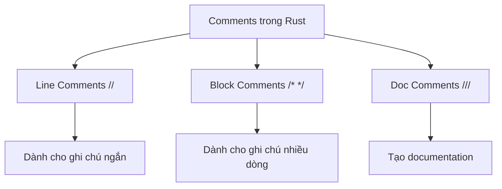
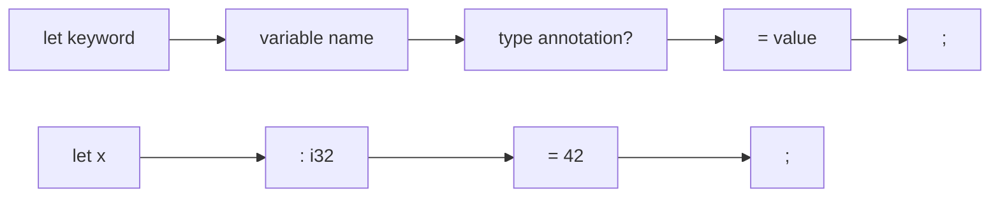
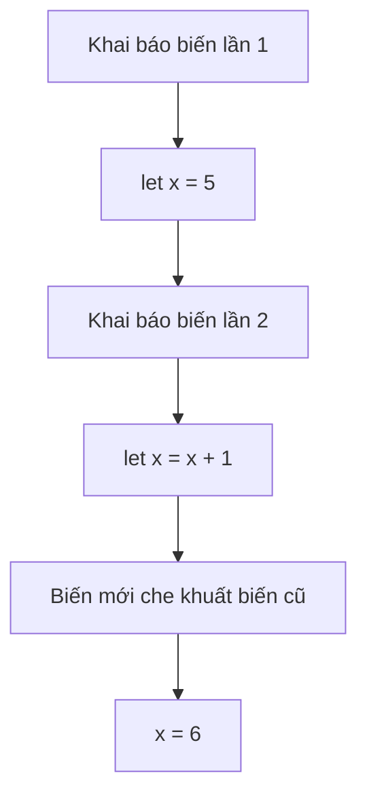
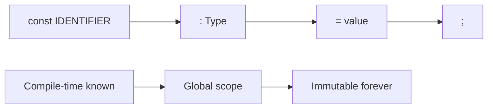
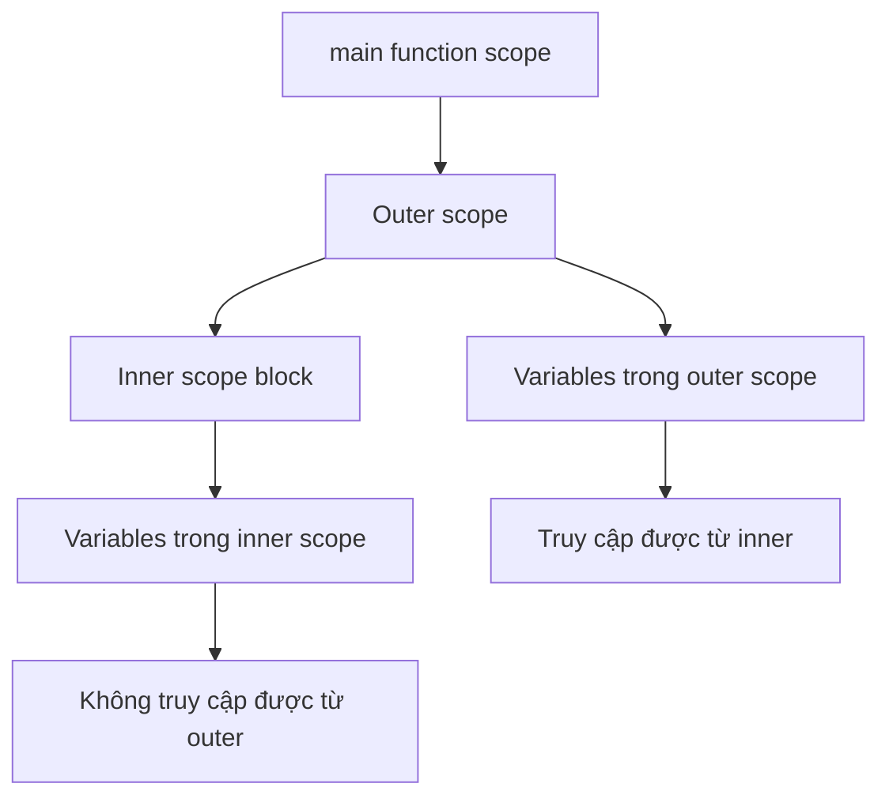

# BÀI 2: CÚ PHÁP CƠ BẢN VÀ BIẾN TRONG RUST

## 🎯 MỤC TIÊU BÀI HỌC

<div className="border-l-4 border-blue-500 pl-4 my-4">
<p className="text-lg font-medium">Nắm vững cú pháp cơ bản và cách làm việc với biến trong Rust</p>
</div>

Sau bài học này, bạn sẽ có thể:

- Hiểu cú pháp cơ bản của Rust
- Khai báo và sử dụng biến hiệu quả
- Phân biệt giữa immutable và mutable variables
- Sử dụng shadowing và constants
- Hiểu về scope và lifetime cơ bản

---

## 1. CÚ PHÁP CƠ BẢN

### 1.1 Comments (Ghi chú)



| Loại Comment  | Cú pháp | Mục đích sử dụng      |
| ------------- | ------- | --------------------- |
| Line Comment  | `//`    | Ghi chú một dòng      |
| Block Comment | `/* */` | Ghi chú nhiều dòng    |
| Doc Comment   | `///`   | Tạo documentation     |
| Inner Doc     | `//!`   | Document module/crate |

### 1.2 Statements vs Expressions

<div className="grid grid-cols-1 md:grid-cols-2 gap-4 my-6">
<div className="border border-gray-300 rounded-lg p-4">
<h4 className="font-bold text-blue-600 mb-2">📋 Statements</h4>
<p>Thực hiện action nhưng không trả về giá trị</p>
<ul className="list-disc ml-4">
<li>Khai báo biến</li>
<li>Function definitions</li>
<li>Kết thúc bằng dấu ;</li>
</ul>
</div>
<div className="border border-gray-300 rounded-lg p-4">
<h4 className="font-bold text-green-600 mb-2">🔄 Expressions</h4>
<p>Evaluate thành một giá trị cụ thể</p>
<ul className="list-disc ml-4">
<li>Math operations</li>
<li>Function calls</li>
<li>Block expressions</li>
</ul>
</div>
</div>

**Ví dụ:**

```rust copy
fn main() {
    let x = 5; // Statement
    let y = {  // Expression block
        let a = 3;
        a + 1  // Expression (no semicolon)
    }; // y = 4
}
```

---

## 2. BIẾN TRONG RUST

### 2.1 Khai báo biến với `let`



**Đặc điểm chính của biến trong Rust:**

| Đặc điểm                 | Mô tả                                     | Ví dụ                 |
| ------------------------ | ----------------------------------------- | --------------------- |
| **Immutable by default** | Biến mặc định không thể thay đổi          | `let x = 5;`          |
| **Type inference**       | Rust tự suy luận kiểu dữ liệu             | `let name = "Alice";` |
| **Explicit typing**      | Có thể chỉ định kiểu rõ ràng              | `let age: u32 = 25;`  |
| **Must be initialized**  | Biến phải được khởi tạo trước khi sử dụng | `let x = 10;` ✅      |

### 2.2 Immutability (Tính bất biến)

<div className="border border-red-200 rounded-lg p-4 my-4">
<h4 className="text-red-600 font-semibold">⚠️ Lưu ý quan trọng</h4>
<p>Trong Rust, biến mặc định là <strong>immutable</strong> (bất biến). Đây là tính năng bảo mật giúp tránh bugs.</p>
</div>

```rust copy
fn main() {
    let x = 5;
    println!("Giá trị x: {}", x);
    // x = 6; // ❌ LỖI: cannot assign twice to immutable variable
}
```

### 2.3 Mutable Variables với `mut`

Để tạo biến có thể thay đổi, sử dụng từ khóa `mut`:

```rust copy
fn main() {
    let mut x = 5;
    println!("Giá trị x ban đầu: {}", x);
    x = 6; // ✅ OK
    println!("Giá trị x sau khi thay đổi: {}", x);
}
```

| Loại biến | Cú pháp          | Có thể thay đổi? | Use case         |
| --------- | ---------------- | ---------------- | ---------------- |
| Immutable | `let x = 5;`     | ❌ Không         | Giá trị cố định  |
| Mutable   | `let mut x = 5;` | ✅ Có            | Giá trị thay đổi |

---

## 3. SHADOWING (CHE KHUẤT BIẾN)

### 3.1 Khái niệm Shadowing



**Shadowing** cho phép tái sử dụng tên biến với giá trị hoặc kiểu mới:

```rust copy
fn main() {
    let x = 5;           // x = 5 (i32)
    let x = x + 1;       // x = 6 (i32) - shadowing
    let x = x * 2;       // x = 12 (i32) - shadowing again

    {
        let x = x + 3;   // x = 15 trong scope này
        println!("Trong scope: {}", x); // 15
    }

    println!("Ngoài scope: {}", x); // 12
}
```

### 3.2 Shadowing vs Mutation

<div className="overflow-x-auto">
<table className="min-w-full border border-gray-300">
<thead className="bg-gray-50">
<tr>
<th className="border border-gray-300 px-4 py-2 text-left">Tiêu chí</th>
<th className="border border-gray-300 px-4 py-2 text-left">Shadowing</th>
<th className="border border-gray-300 px-4 py-2 text-left">Mutation</th>
</tr>
</thead>
<tbody>
<tr>
<td className="border border-gray-300 px-4 py-2">Từ khóa cần thiết</td>
<td className="border border-gray-300 px-4 py-2"><code>let</code></td>
<td className="border border-gray-300 px-4 py-2"><code>mut</code></td>
</tr>
<tr>
<td className="border border-gray-300 px-4 py-2">Thay đổi kiểu dữ liệu</td>
<td className="border border-gray-300 px-4 py-2">✅ Được phép</td>
<td className="border border-gray-300 px-4 py-2">❌ Không được</td>
</tr>
<tr>
<td className="border border-gray-300 px-4 py-2">Tạo biến mới</td>
<td className="border border-gray-300 px-4 py-2">✅ Có</td>
<td className="border border-gray-300 px-4 py-2">❌ Không</td>
</tr>
<tr>
<td className="border border-gray-300 px-4 py-2">Performance</td>
<td className="border border-gray-300 px-4 py-2">Zero-cost</td>
<td className="border border-gray-300 px-4 py-2">Zero-cost</td>
</tr>
</tbody>
</table>
</div>

**Ví dụ shadowing với thay đổi kiểu:**

```rust copy
let spaces = "   ";      // &str type
let spaces = spaces.len(); // usize type - OK với shadowing!

// Với mut sẽ lỗi:
// let mut spaces = "   ";
// spaces = spaces.len(); // ❌ LỖI: khác kiểu dữ liệu
```

---

## 4. CONSTANTS VÀ STATIC VARIABLES

### 4.1 Constants với `const`



| Đặc điểm          | Constants         | Variables    |
| ----------------- | ----------------- | ------------ |
| Từ khóa           | `const`           | `let`        |
| Phạm vi           | Toàn cục          | Theo scope   |
| Thay đổi được     | ❌ Không bao giờ  | ✅ Với `mut` |
| Kiểu dữ liệu      | Bắt buộc chỉ định | Có thể infer |
| Naming convention | UPPER_SNAKE_CASE  | snake_case   |

```rust copy
const MAX_POINTS: u32 = 100_000;
const PI: f64 = 3.14159;

fn main() {
    const PROGRAM_NAME: &str = "Rust Learner";
    println!("Max points: {}", MAX_POINTS);
}
```

### 4.2 Static Variables

```rust copy
static HELLO_WORLD: &str = "Hello, world!";
static mut COUNTER: usize = 0; // Unsafe để modify

fn main() {
    println!("{}", HELLO_WORLD);
}
```

---

## 5. SCOPE VÀ LIFETIME CƠ BẢN

### 5.1 Variable Scope



```rust copy
fn main() {
    let x = 5; // x có scope trong main function

    {
        let y = 10; // y chỉ có scope trong block này
        println!("x: {}, y: {}", x, y); // OK: cả x và y đều accessible
    } // y bị dropped ở đây

    println!("x: {}", x); // OK: x vẫn trong scope
    // println!("y: {}", y); // ❌ LỖI: y đã out of scope
}
```

### 5.2 Variable Lifecycle

<div className="border border-blue-200 rounded-lg p-4 my-4">
<h4 className="text-blue-600 font-semibold">🔄 Vòng đời của biến</h4>
<ol className="list-decimal ml-4">
<li><strong>Creation:</strong> Biến được tạo khi gặp <code>let</code></li>
<li><strong>Usage:</strong> Biến có thể được sử dụng trong scope</li>
<li><strong>Drop:</strong> Biến tự động bị giải phóng khi ra khỏi scope</li>
</ol>
</div>

---

## 6. THỰC HÀNH: CHƯƠNG TRÌNH TÍNH TOÁN

```rust copy
fn main() {
    // Constants
    const TAX_RATE: f64 = 0.1;
    const DISCOUNT_THRESHOLD: f64 = 1000.0;

    // Immutable variables
    let product_name = "Laptop";
    let base_price = 1200.0;

    // Mutable variable
    let mut final_price = base_price;

    // Apply discount if over threshold
    if base_price > DISCOUNT_THRESHOLD {
        final_price = final_price * 0.9; // 10% discount
        println!("Áp dụng giảm giá 10%");
    }

    // Calculate tax
    let tax_amount = final_price * TAX_RATE;
    final_price = final_price + tax_amount;

    // Shadowing for different representation
    let final_price = (final_price * 100.0).round() / 100.0; // Round to 2 decimals

    // Display results
    println!("Sản phẩm: {}", product_name);
    println!("Giá gốc: ${:.2}", base_price);
    println!("Thuế: ${:.2}", tax_amount);
    println!("Giá cuối: ${:.2}", final_price);
}
```

---

## 7. BÀI TẬP THỰC HÀNH

### Bài tập 1: Temperature Converter

Viết chương trình chuyển đổi nhiệt độ từ Celsius sang Fahrenheit và ngược lại.

### Bài tập 2: Simple Interest Calculator

Tạo chương trình tính lãi suất đơn giản với các biến immutable và mutable.

### Bài tập 3: Variable Scope Explorer

Thực hành với scopes khác nhau và quan sát lifetime của biến.

---

## 📚 TÓM TẮT BÀI HỌC

<div className="grid grid-cols-1 md:grid-cols-2 gap-4 my-6">
<div className="border border-green-200 rounded-lg p-4">
<h4 className="text-green-600 font-semibold mb-2">✅ Đã học được</h4>
<ul className="list-disc ml-4 space-y-1">
<li>Cú pháp cơ bản: comments, statements vs expressions</li>
<li>Khai báo biến với <code>let</code></li>
<li>Immutability by default và sử dụng <code>mut</code></li>
<li>Shadowing variables</li>
<li>Constants và static variables</li>
<li>Scope và variable lifetime</li>
</ul>
</div>
<div className="border border-blue-200 rounded-lg p-4">
<h4 className="text-blue-600 font-semibold mb-2">🎯 Bài tiếp theo</h4>
<ul className="list-disc ml-4 space-y-1">
<li>Kiểu dữ liệu cơ bản (scalar types)</li>
<li>Compound types (tuples, arrays)</li>
<li>Type inference và type casting</li>
<li>Memory management cơ bản</li>
</ul>
</div>
</div>

---

## 🔗 TÀI LIỆU THAM KHẢO

- [The Rust Programming Language - Variables](https://doc.rust-lang.org/book/ch03-01-variables-and-mutability.html)
- [Rust by Example - Variables](https://doc.rust-lang.org/rust-by-example/variable_bindings.html)
- [Rustlings Exercises](https://github.com/rust-lang/rustlings)
