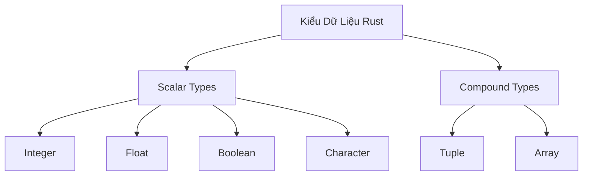
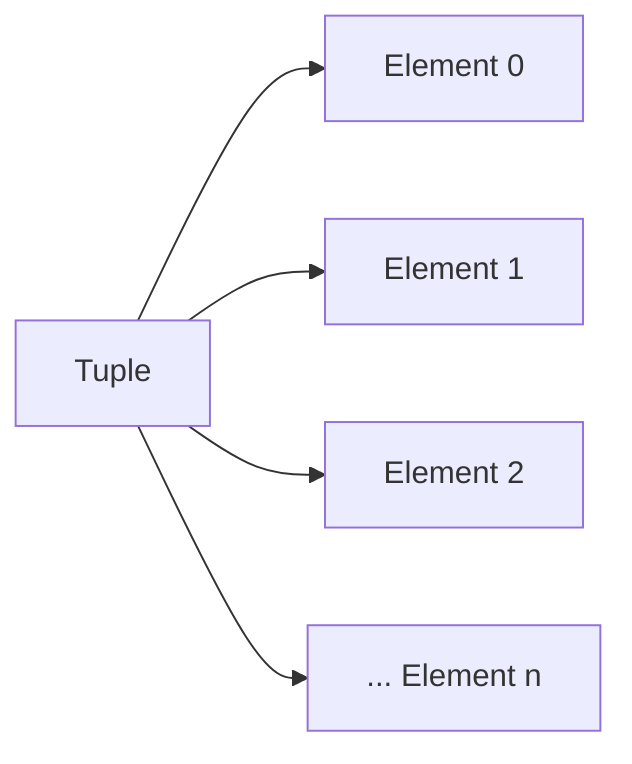
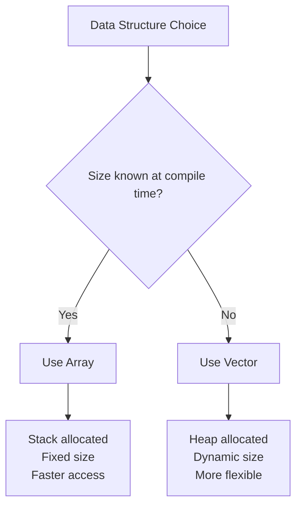

# Bài 3: Kiểu Dữ Liệu Cơ Bản

<div className="bg-blue-50 p-6 rounded-lg border-l-4 border-blue-400 mb-8">
  <h2 className="text-xl font-bold text-blue-800 mb-2">🎯 Mục Tiêu Bài Học</h2>
  <div className="text-blue-700">Làm chủ các kiểu dữ liệu scalar và compound trong Rust, hiểu cách Rust quản lý memory và thực hiện type checking.</div>
</div>

## 📚 Tổng Quan

Rust là ngôn ngữ **statically typed**, nghĩa là tất cả các biến phải có kiểu dữ liệu được xác định tại compile time. Rust có hai loại kiểu dữ liệu chính:
- **Scalar types**: Đại diện cho một giá trị đơn
- **Compound types**: Nhóm nhiều giá trị thành một kiểu



## 🔢 Scalar Types

### Integer Types

Rust cung cấp nhiều kiểu số nguyên với kích thước và dấu khác nhau:

| Độ dài | Signed | Unsigned |
|---------|---------|-----------|
| 8-bit | `i8` | `u8` |
| 16-bit | `i16` | `u16` |
| 32-bit | `i32` | `u32` |
| 64-bit | `i64` | `u64` |
| 128-bit | `i128` | `u128` |
| arch | `isize` | `usize` |

<div className="bg-yellow-50 p-4 rounded-lg border-l-4 border-yellow-400 my-4">
  <h4 className="font-bold text-yellow-800">💡 Lưu Ý</h4>
  <div className="text-yellow-700">
    • <code>isize</code> và <code>usize</code> phụ thuộc vào kiến trúc máy (32-bit hoặc 64-bit)<br/>
    • Kiểu mặc định cho integer là <code>i32</code><br/>
    • Sử dụng <code>usize</code> cho indexing
  </div>
</div>

#### Các Cách Viết Integer Literals

| Định dạng | Ví dụ |
|-----------|--------|
| Decimal | `98_222` |
| Hex | `0xff` |
| Octal | `0o77` |
| Binary | `0b1111_0000` |
| Byte (u8 only) | `b'A'` |

```rust
fn main() {
    // Các cách khai báo integer
    let decimal = 98_222;
    let hex = 0xff;
    let octal = 0o77;
    let binary = 0b1111_0000;
    let byte = b'A';
    
    // Type annotation
    let x: u8 = 255;
    let y: i32 = -100_000;
}
```

### Float Types

Rust có hai kiểu số thực:

| Kiểu | Kích thước | Độ chính xác |
|------|------------|---------------|
| `f32` | 32-bit | Single precision |
| `f64` | 64-bit | Double precision |

<div className="bg-green-50 p-4 rounded-lg border-l-4 border-green-400 my-4">
  <h4 className="font-bold text-green-800">✅ Best Practice</h4>
  <div className="text-green-700">
    Mặc định sử dụng <code>f64</code> vì tốc độ tương tự <code>f32</code> nhưng độ chính xác cao hơn.
  </div>
</div>

```rust
fn main() {
    let x = 2.0; // f64 mặc định
    let y: f32 = 3.0; // f32 explicit
    
    // Floating point operations
    let sum = x + y as f64;
    let difference = 95.5 - 4.3;
    let product = 4.0 * 30.0;
    let quotient = 56.7 / 32.2;
}
```

### Boolean Type

```rust
fn main() {
    let t = true;
    let f: bool = false; // với type annotation
    
    // Boolean operations
    let is_greater = 5 > 3;  // true
    let is_equal = 4 == 4;   // true
}
```

### Character Type

Kiểu `char` trong Rust là Unicode Scalar Value (4 bytes):

```rust
fn main() {
    let c = 'z';
    let z: char = 'ℤ'; // với type annotation
    let heart_eyed_cat = '😻';
    
    println!("Character: {}", c);
    println!("Unicode: {}", z);
    println!("Emoji: {}", heart_eyed_cat);
}
```

## 🔗 Compound Types

### Tuples

Tuple nhóm các giá trị có kiểu khác nhau thành một compound type:



```rust
fn main() {
    // Khai báo tuple
    let tup: (i32, f64, u8) = (500, 6.4, 1);
    
    // Destructuring
    let (x, y, z) = tup;
    println!("x: {}, y: {}, z: {}", x, y, z);
    
    // Access bằng index
    let five_hundred = tup.0;
    let six_point_four = tup.1;
    let one = tup.2;
    
    // Empty tuple (unit type)
    let unit = ();
}
```

#### Ứng Dụng Thực Tế của Tuple

| Use Case | Ví dụ |
|----------|-------|
| Return multiple values | `fn get_name_age() -> (String, u8)` |
| Coordinate system | `(x: f64, y: f64)` |
| RGB colors | `(r: u8, g: u8, b: u8)` |

### Arrays

Array có fixed size và tất cả elements cùng kiểu:

```rust
fn main() {
    // Khai báo array
    let a = [1, 2, 3, 4, 5];
    let months = ["January", "February", "March"];
    
    // Type annotation
    let a: [i32; 5] = [1, 2, 3, 4, 5];
    
    // Initialize với giá trị giống nhau
    let a = [3; 5]; // [3, 3, 3, 3, 3]
    
    // Access elements
    let first = a[0];
    let second = a[1];
}
```

#### So Sánh Array vs Vector

| Đặc điểm | Array | Vector |
|----------|-------|---------|
| Size | Fixed tại compile time | Dynamic |
| Memory | Stack | Heap |
| Performance | Faster access | Slower nhưng flexible |
| Use case | Known size | Unknown/changing size |



## 🔄 Type Inference và Type Annotation

### Type Inference

Rust có thể tự động suy luận kiểu dữ liệu:

```rust
fn main() {
    let x = 5; // Rust infer x là i32
    let y = 2.5; // Rust infer y là f64
    let is_ready = true; // Rust infer là bool
}
```

### Explicit Type Annotation

Khi cần thiết, chúng ta phải chỉ định kiểu rõ ràng:

```rust
fn main() {
    let guess: u32 = "42".parse().expect("Not a number!");
    let numbers: Vec<i32> = vec![1, 2, 3];
}
```

## 🔄 Type Casting

### Explicit Casting với `as`

```rust
fn main() {
    let x = 10i32;
    let y = 20u32;
    
    // Cast i32 to u32
    let sum = y + x as u32;
    
    // Float to integer (truncation)
    let pi = 3.14159f64;
    let integer_pi = pi as i32; // 3
    
    // Casting có thể mất dữ liệu
    let large_number = 300u16;
    let small_number = large_number as u8; // 44 (300 - 256)
}
```

<div className="bg-red-50 p-4 rounded-lg border-l-4 border-red-400 my-4">
  <h4 className="font-bold text-red-800">⚠️ Cảnh Báo</h4>
  <div className="text-red-700">
    Type casting có thể gây mất dữ liệu hoặc overflow. Luôn kiểm tra bounds khi cần thiết.
  </div>
</div>

### Overflow Behavior

| Build Mode | Behavior |
|------------|----------|
| Debug | Panic khi overflow |
| Release | Two's complement wrapping |

```rust
fn main() {
    let mut x: u8 = 255;
    x += 1; // Debug: panic, Release: x = 0
    
    // Explicit wrapping
    let y = 255u8.wrapping_add(1); // 0
    let z = 255u8.saturating_add(1); // 255
    let (result, overflow) = 255u8.overflowing_add(1); // (0, true)
}
```

## 🧮 Thực Hành: Calculator Đơn Giản

Hãy xây dựng một calculator sử dụng các kiểu dữ liệu đã học:

```rust
fn main() {
    // Input values với different types
    let a: f64 = 10.5;
    let b: f64 = 3.2;
    let operation: char = '+';
    
    // Calculations
    let result = match operation {
        '+' => a + b,
        '-' => a - b,
        '*' => a * b,
        '/' => {
            if b != 0.0 {
                a / b
            } else {
                f64::NAN
            }
        },
        _ => {
            println!("Unknown operation: {}", operation);
            f64::NAN
        }
    };
    
    // Display result
    println!("{} {} {} = {}", a, operation, b, result);
    
    // Type casting example
    let integer_result = result as i32;
    println!("Integer result: {}", integer_result);
    
    // Working với tuples
    let calculation: (f64, char, f64, f64) = (a, operation, b, result);
    println!("Calculation tuple: {:?}", calculation);
    
    // Array of results
    let results: [f64; 4] = [
        a + b,
        a - b,
        a * b,
        if b != 0.0 { a / b } else { 0.0 }
    ];
    
    println!("All operations: {:?}", results);
}
```

## 📋 Bảng Tóm Tắt

### Memory Layout

| Type Category | Stack/Heap | Size |
|---------------|------------|------|
| Scalar types | Stack | Fixed, known at compile time |
| Tuples | Stack | Sum of all elements |
| Arrays | Stack | Element size × length |

### Type Conversion Methods

| Method | Description | Example |
|--------|-------------|---------|
| `as` | Explicit cast | `10i32 as u32` |
| `.into()` | Generic conversion | `"hello".into()` |
| `.from()` | Constructor conversion | `String::from("hello")` |
| `.parse()` | String to number | `"42".parse::<i32>()` |

<div className="bg-blue-50 p-6 rounded-lg border-l-4 border-blue-400 mt-8">
  <h2 className="text-xl font-bold text-blue-800 mb-2">📝 Tóm Tắt</h2>
  <ul className="text-blue-700 space-y-1">
    <li>• Rust có scalar types (integer, float, bool, char) và compound types (tuple, array)</li>
    <li>• Type inference mạnh mẽ nhưng đôi khi cần type annotation</li>
    <li>• Arrays có fixed size, tuples có thể chứa các kiểu khác nhau</li>
    <li>• Type casting cần cẩn thận với overflow và data loss</li>
    <li>• Memory safety được đảm bảo thông qua type system</li>
  </ul>
</div>

## 🚀 Bài Tập Thực Hành

1. **Cơ Bản**: Viết chương trình chuyển đổi nhiệt độ giữa Celsius và Fahrenheit
2. **Trung Bình**: Tạo một struct để represent một điểm 2D và tính khoảng cách
3. **Nâng Cao**: Implement một simple polynomial calculator sử dụng arrays

## 📖 Chuẩn Bị Cho Bài Tiếp Theo

Bài 4 sẽ học về **Control Flow và Functions** - cách điều khiển luồng chương trình và tạo functions tái sử dụng.