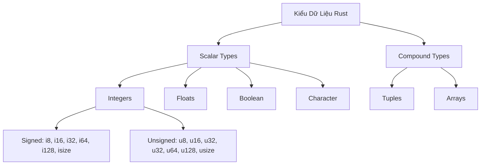
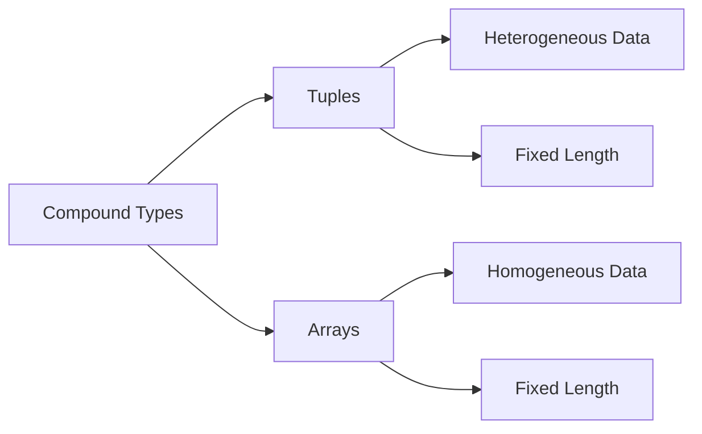
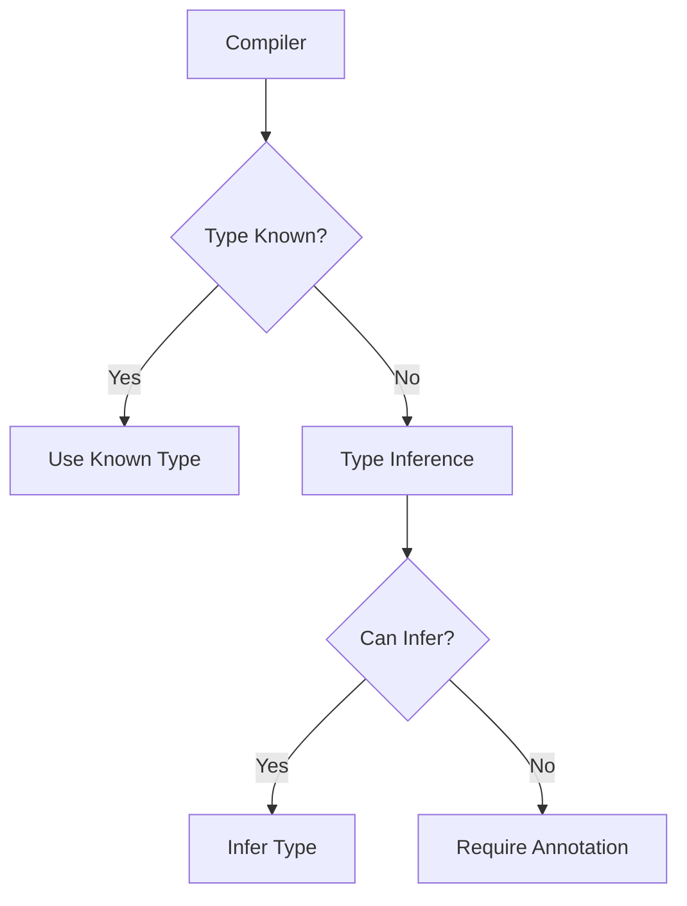

# BÀI 3: KIỂU DỮ LIỆU CƠ BẢN

<div className="bg-gradient-to-r from-blue-600 to-purple-600 text-white p-6 rounded-lg shadow-lg mb-8">
  <h2 className="text-2xl font-bold mb-2">🎯 MỤC TIÊU BÀI HỌC</h2>
  <p className="text-lg">Làm chủ các kiểu dữ liệu scalar và compound trong Rust để xây dựng nền tảng vững chắc cho việc lập trình hiệu quả</p>
</div>

## 📋 NỘI DUNG CHÍNH



---

## 🔢 1. SCALAR TYPES (KIỂU VÔ HƯỚNG)

### 1.1 Integer Types (Kiểu Số Nguyên)

<div className="bg-yellow-50 border-l-4 border-yellow-400 p-4 mb-6">
  <div className="flex">
    <div className="flex-shrink-0">
      <span className="text-2xl">💡</span>
    </div>
    <div className="ml-3">
      <p className="text-sm text-yellow-700">
        <strong>Lưu ý:</strong> Rust có hệ thống kiểu số nguyên rất phong phú với cả signed (có dấu) và unsigned (không dấu)
      </p>
    </div>
  </div>
</div>

| Kiểu | Kích thước | Phạm vi giá trị | Ví dụ |
|------|------------|----------------|-------|
| `i8` | 8 bit | -128 đến 127 | `let x: i8 = -42;` |
| `i16` | 16 bit | -32,768 đến 32,767 | `let y: i16 = 1000;` |
| `i32` | 32 bit | -2³¹ đến 2³¹-1 | `let z = 42;` (mặc định) |
| `i64` | 64 bit | -2⁶³ đến 2⁶³-1 | `let big: i64 = 1_000_000;` |
| `i128` | 128 bit | -2¹²⁷ đến 2¹²⁷-1 | `let huge: i128 = 123;` |
| `isize` | arch | Phụ thuộc kiến trúc | `let idx: isize = -1;` |

| Kiểu | Kích thước | Phạm vi giá trị | Ví dụ |
|------|------------|----------------|-------|
| `u8` | 8 bit | 0 đến 255 | `let byte: u8 = 255;` |
| `u16` | 16 bit | 0 đến 65,535 | `let port: u16 = 8080;` |
| `u32` | 32 bit | 0 đến 2³²-1 | `let count: u32 = 42;` |
| `u64` | 64 bit | 0 đến 2⁶⁴-1 | `let id: u64 = 12345;` |
| `u128` | 128 bit | 0 đến 2¹²⁸-1 | `let massive: u128 = 999;` |
| `usize` | arch | Phụ thuộc kiến trúc | `let len: usize = 10;` |

#### Ví dụ thực tế:

```rust copy
fn main() {
    // Integer literals với suffix
    let decimal = 98_222;          // Decimal
    let hex = 0xff;                // Hexadecimal
    let octal = 0o77;              // Octal
    let binary = 0b1111_0000;      // Binary
    let byte = b'A';               // Byte (u8 only)
    
    // Type annotation
    let x: u32 = 42;
    let y: i64 = -1000;
    
    println!("decimal: {}, hex: {}, octal: {}", decimal, hex, octal);
}
```

### 1.2 Floating-Point Types (Kiểu Số Thực)

| Kiểu | Kích thước | Độ chính xác | Ví dụ |
|------|------------|-------------|-------|
| `f32` | 32 bit | Single precision | `let x: f32 = 3.14;` |
| `f64` | 64 bit | Double precision | `let y = 2.71828;` (mặc định) |

```rust copy
fn main() {
    let x = 2.0;        // f64 (mặc định)
    let y: f32 = 3.0;   // f32
    
    // Các phép toán cơ bản
    let sum = x + y as f64;
    let difference = x - 1.5;
    let product = x * 2.5;
    let quotient = x / 2.0;
    
    println!("Kết quả: {}", sum);
}
```

### 1.3 Boolean Type

```rust copy
fn main() {
    let t = true;
    let f: bool = false;
    
    // Sử dụng trong điều kiện
    if t {
        println!("Điều kiện đúng!");
    }
    
    // Các phép toán logic
    let and_result = t && f;    // false
    let or_result = t || f;     // true
    let not_result = !t;        // false
}
```

### 1.4 Character Type

<div className="bg-blue-50 border-l-4 border-blue-400 p-4 mb-6">
  <div className="flex">
    <div className="flex-shrink-0">
      <span className="text-2xl">🌟</span>
    </div>
    <div className="ml-3">
      <p className="text-sm text-blue-700">
        <strong>Đặc biệt:</strong> Rust sử dụng UTF-8 encoding, char có kích thước 4 bytes và có thể chứa bất kỳ ký tự Unicode nào
      </p>
    </div>
  </div>
</div>

```rust copy
fn main() {
    let c = 'z';
    let z = 'ℤ';
    let heart_eyed_cat = '😻';
    let vietnamese = 'ạ';
    
    println!("Characters: {}, {}, {}, {}", c, z, heart_eyed_cat, vietnamese);
}
```

---

## 🔗 2. COMPOUND TYPES (KIỂU PHỨC HỢP)



### 2.1 Tuple Types

Tuples nhóm nhiều giá trị với các kiểu khác nhau thành một kiểu phức hợp duy nhất.

| Đặc điểm | Mô tả | Ví dụ |
|----------|-------|-------|
| **Heterogeneous** | Chứa các kiểu khác nhau | `(i32, f64, u8)` |
| **Fixed Length** | Độ dài cố định | Không thể thêm/bớt phần tử |
| **Ordered** | Các phần tử có thứ tự | `(1, 2)` ≠ `(2, 1)` |

```rust copy
fn main() {
    // Khai báo tuple
    let tup: (i32, f64, u8) = (500, 6.4, 1);
    
    // Destructuring
    let (x, y, z) = tup;
    println!("x: {}, y: {}, z: {}", x, y, z);
    
    // Truy cập bằng index
    let five_hundred = tup.0;
    let six_point_four = tup.1;
    let one = tup.2;
    
    // Unit tuple (empty tuple)
    let unit = ();
}
```

### 2.2 Array Types

Arrays chứa nhiều giá trị cùng kiểu với độ dài cố định.

| Đặc điểm | Array | Vector |
|----------|-------|--------|
| **Kích thước** | Cố định | Có thể thay đổi |
| **Bộ nhớ** | Stack | Heap |
| **Hiệu suất** | Nhanh hơn | Linh hoạt hơn |
| **Cú pháp** | `[T; N]` | `Vec<T>` |

```rust copy
fn main() {
    // Khai báo array
    let a = [1, 2, 3, 4, 5];
    let months = [
        "January", "February", "March", "April",
        "May", "June", "July", "August", 
        "September", "October", "November", "December"
    ];
    
    // Array với type annotation
    let a: [i32; 5] = [1, 2, 3, 4, 5];
    
    // Array với giá trị giống nhau
    let a = [3; 5];  // [3, 3, 3, 3, 3]
    
    // Truy cập phần tử
    let first = a[0];
    let second = a[1];
    
    // Độ dài array
    println!("Array có {} phần tử", a.len());
}
```

---

## 🔄 3. TYPE INFERENCE VÀ TYPE ANNOTATIONS



### 3.1 Type Inference (Suy luận kiểu)

```rust copy
fn main() {
    let x = 42;         // Compiler suy luận x là i32
    let y = 3.14;       // Compiler suy luận y là f64
    let z = true;       // Compiler suy luận z là bool
    
    // Suy luận từ context
    let mut vec = Vec::new();  // Type chưa xác định
    vec.push(5);               // Bây giờ vec là Vec<i32>
}
```

### 3.2 Explicit Type Annotations

```rust copy
fn main() {
    let x: i32 = 42;
    let y: f32 = 3.14;
    let z: char = 'A';
    let arr: [i32; 3] = [1, 2, 3];
    let tup: (i32, f64, u8) = (500, 6.4, 1);
    
    // Khi cần thiết cho disambiguation
    let guess: u32 = "42".parse().expect("Not a number!");
}
```

---

## 🔄 4. TYPE CASTING VÀ CONVERSIONS

### 4.1 Explicit Casting với `as`

| Từ | Đến | Ví dụ | Lưu ý |
|----|-----|-------|-------|
| `i32` | `f64` | `x as f64` | An toàn |
| `f64` | `i32` | `x as i32` | Có thể mất dữ liệu |
| `u32` | `i32` | `x as i32` | Có thể overflow |
| `char` | `u8` | `x as u8` | Chỉ với ASCII |

```rust copy
fn main() {
    let x: i32 = 42;
    let y: f64 = x as f64;          // 42.0
    
    let a: f64 = 3.14;
    let b: i32 = a as i32;          // 3 (truncate)
    
    let c: u8 = 255;
    let d: i8 = c as i8;            // -1 (overflow)
    
    println!("y: {}, b: {}, d: {}", y, b, d);
}
```

### 4.2 Safe Conversions

```rust copy
fn main() {
    let x: i32 = 42;
    
    // Using TryFrom trait (safe)
    use std::convert::TryFrom;
    
    match u8::try_from(x) {
        Ok(val) => println!("Converted: {}", val),
        Err(e) => println!("Conversion failed: {}", e),
    }
    
    // Using Into trait
    let y: i64 = x.into();  // Always safe i32 -> i64
    println!("y: {}", y);
}
```

---

## ⚠️ 5. OVERFLOW BEHAVIOR

<div className="bg-red-50 border-l-4 border-red-400 p-4 mb-6">
  <div className="flex">
    <div className="flex-shrink-0">
      <span className="text-2xl">⚠️</span>
    </div>
    <div className="ml-3">
      <p className="text-sm text-red-700">
        <strong>Cảnh báo:</strong> Integer overflow trong Rust có thể gây panic trong debug mode nhưng wrap around trong release mode
      </p>
    </div>
  </div>
</div>

| Build Mode | Overflow Behavior | Ví dụ |
|------------|------------------|-------|
| **Debug** | Panic | Program crashes |
| **Release** | Wrap around | 255u8 + 1 = 0u8 |

```rust copy
fn main() {
    let mut x: u8 = 255;
    
    // Explicit overflow handling
    let (result, overflowed) = x.overflowing_add(1);
    println!("Result: {}, Overflowed: {}", result, overflowed);
    
    // Safe arithmetic
    if let Some(result) = x.checked_add(1) {
        println!("Safe addition: {}", result);
    } else {
        println!("Overflow would occur!");
    }
    
    // Saturating arithmetic
    let result = x.saturating_add(10);  // Clamps at maximum
    println!("Saturating result: {}", result);
    
    // Wrapping arithmetic
    let result = x.wrapping_add(10);    // Wraps around
    println!("Wrapping result: {}", result);
}
```

---

## 🧮 6. THỰC HÀNH: XÂY DỰNG CALCULATOR ĐƠN GIẢN

```rust copy
use std::io;

fn main() {
    println!("🧮 SIMPLE CALCULATOR");
    println!("==================");
    
    // Input first number
    println!("Nhập số thứ nhất:");
    let mut input = String::new();
    io::stdin().read_line(&mut input).expect("Failed to read input");
    let num1: f64 = input.trim().parse().expect("Invalid number");
    
    // Input operator
    println!("Nhập phép toán (+, -, *, /):");
    input.clear();
    io::stdin().read_line(&mut input).expect("Failed to read input");
    let operator = input.trim();
    
    // Input second number
    println!("Nhập số thứ hai:");
    input.clear();
    io::stdin().read_line(&mut input).expect("Failed to read input");
    let num2: f64 = input.trim().parse().expect("Invalid number");
    
    // Calculate result
    let result = match operator {
        "+" => num1 + num2,
        "-" => num1 - num2,
        "*" => num1 * num2,
        "/" => {
            if num2 != 0.0 {
                num1 / num2
            } else {
                println!("❌ Lỗi: Không thể chia cho 0!");
                return;
            }
        }
        _ => {
            println!("❌ Phép toán không hợp lệ!");
            return;
        }
    };
    
    // Display result with type information
    println!("\n📊 KẾT QUẢ");
    println!("===========");
    println!("{} {} {} = {}", num1, operator, num2, result);
    println!("Kiểu dữ liệu kết quả: {}", std::any::type_name::<f64>());
    
    // Additional calculations
    demonstrate_types();
}

fn demonstrate_types() {
    println!("\n🔬 DEMO KIỂU DỮ LIỆU");
    println!("====================");
    
    // Integers
    let small: i8 = 127;
    let medium: i32 = 2_147_483_647;
    let large: i64 = 9_223_372_036_854_775_807;
    
    println!("i8 max: {}", small);
    println!("i32 max: {}", medium);
    println!("i64 max: {}", large);
    
    // Floats
    let pi: f32 = 3.14159;
    let e: f64 = 2.718281828459045;
    
    println!("f32 π: {:.5}", pi);
    println!("f64 e: {:.15}", e);
    
    // Boolean and char
    let is_rust_awesome = true;
    let grade = 'A';
    let emoji = '🦀';
    
    println!("Boolean: {}", is_rust_awesome);
    println!("Character: {}, Emoji: {}", grade, emoji);
    
    // Compound types
    let coordinates: (i32, i32) = (10, 20);
    let fibonacci: [i32; 5] = [1, 1, 2, 3, 5];
    
    println!("Coordinates: ({}, {})", coordinates.0, coordinates.1);
    println!("Fibonacci: {:?}", fibonacci);
    
    // Memory usage demonstration
    println!("\n💾 MEMORY USAGE:");
    println!("Size of i32: {} bytes", std::mem::size_of::<i32>());
    println!("Size of f64: {} bytes", std::mem::size_of::<f64>());
    println!("Size of char: {} bytes", std::mem::size_of::<char>());
    println!("Size of tuple (i32, f64): {} bytes", std::mem::size_of::<(i32, f64)>());
    println!("Size of array [i32; 5]: {} bytes", std::mem::size_of::<[i32; 5]>());
}
```

---

## 📋 7. BẢNG TỔNG QUAN QUICK REFERENCE

| Danh mục | Kiểu | Kích thước | Giá trị mặc định | Ví dụ |
|----------|------|------------|------------------|-------|
| **Integer** | i32 | 4 bytes | 0 | `let x = 42;` |
| **Float** | f64 | 8 bytes | 0.0 | `let y = 3.14;` |
| **Boolean** | bool | 1 byte | false | `let flag = true;` |
| **Character** | char | 4 bytes | '\0' | `let c = 'A';` |
| **Tuple** | (T, U) | T + U | () | `let t = (1, 2);` |
| **Array** | [T; N] | T × N | [T::default(); N] | `let arr = [1, 2, 3];` |

---

## 🎯 8. BÀI TẬP VÀ KIỂM TRA

<div className="bg-green-50 border-l-4 border-green-400 p-4 mb-6">
  <div className="flex">
    <div className="flex-shrink-0">
      <span className="text-2xl">📝</span>
    </div>
    <div className="ml-3">
      <div className="text-sm text-green-700">
        <strong>Bài tập:</strong> Hãy thử implement các bài tập sau để củng cố kiến thức
      </div>
    </div>
  </div>
</div>

### Bài tập 1: Temperature Converter
Viết chương trình chuyển đổi nhiệt độ giữa Celsius, Fahrenheit và Kelvin.

### Bài tập 2: Array Statistics  
Tính toán mean, median và mode của một array số nguyên.

### Bài tập 3: Tuple Manipulation
Tạo các function để xử lý tuple 3D coordinates (x, y, z).

---

## 📚 9. TÓM TẮT VÀ NEXT STEPS

<div className="bg-indigo-600 text-white p-6 rounded-lg">
  <h3 className="text-xl font-bold mb-4">🎓 KIẾN THỨC ĐÃ HỌC</h3>
  <ul className="list-disc list-inside space-y-2">
    <li>Scalar types: integers, floats, booleans, characters</li>
    <li>Compound types: tuples và arrays</li>
    <li>Type inference và explicit annotations</li>
    <li>Type casting và overflow behavior</li>
    <li>Memory management cơ bản</li>
  </ul>
  
  <h3 className="text-xl font-bold mt-6 mb-4">🚀 BÀI TIẾP THEO</h3>
  <p>Bài 4 sẽ học về Control Flow và Functions để điều khiển luồng thực thi chương trình một cách hiệu quả.</p>
</div>