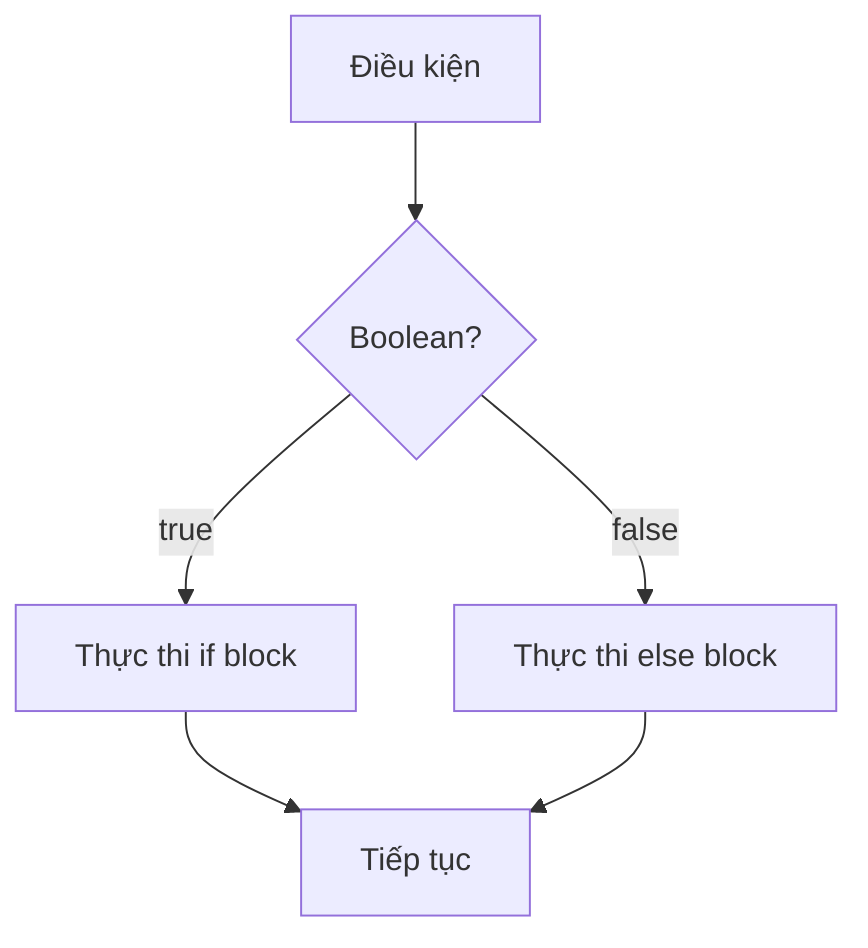
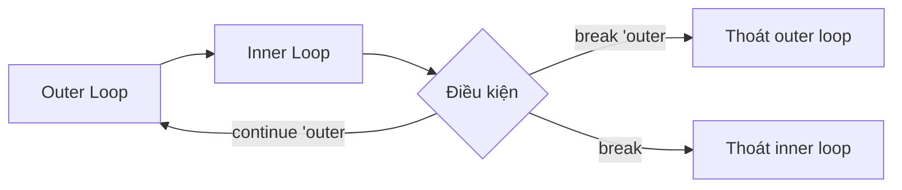
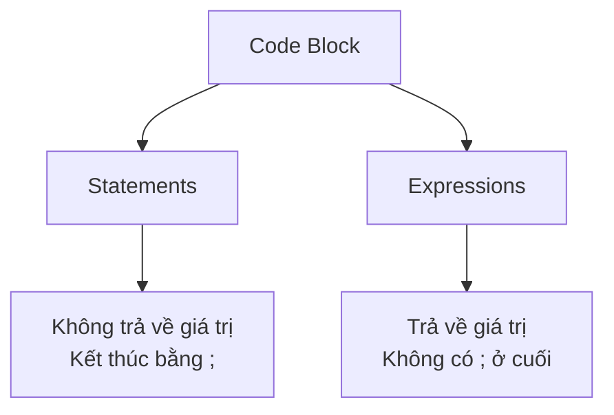
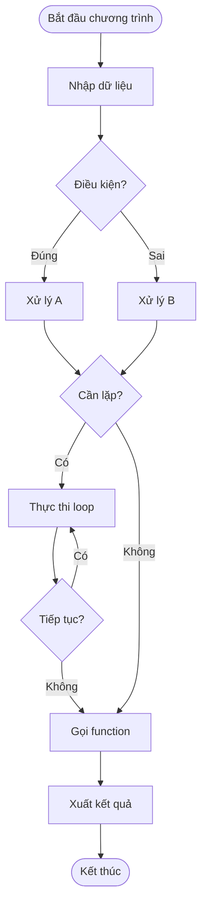

# BÀI 4: CONTROL FLOW VÀ FUNCTIONS

<div className="bg-gradient-to-r from-orange-500 to-red-600 text-white p-6 rounded-lg mb-8 shadow-lg">
  <h2 className="text-2xl font-bold mb-2">🎯 MỤC TIÊU BÀI HỌC</h2>
  <p className="text-lg">Sử dụng thành thạo các cấu trúc điều khiển và functions trong Rust</p>
</div>

## 📚 KIẾN THỨC CẦN ĐẠT

Sau bài học này, bạn sẽ nắm vững:

- Các cấu trúc điều khiển: `if`, `loop`, `while`, `for`
- Định nghĩa và sử dụng functions
- Phân biệt statements và expressions
- Loop labels và break/continue patterns

---

## 1. CÁC CẤU TRÚC ĐIỀU KHIỂN

### 1.1 Câu lệnh IF và IF EXPRESSIONS



| Cú pháp        | Mô tả                 | Ví dụ                                     |
| -------------- | --------------------- | ----------------------------------------- |
| `if condition` | Điều kiện cơ bản      | `if x > 5 { ... }`                        |
| `if...else`    | Có phương án thay thế | `if x > 5 { ... } else { ... }`           |
| `if...else if` | Nhiều điều kiện       | `if x > 5 { ... } else if x == 5 { ... }` |

<div className="bg-blue-50 border-l-4 border-blue-500 p-4 my-4">
  <p className="font-semibold text-blue-800">💡 Lưu ý quan trọng:</p>
  <p className="text-blue-700">Trong Rust, <code>if</code> là một <strong>expression</strong>, không phải statement. Có nghĩa là nó trả về giá trị!</p>
</div>

```rust
// If as expression
let number = if condition { 5 } else { 6 };

// Nested if
let weather = if temperature > 30 {
    "hot"
} else if temperature > 20 {
    "warm"
} else {
    "cool"
};
```

### 1.2 Các loại vòng lặp

| Loại vòng lặp | Khi nào sử dụng              | Cú pháp cơ bản                   |
| ------------- | ---------------------------- | -------------------------------- |
| `loop`        | Lặp vô hạn cho đến khi break | `loop { ... }`                   |
| `while`       | Lặp với điều kiện            | `while condition { ... }`        |
| `for`         | Lặp qua iterator             | `for item in collection { ... }` |

#### Loop - Vòng lặp vô hạn

```rust
let mut counter = 0;
let result = loop {
    counter += 1;

    if counter == 10 {
        break counter * 2; // Trả về giá trị khi break
    }
};
```

#### While - Vòng lặp có điều kiện

```rust
let mut number = 3;
while number != 0 {
    println!("{}!", number);
    number -= 1;
}
```

#### For - Vòng lặp iterator

```rust
// Lặp qua range
for number in 1..4 {
    println!("{}!", number);
}

// Lặp qua collection
let a = [10, 20, 30, 40, 50];
for element in a {
    println!("Giá trị: {}", element);
}
```

### 1.3 Loop Labels và Break/Continue



```rust
'outer: loop {
    println!("Outer loop");

    'inner: loop {
        println!("Inner loop");

        // Thoát khỏi outer loop
        break 'outer;
    }
}
```

---

## 2. FUNCTIONS TRONG RUST

### 2.1 Cú pháp định nghĩa Function

<div className="bg-gray-100 p-4 rounded-lg border-2 border-gray-300">
  <pre><code>fn function_name(parameter: Type) -> ReturnType {
    // function body
    return_value
}</code></pre>
</div>

| Thành phần        | Mô tả                     | Bắt buộc              |
| ----------------- | ------------------------- | --------------------- |
| `fn`              | Từ khóa khai báo function | ✅                    |
| `function_name`   | Tên function (snake_case) | ✅                    |
| `parameter: Type` | Tham số với kiểu dữ liệu  | ❌                    |
| `-> ReturnType`   | Kiểu dữ liệu trả về       | ❌ (nếu không trả về) |

### 2.2 Ví dụ Functions cơ bản

```rust
// Function không tham số, không trả về
fn say_hello() {
    println!("Xin chào!");
}

// Function có tham số
fn greet(name: &str) {
    println!("Xin chào, {}!", name);
}

// Function có trả về
fn add(a: i32, b: i32) -> i32 {
    a + b // Expression, không có dấu ;
}

// Function với nhiều tham số
fn calculate_area(length: f64, width: f64) -> f64 {
    length * width
}
```

### 2.3 Statements vs Expressions



| Statements    | Expressions                     |
| ------------- | ------------------------------- |
| `let x = 5;`  | `5`                             |
| `fn foo() {}` | `x + 1`                         |
| `x = 6;`      | `if condition { 5 } else { 6 }` |

<div className="bg-yellow-50 border-l-4 border-yellow-500 p-4 my-4">
  <p className="font-semibold text-yellow-800">⚠️ Lưu ý:</p>
  <p className="text-yellow-700">Thêm dấu <code>;</code> vào cuối expression sẽ biến nó thành statement!</p>
</div>

### 2.4 Function Scope và Nested Functions

```rust
fn outer_function() {
    let outer_var = 10;

    fn inner_function() {
        // Không thể truy cập outer_var ở đây
        println!("Trong inner function");
    }

    inner_function();
    println!("outer_var = {}", outer_var);
}
```

---

## 3. BÀI TẬP THỰC HÀNH

### Bài tập 1: Tính giai thừa

```rust
fn factorial(n: u32) -> u32 {
    let mut result = 1;
    for i in 1..=n {
        result *= i;
    }
    result
}

// Phiên bản đệ quy
fn factorial_recursive(n: u32) -> u32 {
    if n <= 1 {
        1
    } else {
        n * factorial_recursive(n - 1)
    }
}
```

### Bài tập 2: Dãy Fibonacci

```rust
fn fibonacci(n: u32) -> u32 {
    match n {
        0 => 0,
        1 => 1,
        _ => {
            let mut a = 0;
            let mut b = 1;
            for _ in 2..=n {
                let temp = a + b;
                a = b;
                b = temp;
            }
            b
        }
    }
}
```

### Bài tập 3: Kiểm tra số nguyên tố

```rust
fn is_prime(n: u32) -> bool {
    if n < 2 {
        return false;
    }

    for i in 2..=(n as f64).sqrt() as u32 {
        if n % i == 0 {
            return false;
        }
    }
    true
}

fn print_primes_up_to(limit: u32) {
    println!("Các số nguyên tố nhỏ hơn {}:", limit);
    for n in 2..limit {
        if is_prime(n) {
            print!("{} ", n);
        }
    }
    println!();
}
```

---

## 4. FLOW CHART TỔNG QUAN



---

## 5. BẢNG THAM KHẢO NHANH

### Keywords và Cú pháp

| Keyword    | Chức năng                  | Ví dụ                           |
| ---------- | -------------------------- | ------------------------------- |
| `if`       | Điều kiện                  | `if x > 0 { ... }`              |
| `else`     | Phương án khác             | `if x > 0 { ... } else { ... }` |
| `loop`     | Vòng lặp vô hạn            | `loop { ... }`                  |
| `while`    | Vòng lặp có điều kiện      | `while condition { ... }`       |
| `for`      | Vòng lặp iterator          | `for i in 0..10 { ... }`        |
| `break`    | Thoát vòng lặp             | `break;` hoặc `break 'label;`   |
| `continue` | Tiếp tục lần lặp tiếp theo | `continue;`                     |
| `fn`       | Khai báo function          | `fn name() { ... }`             |
| `return`   | Trả về giá trị             | `return value;`                 |

### Best Practices

<div className="bg-green-50 border-l-4 border-green-500 p-4 my-4">
  <ul className="text-green-800 list-disc list-inside">
    <li>Sử dụng <code>for</code> loop thay vì <code>while</code> khi có thể</li>
    <li>Tránh nested loops quá sâu (> 3 levels)</li>
    <li>Functions nên có một mục đích duy nhất</li>
    <li>Sử dụng expressions thay vì statements khi phù hợp</li>
    <li>Đặt tên functions theo snake_case</li>
  </ul>
</div>

---

## 6. BÀI TẬP VỀ NHÀ

1. **Viết function tính UCLN (Greatest Common Divisor)**
2. **Tạo function kiểm tra số palindrome**
3. **Implement binary search algorithm**
4. **Viết function chuyển đổi số thập phân sang nhị phân**

<div className="bg-purple-100 border-l-4 border-purple-500 p-6 my-6">
  <h3 className="text-xl font-bold text-purple-800 mb-3">🎓 TÓM TẮT BÀI HỌC</h3>
  <div className="text-purple-700">
    <p>✅ Đã học các cấu trúc điều khiển: if, loop, while, for</p>
    <p>✅ Hiểu cách định nghĩa và sử dụng functions</p>
    <p>✅ Phân biệt được statements và expressions</p>
    <p>✅ Biết cách sử dụng loop labels và break/continue</p>
    <p>✅ Thực hành với các bài toán mathematical cơ bản</p>
  </div>
</div>

**Bài tiếp theo:** Strings và Collections cơ bản - Tìm hiểu cách làm việc với text và data structures trong Rust!
