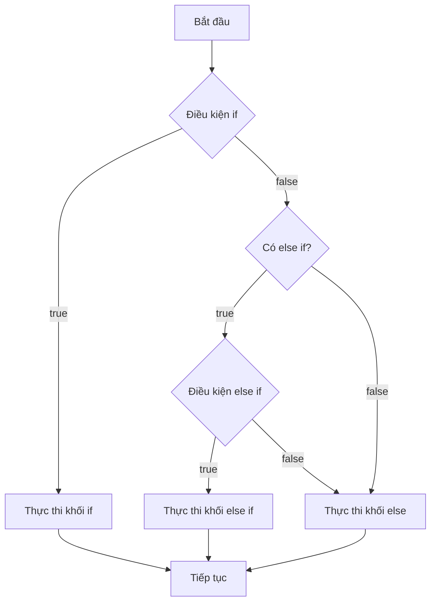
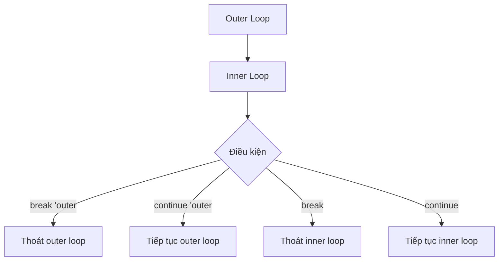

# Bài 4: Control Flow và Functions

<div className="bg-gradient-to-r from-blue-600 to-purple-700 text-white p-6 rounded-lg mb-8">
  <h2 className="text-2xl font-bold mb-2">🎯 Mục tiêu bài học</h2>
  <p className="text-lg">Sử dụng thành thạo các cấu trúc điều khiển và functions trong Rust</p>
</div>

## 📚 Tổng quan

Trong bài học này, chúng ta sẽ tìm hiểu về các cấu trúc điều khiển luồng chương trình và cách định nghĩa functions trong Rust. Đây là những khái niệm cốt lõi giúp bạn xây dựng logic phức tạp và tổ chức code hiệu quả.

## 1. Câu lệnh điều kiện (Conditional Statements)

### If Expressions

Rust sử dụng `if` như một expression, nghĩa là nó có thể trả về giá trị.



### Cú pháp cơ bản

| Loại | Cú pháp | Ví dụ |
|------|---------|-------|
| If đơn giản | `if condition { }` | `if x > 0 { println!("Positive"); }` |
| If-else | `if condition { } else { }` | `if x > 0 { 1 } else { -1 }` |
| If-else if | `if cond1 { } else if cond2 { } else { }` | Xem ví dụ bên dưới |

```rust
fn main() {
    let number = 6;

    // If expression trả về giá trị
    let result = if number % 4 == 0 {
        "divisible by 4"
    } else if number % 3 == 0 {
        "divisible by 3"
    } else if number % 2 == 0 {
        "divisible by 2"
    } else {
        "not divisible by 4, 3, or 2"
    };

    println!("The number is {}", result);
}
```

<div className="bg-yellow-50 border-l-4 border-yellow-400 p-4 my-4">
  <div className="flex">
    <div className="flex-shrink-0">
      <span className="text-yellow-400 text-xl">⚠️</span>
    </div>
    <div className="ml-3">
      <h3 className="text-lg font-medium text-yellow-800">Lưu ý quan trọng</h3>
      <p className="text-yellow-700">Điều kiện trong Rust phải là kiểu <code>bool</code>. Không thể sử dụng số nguyên như trong C/C++.</p>
    </div>
  </div>
</div>

## 2. Vòng lặp (Loops)

Rust cung cấp ba loại vòng lặp chính:

### Bảng so sánh các loại vòng lặp

| Loại vòng lặp | Cú pháp | Khi nào sử dụng | Ví dụ |
|---------------|---------|-----------------|-------|
| `loop` | `loop { }` | Vòng lặp vô hạn hoặc có điều kiện thoát phức tạp | `loop { if condition { break; } }` |
| `while` | `while condition { }` | Lặp khi điều kiện đúng | `while x < 10 { x += 1; }` |
| `for` | `for item in iterator { }` | Lặp qua collection hoặc range | `for i in 0..5 { }` |

### 2.1 Loop - Vòng lặp vô hạn

```rust
fn main() {
    let mut count = 0;
    
    // Vòng lặp với break có giá trị trả về
    let result = loop {
        count += 1;
        
        if count == 10 {
            break count * 2; // Trả về giá trị khi break
        }
    };
    
    println!("Result: {}", result); // Output: Result: 20
}
```

### 2.2 While Loop

```rust
fn main() {
    let mut number = 3;

    while number != 0 {
        println!("{}!", number);
        number -= 1;
    }

    println!("LIFTOFF!!!");
}
```

### 2.3 For Loop

```rust
fn main() {
    // Lặp qua range
    for number in 1..=5 {
        println!("{}", number);
    }

    // Lặp qua array
    let a = [10, 20, 30, 40, 50];
    for element in a {
        println!("Value: {}", element);
    }

    // Lặp với index
    for (index, value) in a.iter().enumerate() {
        println!("Index: {}, Value: {}", index, value);
    }
}
```

### Loop Labels và Control Flow



```rust
fn main() {
    'outer: loop {
        println!("Outer loop");
        
        'inner: loop {
            println!("Inner loop");
            break 'outer; // Thoát khỏi outer loop
        }
        
        println!("This point will never be reached");
    }
    
    println!("Exited the outer loop");
}
```

## 3. Functions (Hàm)

### Cú pháp định nghĩa hàm

```rust
fn function_name(parameter1: Type1, parameter2: Type2) -> ReturnType {
    // function body
    expression_or_return_statement
}
```

### Bảng phân loại functions

| Loại | Đặc điểm | Ví dụ |
|------|----------|-------|
| Không tham số, không trả về | `fn name() { }` | `fn greet() { println!("Hello!"); }` |
| Có tham số, không trả về | `fn name(param: Type) { }` | `fn print_number(x: i32) { println!("{}", x); }` |
| Không tham số, có trả về | `fn name() -> Type { }` | `fn get_number() -> i32 { 42 }` |
| Có tham số, có trả về | `fn name(param: Type) -> Type { }` | `fn add(x: i32, y: i32) -> i32 { x + y }` |

### 3.1 Functions với Parameters và Return Values

```rust
// Function với parameters
fn add(x: i32, y: i32) -> i32 {
    x + y  // Expression, không cần return keyword
}

// Function với return statement
fn subtract(x: i32, y: i32) -> i32 {
    return x - y;  // Có thể sử dụng return
}

// Function trả về tuple
fn calculate(x: i32, y: i32) -> (i32, i32, i32, i32) {
    (x + y, x - y, x * y, x / y)
}

fn main() {
    let sum = add(5, 3);
    let difference = subtract(10, 4);
    let (add_result, sub_result, mul_result, div_result) = calculate(20, 4);
    
    println!("Sum: {}", sum);
    println!("Difference: {}", difference);
    println!("Results: {}, {}, {}, {}", add_result, sub_result, mul_result, div_result);
}
```

### 3.2 Statements vs Expressions

<div className="bg-blue-50 border-l-4 border-blue-400 p-4 my-4">
  <div className="flex">
    <div className="flex-shrink-0">
      <span className="text-blue-400 text-xl">💡</span>
    </div>
    <div className="ml-3">
      <h3 className="text-lg font-medium text-blue-800">Khái niệm quan trọng</h3>
      <ul className="text-blue-700 mt-2 list-disc list-inside">
        <li><strong>Statements:</strong> Thực thi hành động nhưng không trả về giá trị</li>
        <li><strong>Expressions:</strong> Đánh giá và trả về một giá trị</li>
      </ul>
    </div>
  </div>
</div>

| Loại | Ví dụ | Ghi chú |
|------|-------|---------|
| Statement | `let x = 5;` | Không trả về giá trị |
| Statement | `fn foo() {}` | Định nghĩa function |
| Expression | `5` | Literal value |
| Expression | `x + 1` | Mathematical operation |
| Expression | `{ let x = 3; x + 1 }` | Block expression |

```rust
fn main() {
    // Block expression
    let y = {
        let x = 3;
        x + 1  // Expression, không có dấu ;
    };
    
    println!("Value of y: {}", y); // Output: Value of y: 4
}
```

## 4. Function Scope và Nested Functions

```rust
fn outer_function() {
    println!("Outer function");
    
    // Nested function
    fn inner_function() {
        println!("Inner function");
    }
    
    inner_function(); // Gọi nested function
}

fn main() {
    outer_function();
    // inner_function(); // Error: không thể gọi từ main
}
```

## 🔨 Thực hành: Mathematical Functions

Hãy implement các functions sau:

### 4.1 Factorial Function

```rust
fn factorial(n: u32) -> u32 {
    if n <= 1 {
        1
    } else {
        n * factorial(n - 1)
    }
}

// Iterative version
fn factorial_iterative(n: u32) -> u32 {
    let mut result = 1;
    for i in 1..=n {
        result *= i;
    }
    result
}
```

### 4.2 Fibonacci Function

```rust
fn fibonacci(n: u32) -> u32 {
    match n {
        0 => 0,
        1 => 1,
        _ => fibonacci(n - 1) + fibonacci(n - 2)
    }
}

// Optimized iterative version
fn fibonacci_iterative(n: u32) -> u32 {
    if n <= 1 {
        return n;
    }
    
    let mut prev = 0;
    let mut curr = 1;
    
    for _ in 2..=n {
        let next = prev + curr;
        prev = curr;
        curr = next;
    }
    
    curr
}
```

### 4.3 Prime Number Checker

```rust
fn is_prime(n: u32) -> bool {
    if n <= 1 {
        return false;
    }
    if n <= 3 {
        return true;
    }
    if n % 2 == 0 || n % 3 == 0 {
        return false;
    }
    
    let mut i = 5;
    while i * i <= n {
        if n % i == 0 || n % (i + 2) == 0 {
            return false;
        }
        i += 6;
    }
    
    true
}

fn find_primes(limit: u32) -> Vec<u32> {
    let mut primes = Vec::new();
    
    for num in 2..=limit {
        if is_prime(num) {
            primes.push(num);
        }
    }
    
    primes
}
```

### 4.4 Complete Example Program

```rust
fn main() {
    // Test factorial
    for i in 0..=10 {
        println!("{}! = {}", i, factorial(i));
    }
    
    println!("\n--- Fibonacci Sequence ---");
    for i in 0..15 {
        println!("F({}) = {}", i, fibonacci_iterative(i));
    }
    
    println!("\n--- Prime Numbers up to 50 ---");
    let primes = find_primes(50);
    println!("Primes: {:?}", primes);
    
    // Interactive calculator
    calculator_menu();
}

fn calculator_menu() {
    loop {
        println!("\n=== Simple Calculator ===");
        println!("1. Addition");
        println!("2. Subtraction");
        println!("3. Multiplication");
        println!("4. Division");
        println!("5. Exit");
        
        // Trong thực tế, bạn sẽ cần sử dụng thư viện để đọc input
        let choice = 1; // Giả sử chọn 1
        let a = 10;
        let b = 5;
        
        match choice {
            1 => println!("{} + {} = {}", a, b, add(a, b)),
            2 => println!("{} - {} = {}", a, b, subtract(a, b)),
            3 => println!("{} * {} = {}", a, b, multiply(a, b)),
            4 => {
                if b != 0 {
                    println!("{} / {} = {}", a, b, divide(a, b));
                } else {
                    println!("Error: Division by zero!");
                }
            },
            5 => {
                println!("Goodbye!");
                break;
            },
            _ => println!("Invalid choice!"),
        }
        
        break; // Để tránh vòng lặp vô hạn trong ví dụ này
    }
}

fn add(x: i32, y: i32) -> i32 { x + y }
fn subtract(x: i32, y: i32) -> i32 { x - y }
fn multiply(x: i32, y: i32) -> i32 { x * y }
fn divide(x: i32, y: i32) -> f64 { x as f64 / y as f64 }
```

## 📋 Tóm tắt kiến thức

<div className="bg-green-50 border-l-4 border-green-400 p-4 my-4">
  <div className="flex">
    <div className="flex-shrink-0">
      <span className="text-green-400 text-xl">✅</span>
    </div>
    <div className="ml-3">
      <h3 className="text-lg font-medium text-green-800">Những điều cần nhớ</h3>
      <ul className="text-green-700 mt-2 list-disc list-inside space-y-1">
        <li><code>if</code> là expression, có thể trả về giá trị</li>
        <li>Ba loại vòng lặp: <code>loop</code>, <code>while</code>, <code>for</code></li>
        <li>Sử dụng loop labels để control nested loops</li>
        <li>Functions có thể trả về giá trị mà không cần <code>return</code></li>
        <li>Phân biệt statements và expressions</li>
        <li>Nested functions chỉ có thể được gọi trong scope của chúng</li>
      </ul>
    </div>
  </div>
</div>

## 🎯 Bài tập thực hành

1. **Viết function `power(base: i32, exp: u32) -> i32`** tính lũy thừa
2. **Tạo function `gcd(a: u32, b: u32) -> u32`** tìm ước chung lớn nhất
3. **Implement `is_perfect_number(n: u32) -> bool`** kiểm tra số hoàn hảo
4. **Xây dựng number guessing game** sử dụng loops và conditions

---

<div className="text-center p-4 bg-gray-100 rounded-lg">
  <p className="text-gray-600">📚 <strong>Bài tiếp theo:</strong> Bài 5 - Strings và Collections cơ bản</p>
</div>