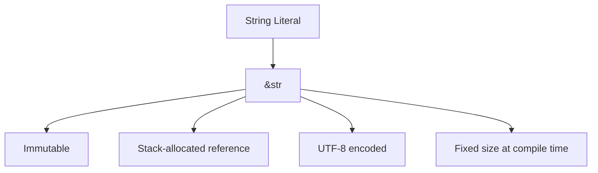
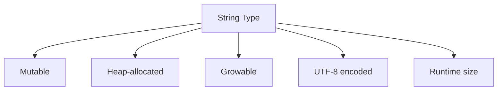
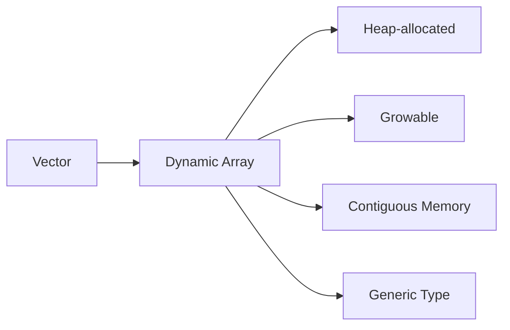
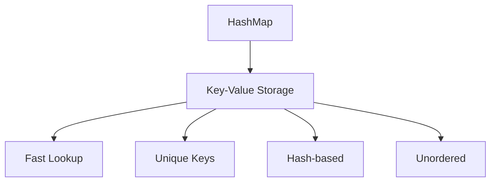
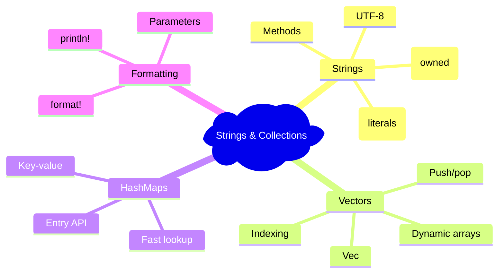

# BÀI 5: STRINGS VÀ COLLECTIONS CƠ BẢN

<div className="bg-gradient-to-r from-blue-500 to-purple-600 text-white p-6 rounded-lg shadow-lg mb-8">
  <h2 className="text-2xl font-bold mb-2">🎯 Mục Tiêu Bài Học</h2>
  <p className="text-lg">Làm việc hiệu quả với strings và các collections cơ bản trong Rust</p>
</div>

## 📚 Nội Dung Bài Học

### 1. Strings trong Rust

<div className="bg-yellow-100 border-l-4 border-yellow-500 p-4 mb-6">
  <h4 className="font-bold text-yellow-800">⚠️ Điểm Quan Trọng</h4>
  <p className="text-yellow-700">Rust có hai loại string chính: <code>&str</code> (string slice) và <code>String</code> (owned string)</p>
</div>

#### 1.1 String Literals (&str)



| Đặc điểm | Mô tả |
|----------|-------|
| Kiểu | `&str` (string slice) |
| Khả năng thay đổi | Immutable |
| Bộ nhớ | Stack (reference), Heap (data) |
| Kích thước | Cố định tại compile time |

```rust
fn main() {
    let greeting = "Hello, World!"; // &str
    let name = "Rust"; // &str
    
    println!("{}", greeting);
    println!("Language: {}", name);
}
```

#### 1.2 String Type



| Đặc điểm | Mô tả |
|----------|-------|
| Kiểu | `String` |
| Khả năng thay đổi | Mutable (với `mut`) |
| Bộ nhớ | Heap-allocated |
| Kích thước | Có thể thay đổi tại runtime |

```rust
fn main() {
    let mut my_string = String::new(); // Tạo String rỗng
    my_string.push_str("Hello");
    my_string.push(' ');
    my_string.push_str("Rust");
    
    println!("{}", my_string); // "Hello Rust"
}
```

### 2. String Methods và Operations

<div className="bg-blue-50 border border-blue-200 rounded-lg p-4 mb-6">
  <h4 className="font-semibold text-blue-800 mb-2">📋 String Methods Phổ Biến</h4>
</div>

| Method | Mô tả | Ví dụ |
|--------|-------|-------|
| `String::new()` | Tạo String rỗng | `let s = String::new();` |
| `String::from()` | Tạo String từ &str | `let s = String::from("hello");` |
| `push_str()` | Thêm &str vào cuối | `s.push_str(" world");` |
| `push()` | Thêm char vào cuối | `s.push('!');` |
| `len()` | Độ dài (bytes) | `s.len()` |
| `is_empty()` | Kiểm tra rỗng | `s.is_empty()` |

```rust
fn string_operations() {
    // Tạo String
    let mut message = String::from("Hello");
    
    // Concatenation
    message.push_str(", ");
    message.push_str("Rust");
    message.push('!');
    
    // String slicing
    let hello = &message[0..5]; // "Hello"
    let rust = &message[7..11]; // "Rust"
    
    println!("Full message: {}", message);
    println!("First part: {}", hello);
    println!("Second part: {}", rust);
}
```

### 3. Vectors (Vec&lt;T&gt;)



#### 3.1 Vector Creation và Manipulation

| Operation | Syntax | Mô tả |
|-----------|--------|-------|
| Tạo vector rỗng | `Vec::new()` | `let v: Vec<i32> = Vec::new();` |
| Tạo với macro | `vec![]` | `let v = vec![1, 2, 3];` |
| Thêm element | `push()` | `v.push(4);` |
| Xóa element cuối | `pop()` | `v.pop();` |
| Truy cập element | `[]` hoặc `get()` | `v[0]` hoặc `v.get(0)` |

```rust
fn vector_operations() {
    // Tạo vector
    let mut numbers = Vec::new();
    numbers.push(1);
    numbers.push(2);
    numbers.push(3);
    
    // Hoặc sử dụng macro
    let mut fruits = vec!["apple", "banana", "orange"];
    
    // Truy cập elements
    println!("First number: {}", numbers[0]);
    
    // An toàn với get()
    match numbers.get(10) {
        Some(value) => println!("Value: {}", value),
        None => println!("Index out of bounds"),
    }
    
    // Iteration
    for fruit in &fruits {
        println!("Fruit: {}", fruit);
    }
}
```

#### 3.2 Vector vs Array Comparison

<div className="overflow-x-auto">
  <table className="min-w-full bg-white border border-gray-300">
    <thead className="bg-gray-100">
      <tr>
        <th className="border border-gray-300 px-4 py-2 text-left">Đặc điểm</th>
        <th className="border border-gray-300 px-4 py-2 text-left">Array</th>
        <th className="border border-gray-300 px-4 py-2 text-left">Vector</th>
      </tr>
    </thead>
    <tbody>
      <tr>
        <td className="border border-gray-300 px-4 py-2 font-medium">Kích thước</td>
        <td className="border border-gray-300 px-4 py-2">Cố định tại compile time</td>
        <td className="border border-gray-300 px-4 py-2">Động tại runtime</td>
      </tr>
      <tr className="bg-gray-50">
        <td className="border border-gray-300 px-4 py-2 font-medium">Bộ nhớ</td>
        <td className="border border-gray-300 px-4 py-2">Stack</td>
        <td className="border border-gray-300 px-4 py-2">Heap</td>
      </tr>
      <tr>
        <td className="border border-gray-300 px-4 py-2 font-medium">Performance</td>
        <td className="border border-gray-300 px-4 py-2">Nhanh hơn</td>
        <td className="border border-gray-300 px-4 py-2">Linh hoạt hơn</td>
      </tr>
    </tbody>
  </table>
</div>

### 4. HashMaps



#### 4.1 HashMap Operations

```rust
use std::collections::HashMap;

fn hashmap_operations() {
    // Tạo HashMap
    let mut scores = HashMap::new();
    
    // Insert key-value pairs
    scores.insert("Alice", 100);
    scores.insert("Bob", 85);
    scores.insert("Charlie", 92);
    
    // Truy cập values
    match scores.get("Alice") {
        Some(score) => println!("Alice's score: {}", score),
        None => println!("Alice not found"),
    }
    
    // Update values
    scores.insert("Alice", 105); // Overwrite
    
    // Or update only if key doesn't exist
    scores.entry("David").or_insert(88);
    
    // Iterate
    for (name, score) in &scores {
        println!("{}: {}", name, score);
    }
}
```

#### 4.2 HashMap Methods

| Method | Mô tả | Ví dụ |
|--------|-------|-------|
| `insert(k, v)` | Thêm/cập nhật key-value | `map.insert("key", 42);` |
| `get(&k)` | Lấy value theo key | `map.get("key")` |
| `contains_key(&k)` | Kiểm tra key tồn tại | `map.contains_key("key")` |
| `remove(&k)` | Xóa key-value | `map.remove("key")` |
| `entry(k)` | Entry API | `map.entry("key").or_insert(0)` |

### 5. String Formatting

<div className="bg-green-50 border border-green-200 rounded-lg p-4 mb-6">
  <h4 className="font-semibold text-green-800 mb-2">✨ String Formatting Macros</h4>
</div>

| Macro | Mô tả | Output |
|-------|-------|--------|
| `format!()` | Tạo String | Trả về String |
| `print!()` | In ra stdout | Không có newline |
| `println!()` | In ra stdout | Có newline |
| `eprint!()` | In ra stderr | Không có newline |
| `eprintln!()` | In ra stderr | Có newline |

```rust
fn string_formatting() {
    let name = "Rust";
    let version = 1.70;
    
    // Basic formatting
    let message = format!("Hello, {}!", name);
    println!("{}", message);
    
    // Multiple parameters
    println!("Language: {}, Version: {}", name, version);
    
    // Named parameters
    println!("{lang} version {ver}", lang=name, ver=version);
    
    // Number formatting
    let pi = 3.14159;
    println!("Pi: {:.2}", pi); // 2 decimal places
    println!("Pi: {:08.2}", pi); // 8 width, 2 decimals, zero-padded
}
```

## 🛠️ Thực Hành

### Bài Tập 1: Word Counter

```rust
use std::collections::HashMap;

fn word_counter(text: &str) -> HashMap<String, usize> {
    let mut word_count = HashMap::new();
    
    for word in text.split_whitespace() {
        let word = word.to_lowercase();
        *word_count.entry(word).or_insert(0) += 1;
    }
    
    word_count
}

fn main() {
    let text = "Hello world hello rust world";
    let counts = word_counter(text);
    
    for (word, count) in &counts {
        println!("{}: {}", word, count);
    }
}
```

### Bài Tập 2: Simple Contact Manager

```rust
use std::collections::HashMap;

struct ContactManager {
    contacts: HashMap<String, String>,
}

impl ContactManager {
    fn new() -> ContactManager {
        ContactManager {
            contacts: HashMap::new(),
        }
    }
    
    fn add_contact(&mut self, name: String, phone: String) {
        self.contacts.insert(name, phone);
    }
    
    fn find_contact(&self, name: &str) -> Option<&String> {
        self.contacts.get(name)
    }
    
    fn list_contacts(&self) {
        for (name, phone) in &self.contacts {
            println!("{}: {}", name, phone);
        }
    }
}

fn main() {
    let mut manager = ContactManager::new();
    
    manager.add_contact("Alice".to_string(), "123-456-7890".to_string());
    manager.add_contact("Bob".to_string(), "098-765-4321".to_string());
    
    println!("All contacts:");
    manager.list_contacts();
    
    if let Some(phone) = manager.find_contact("Alice") {
        println!("Alice's phone: {}", phone);
    }
}
```

## 📋 Tóm Tắt Bài Học



<div className="bg-gray-100 p-6 rounded-lg mt-8">
  <h3 className="text-xl font-bold mb-4">🎯 Điểm Cần Nhớ</h3>
  <ul className="space-y-2">
    <li className="flex items-start">
      <span className="text-blue-500 mr-2">•</span>
      <span><strong>&str</strong> là string slice (immutable), <strong>String</strong> là owned string (mutable)</span>
    </li>
    <li className="flex items-start">
      <span className="text-blue-500 mr-2">•</span>
      <span><strong>Vec&lt;T&gt;</strong> là dynamic array, có thể grow/shrink tại runtime</span>
    </li>
    <li className="flex items-start">
      <span className="text-blue-500 mr-2">•</span>
      <span><strong>HashMap</strong> cung cấp key-value storage với O(1) lookup time</span>
    </li>
    <li className="flex items-start">
      <span className="text-blue-500 mr-2">•</span>
      <span>Sử dụng <strong>format!</strong> và các macro liên quan để format strings</span>
    </li>
    <li className="flex items-start">
      <span className="text-blue-500 mr-2">•</span>
      <span>Rust strings luôn là valid UTF-8</span>
    </li>
  </ul>
</div>

## 🔄 Bài Tiếp Theo

Trong **Bài 6**, chúng ta sẽ học về **Structs và Enums** - cách tạo custom data types để organize data một cách hiệu quả hơn.