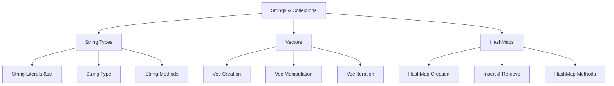
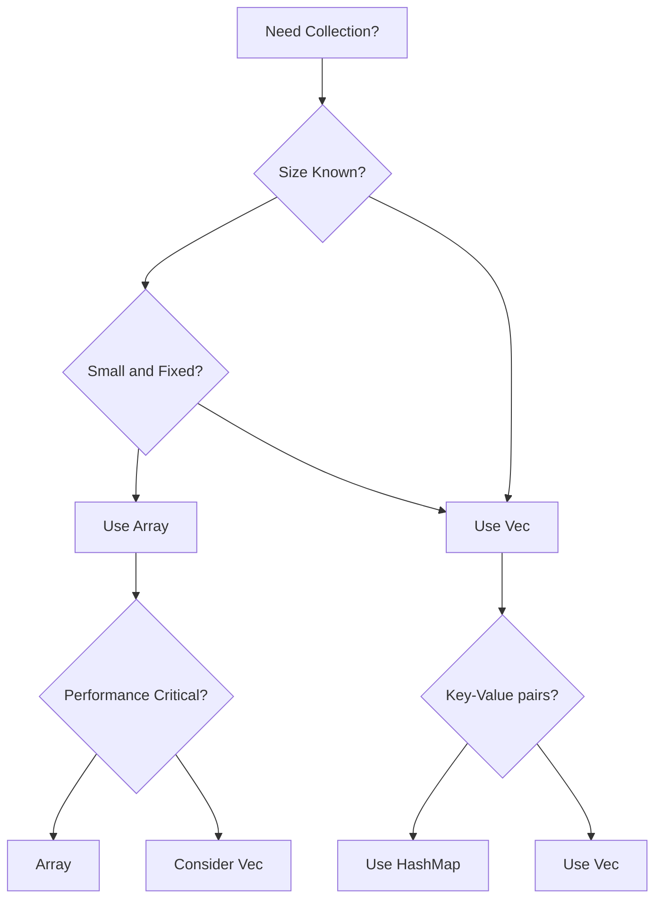
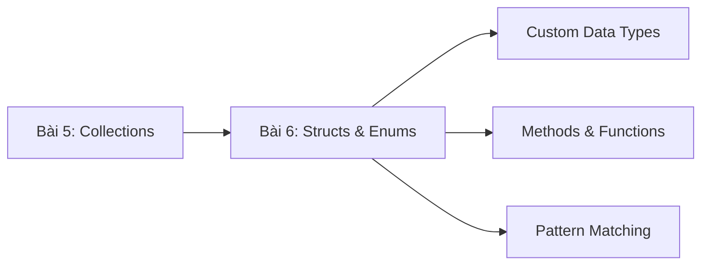

# BÀI 5: STRINGS VÀ COLLECTIONS CƠ BẢN

<div className="bg-gradient-to-r from-orange-500 to-red-600 text-white p-6 rounded-lg mb-8 shadow-lg">
  <h2 className="text-2xl font-bold mb-2">🎯 MỤC TIÊU BÀI HỌC</h2>
  <p className="text-lg">Làm việc hiệu quả với strings và các collections cơ bản trong Rust</p>
</div>

## 📚 TỔNG QUAN NỘI DUNG



---

## 🔤 PHẦN 1: STRINGS TRONG RUST

### 1.1 Hai Loại String Chính

<div className="bg-blue-50 border-l-4 border-blue-500 p-4 mb-6 rounded-r-lg">
  <h3 className="text-blue-800 font-semibold mb-2">💡 Khái Niệm Quan Trọng</h3>
  <p className="text-blue-700">Rust có hai loại string chính: <code>&str</code> (string slice) và <code>String</code> (owned string)</p>
</div>

| Đặc điểm | `&str` | `String` |
|----------|--------|----------|
| **Ownership** | Borrowed | Owned |
| **Memory** | Stack (reference) | Heap |
| **Mutability** | Immutable | Có thể mutable |
| **Size** | Fixed | Có thể thay đổi |
| **Use case** | String literals, slices | Dynamic strings |

### 1.2 String Literals (&str)

```rust copy
// String literals - stored in program binary
let greeting = "Hello, World!";  // Type: &str
let multiline = "This is a 
multiline string";

// Raw strings - không escape characters
let raw_string = r"C:\Users\Name\file.txt";
let raw_multiline = r#"
    This is a "raw" string
    with multiple lines
"#;
```

### 1.3 String Type

```rust copy
// Tạo String từ literal
let mut s1 = String::from("Hello");
let mut s2 = "Hello".to_string();
let mut s3 = String::new(); // Empty string

// String manipulation
s1.push_str(", World!");     // Append string slice
s1.push('!');                // Append single character
```

### 1.4 String Methods Map

```mermaid
mindmap
  root)String Methods(
    Creation
      ::from()
      ::new()
      ::with_capacity()
    
    Modification
      ::push()
      ::push_str()
      ::insert()
      ::replace()
    
    Information
      ::len()
      ::is_empty()
      ::capacity()
      ::chars()
    
    Conversion
      ::to_string()
      ::as_str()
      ::into_bytes()
```

### 1.5 String Operations Table

| Method | Description | Example |
|--------|-------------|---------|
| `len()` | Trả về số bytes | `"Hello".len() // 5` |
| `chars()` | Iterator qua characters | `"Hello".chars()` |
| `split()` | Tách string theo delimiter | `"a,b,c".split(',')` |
| `trim()` | Loại bỏ whitespace | `" hello ".trim()` |
| `replace()` | Thay thế substring | `"hello".replace("l", "x")` |
| `contains()` | Kiểm tra substring | `"hello".contains("ell")` |

---

## 📦 PHẦN 2: VECTORS - VEC&LT;T&GT;

### 2.1 Vector Overview

<div className="bg-green-50 border-l-4 border-green-500 p-4 mb-6 rounded-r-lg">
  <h3 className="text-green-800 font-semibold mb-2">🚀 Vector là gì?</h3>
  <p className="text-green-700">Vector là dynamic array, có thể thay đổi size và store elements cùng type trên heap</p>
</div>

### 2.2 Vector Creation Methods

```rust copy
// Tạo vector rỗng
let mut v1: Vec<i32> = Vec::new();
let mut v2 = Vec::<i32>::new();

// Tạo vector với macro vec!
let v3 = vec![1, 2, 3, 4, 5];
let v4 = vec![0; 5]; // [0, 0, 0, 0, 0]

// Tạo với capacity
let mut v5 = Vec::with_capacity(10);
```

### 2.3 Vector Operations

| Operation | Method | Example | Result |
|-----------|--------|---------|---------|
| **Add element** | `push()` | `v.push(5)` | Adds to end |
| **Remove last** | `pop()` | `v.pop()` | `Option<T>` |
| **Insert at index** | `insert()` | `v.insert(0, 10)` | Insert at position |
| **Remove at index** | `remove()` | `v.remove(1)` | Remove & return |
| **Access element** | `[]` hoặc `get()` | `v[0]` hoặc `v.get(0)` | Direct hoặc `Option<&T>` |

### 2.4 Vector Iteration

```rust copy
let v = vec![1, 2, 3, 4, 5];

// Iterate by reference
for item in &v {
    println!("{}", item);
}

// Iterate by value (consumes vector)
for item in v {
    println!("{}", item);
}

// Iterate with index
for (index, value) in v.iter().enumerate() {
    println!("Index {}: {}", index, value);
}

// Mutable iteration
let mut v = vec![1, 2, 3];
for item in &mut v {
    *item *= 2;
}
```

---

## 🗺️ PHẦN 3: HASHMAPS - KEY-VALUE STORAGE

### 3.1 HashMap Characteristics

```mermaid
graph LR
    A[HashMap] --> B[Key-Value Pairs]
    A --> C[Hash-based Lookup]
    A --> D[O(1) Average Access]
    
    B --> B1[Unique Keys]
    B --> B2[Any Value Type]
    
    C --> C1[Fast Insertion]
    C --> C2[Fast Retrieval]
```

### 3.2 HashMap Creation và Basic Operations

```rust copy
use std::collections::HashMap;

// Tạo HashMap
let mut scores = HashMap::new();

// Insert key-value pairs
scores.insert(String::from("Blue"), 10);
scores.insert(String::from("Red"), 25);

// Tạo từ vector of tuples
let teams = vec![String::from("Blue"), String::from("Red")];
let scores_vec = vec![10, 25];
let scores: HashMap<_, _> = teams.iter().zip(scores_vec.iter()).collect();
```

### 3.3 HashMap Methods Reference

| Method | Purpose | Return Type | Example |
|--------|---------|-------------|---------|
| `insert(k, v)` | Insert/Update | `Option<V>` | `map.insert("key", 42)` |
| `get(k)` | Retrieve value | `Option<&V>` | `map.get("key")` |
| `remove(k)` | Remove entry | `Option<V>` | `map.remove("key")` |
| `contains_key(k)` | Check existence | `bool` | `map.contains_key("key")` |
| `entry(k)` | Get entry | `Entry<K,V>` | `map.entry("key")` |

### 3.4 Advanced HashMap Patterns

```rust copy
use std::collections::HashMap;

let mut map = HashMap::new();

// Entry API - insert if not exists
map.entry("key".to_string())
   .or_insert(42);

// Entry API - update existing or insert default
*map.entry("counter".to_string())
    .or_insert(0) += 1;

// Pattern matching with get()
match map.get("key") {
    Some(value) => println!("Found: {}", value),
    None => println!("Key not found"),
}
```

---

## ⚖️ PHẦN 4: SO SÁNH COLLECTIONS

### 4.1 Arrays vs Vectors Comparison

<div className="overflow-x-auto">

| Aspect | Array `[T; N]` | Vector `Vec<T>` |
|--------|----------------|-----------------|
| **Size** | Fixed at compile time | Dynamic |
| **Memory** | Stack | Heap |
| **Performance** | Faster access | Slightly slower |
| **Flexibility** | Limited | High |
| **Use case** | Known size, performance critical | Dynamic size needed |

</div>

### 4.2 Collection Selection Guide



---

## 🎨 PHẦN 5: STRING FORMATTING

### 5.1 Format Macros

| Macro | Purpose | Example |
|-------|---------|---------|
| `format!` | Create formatted String | `format!("Hello {}", name)` |
| `print!` | Print to stdout | `print!("Value: {}", x)` |
| `println!` | Print with newline | `println!("Debug: {:?}", obj)` |
| `eprintln!` | Print to stderr | `eprintln!("Error: {}", msg)` |

### 5.2 Format Specifiers

```rust copy
let name = "Alice";
let age = 30;
let pi = 3.14159;

// Basic formatting
println!("Hello, {}!", name);

// Positional parameters
println!("{0} is {1} years old, {0} likes Rust", name, age);

// Named parameters  
println!("{name} is {age} years old");

// Number formatting
println!("Pi: {:.2}", pi);        // 2 decimal places
println!("Hex: {:x}", 255);       // Hexadecimal
println!("Binary: {:b}", 8);      // Binary
println!("Padded: {:05}", 42);    // Zero-padded
```

---

## 💻 PHẦN 6: THỰC HÀNH - WORD COUNTER

<div className="bg-yellow-50 border-l-4 border-yellow-500 p-4 mb-6 rounded-r-lg">
  <h3 className="text-yellow-800 font-semibold mb-2">🔧 Bài Tập Thực Hành</h3>
  <p className="text-yellow-700">Xây dựng chương trình đếm từ sử dụng HashMap và String processing</p>
</div>

```rust copy
use std::collections::HashMap;

fn word_counter(text: &str) -> HashMap<String, usize> {
    let mut word_count = HashMap::new();
    
    // Split text thành words và clean up
    for word in text
        .to_lowercase()
        .split_whitespace()
        .map(|w| w.trim_matches(|c: char| !c.is_alphabetic()))
        .filter(|w| !w.is_empty())
    {
        let count = word_count.entry(word.to_string()).or_insert(0);
        *count += 1;
    }
    
    word_count
}

fn main() {
    let text = "Hello world! This is a hello world example.";
    let counts = word_counter(text);
    
    // In kết quả
    for (word, count) in &counts {
        println!("{}: {}", word, count);
    }
    
    // Top 3 words
    let mut word_vec: Vec<_> = counts.iter().collect();
    word_vec.sort_by(|a, b| b.1.cmp(a.1));
    
    println!("\nTop 3 words:");
    for (word, count) in word_vec.iter().take(3) {
        println!("  {}: {}", word, count);
    }
}
```

---

## 🎯 PHẦN 7: CONTACT MANAGER EXAMPLE

```rust copy
use std::collections::HashMap;

#[derive(Debug, Clone)]
struct Contact {
    name: String,
    email: String,
    phone: String,
}

struct ContactManager {
    contacts: HashMap<String, Contact>,
}

impl ContactManager {
    fn new() -> Self {
        ContactManager {
            contacts: HashMap::new(),
        }
    }
    
    fn add_contact(&mut self, contact: Contact) {
        let key = contact.name.to_lowercase();
        self.contacts.insert(key, contact);
    }
    
    fn find_contact(&self, name: &str) -> Option<&Contact> {
        self.contacts.get(&name.to_lowercase())
    }
    
    fn list_contacts(&self) -> Vec<&Contact> {
        self.contacts.values().collect()
    }
    
    fn remove_contact(&mut self, name: &str) -> Option<Contact> {
        self.contacts.remove(&name.to_lowercase())
    }
}

fn main() {
    let mut manager = ContactManager::new();
    
    // Add contacts
    manager.add_contact(Contact {
        name: "Alice Johnson".to_string(),
        email: "alice@example.com".to_string(),
        phone: "123-456-7890".to_string(),
    });
    
    // Find contact
    if let Some(contact) = manager.find_contact("alice johnson") {
        println!("Found: {:?}", contact);
    }
    
    // List all contacts
    println!("All contacts:");
    for contact in manager.list_contacts() {
        println!("  {}: {}", contact.name, contact.email);
    }
}
```

---

## 📋 TÓM TẮT BÀI HỌC

<div className="bg-purple-50 border border-purple-200 rounded-lg p-6">
  <h3 className="text-purple-800 font-bold text-lg mb-4">🎊 Những Điều Đã Học</h3>
  
  <div className="grid grid-cols-1 md:grid-cols-2 gap-4">
    <div className="bg-white p-4 rounded border">
      <h4 className="font-semibold text-purple-700 mb-2">Strings</h4>
      <ul className="text-sm text-purple-600 space-y-1">
        <li>• Hiểu sự khác biệt giữa &str và String</li>
        <li>• String methods và manipulation</li>
        <li>• UTF-8 encoding handling</li>
        <li>• String formatting với macros</li>
      </ul>
    </div>
    
    <div className="bg-white p-4 rounded border">
      <h4 className="font-semibold text-purple-700 mb-2">Collections</h4>
      <ul className="text-sm text-purple-600 space-y-1">
        <li>• Vector creation và manipulation</li>
        <li>• HashMap key-value operations</li>
        <li>• Collection iteration patterns</li>
        <li>• Choosing right collection type</li>
      </ul>
    </div>
  </div>
</div>

---

## 🚀 CHUẨN BỊ CHO BÀI TIẾP THEO

Bài 6 sẽ học về **Structs và Enums** - tạo custom data types để tổ chức code tốt hơn:



<div className="bg-gray-100 p-4 rounded-lg mt-6">
  <p className="text-gray-700 font-medium">💡 <strong>Lời khuyên:</strong> Hãy thực hành nhiều với String và HashMap operations vì chúng rất phổ biến trong Rust programming!</p>
</div>