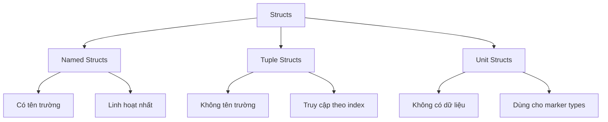
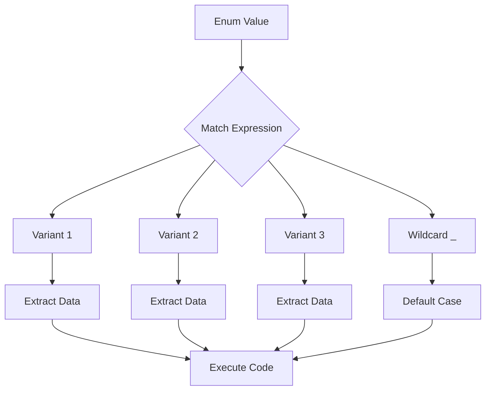

# BÀI 6: STRUCTS VÀ ENUMS - TẠO CÁC KIỂU DỮ LIỆU TÙY CHỈNH

<div className="bg-gradient-to-r from-orange-400 to-red-600 text-white p-6 rounded-lg mb-8">
  <h2 className="text-2xl font-bold mb-2">🎯 Mục Tiêu Bài Học</h2>
  <p className="text-lg">Tạo và sử dụng custom data types với structs và enums để mô hình hóa dữ liệu phức tạp trong Rust</p>
</div>

## 🏗️ Structs - Cấu Trúc Dữ Liệu

### Các Loại Structs



### 1. Named Structs (Structs có tên trường)

<div className="bg-blue-50 p-4 rounded-lg border-l-4 border-blue-400 mb-4">
  <h4 className="font-semibold text-blue-800">📖 Định nghĩa</h4>
  <p className="text-blue-700">Named structs là loại phổ biến nhất, cho phép đặt tên cho từng trường dữ liệu</p>
</div>

```rust
// Định nghĩa struct Employee
struct Employee {
    id: u32,
    name: String,
    email: String,
    salary: f64,
    is_active: bool,
}

// Tạo instance
fn main() {
    let emp1 = Employee {
        id: 1,
        name: String::from("Nguyen Van A"),
        email: String::from("a@company.com"),
        salary: 50000.0,
        is_active: true,
    };
    
    // Truy cập trường
    println!("Employee: {}, ID: {}", emp1.name, emp1.id);
}
```

### 2. Tuple Structs

```rust
// Định nghĩa tuple structs
struct Point(f64, f64, f64);  // 3D Point
struct Color(u8, u8, u8);     // RGB Color

fn main() {
    let origin = Point(0.0, 0.0, 0.0);
    let red = Color(255, 0, 0);
    
    // Truy cập theo index
    println!("Point: ({}, {}, {})", origin.0, origin.1, origin.2);
    println!("Red color: ({}, {}, {})", red.0, red.1, red.2);
}
```

### 3. Unit Structs

```rust
// Unit structs - không có dữ liệu
struct DatabaseConnection;
struct NetworkError;

// Thường dùng làm marker types
impl DatabaseConnection {
    fn connect() -> Self {
        DatabaseConnection
    }
}
```

### Struct Update Syntax

<div className="bg-green-50 p-4 rounded-lg border-l-4 border-green-400 mb-4">
  <h4 className="font-semibold text-green-800">✨ Mẹo hay</h4>
  <p className="text-green-700">Sử dụng <code>..other_struct</code> để copy các trường từ struct khác</p>
</div>

```rust
let emp1 = Employee {
    id: 1,
    name: String::from("Nguyen Van A"),
    email: String::from("a@company.com"),
    salary: 50000.0,
    is_active: true,
};

// Tạo emp2 dựa trên emp1
let emp2 = Employee {
    id: 2,
    name: String::from("Nguyen Van B"),
    ..emp1  // Copy các trường còn lại từ emp1
};
```

## 📋 So Sánh Các Loại Structs

| Loại Struct | Cú pháp | Truy cập | Sử dụng |
|-------------|---------|----------|---------|
| Named | `struct Person { name: String }` | `person.name` | Dữ liệu phức tạp |
| Tuple | `struct Point(f64, f64)` | `point.0` | Nhóm dữ liệu đơn giản |
| Unit | `struct Marker;` | N/A | Marker types, Zero-sized |

## 🛠️ Methods và Associated Functions

### Impl Blocks - Định nghĩa Methods

```rust
struct Rectangle {
    width: u32,
    height: u32,
}

impl Rectangle {
    // Associated function (như static method)
    fn new(width: u32, height: u32) -> Rectangle {
        Rectangle { width, height }
    }
    
    // Method (nhận &self)
    fn area(&self) -> u32 {
        self.width * self.height
    }
    
    // Method có thể thay đổi struct
    fn double_size(&mut self) {
        self.width *= 2;
        self.height *= 2;
    }
    
    // Method nhận ownership
    fn destroy(self) -> String {
        format!("Rectangle {}x{} destroyed", self.width, self.height)
    }
}

fn main() {
    // Gọi associated function
    let mut rect = Rectangle::new(10, 20);
    
    // Gọi methods
    println!("Area: {}", rect.area());
    rect.double_size();
    println!("New area: {}", rect.area());
    
    // rect không thể sử dụng sau destroy()
    println!("{}", rect.destroy());
}
```

## 🎭 Enums - Kiểu Liệt Kê

### Định nghĩa Enum Cơ bản

```rust
enum Status {
    Active,
    Inactive,
    Pending,
    Suspended,
}

enum IpAddr {
    V4(u8, u8, u8, u8),      // Tuple variant
    V6(String),               // Single value variant
}

enum Message {
    Quit,                     // Unit variant
    Move { x: i32, y: i32 }, // Struct variant
    Write(String),            // Tuple variant
    ChangeColor(i32, i32, i32), // Multiple values
}
```

### Enum Methods

```rust
impl Status {
    fn is_active(&self) -> bool {
        matches!(self, Status::Active)
    }
    
    fn description(&self) -> &str {
        match self {
            Status::Active => "User is active",
            Status::Inactive => "User is inactive", 
            Status::Pending => "Awaiting approval",
            Status::Suspended => "Account suspended",
        }
    }
}
```

## 🎯 Pattern Matching với Match

<div className="bg-purple-50 p-4 rounded-lg border-l-4 border-purple-400 mb-4">
  <h4 className="font-semibold text-purple-800">🔍 Pattern Matching</h4>
  <p className="text-purple-700">Match expressions phải xử lý tất cả các trường hợp có thể (exhaustive)</p>
</div>

```rust
fn process_message(msg: Message) {
    match msg {
        Message::Quit => println!("Quit message received"),
        Message::Move { x, y } => println!("Move to ({}, {})", x, y),
        Message::Write(text) => println!("Text message: {}", text),
        Message::ChangeColor(r, g, b) => {
            println!("Change color to RGB({}, {}, {})", r, g, b)
        }
    }
}

fn process_ip(ip: IpAddr) {
    match ip {
        IpAddr::V4(a, b, c, d) => {
            println!("IPv4: {}.{}.{}.{}", a, b, c, d)
        }
        IpAddr::V6(addr) => {
            println!("IPv6: {}", addr)
        }
    }
}
```

## 🎪 If Let và While Let

### If Let - Pattern Matching Ngắn gọn

```rust
let status = Status::Active;

// Thay vì dùng match đầy đủ
if let Status::Active = status {
    println!("User is active!");
}

// Với dữ liệu
let msg = Message::Write(String::from("Hello"));
if let Message::Write(text) = msg {
    println!("Message content: {}", text);
}
```

### While Let - Lặp với Pattern

```rust
let mut stack = vec![1, 2, 3, 4, 5];

while let Some(value) = stack.pop() {
    println!("Popped: {}", value);
}
```

## 📊 Sơ Đồ Luồng Pattern Matching



## 💼 Thực Hành: Employee Management System

```rust
#[derive(Debug)]
enum EmployeeType {
    FullTime { salary: f64 },
    PartTime { hourly_rate: f64, hours_per_week: u32 },
    Contract { daily_rate: f64, days_remaining: u32 },
    Intern,
}

#[derive(Debug)]
struct Employee {
    id: u32,
    name: String,
    email: String,
    employee_type: EmployeeType,
    is_active: bool,
}

impl Employee {
    fn new(id: u32, name: String, email: String, emp_type: EmployeeType) -> Self {
        Employee {
            id,
            name,
            email,
            employee_type: emp_type,
            is_active: true,
        }
    }
    
    fn calculate_monthly_payment(&self) -> f64 {
        if !self.is_active {
            return 0.0;
        }
        
        match &self.employee_type {
            EmployeeType::FullTime { salary } => salary / 12.0,
            EmployeeType::PartTime { hourly_rate, hours_per_week } => {
                hourly_rate * (*hours_per_week as f64) * 4.33 // Trung bình tuần/tháng
            },
            EmployeeType::Contract { daily_rate, days_remaining: _ } => {
                daily_rate * 22.0 // 22 ngày làm việc/tháng
            },
            EmployeeType::Intern => 0.0,
        }
    }
    
    fn get_type_description(&self) -> String {
        match &self.employee_type {
            EmployeeType::FullTime { salary } => {
                format!("Full-time (${:.2}/year)", salary)
            },
            EmployeeType::PartTime { hourly_rate, hours_per_week } => {
                format!("Part-time (${:.2}/hour, {}h/week)", hourly_rate, hours_per_week)
            },
            EmployeeType::Contract { daily_rate, days_remaining } => {
                format!("Contract (${:.2}/day, {} days left)", daily_rate, days_remaining)
            },
            EmployeeType::Intern => String::from("Intern (Unpaid)"),
        }
    }
    
    fn deactivate(&mut self) {
        self.is_active = false;
    }
}

fn main() {
    let mut employees = vec![
        Employee::new(
            1,
            String::from("Nguyen Van A"),
            String::from("a@company.com"),
            EmployeeType::FullTime { salary: 60000.0 }
        ),
        Employee::new(
            2, 
            String::from("Tran Thi B"),
            String::from("b@company.com"),
            EmployeeType::PartTime { hourly_rate: 25.0, hours_per_week: 20 }
        ),
        Employee::new(
            3,
            String::from("Le Van C"), 
            String::from("c@company.com"),
            EmployeeType::Contract { daily_rate: 200.0, days_remaining: 90 }
        ),
        Employee::new(
            4,
            String::from("Pham Thi D"),
            String::from("d@company.com"), 
            EmployeeType::Intern
        ),
    ];
    
    println!("=== EMPLOYEE MANAGEMENT SYSTEM ===\n");
    
    for emp in &employees {
        println!("ID: {}", emp.id);
        println!("Name: {}", emp.name);
        println!("Email: {}", emp.email);
        println!("Type: {}", emp.get_type_description());
        println!("Monthly Payment: ${:.2}", emp.calculate_monthly_payment());
        println!("Status: {}", if emp.is_active { "Active" } else { "Inactive" });
        println!("---");
    }
    
    // Deactivate employee
    employees[0].deactivate();
    println!("\nAfter deactivating {}:", employees[0].name);
    println!("Monthly Payment: ${:.2}", employees[0].calculate_monthly_payment());
}
```

## 📋 Bảng Tổng Kết Kiến Thức

| Khái Niệm | Cú Pháp | Đặc Điểm | Ví Dụ |
|-----------|---------|----------|--------|
| Named Struct | `struct Person { name: String }` | Có tên trường, rõ ràng | `person.name` |
| Tuple Struct | `struct Point(i32, i32)` | Không tên trường, ngắn gọn | `point.0` |
| Unit Struct | `struct Marker;` | Không dữ liệu, marker | `Marker` |
| Enum | `enum Status { Active, Inactive }` | Một trong nhiều giá trị | `Status::Active` |
| Match | `match value { ... }` | Phải exhaustive | Xử lý tất cả cases |
| If Let | `if let Some(x) = opt { ... }` | Pattern matching ngắn | Chỉ quan tâm 1 case |

## 🎯 Bài Tập Thực Hành

<div className="bg-yellow-50 p-4 rounded-lg border-l-4 border-yellow-400 mb-4">
  <h4 className="font-semibold text-yellow-800">📝 Thử Thách</h4>
  <p className="text-yellow-700">Hãy mở rộng Employee Management System để hỗ trợ thêm các tính năng sau:</p>
</div>

1. **Thêm Department enum** với các phòng ban khác nhau
2. **Performance Rating enum** với các mức đánh giá 
3. **Methods để tính bonus** dựa trên loại nhân viên và performance
4. **Search functionality** để tìm nhân viên theo tên hoặc email
5. **Promotion system** để thăng chức nhân viên

## 🔗 Tài Liệu Tham Khảo

- [The Rust Book - Structs](https://doc.rust-lang.org/book/ch05-00-structs.html)
- [The Rust Book - Enums](https://doc.rust-lang.org/book/ch06-00-enums.html)
- [Rust by Example - Structs](https://doc.rust-lang.org/rust-by-example/custom_types/structs.html)

---

<div className="bg-gradient-to-r from-green-400 to-blue-500 text-white p-6 rounded-lg">
  <h3 className="text-xl font-bold mb-2">🎉 Chúc Mừng!</h3>
  <p>Bạn đã hoàn thành Bài 6 về Structs và Enums. Giờ đây bạn có thể tạo các kiểu dữ liệu phức tạp để mô hình hóa domain logic trong ứng dụng Rust!</p>
</div>

**Tiếp theo:** Bài 7 - Pattern Matching và Destructuring