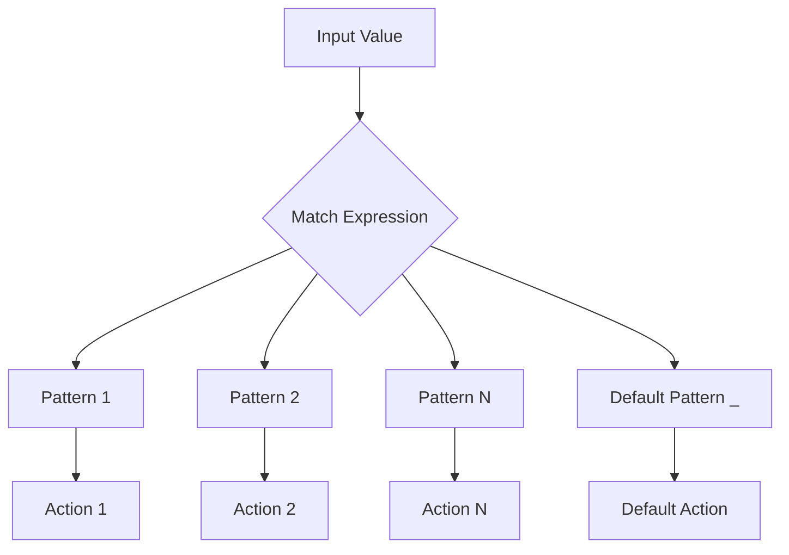
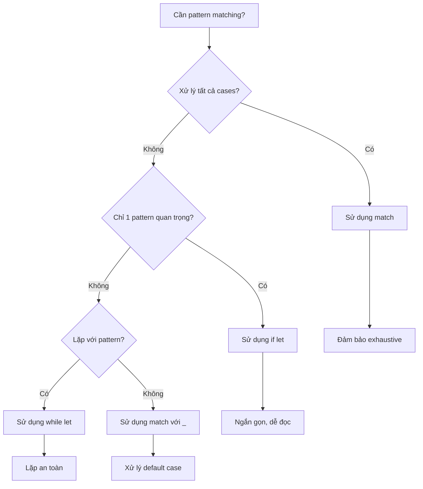

# Bài 7: Pattern Matching và Destructuring trong Rust

<div className="bg-gradient-to-r from-blue-500 to-purple-600 text-white p-6 rounded-lg mb-8">
  <h2 className="text-2xl font-bold mb-2">🎯 Mục tiêu bài học</h2>
  <p className="text-lg">Thành thạo pattern matching - một tính năng mạnh mẽ của Rust để xử lý dữ liệu một cách an toàn và biểu cảm</p>
</div>

## 📚 Giới thiệu về Pattern Matching

Pattern Matching là một tính năng mạnh mẽ trong Rust cho phép bạn so khớp giá trị với các mẫu (patterns) và thực hiện các hành động tương ứng. Đây là cách Rust đảm bảo tính an toàn và tránh lỗi runtime.



## 🔍 Match Expressions

### Cú pháp cơ bản

```rust copy
match value {
    pattern1 => expression1,
    pattern2 => expression2,
    _ => default_expression, // Wildcard pattern
}
```

### Ví dụ thực tế với enum

```rust copy
#[derive(Debug)]
enum TrafficLight {
    Red,
    Yellow,
    Green,
}

fn get_action(light: TrafficLight) -> &'static str {
    match light {
        TrafficLight::Red => "Stop",
        TrafficLight::Yellow => "Prepare to stop",
        TrafficLight::Green => "Go",
    }
}
```

<div className="bg-yellow-50 border-l-4 border-yellow-400 p-4 my-6">
  <div className="flex">
    <div className="flex-shrink-0">
      <span className="text-yellow-700 font-bold">⚠️ Lưu ý quan trọng:</span>
    </div>
    <div className="ml-3">
      <p className="text-yellow-700">Match expressions phải exhaustive (bao phủ tất cả trường hợp có thể). Rust compiler sẽ báo lỗi nếu bạn bỏ sót trường hợp nào.</p>
    </div>
  </div>
</div>

## 🎨 Các loại Pattern

### 1. Literal Patterns

| Pattern Type | Ví dụ | Mô tả |
|--------------|-------|-------|
| Number | `1`, `42`, `3.14` | Khớp với giá trị số cụ thể |
| String | `"hello"` | Khớp với string literal |
| Boolean | `true`, `false` | Khớp với giá trị boolean |
| Character | `'a'`, `'x'` | Khớp với ký tự cụ thể |

```rust copy
fn classify_number(n: i32) -> &'static str {
    match n {
        0 => "zero",
        1 => "one", 
        2 => "two",
        _ => "other",
    }
}
```

### 2. Range Patterns

```rust copy
fn classify_score(score: u32) -> &'static str {
    match score {
        0..=59 => "Fail",
        60..=69 => "Pass",
        70..=84 => "Good", 
        85..=94 => "Very Good",
        95..=100 => "Excellent",
        _ => "Invalid score",
    }
}
```

### 3. Multiple Patterns với OR (|)

```rust copy
fn is_weekend(day: &str) -> bool {
    match day {
        "Saturday" | "Sunday" => true,
        _ => false,
    }
}
```

## 🧩 Destructuring

Destructuring cho phép bạn "tách" các thành phần của compound types.

### Destructuring Tuples

```rust copy
fn process_point(point: (i32, i32)) -> String {
    match point {
        (0, 0) => "Origin".to_string(),
        (x, 0) => format!("On X-axis at {}", x),
        (0, y) => format!("On Y-axis at {}", y), 
        (x, y) => format!("Point at ({}, {})", x, y),
    }
}
```

### Destructuring Structs

```rust copy
#[derive(Debug)]
struct Person {
    name: String,
    age: u32,
    city: String,
}

fn describe_person(person: Person) -> String {
    match person {
        Person { name, age: 0..=17, .. } => {
            format!("{} is a minor", name)
        },
        Person { name, age: 18..=64, city } => {
            format!("{} is an adult living in {}", name, city)
        },
        Person { name, age, .. } => {
            format!("{} is {} years old (senior)", name, age)
        },
    }
}
```

### Destructuring Enums

```rust copy
#[derive(Debug)]
enum Message {
    Quit,
    Move { x: i32, y: i32 },
    Write(String),
    ChangeColor(i32, i32, i32),
}

fn process_message(msg: Message) {
    match msg {
        Message::Quit => println!("Quit message received"),
        Message::Move { x, y } => {
            println!("Move to coordinates ({}, {})", x, y);
        },
        Message::Write(text) => println!("Text message: {}", text),
        Message::ChangeColor(r, g, b) => {
            println!("Change color to RGB({}, {}, {})", r, g, b);
        },
    }
}
```

## 🛡️ Guards với if

Guards cho phép thêm điều kiện bổ sung vào patterns:

```rust copy
fn categorize_number(x: i32) -> &'static str {
    match x {
        n if n < 0 => "negative",
        n if n % 2 == 0 => "positive even",
        n if n % 2 == 1 => "positive odd", 
        _ => "unreachable",
    }
}
```

## 🔗 Binding với @ Operator

Operator `@` cho phép bind giá trị vào biến trong khi vẫn pattern matching:

```rust copy
#[derive(Debug)]
enum Status {
    Active(u32),
    Inactive,
    Pending(u32),
}

fn process_status(status: Status) {
    match status {
        Status::Active(id @ 1..=100) => {
            println!("High priority active task: {}", id);
        },
        Status::Active(id) => {
            println!("Normal active task: {}", id);
        },
        Status::Pending(id @ 1..=10) => {
            println!("Urgent pending task: {}", id);
        },
        Status::Pending(id) => {
            println!("Normal pending task: {}", id);
        },
        Status::Inactive => println!("Inactive status"),
    }
}
```

## 🎯 If Let và While Let

### If Let - Pattern Matching ngắn gọn

So sánh giữa `match` và `if let`:

| Approach | Code | Use Case |
|----------|------|----------|
| **match** | `match option { Some(x) => { ... }, None => {} }` | Khi cần xử lý tất cả cases |
| **if let** | `if let Some(x) = option { ... }` | Chỉ quan tâm đến 1 pattern cụ thể |

```rust copy
fn handle_option(opt: Option<i32>) {
    // Cách 1: Sử dụng match
    match opt {
        Some(value) => println!("Got value: {}", value),
        None => {}, // Không làm gì
    }
    
    // Cách 2: Sử dụng if let (ngắn gọn hơn)
    if let Some(value) = opt {
        println!("Got value: {}", value);
    }
}
```

### While Let - Lặp với pattern matching

```rust copy
fn process_stack() {
    let mut stack = vec![1, 2, 3, 4, 5];
    
    // Lấy và xử lý từng phần tử cho đến khi stack rỗng
    while let Some(value) = stack.pop() {
        println!("Processing: {}", value);
    }
}
```

## 🧮 Thực hành: Simple Calculator

Hãy xây dựng một máy tính đơn giản sử dụng pattern matching:

```rust copy
#[derive(Debug)]
enum Operation {
    Add(f64, f64),
    Subtract(f64, f64),
    Multiply(f64, f64),
    Divide(f64, f64),
    Power(f64, f64),
}

#[derive(Debug)]
enum CalculatorError {
    DivisionByZero,
    InvalidOperation,
}

fn calculate(op: Operation) -> Result<f64, CalculatorError> {
    match op {
        Operation::Add(a, b) => Ok(a + b),
        Operation::Subtract(a, b) => Ok(a - b),
        Operation::Multiply(a, b) => Ok(a * b),
        Operation::Divide(a, b) if b != 0.0 => Ok(a / b),
        Operation::Divide(_, 0.0) => Err(CalculatorError::DivisionByZero),
        Operation::Power(base, exp) => Ok(base.powf(exp)),
    }
}

// Expression parser
#[derive(Debug)]
enum Expression {
    Number(f64),
    Binary {
        left: Box<Expression>,
        op: BinaryOp,
        right: Box<Expression>,
    },
}

#[derive(Debug)]
enum BinaryOp {
    Add, Sub, Mul, Div,
}

fn evaluate(expr: Expression) -> f64 {
    match expr {
        Expression::Number(n) => n,
        Expression::Binary { left, op, right } => {
            let left_val = evaluate(*left);
            let right_val = evaluate(*right);
            
            match op {
                BinaryOp::Add => left_val + right_val,
                BinaryOp::Sub => left_val - right_val,
                BinaryOp::Mul => left_val * right_val,
                BinaryOp::Div => left_val / right_val,
            }
        }
    }
}
```

## 📊 So sánh Pattern Matching trong Rust vs Ngôn ngữ khác

| Feature | Rust | C/C++ | Java | Python |
|---------|------|-------|------|--------|
| **Exhaustiveness checking** | ✅ Compile-time | ❌ | ❌ | ❌ |
| **Destructuring** | ✅ Deep | ❌ | ⚠️ Limited | ✅ |
| **Guards** | ✅ | ❌ | ❌ | ⚠️ Limited |
| **Type safety** | ✅ | ❌ | ⚠️ | ❌ |
| **Performance** | ✅ Zero-cost | ⚠️ | ⚠️ | ❌ |

## 🎯 Pattern Matching Best Practices

<div className="bg-green-50 border border-green-200 rounded-lg p-6 my-6">
  <h3 className="text-green-800 font-bold text-lg mb-4">✅ Nên làm</h3>
  <ul className="text-green-700 space-y-2">
    <li>• Sử dụng <code>match</code> khi cần xử lý tất cả cases</li>
    <li>• Sử dụng <code>if let</code> khi chỉ quan tâm 1 pattern</li>
    <li>• Đặt các patterns cụ thể trước patterns tổng quát</li>
    <li>• Sử dụng guards để thêm logic phức tạp</li>
  </ul>
</div>

<div className="bg-red-50 border border-red-200 rounded-lg p-6 my-6">
  <h3 className="text-red-800 font-bold text-lg mb-4">❌ Không nên làm</h3>
  <ul className="text-red-700 space-y-2">
    <li>• Sử dụng wildcard <code>_</code> khi có thể list cụ thể</li>
    <li>• Tạo patterns quá phức tạp khó đọc</li>
    <li>• Ignore compiler warnings về unreachable patterns</li>
  </ul>
</div>

## 🔄 Flow Chart: Khi nào sử dụng loại pattern nào



## 🎯 Bài tập thực hành

### Bài tập 1: JSON Parser
Tạo một JSON parser đơn giản sử dụng enums và pattern matching:

```rust copy
#[derive(Debug)]
enum JsonValue {
    Null,
    Bool(bool),
    Number(f64),
    String(String),
    Array(Vec<JsonValue>),
    Object(std::collections::HashMap<String, JsonValue>),
}

fn stringify_json(value: JsonValue) -> String {
    match value {
        JsonValue::Null => "null".to_string(),
        JsonValue::Bool(b) => b.to_string(),
        JsonValue::Number(n) => n.to_string(),
        JsonValue::String(s) => format!("\"{}\"", s),
        JsonValue::Array(arr) => {
            let items: Vec<String> = arr
                .into_iter()
                .map(stringify_json)
                .collect();
            format!("[{}]", items.join(", "))
        },
        JsonValue::Object(obj) => {
            let items: Vec<String> = obj
                .into_iter()
                .map(|(k, v)| format!("\"{}\": {}", k, stringify_json(v)))
                .collect();
            format!("{{{}}}", items.join(", "))
        },
    }
}
```

### Bài tập 2: State Machine
Implement một state machine cho traffic light:

```rust copy
#[derive(Debug, Clone)]
enum TrafficState {
    Red { remaining_time: u32 },
    Yellow { remaining_time: u32 },
    Green { remaining_time: u32 },
}

impl TrafficState {
    fn tick(self) -> TrafficState {
        match self {
            TrafficState::Red { remaining_time: 0 } => {
                TrafficState::Green { remaining_time: 30 }
            },
            TrafficState::Yellow { remaining_time: 0 } => {
                TrafficState::Red { remaining_time: 45 }
            },
            TrafficState::Green { remaining_time: 0 } => {
                TrafficState::Yellow { remaining_time: 5 }
            },
            TrafficState::Red { remaining_time } => {
                TrafficState::Red { remaining_time: remaining_time - 1 }
            },
            TrafficState::Yellow { remaining_time } => {
                TrafficState::Yellow { remaining_time: remaining_time - 1 }
            },
            TrafficState::Green { remaining_time } => {
                TrafficState::Green { remaining_time: remaining_time - 1 }
            },
        }
    }
}
```

## 📝 Tóm tắt

<div className="bg-blue-50 border border-blue-200 rounded-lg p-6">
  <h3 className="text-blue-800 font-bold text-lg mb-4">🎓 Kiến thức đã học</h3>
  <div className="text-blue-700 space-y-2">
    <p>• <strong>Match expressions:</strong> Cách chính để pattern matching trong Rust</p>
    <p>• <strong>Destructuring:</strong> Tách dữ liệu từ tuples, structs, enums</p>
    <p>• <strong>Guards:</strong> Thêm điều kiện với <code>if</code> trong patterns</p>
    <p>• <strong>@ operator:</strong> Bind giá trị trong khi pattern matching</p>
    <p>• <strong>if let/while let:</strong> Pattern matching ngắn gọn</p>
    <p>• <strong>Exhaustiveness:</strong> Đảm bảo xử lý tất cả trường hợp</p>
  </div>
</div>

**Bài tiếp theo:** Ownership System - Core Concepts (Bài 8)

Pattern matching là một trong những tính năng mạnh mẽ nhất của Rust, giúp code trở nên an toàn, rõ ràng và biểu cảm. Hãy thực hành nhiều để thành thạo!