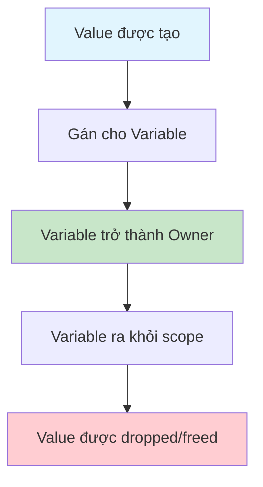
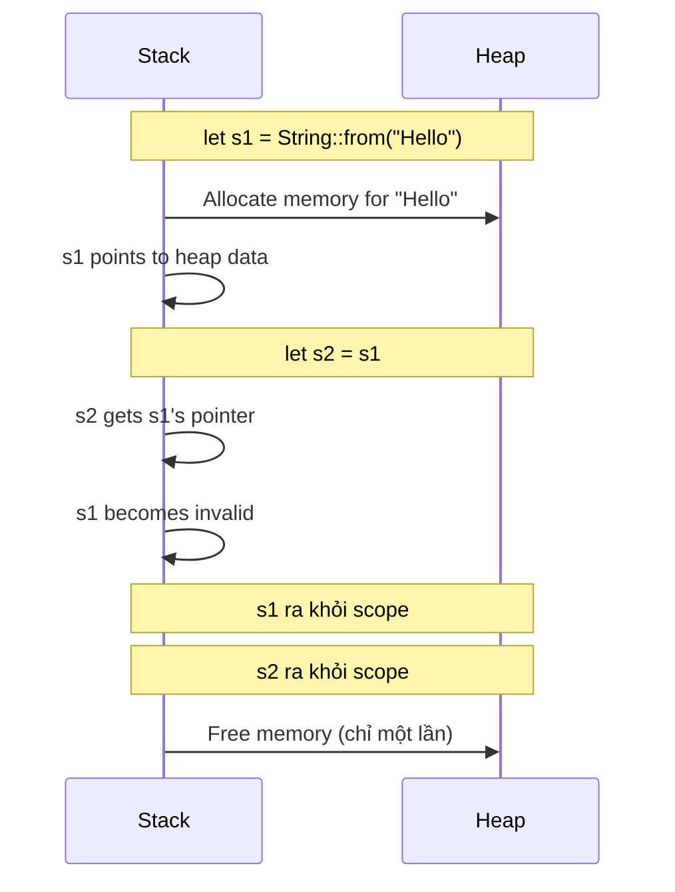
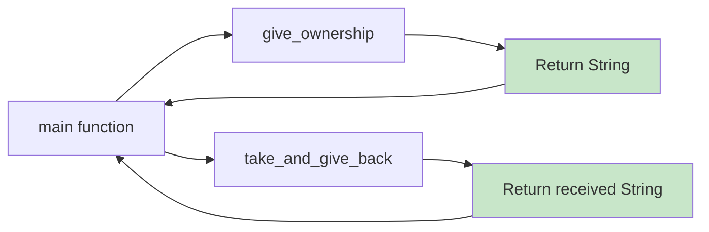
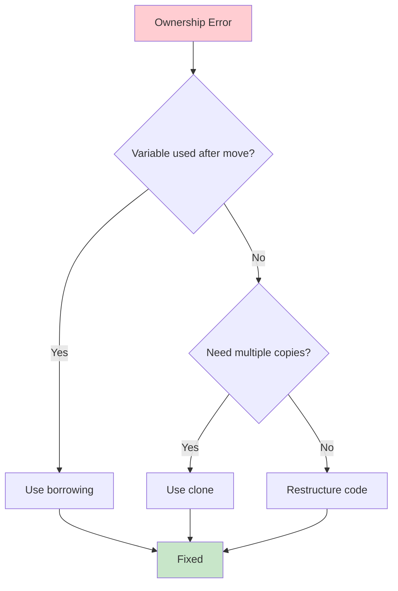

# BÀI 8: OWNERSHIP SYSTEM - CORE CONCEPTS

<div className="bg-gradient-to-r from-blue-50 to-indigo-100 p-6 rounded-lg border-l-4 border-blue-500 mb-8">
  <h2 className="text-2xl font-bold text-blue-900 mb-2">🎯 Mục Tiêu Bài Học</h2>
  <p className="text-blue-800">Hiểu sâu về ownership - tính năng đặc trưng và mạnh mẽ nhất của Rust, đảm bảo memory safety mà không cần garbage collector.</p>
</div>

## 1. Giới Thiệu Ownership System

**Ownership** là hệ thống quản lý bộ nhớ độc đáo của Rust, giúp đảm bảo memory safety tại compile time mà không cần garbage collector.

<div className="bg-yellow-50 border-l-4 border-yellow-400 p-4 my-6">
  <p className="font-semibold text-yellow-800">💡 Tại Sao Ownership Quan Trọng?</p>
  <ul className="list-disc list-inside text-yellow-700 mt-2">
    <li>Ngăn ngừa memory leaks</li>
    <li>Tránh double-free errors</li>
    <li>Loại bỏ dangling pointers</li>
    <li>Đảm bảo thread safety</li>
  </ul>
</div>

### So Sánh Quản Lý Memory

| Phương Pháp | Ngôn Ngữ | Ưu Điểm | Nhược Điểm |
|-------------|----------|---------|------------|
| **Manual** | C/C++ | Hiệu suất cao, kiểm soát tối đa | Dễ có lỗi memory |
| **Garbage Collection** | Java, Python | An toàn, dễ sử dụng | Overhead, pause time |
| **Ownership** | Rust | An toàn + Hiệu suất cao | Learning curve cao |

## 2. Ba Quy Tắc Ownership Cơ Bản

<div className="bg-red-50 border-l-4 border-red-500 p-4 mb-6">
  <h3 className="font-bold text-red-900 mb-3">📜 Quy Tắc Ownership</h3>
  <ol className="list-decimal list-inside text-red-800 space-y-2">
    <li><strong>Mỗi value trong Rust có một owner</strong></li>
    <li><strong>Tại mỗi thời điểm chỉ có một owner</strong></li>
    <li><strong>Khi owner ra khỏi scope, value sẽ được dropped</strong></li>
  </ol>
</div>



## 3. Stack vs Heap Memory

### Stack Memory

<div className="bg-green-50 p-4 rounded-lg mb-4">
  <h4 className="font-bold text-green-900 mb-2">🏠 Stack Characteristics</h4>
  <ul className="text-green-800 space-y-1">
    <li>• Fast access (LIFO - Last In, First Out)</li>
    <li>• Fixed size data</li>
    <li>• Automatic cleanup</li>
    <li>• Known size at compile time</li>
  </ul>
</div>

### Heap Memory

<div className="bg-orange-50 p-4 rounded-lg mb-4">
  <h4 className="font-bold text-orange-900 mb-2">🌊 Heap Characteristics</h4>
  <ul className="text-orange-800 space-y-1">
    <li>• Slower access (pointer indirection)</li>
    <li>• Dynamic size data</li>
    <li>• Manual or automatic cleanup</li>
    <li>• Size determined at runtime</li>
  </ul>
</div>

| Kiểu Dữ Liệu | Vị Trí Lưu Trữ | Lý Do |
|---------------|----------------|--------|
| `i32`, `f64`, `bool` | Stack | Kích thước cố định |
| `String`, `Vec<T>` | Heap | Kích thước động |
| `&str` (string slice) | Stack (pointer) + Stack/Static (data) | Reference |

## 4. Move Semantics

```rust
fn main() {
    // String được lưu trữ trên heap
    let s1 = String::from("Hello");
    let s2 = s1; // s1 được MOVED vào s2
    
    // println!("{}", s1); // ❌ ERROR: s1 không còn valid
    println!("{}", s2); // ✅ OK: s2 là owner mới
}
```



### Khi Nào Move Xảy Ra?

| Trường Hợp | Ví Dụ | Move? |
|-------------|--------|-------|
| **Assignment** | `let s2 = s1;` | ✅ Yes |
| **Function call** | `take_ownership(s1);` | ✅ Yes |
| **Return value** | `return s1;` | ✅ Yes |
| **Copy types** | `let x2 = x1; // i32` | ❌ No (Copy) |

## 5. Copy Trait vs Clone Trait

### Copy Trait

<div className="bg-blue-50 p-4 rounded-lg mb-4">
  <h4 className="font-bold text-blue-900 mb-2">📋 Copy Trait</h4>
  <p className="text-blue-800">Automatic, lightweight copy operation cho các types có kích thước cố định</p>
</div>

```rust
fn main() {
    let x = 5;        // i32 implements Copy
    let y = x;        // x được copy, vẫn valid
    
    println!("x: {}, y: {}", x, y); // ✅ Both are valid
}
```

**Các kiểu implement Copy:**

| Nhóm | Kiểu Dữ Liệu |
|------|-------------|
| **Integers** | `i8`, `i16`, `i32`, `i64`, `i128`, `isize` |
| **Unsigned** | `u8`, `u16`, `u32`, `u64`, `u128`, `usize` |
| **Floats** | `f32`, `f64` |
| **Others** | `bool`, `char` |
| **Tuples** | `(i32, i32)` (nếu tất cả elements đều Copy) |
| **Arrays** | `[i32; 3]` (nếu element type là Copy) |

### Clone Trait

<div className="bg-purple-50 p-4 rounded-lg mb-4">
  <h4 className="font-bold text-purple-900 mb-2">🔄 Clone Trait</h4>
  <p className="text-purple-800">Explicit, potentially expensive deep copy operation</p>
</div>

```rust
fn main() {
    let s1 = String::from("Hello");
    let s2 = s1.clone(); // Explicit clone
    
    println!("s1: {}, s2: {}", s1, s2); // ✅ Both valid
}
```

## 6. Ownership với Functions

### Passing Ownership

```rust
fn take_ownership(s: String) {
    println!("{}", s);
} // s goes out of scope and is dropped

fn main() {
    let s = String::from("Hello");
    take_ownership(s); // s moved into function
    // println!("{}", s); // ❌ ERROR: s no longer valid
}
```

### Returning Ownership

```rust
fn give_ownership() -> String {
    String::from("Hello") // Return moves out
}

fn take_and_give_back(s: String) -> String {
    s // Return moves out
}

fn main() {
    let s1 = give_ownership();
    let s2 = String::from("World");
    let s3 = take_and_give_back(s2);
    
    println!("{} {}", s1, s3);
    // s2 không còn valid, đã moved vào function
}
```



## 7. Scope và RAII (Resource Acquisition Is Initialization)

### Automatic Cleanup

```rust
fn main() {
    {
        let s = String::from("Hello"); // s comes into scope
        // do stuff with s
    } // s goes out of scope, drop is called
    
    // s is no longer valid here
}
```

### Custom Drop Implementation

```rust
struct MyStruct {
    data: String,
}

impl Drop for MyStruct {
    fn drop(&mut self) {
        println!("Dropping MyStruct with data: {}", self.data);
    }
}

fn main() {
    let my_struct = MyStruct {
        data: String::from("Hello"),
    };
    // my_struct will be automatically dropped here
}
```

## 8. Common Ownership Patterns

### Pattern 1: Function Parameters

| Pattern | Use Case | Ownership |
|---------|----------|-----------|
| `fn process(s: String)` | Take ownership | Caller loses ownership |
| `fn process(s: &String)` | Borrow (read-only) | Caller keeps ownership |
| `fn process(s: &mut String)` | Borrow (mutable) | Caller keeps ownership |

### Pattern 2: Return Values

```rust
// ❌ Problematic: Creating and immediately moving
fn bad_pattern() -> String {
    let s = String::from("Hello");
    s // Moves out, but could be optimized
}

// ✅ Better: Direct construction
fn good_pattern() -> String {
    String::from("Hello") // Direct return
}
```

## 9. Debugging Ownership Issues

### Common Compiler Messages

<div className="bg-gray-50 p-4 rounded-lg mb-4">
  <h4 className="font-bold text-gray-900 mb-2">🔍 Error: "value moved here"</h4>
  <pre className="text-sm text-gray-800">
error[E0382]: borrow of moved value: `s`
  --> src/main.rs:4:20
   |
2  |     let s = String::from("hello");
   |         - move occurs because `s` has type `String`
3  |     let s2 = s;
   |              - value moved here
4  |     println!("{}", s);
   |                    ^ value borrowed here after move
  </pre>
</div>

### Debugging Strategy



## 10. Thực Hành

### Bài Tập 1: Ownership Transfer

```rust
fn main() {
    // TODO: Fix ownership issues
    let message = String::from("Hello, World!");
    print_message(message);
    print_length(message); // Error: value moved
}

fn print_message(msg: String) {
    println!("Message: {}", msg);
}

fn print_length(msg: String) {
    println!("Length: {}", msg.len());
}
```

<details>
<summary>💡 Giải pháp</summary>

```rust
fn main() {
    let message = String::from("Hello, World!");
    print_message(&message);    // Borrow instead of move
    print_length(&message);     // Borrow instead of move
}

fn print_message(msg: &String) {  // Take reference
    println!("Message: {}", msg);
}

fn print_length(msg: &String) {   // Take reference
    println!("Length: {}", msg.len());
}
```
</details>

### Bài Tập 2: Ownership với Collections

```rust
fn process_data() -> Vec<String> {
    let mut data = Vec::new();
    
    // TODO: Implement without ownership issues
    let item1 = String::from("Hello");
    let item2 = String::from("World");
    
    data.push(item1);
    data.push(item2);
    
    // Return processed data
    data
}
```

## 11. Tóm Tắt

<div className="bg-indigo-50 border-l-4 border-indigo-500 p-6 mt-8">
  <h3 className="font-bold text-indigo-900 mb-4">📚 Kiến Thức Trọng Tâm</h3>
  
  <div className="grid grid-cols-1 md:grid-cols-2 gap-4">
    <div>
      <h4 className="font-semibold text-indigo-800 mb-2">Core Concepts:</h4>
      <ul className="text-indigo-700 space-y-1">
        <li>• Ba quy tắc ownership</li>
        <li>• Move semantics</li>
        <li>• Stack vs Heap</li>
        <li>• Copy vs Clone</li>
      </ul>
    </div>
    
    <div>
      <h4 className="font-semibold text-indigo-800 mb-2">Best Practices:</h4>
      <ul className="text-indigo-700 space-y-1">
        <li>• Sử dụng references khi possible</li>
        <li>• Clone chỉ khi cần thiết</li>
        <li>• Hiểu compiler messages</li>
        <li>• Design around ownership</li>
      </ul>
    </div>
  </div>
</div>

**Bài tiếp theo:** Bài 9 - Borrowing, References và Slices - Học cách "mượn" data mà không chiếm ownership!