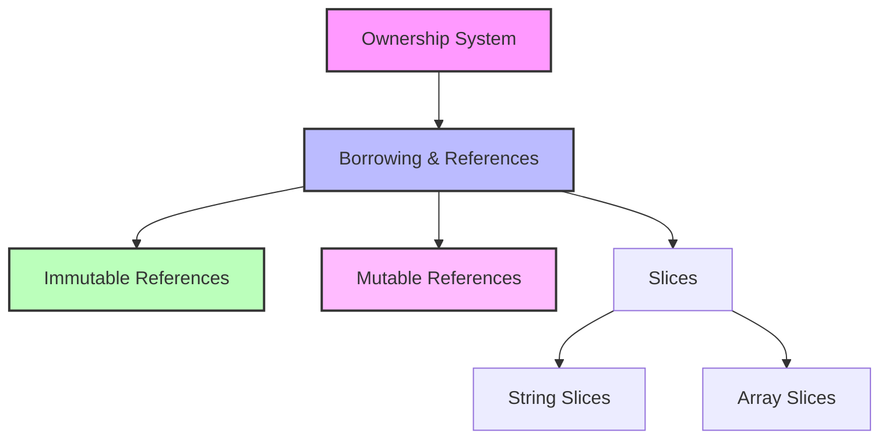
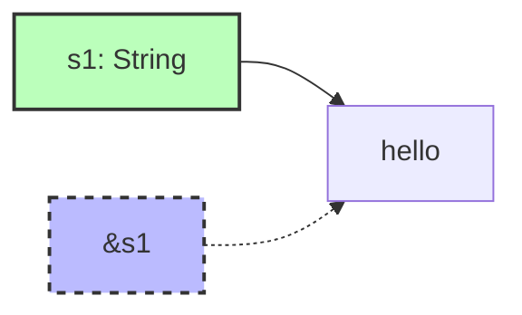
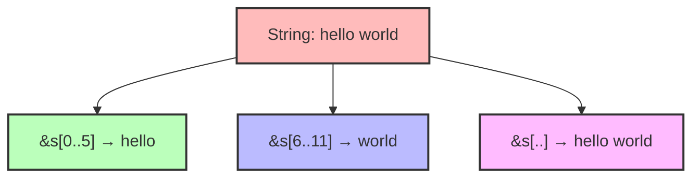
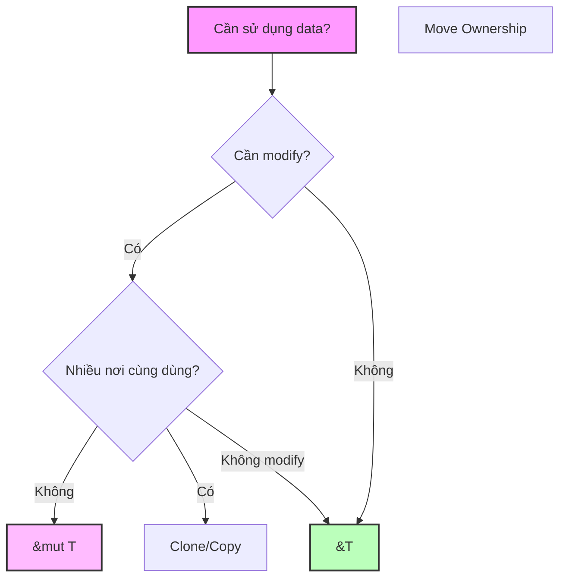

# BÀI 9: BORROWING, REFERENCES VÀ SLICES

<div className="bg-gradient-to-r from-orange-400 to-red-500 text-white p-6 rounded-lg shadow-lg mb-8">
  <h2 className="text-2xl font-bold mb-2">🎯 MỤC TIÊU BÀI HỌC</h2>
  <p className="text-lg">Sử dụng borrowing để truy cập dữ liệu mà không cần chiếm quyền sở hữu (ownership)</p>
</div>

## 📚 TỔNG QUAN

Trong bài này, chúng ta sẽ học về **borrowing** - một khái niệm quan trọng trong Rust cho phép truy cập dữ liệu mà không chiếm quyền sở hữu. Đây là cách Rust đảm bảo memory safety mà vẫn cho phép code linh hoạt và hiệu quả.



## 🔍 1. REFERENCES VÀ BORROWING

### 1.1 Khái Niệm Cơ Bản

<div className="bg-blue-50 border-l-4 border-blue-400 p-4 mb-4">
  <h4 className="font-semibold text-blue-800">💡 Định nghĩa</h4>
  <p><strong>Reference</strong> là một con trỏ cho phép truy cập giá trị mà không chiếm quyền sở hữu.</p>
  <p><strong>Borrowing</strong> là hành động tạo reference đến một giá trị.</p>
</div>

| Loại Reference | Ký Hiệu | Đặc Điểm | Quy Tắc |
|----------------|---------|----------|---------|
| **Immutable** | `&T` | Chỉ đọc | Nhiều references cùng lúc |
| **Mutable** | `&mut T` | Đọc + Ghi | Chỉ 1 reference tại 1 thời điểm |

### 1.2 Immutable References

```rust
fn main() {
    let s1 = String::from("hello");
    let len = calculate_length(&s1);  // Borrowing s1
    
    println!("Chuỗi '{}' có độ dài {}", s1, len);  // s1 vẫn có thể dùng
}

fn calculate_length(s: &String) -> usize {
    s.len()
}  // s ra khỏi scope, nhưng không drop giá trị vì không sở hữu
```



### 1.3 Mutable References

```rust
fn main() {
    let mut s = String::from("hello");
    change(&mut s);
    println!("{}", s);  // "hello, world"
}

fn change(some_string: &mut String) {
    some_string.push_str(", world");
}
```

<div className="bg-yellow-50 border-l-4 border-yellow-400 p-4 mb-4">
  <h4 className="font-semibold text-yellow-800">⚠️ Lưu ý quan trọng</h4>
  <p>Chỉ có thể có <strong>một mutable reference</strong> tại một thời điểm trong cùng scope!</p>
</div>

## 🚫 2. QUY TẮC BORROWING

### 2.1 Bảng Quy Tắc Chi Tiết

| Tình Huống | Immutable Ref | Mutable Ref | Kết Quả |
|------------|---------------|-------------|---------|
| Nhiều `&T` | ✅ | ❌ | OK |
| Một `&mut T` | ❌ | ❌ | OK |
| `&T` + `&mut T` | ❌ | ❌ | Error |

### 2.2 Ví Dụ Vi Phạm Quy Tắc

```rust
// ❌ Lỗi: Không thể có mutable và immutable reference cùng lúc
fn main() {
    let mut s = String::from("hello");
    
    let r1 = &s;        // OK
    let r2 = &s;        // OK  
    let r3 = &mut s;    // ❌ ERROR!
    
    println!("{}, {}, and {}", r1, r2, r3);
}
```

### 2.3 Phạm Vi (Scope) của References

```rust
fn main() {
    let mut s = String::from("hello");

    let r1 = &s;        // immutable reference
    let r2 = &s;        // immutable reference
    println!("{} and {}", r1, r2);
    // r1 và r2 không được sử dụng nữa từ đây

    let r3 = &mut s;    // ✅ OK! 
    println!("{}", r3);
}
```

## 📐 3. SLICES - REFERENCES ĐẾN PHẦN CỦA DỮ LIỆU

### 3.1 String Slices

<div className="bg-green-50 border-l-4 border-green-400 p-4 mb-4">
  <h4 className="font-semibold text-green-800">🎯 String Slice (`&str`)</h4>
  <p>Reference đến một phần của String hoặc string literal</p>
</div>

```rust
fn main() {
    let s = String::from("hello world");
    
    let hello = &s[0..5];   // "hello"
    let world = &s[6..11];  // "world"  
    let whole = &s[..];     // "hello world"
    
    println!("{}, {}, {}", hello, world, whole);
}
```



### 3.2 Cú Pháp Slice Range

| Cú Pháp | Mô Tả | Ví Dụ |
|---------|-------|--------|
| `&s[start..end]` | Từ start đến end-1 | `&s[0..5]` |
| `&s[start..]` | Từ start đến cuối | `&s[6..]` |
| `&s[..end]` | Từ đầu đến end-1 | `&s[..5]` |
| `&s[..]` | Toàn bộ string | `&s[..]` |

### 3.3 Array Slices

```rust
fn main() {
    let a = [1, 2, 3, 4, 5];
    
    let slice = &a[1..4];  // [2, 3, 4]
    println!("{:?}", slice);
    
    // Sử dụng với function
    print_slice(&a[..3]);  // [1, 2, 3]
}

fn print_slice(slice: &[i32]) {
    for item in slice {
        println!("{}", item);
    }
}
```

## 🛠️ 4. FUNCTIONS VỚI REFERENCES

### 4.1 Function Parameters với References

```rust
// Tốt: Sử dụng string slice thay vì String reference
fn first_word(s: &str) -> &str {  // Nhận cả &String và &str
    let bytes = s.as_bytes();
    
    for (i, &item) in bytes.iter().enumerate() {
        if item == b' ' {
            return &s[0..i];
        }
    }
    
    &s[..]
}

fn main() {
    let my_string = String::from("hello world");
    let word = first_word(&my_string[..]);  // String slice
    
    let my_string_literal = "hello world";
    let word = first_word(my_string_literal);  // String literal
}
```

### 4.2 Returning References

<div className="bg-red-50 border-l-4 border-red-400 p-4 mb-4">
  <h4 className="font-semibold text-red-800">⚠️ Dangling References</h4>
  <p>Rust ngăn chặn việc trả về references đến dữ liệu sẽ bị hủy</p>
</div>

```rust
// ❌ Lỗi: Dangling reference
fn dangle() -> &String {  // ERROR!
    let s = String::from("hello");
    &s  // s sẽ bị drop khi function kết thúc
}  

// ✅ Đúng: Return ownership
fn no_dangle() -> String {
    let s = String::from("hello");
    s  // Move ownership ra ngoài
}
```

## 💻 5. THỰC HÀNH: TEXT PROCESSING

### Bài Tập 1: Tìm từ đầu tiên

```rust
fn first_word(s: &str) -> Option<&str> {
    for (i, &byte) in s.as_bytes().iter().enumerate() {
        if byte == b' ' {
            return Some(&s[..i]);
        }
    }
    
    if s.is_empty() {
        None
    } else {
        Some(s)
    }
}

fn main() {
    let sentence = "Rust programming language";
    
    match first_word(sentence) {
        Some(word) => println!("Từ đầu tiên: {}", word),
        None => println!("Chuỗi rỗng"),
    }
}
```

### Bài Tập 2: Search Function

```rust
fn find_substring(text: &str, pattern: &str) -> Option<usize> {
    text.find(pattern)
}

fn count_occurrences(text: &str, pattern: &str) -> usize {
    text.matches(pattern).count()
}

fn main() {
    let text = "Rust is fast. Rust is safe. Rust is productive.";
    let pattern = "Rust";
    
    if let Some(pos) = find_substring(text, pattern) {
        println!("Tìm thấy '{}' tại vị trí: {}", pattern, pos);
    }
    
    let count = count_occurrences(text, pattern);
    println!("'{}' xuất hiện {} lần", pattern, count);
}
```

## 📊 6. SO SÁNH OWNERSHIP VS BORROWING

| Khía Cạnh | Ownership | Borrowing |
|-----------|-----------|-----------|
| **Memory** | Chuyển quyền sở hữu | Chỉ mượn temporary |
| **Performance** | Có thể copy/move | Zero-cost abstractions |
| **Flexibility** | Hạn chế | Linh hoạt hơn |
| **Safety** | Compiler guarantee | Compile-time checks |



## ✅ 7. TÓM TẮT & ĐIỂM QUAN TRỌNG

<div className="bg-gray-50 p-6 rounded-lg">
  <h3 className="text-xl font-bold mb-4 text-gray-800">🔑 Những điểm then chốt</h3>
  
  <div className="grid grid-cols-1 md:grid-cols-2 gap-4">
    <div className="bg-blue-100 p-4 rounded">
      <h4 className="font-semibold text-blue-800">References</h4>
      <ul className="text-sm mt-2 space-y-1">
        <li>• `&T`: immutable reference</li>
        <li>• `&mut T`: mutable reference</li>
        <li>• Zero-cost abstractions</li>
      </ul>
    </div>
    
    <div className="bg-green-100 p-4 rounded">
      <h4 className="font-semibold text-green-800">Borrowing Rules</h4>
      <ul className="text-sm mt-2 space-y-1">
        <li>• Nhiều immutable refs OK</li>
        <li>• Một mutable ref OK</li>
        <li>• Không mix immutable + mutable</li>
      </ul>
    </div>
    
    <div className="bg-purple-100 p-4 rounded">
      <h4 className="font-semibold text-purple-800">Slices</h4>
      <ul className="text-sm mt-2 space-y-1">
        <li>• `&str`: string slices</li>
        <li>• `&[T]`: array slices</li>
        <li>• Range syntax: `[start..end]`</li>
      </ul>
    </div>
    
    <div className="bg-orange-100 p-4 rounded">
      <h4 className="font-semibold text-orange-800">Best Practices</h4>
      <ul className="text-sm mt-2 space-y-1">
        <li>• Prefer `&str` over `&String`</li>
        <li>• Use slices cho flexibility</li>
        <li>• Avoid dangling references</li>
      </ul>
    </div>
  </div>
</div>

---

<div className="bg-gradient-to-r from-green-400 to-blue-500 text-white p-4 rounded-lg mt-8">
  <h3 className="text-lg font-bold">🚀 Bài Tiếp Theo</h3>
  <p>Bài 10: Error Handling - Xử lý errors một cách an toàn với Result và Option</p>
</div>