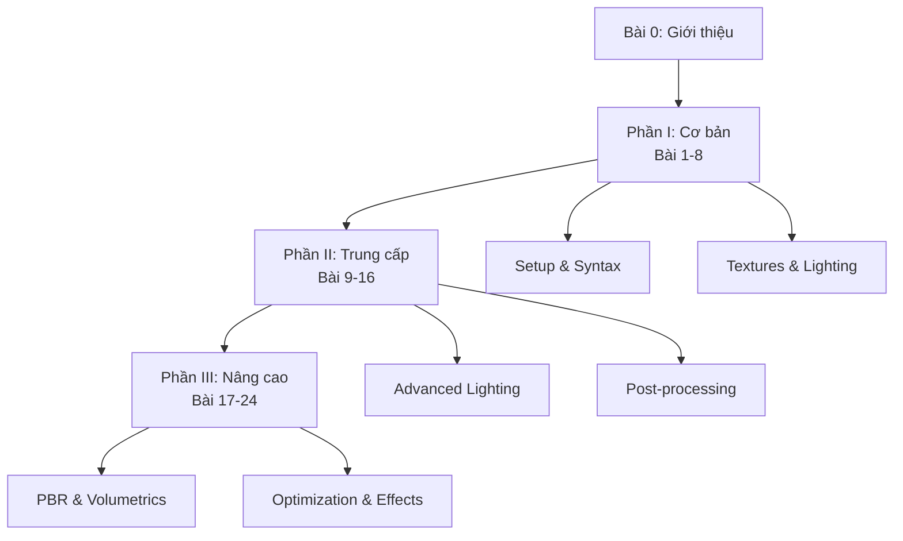
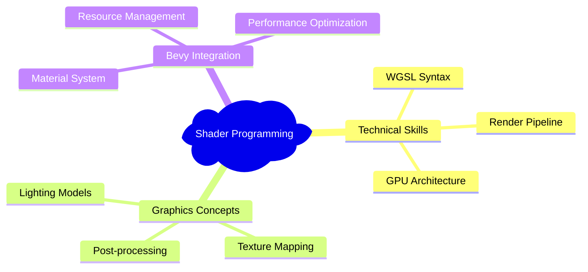
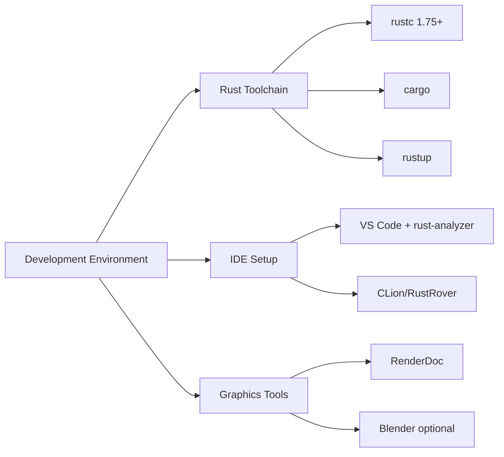

# Bài 0: Giới thiệu Khóa học Shaders với Bevy Rust và WGSL

  <h2 className="text-2xl font-bold mb-4">🎯 Chào mừng đến với thế giới Shaders!</h2>
  
Khóa học toàn diện về lập trình shaders với công nghệ hiện đại nhất

## 📋 Tổng quan khóa học

Khóa học **"Shaders với Bevy Rust và WGSL"** là chương trình học 24 bài được thiết kế để đưa bạn từ người mới bắt đầu trở thành chuyên gia về lập trình đồ họa GPU.

### 🎓 Đối tượng học viên

| Đối tượng | Mô tả | Yêu cầu tiên quyết |
|-----------|-------|-------------------|
| **Beginner** | Lập trình viên Rust mới tiếp cận graphics | Rust cơ bản, toán học cấp 3 |
| **Intermediate** | Developer muốn nâng cao kỹ năng 3D | Kinh nghiệm Rust 6 tháng+ |
| **Advanced** | Game developer chuyên nghiệp | Hiểu biết về graphics pipeline |

### 🛠️ Công nghệ sử dụng

  

    <h3 className="font-bold text-orange-800">🦀 Rust</h3>
    
Ngôn ngữ an toàn, hiệu năng cao

  

  

    <h3 className="font-bold text-blue-800">⚡ Bevy Engine</h3>
    
Game engine hiện đại với ECS

  

  

    <h3 className="font-bold text-green-800">🎨 WGSL</h3>
    
WebGPU Shading Language

  

## 📚 Cấu trúc khóa học

### 📊 Phân bổ nội dung theo cấp độ

| Cấp độ | Số bài | Thời lượng | Trọng tâm |
|--------|--------|------------|-----------|
| **Cơ bản** | 8 bài | 40% | Syntax, textures, lighting cơ bản |
| **Trung cấp** | 8 bài | 35% | Multi-lighting, shadows, post-processing |
| **Nâng cao** | 8 bài | 25% | PBR, compute shaders, optimization |

## 🎯 Mục tiêu học tập

### Kiến thức cốt lõi

### 🏆 Thành quả sau khóa học

  

    

      

        <strong>Sau khi hoàn thành khóa học, bạn sẽ có thể:</strong>
      

      <ul className="mt-2 text-sm text-yellow-600 list-disc list-inside">
        <li>Tạo materials và effects phức tạp trong Bevy</li>
        <li>Implement các lighting model hiện đại (PBR)</li>
        <li>Optimize performance cho mobile và desktop</li>
        <li>Xây dựng post-processing pipeline hoàn chỉnh</li>
      </ul>
    

  

## 💻 Yêu cầu hệ thống

### Hardware tối thiểu

| Component | Yêu cầu tối thiểu | Khuyến nghị |
|-----------|-------------------|-------------|
| **CPU** | 4 cores, 2.5GHz | 8 cores, 3.0GHz+ |
| **RAM** | 8GB | 16GB+ |
| **GPU** | Integrated GPU với Vulkan/DX12 | Dedicated GPU (GTX 1060/RX 580+) |
| **Storage** | 10GB free space | SSD với 20GB+ |

### Software requirements

## 📖 Phương pháp học tập

### 🔄 Cấu trúc mỗi bài học

| Giai đoạn | Thời lượng | Hoạt động |
|-----------|------------|-----------|
| **Warm-up** | 5% | Ôn tập bài trước |
| **Theory** | 25% | Concepts & Math |
| **Live Coding** | 45% | Implementation |
| **Practice** | 20% | Bài tập độc lập |
| **Troubleshooting** | 5% | Debug techniques |

### 💡 Tips học hiệu quả

  <h3 className="text-lg font-semibold text-blue-800 mb-4">💡 Chiến lược học tập hiệu quả</h3>
  

    

      <h4 className="font-medium text-blue-700">📝 Thực hành</h4>
      <ul className="text-sm text-blue-600 mt-2 space-y-1">
        <li>• Code cùng với video</li>
        <li>• Thử nghiệm parameters</li>
        <li>• Làm bài tập đầy đủ</li>
      </ul>
    

    

      <h4 className="font-medium text-blue-700">🔍 Khám phá</h4>
      <ul className="text-sm text-blue-600 mt-2 space-y-1">
        <li>• Đọc documentation</li>
        <li>• Tham gia community</li>
        <li>• Debug và experiment</li>
      </ul>
    

  

## 🗺️ Lộ trình học tập

### Phase 1: Foundation (Tuần 1-4)
- **Mục tiêu**: Thiết lập môi trường và nắm vững cú pháp WGSL
- **Deliverables**: Basic shader effects, texture mapping

### Phase 2: Intermediate Skills (Tuần 5-8)  
- **Mục tiêu**: Lighting models và post-processing
- **Deliverables**: Phong lighting, shadow mapping

### Phase 3: Advanced Mastery (Tuần 9-12)
- **Mục tiêu**: PBR, compute shaders, optimization  
- **Deliverables**: Complete game-ready materials

## 🚀 Chuẩn bị cho bài học đầu tiên

### Checklist chuẩn bị

- [ ] Cài đặt Rust toolchain (rustup, cargo)
- [ ] Setup IDE với rust-analyzer
- [ ] Clone repository template
- [ ] Test build environment
- [ ] Join Discord community

### 🔗 Resources quan trọng

| Loại | Link/Tool | Mục đích |
|------|-----------|----------|
| **Docs** | [Bevy Book](https://bevyengine.org/learn/book/) | Tài liệu chính thức |
| **Reference** | [WGSL Spec](https://gpuweb.github.io/gpuweb/wgsl/) | Cú pháp WGSL |
| **Community** | Discord Server | Q&A và thảo luận |
| **Tools** | RenderDoc | Graphics debugging |

---

  <h3 className="text-lg font-semibold mb-4">🎉 Bạn đã sẵn sàng!</h3>
  

    Khóa học này sẽ mở ra một thế giới mới của lập trình đồ họa. 
    Từ những shader đơn giản đến các effect phức tạp như PBR và volumetric rendering.
  

  

    <strong className="text-blue-600">Tiếp theo: Bài 1 - Giới thiệu về Bevy và WGSL →</strong>
  

