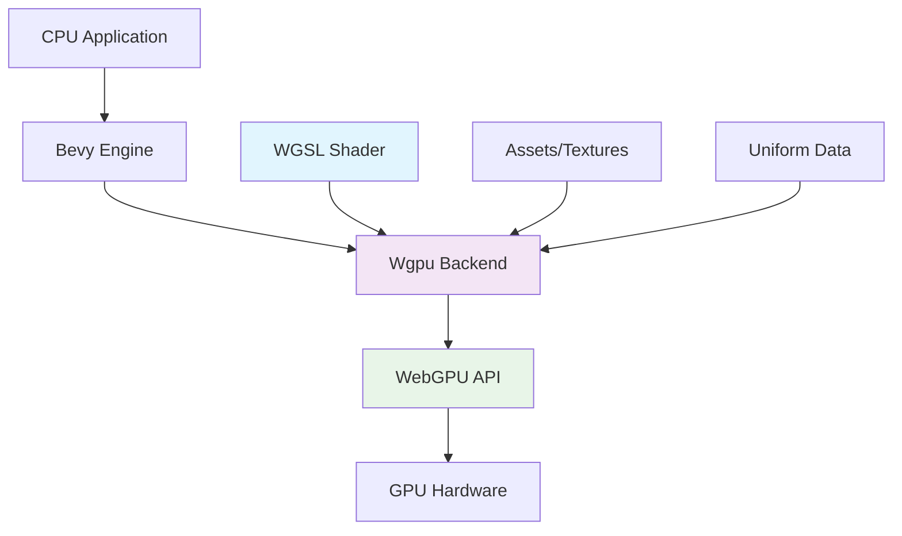
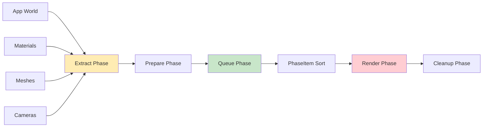

# Bài 1: Giới thiệu về Bevy và WGSL

<div className="bg-gradient-to-r from-blue-50 to-purple-50 p-6 rounded-lg border-l-4 border-blue-500 mb-8">
  <h2 className="text-2xl font-bold text-gray-800 mb-2">🎯 Mục tiêu học tập</h2>
  <ul className="list-disc list-inside space-y-2 text-gray-700">
    <li>Cài đặt và thiết lập môi trường phát triển Bevy (version 0.16+)</li>
    <li>Hiểu về WebGPU Shading Language (WGSL) và sự khác biệt với GLSL/HLSL</li>
    <li>Tạo project Bevy đầu tiên với custom Material và shader đơn giản</li>
    <li>Nắm vững pipeline rendering của Bevy và Wgpu backend</li>
  </ul>
</div>

## 1. Giới thiệu về Bevy Engine

Bevy là một game engine hiện đại được viết bằng Rust, sử dụng Entity Component System (ECS) architecture và WebGPU rendering backend. Điều này làm cho Bevy trở thành lựa chọn tuyệt vời để học về shader programming.

### 1.1 Ưu điểm của Bevy trong Shader Development

| Đặc điểm | Lợi ích | So sánh với Engine khác |
|----------|---------|-------------------------|
| **WebGPU Backend** | API hiện đại, cross-platform | Unity/Unreal sử dụng API cũ hơn |
| **WGSL Native** | Syntax đơn giản, dễ debug | GLSL/HLSL phức tạp hơn |
| **Hot Reloading** | Shader compile real-time | Yêu cầu restart trong nhiều engine |
| **Type Safety** | Rust compile-time checking | C++ runtime errors |

### 1.2 WebGPU và WGSL Overview

WebGPU là API graphics tiế thế hệ, được thiết kế để thay thế OpenGL và Direct3D. WGSL (WebGPU Shading Language) là shader language chính thức của WebGPU.



## 2. Cài đặt Môi trường Phát triển

### 2.1 System Requirements

<div className="bg-yellow-50 border border-yellow-200 rounded-lg p-4 mb-4">
  <h4 className="font-semibold text-yellow-800 mb-2">⚠️ Yêu cầu hệ thống</h4>
  <ul className="text-sm text-yellow-700 space-y-1">
    <li><strong>GPU:</strong> Hỗ trợ Vulkan/DirectX 12/Metal</li>
    <li><strong>RAM:</strong> 8GB+ (16GB khuyến nghị)</li>
    <li><strong>Storage:</strong> 10GB+ cho development environment</li>
    <li><strong>OS:</strong> Windows 10+, macOS 10.15+, Linux</li>
  </ul>
</div>

### 2.2 Installation Steps

**Bước 1: Cài đặt Rust**
```bash
# Cài đặt Rust thông qua rustup
curl --proto '=https' --tlsv1.2 -sSf https://sh.rustup.rs | sh
source $HOME/.cargo/env

# Kiểm tra version
rustc --version
cargo --version
```

**Bước 2: Tạo Bevy Project**
```bash
# Tạo project mới
cargo new shader_learning --bin
cd shader_learning

# Thêm dependencies vào Cargo.toml
```

**Bước 3: Cấu hình Cargo.toml**
```toml
[package]
name = "shader_learning"
version = "0.1.0"
edition = "2021"

[dependencies]
bevy = { version = "0.16", features = ["dynamic_linking"] }

[profile.dev]
opt-level = 1

[profile.dev.package."*"]
opt-level = 3
```

### 2.3 Development Tools Setup

| Tool | Mục đích | Cài đặt |
|------|----------|---------|
| **VS Code** | IDE chính | Download từ code.visualstudio.com |
| **rust-analyzer** | Language Server | Extension trong VS Code |
| **RenderDoc** | Graphics Debugging | renderdoc.org |
| **Cargo Watch** | Auto-rebuild | `cargo install cargo-watch` |

## 3. WGSL vs Other Shading Languages

### 3.1 So sánh Syntax

**WGSL (Modern):**
```wgsl
// Vertex Shader
@vertex
fn vs_main(
    @location(0) position: vec3<f32>
) -> @builtin(position) vec4<f32> {
    return vec4<f32>(position, 1.0);
}
```

**GLSL (Legacy):**
```glsl
// Vertex Shader
#version 330 core
layout (location = 0) in vec3 position;

void main() {
    gl_Position = vec4(position, 1.0);
}
```

### 3.2 Sự khác biệt chính

| Aspect | WGSL | GLSL | HLSL |
|--------|------|------|------|
| **Syntax** | Rust-inspired, modern | C-like, verbose | C-like, Microsoft |
| **Type System** | Strongly typed | Weakly typed | Moderately typed |
| **Error Messages** | Clear, descriptive | Cryptic | Good but Windows-only |
| **Platform Support** | Cross-platform | OpenGL only | DirectX primarily |
| **Future-proof** | Yes (WebGPU standard) | Legacy | Platform-specific |

## 4. Bevy Rendering Pipeline

### 4.1 Render Graph Architecture



### 4.2 Render Phases trong Bevy

| Phase | Mục đích | Thread | Example Usage |
|-------|----------|--------|---------------|
| **Extract** | Thu thập data từ World | Main | Entity queries, component extraction |
| **Prepare** | Chuẩn bị GPU resources | Render | Buffer updates, texture uploads |
| **Queue** | Tạo draw calls | Render | Material binding, pipeline setup |
| **Render** | Thực thi GPU commands | Render | Actual drawing, compute dispatch |

## 5. Tạo First Shader Project

### 5.1 Basic Application Setup

```rust
use bevy::prelude::*;

fn main() {
    App::new()
        .add_plugins(DefaultPlugins)
        .add_systems(Startup, setup)
        .run();
}

fn setup(
    mut commands: Commands,
    mut meshes: ResMut<Assets<Mesh>>,
    mut materials: ResMut<Assets<StandardMaterial>>,
) {
    // Camera
    commands.spawn(Camera3dBundle {
        transform: Transform::from_xyz(0.0, 0.0, 5.0)
            .looking_at(Vec3::ZERO, Vec3::Y),
        ..default()
    });
    
    // Light
    commands.spawn(PointLightBundle {
        transform: Transform::from_xyz(4.0, 5.0, 4.0),
        ..default()
    });
    
    // Cube với material mặc định
    commands.spawn(PbrBundle {
        mesh: meshes.add(Mesh::from(Cuboid::new(2.0, 2.0, 2.0))),
        material: materials.add(StandardMaterial {
            base_color: Color::BLUE,
            ..default()
        }),
        ..default()
    });
}
```

### 5.2 Custom Material Implementation

```rust
use bevy::{
    pbr::{Material, MaterialPlugin},
    render::render_resource::{AsBindGroup, ShaderRef},
};

#[derive(Asset, TypePath, AsBindGroup, Debug, Clone)]
pub struct CustomMaterial {
    #[uniform(0)]
    pub color: Vec4,
    #[uniform(0)]
    pub time: f32,
}

impl Material for CustomMaterial {
    fn fragment_shader() -> ShaderRef {
        "shaders/custom_material.wgsl".into()
    }
}

// Trong main function
fn main() {
    App::new()
        .add_plugins((
            DefaultPlugins,
            MaterialPlugin::<CustomMaterial>::default(),
        ))
        .add_systems(Startup, setup)
        .add_systems(Update, update_material)
        .run();
}
```

### 5.3 First WGSL Shader

Tạo file `assets/shaders/custom_material.wgsl`:

```wgsl
#import bevy_pbr::forward_io::VertexOutput

struct CustomMaterial {
    color: vec4<f32>,
    time: f32,
};

@group(2) @binding(0)
var<uniform> material: CustomMaterial;

@fragment
fn fragment(
    mesh: VertexOutput,
) -> @location(0) vec4<f32> {
    // Tạo hiệu ứng color cycling
    let time_factor = sin(material.time) * 0.5 + 0.5;
    let animated_color = material.color * time_factor;
    
    return vec4<f32>(animated_color.rgb, 1.0);
}
```

## 6. Debug Tools và Troubleshooting

### 6.1 Common Shader Errors

<div className="bg-red-50 border border-red-200 rounded-lg p-4 mb-4">
  <h4 className="font-semibold text-red-800 mb-2">🚫 Lỗi thường gặp</h4>
  <div className="text-sm text-red-700 space-y-2">
    <div><strong>Compilation Error:</strong> Syntax sai trong WGSL</div>
    <div><strong>Binding Error:</strong> Uniform binding không đúng</div>
    <div><strong>Type Mismatch:</strong> Kiểu dữ liệu không khớp</div>
    <div><strong>Resource Error:</strong> Texture hoặc buffer không tồn tại</div>
  </div>
</div>

### 6.2 Debugging Techniques

| Technique | Usage | Example |
|-----------|-------|---------|
| **Console Logs** | Rust-side debugging | `println!("Material: {:?}", material)` |
| **Shader Validation** | WGSL compile errors | Check terminal output |
| **RenderDoc** | GPU frame debugging | Capture frame, inspect draw calls |
| **Hot Reloading** | Live shader editing | Modify .wgsl files without restart |

### 6.3 Performance Monitoring

```rust
// Thêm FPS counter
use bevy::diagnostic::{DiagnosticsStore, FrameTimeDiagnosticsPlugin};

fn main() {
    App::new()
        .add_plugins((
            DefaultPlugins,
            FrameTimeDiagnosticsPlugin::default(),
        ))
        .add_systems(Update, fps_counter_system)
        .run();
}

fn fps_counter_system(diagnostics: Res<DiagnosticsStore>) {
    if let Some(fps) = diagnostics.get(&FrameTimeDiagnosticsPlugin::FPS) {
        if let Some(value) = fps.smoothed() {
            println!("FPS: {:.2}", value);
        }
    }
}
```

## 7. Bài tập thực hành

### 7.1 Exercise 1: Color Animation

**Mục tiêu:** Tạo một cube thay đổi màu theo thời gian

**Yêu cầu:**
- Sử dụng CustomMaterial
- Implement color transition: Red → Green → Blue → Red
- Chu kỳ 3 giây

**Gợi ý:**
```wgsl
// Trong fragment shader
let cycle = (material.time % 3.0) / 3.0;
let r = sin(cycle * 6.28318) * 0.5 + 0.5;
let g = sin((cycle + 0.33) * 6.28318) * 0.5 + 0.5;
let b = sin((cycle + 0.66) * 6.28318) * 0.5 + 0.5;
```

### 7.2 Exercise 2: Multiple Materials

**Mục tiêu:** Tạo nhiều objects với materials khác nhau

**Yêu cầu:**
- 3 cubes với 3 materials khác nhau
- Mỗi material có tốc độ animation khác nhau
- Sắp xếp thành hàng ngang

## 8. Tài liệu tham khảo

### 8.1 Official Documentation

| Resource | URL | Mô tả |
|----------|-----|--------|
| **Bevy Book** | bevyengine.org/learn/book | Hướng dẫn chính thức |
| **WGSL Spec** | w3.org/TR/WGSL | WebGPU Shading Language specification |
| **Wgpu Guide** | sotrh.github.io/learn-wgpu | WebGPU programming guide |

### 8.2 Community Resources

<div className="grid grid-cols-1 md:grid-cols-2 gap-4">
  <div className="bg-green-50 p-4 rounded-lg">
    <h4 className="font-bold text-green-800 mb-2">🌟 Learning Resources</h4>
    <ul className="text-sm text-green-700 space-y-1">
      <li>Bevy Discord Community</li>
      <li>r/rust_gamedev Reddit</li>
      <li>Bevy Assets Collection</li>
      <li>Shader examples on GitHub</li>
    </ul>
  </div>
  
  <div className="bg-purple-50 p-4 rounded-lg">
    <h4 className="font-bold text-purple-800 mb-2">🔧 Tools & Extensions</h4>
    <ul className="text-sm text-purple-700 space-y-1">
      <li>VS Code WGSL extension</li>
      <li>Bevy Inspector Egui</li>
      <li>Cargo expand for macro debugging</li>
      <li>RenderDoc integration</li>
    </ul>
  </div>
</div>

## 9. Tóm tắt và Chuẩn bị cho Bài 2

### 9.1 Kiến thức đã học

<div className="bg-blue-50 p-6 rounded-lg">
  <h4 className="font-bold text-blue-800 mb-3">✅ Checklist kiến thức</h4>
  <div className="grid grid-cols-2 gap-4 text-sm">
    <div>
      <p className="font-semibold mb-2">Setup & Environment:</p>
      <ul className="space-y-1 text-blue-700">
        <li>☑️ Rust và Cargo installation</li>
        <li>☑️ Bevy project setup</li>
        <li>☑️ Development tools</li>
      </ul>
    </div>
    <div>
      <p className="font-semibold mb-2">Shader Concepts:</p>
      <ul className="space-y-1 text-blue-700">
        <li>☑️ WGSL vs GLSL differences</li>
        <li>☑️ Custom Material creation</li>
        <li>☑️ Basic fragment shader</li>
      </ul>
    </div>
  </div>
</div>

### 9.2 Preview Bài 2

**Bài 2: Cấu trúc cơ bản của WGSL shader** sẽ tập trung vào:
- WGSL syntax chi tiết
- Vertex shader programming  
- Data types và functions
- Input/Output handling
- Debug techniques nâng cao

---

<div className="mt-8 p-4 bg-gray-100 rounded-lg text-center">
  <p className="text-gray-600 text-sm">
    <strong>Lưu ý:</strong> Hãy đảm bảo hoàn thành tất cả exercises trước khi chuyển sang bài tiếp theo. 
    Nếu gặp vấn đề, tham khao phần troubleshooting hoặc cộng đồng Bevy Discord.
  </p>
</div>