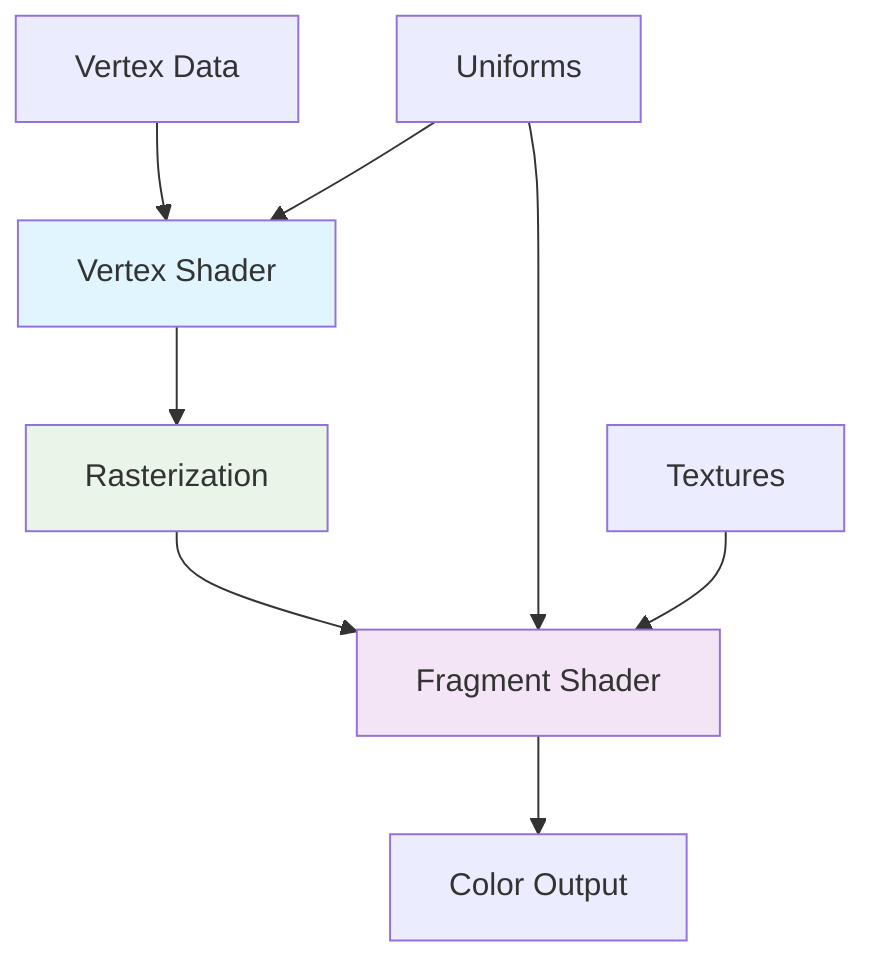
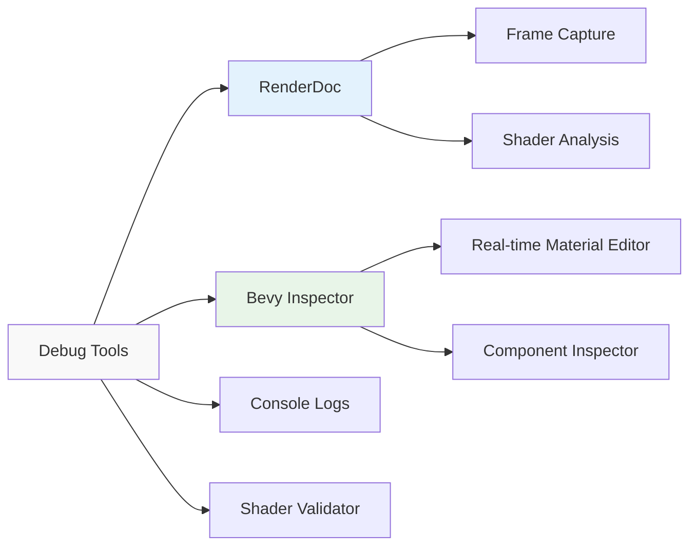

# Bài 2: Cấu trúc cơ bản của WGSL shader

<div className="bg-gradient-to-r from-blue-50 to-purple-50 p-6 rounded-lg border-l-4 border-blue-500 mb-8">
  <h2 className="text-2xl font-bold text-gray-800 mb-2">🎯 Mục tiêu học tập</h2>
  <ul className="list-disc list-inside space-y-2 text-gray-700">
    <li>Nắm vững syntax cơ bản của WGSL (variables, functions, types)</li>
    <li>Hiểu rõ về vertex input và fragment output trong pipeline rendering</li>
    <li>Tạo được vertex shader đơn giản để vẽ hình tam giác</li>
    <li>Làm việc thành thạo với các kiểu dữ liệu: vec2, vec3, vec4, mat4</li>
    <li>Tạo fragment shader để tô màu cơ bản</li>
    <li>Debug và khắc phục lỗi shader hiệu quả</li>
  </ul>
</div>

## 📚 Lý thuyết cơ bản

### 1. WebGPU Shading Language (WGSL) là gì?

**WGSL** là ngôn ngữ shader chính thức của WebGPU, được thiết kế để:
- Chạy native trên mọi platform (Windows, macOS, Linux, Web)
- Cung cấp syntax hiện đại và type-safe
- Tối ưu hóa hiệu suất cho GPU hiện đại

### 2. So sánh WGSL với các ngôn ngữ shader khác

| Đặc điểm | WGSL | GLSL | HLSL |
|----------|------|------|------|
| **Platform** | Cross-platform | OpenGL/Vulkan | DirectX |
| **Type System** | Strict typing | Loose typing | Medium typing |
| **Syntax** | Rust-like | C-like | C++-like |
| **Memory Model** | Explicit | Implicit | Mixed |
| **Precision** | Explicit | Varying | Explicit |

## 🏗️ Cấu trúc Rendering Pipeline



<div className="bg-yellow-50 border-l-4 border-yellow-400 p-4 my-6">
  <div className="flex">
    <div className="flex-shrink-0">
      <svg className="h-5 w-5 text-yellow-400" fill="currentColor" viewBox="0 0 20 20">
        <path fillRule="evenodd" d="M8.257 3.099c.765-1.36 2.722-1.36 3.486 0l5.58 9.92c.75 1.334-.213 2.98-1.742 2.98H4.42c-1.53 0-2.493-1.646-1.743-2.98l5.58-9.92zM11 13a1 1 0 11-2 0 1 1 0 012 0zm-1-8a1 1 0 00-1 1v3a1 1 0 002 0V6a1 1 0 00-1-1z" clipRule="evenodd" />
      </svg>
    </div>
    <div className="ml-3">
      <p className="text-sm text-yellow-700">
        <strong>Lưu ý quan trọng:</strong> Vertex Shader xử lý từng vertex riêng biệt, trong khi Fragment Shader xử lý từng pixel được rasterize.
      </p>
    </div>
  </div>
</div>

## 🔧 Cấu trúc cơ bản của WGSL Shader

### 1. Kiểu dữ liệu cơ bản

| Kiểu dữ liệu | Mô tả | Ví dụ sử dụng |
|--------------|--------|---------------|
| `f32` | Số thực 32-bit | `var position: f32 = 1.5;` |
| `i32` | Số nguyên 32-bit có dấu | `var count: i32 = 10;` |
| `u32` | Số nguyên 32-bit không dấu | `var index: u32 = 0u;` |
| `bool` | Boolean | `var is_visible: bool = true;` |
| `vec2<f32>` | Vector 2D | `var uv: vec2<f32> = vec2(0.5, 0.5);` |
| `vec3<f32>` | Vector 3D | `var color: vec3<f32> = vec3(1.0, 0.0, 0.0);` |
| `vec4<f32>` | Vector 4D | `var position: vec4<f32> = vec4(0.0, 0.0, 0.0, 1.0);` |
| `mat4x4<f32>` | Ma trận 4x4 | `var transform: mat4x4<f32>;` |

### 2. Cấu trúc Vertex Input và Output

```wgsl
// Vertex Input Structure
struct VertexInput {
    @location(0) position: vec3<f32>,    // Vị trí vertex
    @location(1) color: vec3<f32>,       // Màu sắc vertex
    @location(2) uv: vec2<f32>,          // Tọa độ texture
}

// Vertex Output Structure  
struct VertexOutput {
    @builtin(position) position: vec4<f32>,  // Vị trí trong clip space
    @location(0) color: vec3<f32>,           // Màu sắc interpolated
    @location(1) uv: vec2<f32>,              // UV coordinates
}
```

## 💡 Tạo Vertex Shader đầu tiên

<div className="bg-blue-50 p-6 rounded-lg mb-6">
  <h3 className="text-lg font-semibold text-blue-800 mb-3">🚀 Thực hành: Vertex Shader cơ bản</h3>

### Bước 1: Tạo Vertex Shader vẽ tam giác

```wgsl
// vertex_shader.wgsl
struct VertexInput {
    @location(0) position: vec3<f32>,
    @location(1) color: vec3<f32>,
}

struct VertexOutput {
    @builtin(position) clip_position: vec4<f32>,
    @location(0) color: vec3<f32>,
}

@vertex
fn vs_main(vertex: VertexInput) -> VertexOutput {
    var output: VertexOutput;
    
    // Chuyển đổi position từ 3D sang clip space 4D
    output.clip_position = vec4<f32>(vertex.position, 1.0);
    
    // Truyền màu sắc xuống fragment shader
    output.color = vertex.color;
    
    return output;
}
```

### Bước 2: Tạo Fragment Shader

```wgsl
// fragment_shader.wgsl
struct FragmentInput {
    @location(0) color: vec3<f32>,
}

@fragment  
fn fs_main(input: FragmentInput) -> @location(0) vec4<f32> {
    // Trả về màu sắc với alpha = 1.0 (không trong suốt)
    return vec4<f32>(input.color, 1.0);
}
```

</div>

## 🎨 Tích hợp với Bevy Engine

### 1. Tạo Custom Material trong Bevy

```rust
// src/triangle_material.rs
use bevy::{
    prelude::*,
    reflect::TypeUuid,
    render::render_resource::*,
};

#[derive(AsBindGroup, TypeUuid, Debug, Clone)]
#[uuid = "f690fdae-d598-45ab-8225-97e2a3f056e0"]
pub struct TriangleMaterial {
    #[uniform(0)]
    pub base_color: Color,
}

impl Material for TriangleMaterial {
    fn vertex_shader() -> ShaderRef {
        "shaders/triangle_vertex.wgsl".into()
    }

    fn fragment_shader() -> ShaderRef {
        "shaders/triangle_fragment.wgsl".into()
    }
}
```

### 2. Setup Bevy App

```rust
// src/main.rs
use bevy::{prelude::*, render::mesh::Indices};

fn main() {
    App::new()
        .add_plugins(DefaultPlugins)
        .add_plugin(MaterialPlugin::<TriangleMaterial>::default())
        .add_startup_system(setup)
        .run();
}

fn setup(
    mut commands: Commands,
    mut meshes: ResMut<Assets<Mesh>>,
    mut materials: ResMut<Assets<TriangleMaterial>>,
) {
    // Tạo mesh tam giác
    let triangle_mesh = create_triangle_mesh();
    
    // Spawn entity với triangle mesh
    commands.spawn(MaterialMeshBundle {
        mesh: meshes.add(triangle_mesh),
        material: materials.add(TriangleMaterial {
            base_color: Color::RED,
        }),
        ..default()
    });
    
    // Camera
    commands.spawn(Camera3dBundle {
        transform: Transform::from_xyz(0.0, 0.0, 5.0),
        ..default()
    });
}

fn create_triangle_mesh() -> Mesh {
    let vertices = vec![
        // Position        // Color
        [0.0, 0.5, 0.0],   [1.0, 0.0, 0.0], // Đỉnh trên - đỏ
        [-0.5, -0.5, 0.0], [0.0, 1.0, 0.0], // Đỉnh trái - xanh lá
        [0.5, -0.5, 0.0],  [0.0, 0.0, 1.0], // Đỉnh phải - xanh dương
    ];
    
    let indices = vec![0, 1, 2]; // Thứ tự vertices
    
    let mut mesh = Mesh::new(PrimitiveTopology::TriangleList);
    
    // Tách positions và colors
    let positions: Vec<[f32; 3]> = vertices.iter()
        .map(|v| [v[0], v[1], v[2]]).collect();
    let colors: Vec<[f32; 3]> = vertices.iter()
        .map(|v| [v[3], v[4], v[5]]).collect();
    
    mesh.insert_attribute(Mesh::ATTRIBUTE_POSITION, positions);
    mesh.insert_attribute(Mesh::ATTRIBUTE_COLOR, colors);
    mesh.set_indices(Some(Indices::U32(indices)));
    
    mesh
}
```

## 🔍 Debug và Troubleshooting

### Các lỗi thường gặp và cách khắc phục

<div className="overflow-x-auto">
  <table className="w-full border-collapse border border-gray-300 bg-white">
    <thead className="bg-gray-50">
      <tr>
        <th className="border border-gray-300 px-4 py-2 text-left font-medium text-gray-700">Lỗi</th>
        <th className="border border-gray-300 px-4 py-2 text-left font-medium text-gray-700">Nguyên nhân</th>
        <th className="border border-gray-300 px-4 py-2 text-left font-medium text-gray-700">Giải pháp</th>
      </tr>
    </thead>
    <tbody>
      <tr className="hover:bg-gray-50">
        <td className="border border-gray-300 px-4 py-2 font-mono text-sm">Shader compilation error</td>
        <td className="border border-gray-300 px-4 py-2">Syntax sai trong WGSL</td>
        <td className="border border-gray-300 px-4 py-2">Kiểm tra syntax, missing semicolons</td>
      </tr>
      <tr className="hover:bg-gray-50">
        <td className="border border-gray-300 px-4 py-2 font-mono text-sm">Binding mismatch</td>
        <td className="border border-gray-300 px-4 py-2">@location không khớp</td>
        <td className="border border-gray-300 px-4 py-2">Đảm bảo vertex output = fragment input</td>
      </tr>
      <tr className="hover:bg-gray-50">
        <td className="border border-gray-300 px-4 py-2 font-mono text-sm">Black screen</td>
        <td className="border border-gray-300 px-4 py-2">Vertices ngoài clip space</td>
        <td className="border border-gray-300 px-4 py-2">Kiểm tra position values [-1, 1] range</td>
      </tr>
      <tr className="hover:bg-gray-50">
        <td className="border border-gray-300 px-4 py-2 font-mono text-sm">Wrong colors</td>
        <td className="border border-gray-300 px-4 py-2">Color range không đúng</td>
        <td className="border border-gray-300 px-4 py-2">Sử dụng [0.0, 1.0] cho màu sắc</td>
      </tr>
    </tbody>
  </table>
</div>

### Tools Debug hữu ích



## 🏋️ Bài tập thực hành

<div className="bg-green-50 border-l-4 border-green-400 p-6 my-6">
  <h3 className="text-lg font-semibold text-green-800 mb-3">💪 Thử thách</h3>
  
### Bài tập 1: Tạo hình vuông có màu gradient

**Yêu cầu:**
- Tạo mesh hình vuông với 4 vertices
- Mỗi góc có màu sắc khác nhau
- Sử dụng indices để tạo 2 tam giác

### Bài tập 2: Animation đơn giản

**Yêu cầu:**
- Thêm uniform `time` vào shader
- Tạo hiệu ứng xoay tam giác
- Thay đổi màu sắc theo thời gian

### Bài tập 3: Multiple shapes

**Yêu cầu:**
- Tạo nhiều hình dạng khác nhau
- Sử dụng cùng một shader
- Áp dụng transforms khác nhau

</div>

## 🎓 Tóm tắt kiến thức

### Checklist kiến thức cần nắm vững:

- [ ] **Syntax WGSL cơ bản**: Variables, functions, structs
- [ ] **Kiểu dữ liệu**: vec2, vec3, vec4, mat4x4
- [ ] **Vertex Input/Output**: @location, @builtin attributes  
- [ ] **Vertex Shader**: Xử lý position và attributes
- [ ] **Fragment Shader**: Tạo màu sắc cho pixels
- [ ] **Bevy Integration**: Material trait, mesh creation
- [ ] **Debug Skills**: Troubleshooting và error fixing

### Điểm chuẩn đánh giá:

| Mức độ | Mô tả | Tiêu chí |
|--------|-------|----------|
| **Cơ bản** | Hiểu syntax WGSL | Tạo được shader đơn giản không lỗi |
| **Trung bình** | Tích hợp Bevy thành công | Render được hình tam giác với màu |
| **Khá** | Custom materials | Tạo được nhiều shapes khác nhau |
| **Giỏi** | Animation cơ bản | Thêm được movement và color animation |

---

<div className="bg-blue-100 border border-blue-300 rounded-lg p-6 mt-8">
  <h3 className="text-xl font-bold text-blue-800 mb-3">📋 Chuẩn bị cho Bài 3</h3>
  <p className="text-blue-700 mb-4">
    Trong bài học tiếp theo, chúng ta sẽ tìm hiểu về <strong>Uniforms và Bindings trong Bevy</strong> - cách truyền dữ liệu từ CPU sang GPU một cách hiệu quả.
  </p>
  
  <h4 className="font-semibold text-blue-800 mb-2">Kiến thức cần ôn tập:</h4>
  <ul className="list-disc list-inside text-blue-700 space-y-1">
    <li>Cách tạo struct trong WGSL</li>
    <li>Hiểu về binding trong GPU programming</li>
    <li>Bevy Material trait và custom properties</li>
    <li>Rust ownership và borrowing (để hiểu uniform buffers)</li>
  </ul>
  
  <div className="mt-4 p-3 bg-blue-50 rounded">
    <p className="text-sm text-blue-600">
      <strong>💡 Tip:</strong> Thực hành tạo thêm nhiều shapes và thử nghiệm với các màu sắc khác nhau để làm quen với vertex attributes!
    </p>
  </div>
</div>