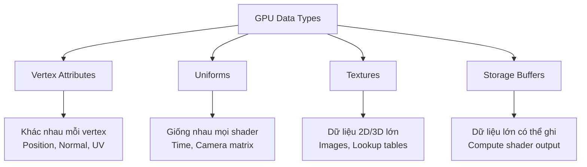
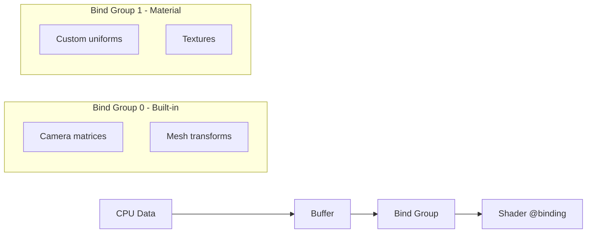

# Bài 3: Uniforms và Bindings trong Bevy

<div className="bg-gradient-to-r from-blue-50 to-indigo-50 p-6 rounded-lg border-l-4 border-blue-500 mb-8">
  <h2 className="text-2xl font-bold text-blue-800 mb-2">🎯 Mục tiêu bài học</h2>
  <p className="text-blue-700">
    Hiểu và thành thạo cách truyền dữ liệu từ CPU sang GPU thông qua uniform buffers, 
    tạo Material trait tùy chỉnh và implement uniform binding trong WGSL để tạo shader động.
  </p>
</div>

## 📚 Kiến thức cần ôn tập

Trước khi bắt đầu bài này, hãy đảm bảo bạn đã nắm vững:

| Khái niệm | Mô tả | Từ bài học |
|-----------|--------|-------------|
| **WGSL Syntax** | Cú pháp cơ bản, types, functions | Bài 2 |
| **Vertex/Fragment** | Hiểu về vertex input và fragment output | Bài 2 |
| **Bevy Materials** | Khái niệm cơ bản về Material system | Bài 2 |

## 🔍 Khái niệm Uniforms và ý nghĩa

### Uniforms là gì?

<div className="bg-yellow-50 border-l-4 border-yellow-400 p-4 my-6">
  <div className="flex">
    <div className="ml-3">
      <p className="text-sm text-yellow-700">
        <strong>Uniform</strong> là dữ liệu được truyền từ CPU sang GPU và có giá trị <em>đồng nhất</em> 
        (uniform) cho tất cả các vertices hoặc fragments trong một draw call.
      </p>
    </div>
  </div>
</div>

**Đặc điểm chính của Uniforms:**

| Đặc điểm | Mô tả | Ví dụ |
|----------|--------|-------|
| **Giá trị không đổi** | Trong một draw call, uniform có cùng giá trị cho mọi shader invocation | `time: 1.25` cho tất cả pixels |
| **CPU → GPU** | Được cập nhật từ phía CPU | Rust code → WGSL shader |
| **Hiệu suất cao** | Được cache và optimize bởi GPU | Truy cập nhanh hơn textures |
| **Kích thước hạn chế** | Có giới hạn về dung lượng buffer | Thường 64KB - 256KB |

### So sánh với các loại dữ liệu khác



## 🏗️ Cấu trúc Uniform Buffer trong WGSL

### Khai báo cơ bản

```rust
// WGSL - Shader code
struct TimeUniform {
    time: f32,
    delta_time: f32,
    frame_count: u32,
    _padding: u32,  // Alignment padding
}

@group(1) @binding(0)
var<uniform> time_uniform: TimeUniform;
```

### Memory Alignment Rules

<div className="bg-red-50 border-l-4 border-red-400 p-4 my-6">
  <p className="text-red-700">
    <strong>⚠️ Quan trọng:</strong> WGSL tuân theo std140 layout rules. 
    Mỗi field phải được align theo size của nó và struct size phải là bội số của 16 bytes.
  </p>
</div>

| Type | Size (bytes) | Alignment | Padding cần thiết |
|------|-------------|-----------|-------------------|
| `f32` | 4 | 4 | Không cần |
| `vec2<f32>` | 8 | 8 | Không cần |
| `vec3<f32>` | 12 | 16 | +4 bytes padding |
| `vec4<f32>` | 16 | 16 | Không cần |
| `mat4x4<f32>` | 64 | 16 | Không cần |

### Ví dụ về Alignment

```rust
// ❌ Sai - không đúng alignment
struct BadUniform {
    time: f32,          // offset: 0, size: 4
    position: vec3<f32>, // offset: 4, size: 12 (sai!)
    color: vec4<f32>,   // offset: 16, size: 16
}

// ✅ Đúng - có padding
struct GoodUniform {
    time: f32,          // offset: 0, size: 4
    _padding1: f32,     // offset: 4, size: 4 (padding)
    _padding2: f32,     // offset: 8, size: 4 (padding)  
    _padding3: f32,     // offset: 12, size: 4 (padding)
    position: vec3<f32>, // offset: 16, size: 12
    _padding4: f32,     // offset: 28, size: 4 (padding)
    color: vec4<f32>,   // offset: 32, size: 16
}
```

## 🔧 Implement Material Trait trong Bevy

### Bước 1: Tạo Custom Material Struct

```rust
use bevy::prelude::*;
use bevy::render::render_resource::*;
use bevy::reflect::TypeUuid;

#[derive(Asset, TypePath, AsBindGroup, Debug, Clone)]
pub struct AnimatedMaterial {
    #[uniform(0)]
    pub time: f32,
    
    #[uniform(0)]  
    pub speed: f32,
    
    #[uniform(0)]
    pub amplitude: f32,
    
    #[uniform(0)]
    pub color: Color,
}
```

### Bước 2: Implement Material Trait

```rust
impl Material for AnimatedMaterial {
    fn fragment_shader() -> ShaderRef {
        "shaders/animated_material.wgsl".into()
    }
    
    fn vertex_shader() -> ShaderRef {
        "shaders/animated_material.wgsl".into()
    }
    
    fn alpha_mode(&self) -> AlphaMode {
        AlphaMode::Blend
    }
}
```

### Bước 3: Shader Implementation

```rust
// assets/shaders/animated_material.wgsl

struct AnimatedMaterial {
    time: f32,
    speed: f32, 
    amplitude: f32,
    color: vec4<f32>,
}

@group(1) @binding(0)
var<uniform> material: AnimatedMaterial;

struct VertexInput {
    @location(0) position: vec3<f32>,
    @location(1) normal: vec3<f32>,
    @location(2) uv: vec2<f32>,
}

struct VertexOutput {
    @builtin(position) clip_position: vec4<f32>,
    @location(0) world_position: vec4<f32>,
    @location(1) uv: vec2<f32>,
}

@vertex
fn vertex(vertex: VertexInput) -> VertexOutput {
    var out: VertexOutput;
    
    // Tạo wave effect
    let wave = sin(material.time * material.speed + vertex.position.x * 2.0) * material.amplitude;
    let displaced_pos = vertex.position + vec3<f32>(0.0, wave, 0.0);
    
    out.clip_position = mesh_position_local_to_clip(
        get_model_matrix(0u),
        vec4<f32>(displaced_pos, 1.0)
    );
    
    out.world_position = mesh_position_local_to_world(
        get_model_matrix(0u), 
        vec4<f32>(displaced_pos, 1.0)
    );
    
    out.uv = vertex.uv;
    
    return out;
}

@fragment  
fn fragment(in: VertexOutput) -> @location(0) vec4<f32> {
    // Tạo color animation
    let time_color = vec3<f32>(
        sin(material.time * 2.0) * 0.5 + 0.5,
        sin(material.time * 2.0 + 2.0) * 0.5 + 0.5,
        sin(material.time * 2.0 + 4.0) * 0.5 + 0.5
    );
    
    let final_color = material.color.rgb * time_color;
    
    return vec4<f32>(final_color, material.color.a);
}
```

## 🎮 Tạo System để cập nhật Uniforms

### Time System

```rust
fn update_animated_materials(
    time: Res<Time>,
    mut materials: ResMut<Assets<AnimatedMaterial>>,
) {
    for (_, material) in materials.iter_mut() {
        material.time = time.elapsed_seconds();
    }
}
```

### Interactive System

```rust
fn control_material_properties(
    keyboard: Res<Input<KeyCode>>,
    mut materials: ResMut<Assets<AnimatedMaterial>>,
) {
    for (_, material) in materials.iter_mut() {
        // Điều khiển speed
        if keyboard.pressed(KeyCode::Up) {
            material.speed += 0.1;
        }
        if keyboard.pressed(KeyCode::Down) {
            material.speed -= 0.1;
        }
        
        // Điều khiển amplitude  
        if keyboard.pressed(KeyCode::Right) {
            material.amplitude += 0.01;
        }
        if keyboard.pressed(KeyCode::Left) {
            material.amplitude -= 0.01;
        }
        
        // Clamp values
        material.speed = material.speed.clamp(0.1, 10.0);
        material.amplitude = material.amplitude.clamp(0.0, 1.0);
    }
}
```

## 🎨 Ví dụ thực tế: Rainbow Wave Effect

### Complete Example

```rust
use bevy::prelude::*;

fn main() {
    App::new()
        .add_plugins(DefaultPlugins)
        .add_plugins(MaterialPlugin::<AnimatedMaterial>::default())
        .add_systems(Startup, setup)
        .add_systems(Update, (
            update_animated_materials,
            control_material_properties,
        ))
        .run();
}

fn setup(
    mut commands: Commands,
    mut meshes: ResMut<Assets<Mesh>>,
    mut materials: ResMut<Assets<AnimatedMaterial>>,
) {
    // Camera
    commands.spawn(Camera3dBundle {
        transform: Transform::from_xyz(0.0, 2.0, 5.0)
            .looking_at(Vec3::ZERO, Vec3::Y),
        ..default()
    });

    // Light
    commands.spawn(DirectionalLightBundle {
        directional_light: DirectionalLight {
            shadows_enabled: true,
            ..default()
        },
        transform: Transform::from_rotation(Quat::from_euler(EulerRot::ZYX, 0.0, 1.0, -std::f32::consts::FRAC_PI_4)),
        ..default()
    });

    // Animated plane
    commands.spawn(MaterialMeshBundle {
        mesh: meshes.add(Mesh::from(shape::Plane::from_size(4.0))),
        material: materials.add(AnimatedMaterial {
            time: 0.0,
            speed: 2.0,
            amplitude: 0.2,
            color: Color::WHITE,
        }),
        ..default()
    });
}
```

## 📊 Bind Groups và Resource Layout

### Hiểu về Bind Groups



### Binding Layout Table

| Group | Binding | Type | Mô tả |
|-------|---------|------|--------|
| 0 | 0 | uniform | View transforms (camera) |
| 0 | 1 | uniform | Model transforms (mesh) |
| 1 | 0 | uniform | Material properties |
| 1 | 1 | texture | Diffuse texture |
| 1 | 2 | sampler | Texture sampler |

### Advanced Binding Example

```rust
#[derive(Asset, TypePath, AsBindGroup, Debug, Clone)]
pub struct AdvancedMaterial {
    // Binding 0 - uniforms
    #[uniform(0)]
    pub properties: MaterialProperties,
    
    // Binding 1 - main texture
    #[texture(1)]
    #[sampler(2)]
    pub diffuse_texture: Option<Handle<Image>>,
    
    // Binding 3 - normal map  
    #[texture(3)]
    #[sampler(4)]
    pub normal_map: Option<Handle<Image>>,
}

#[derive(ShaderType, Debug, Clone)]
pub struct MaterialProperties {
    pub time: f32,
    pub metallic: f32,
    pub roughness: f32, 
    pub _padding: f32,  // Alignment
    pub base_color: Vec4,
    pub emissive: Vec3,
    pub _padding2: f32, // Alignment
}
```

## 🔧 Debug và Troubleshooting

### Common Issues và Solutions

<div className="overflow-x-auto">
  <table className="min-w-full bg-white border border-gray-200">
    <thead className="bg-gray-100">
      <tr>
        <th className="px-4 py-2 text-left">Lỗi</th>
        <th className="px-4 py-2 text-left">Nguyên nhân</th>
        <th className="px-4 py-2 text-left">Giải pháp</th>
      </tr>
    </thead>
    <tbody>
      <tr className="border-t">
        <td className="px-4 py-2 font-mono text-red-600">Alignment error</td>
        <td className="px-4 py-2">Struct không tuân theo std140</td>
        <td className="px-4 py-2">Thêm padding fields</td>
      </tr>
      <tr className="border-t bg-gray-50">
        <td className="px-4 py-2 font-mono text-red-600">Binding not found</td>
        <td className="px-4 py-2">Sai group/binding index</td>
        <td className="px-4 py-2">Kiểm tra @group/@binding numbers</td>
      </tr>
      <tr className="border-t">
        <td className="px-4 py-2 font-mono text-red-600">Buffer too large</td>
        <td className="px-4 py-2">Uniform buffer quá lớn</td>
        <td className="px-4 py-2">Dùng storage buffer thay thế</td>
      </tr>
    </tbody>
  </table>
</div>

### Debug Tools

```rust
// Enable shader validation
fn setup_debug() {
    std::env::set_var("RUST_LOG", "wgpu_core=debug");
}

// Print uniform layout
impl MaterialProperties {
    pub fn print_layout() {
        println!("MaterialProperties layout:");
        println!("  time: offset={}, size={}", 0, 4);
        println!("  metallic: offset={}, size={}", 4, 4);
        println!("  roughness: offset={}, size={}", 8, 4);
        println!("  _padding: offset={}, size={}", 12, 4);
        println!("  base_color: offset={}, size={}", 16, 16);
        println!("  Total size: {}", 32);
    }
}
```

## 🏋️ Bài tập thực hành

<div className="bg-green-50 border-l-4 border-green-400 p-4 my-6">
  <h3 className="font-bold text-green-800">Bài tập 1: Pulsing Sphere</h3>
  <p className="text-green-700">
    Tạo một material làm cho sphere thay đổi kích thước theo thời gian với hiệu ứng pulse.
    Sử dụng uniform để điều khiển tần số và amplitude.
  </p>
</div>

<div className="bg-blue-50 border-l-4 border-blue-400 p-4 my-6">
  <h3 className="font-bold text-blue-800">Bài tập 2: Interactive Color Mixer</h3>
  <p className="text-blue-700">
    Tạo material cho phép thay đổi màu sắc bằng cách trộn 3 màu cơ bản thông qua 
    keyboard input. Sử dụng uniform để truyền weight của từng màu.
  </p>
</div>

<div className="bg-purple-50 border-l-4 border-purple-400 p-4 my-6">
  <h3 className="font-bold text-purple-800">Bài tập 3: Multi-object Animation</h3>
  <p className="text-purple-700">
    Tạo nhiều objects với cùng material nhưng các tham số uniform khác nhau 
    (offset phase, speed, amplitude) để tạo animation không đồng bộ.
  </p>
</div>

## 📈 Performance Tips

### Best Practices

| Nguyên tắc | Mô tả | Ví dụ |
|------------|-------|--------|
| **Minimize Updates** | Chỉ update uniform khi cần thiết | Cache values, dirty flags |
| **Pack Data** | Sử dụng hết không gian uniform | vec4 thay vì 4 float riêng |
| **Constant Folding** | GPU có thể optimize constants | `const PI: f32 = 3.14159;` |
| **Reduce Branching** | Tránh if/else trong shader | Dùng mix(), step(), smoothstep() |

### Memory Usage Monitoring

```rust
fn monitor_uniform_usage(
    materials: Res<Assets<AnimatedMaterial>>,
) {
    let count = materials.iter().count();
    let size_per_material = std::mem::size_of::<MaterialProperties>();
    let total_uniform_memory = count * size_per_material;
    
    if total_uniform_memory > 1024 * 1024 {  // 1MB
        warn!("High uniform memory usage: {}KB", total_uniform_memory / 1024);
    }
}
```

## 🎯 Tóm tắt

<div className="bg-gray-50 p-6 rounded-lg">
  <h3 className="text-lg font-bold mb-4">Key Takeaways:</h3>
  
  <ul className="space-y-2 list-disc list-inside">
    <li><strong>Uniforms</strong> là cầu nối quan trọng giữa CPU và GPU</li>
    <li><strong>Memory alignment</strong> là yếu tố then chốt trong WGSL</li>
    <li><strong>AsBindGroup derive macro</strong> đơn giản hóa binding setup</li>
    <li><strong>Performance</strong> phụ thuộc vào cách tổ chức và cập nhật data</li>
    <li><strong>Debug tools</strong> giúp troubleshoot alignment và binding issues</li>
  </ul>
</div>

---

<div className="text-center py-8">
  <div className="inline-flex items-center px-6 py-3 bg-gradient-to-r from-blue-500 to-purple-600 text-white font-semibold rounded-lg shadow-lg">
    <span className="mr-2">🚀</span>
    Bài tiếp theo: Vertex Transformation cơ bản
  </div>
</div>