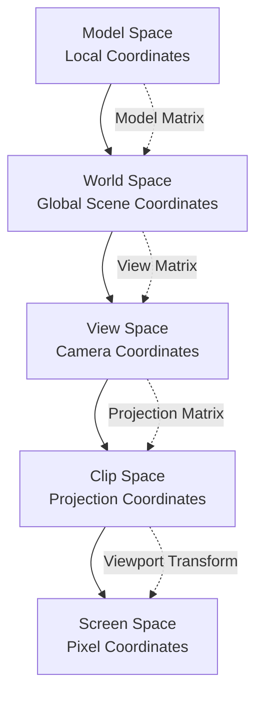
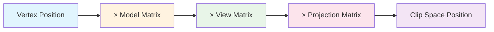

# Bài 4: Vertex Transformation cơ bản

<div className="bg-gradient-to-r from-blue-600 to-purple-600 text-white p-6 rounded-lg mb-8">
  <h2 className="text-2xl font-bold mb-2">🎯 Mục tiêu bài học</h2>
  <p className="text-lg">Hiểu và thực hành các phép biến đổi vertex cơ bản trong 3D graphics, từ model space đến screen space</p>
</div>

## 📚 Nội dung chính

### 1. Warm-up & Review (5 phút)

<div className="bg-gray-100 p-4 rounded-md mb-4">
  <h4 className="font-semibold text-gray-800 mb-2">Ôn tập bài trước:</h4>
  <ul className="list-disc pl-5 text-gray-700">
    <li>Cách tạo và sử dụng uniform buffers trong Bevy</li>
    <li>Truyền dữ liệu từ CPU sang GPU</li>
    <li>Cấu trúc Material trait tùy chỉnh</li>
  </ul>
</div>

---

## 🌐 Coordinate Systems - Các hệ tọa độ trong 3D Graphics

Trước khi bắt đầu với vertex transformation, chúng ta cần hiểu rõ các hệ tọa độ khác nhau trong pipeline render 3D.



### Bảng so sánh các hệ tọa độ:

| Hệ tọa độ | Mô tả | Phạm vi | Ma trận biến đổi |
|-----------|--------|---------|-------------------|
| **Model Space** | Tọa độ địa phương của object | Tùy thuộc model | Model Matrix |
| **World Space** | Tọa độ trong scene toàn cục | Unlimited | View Matrix |
| **View Space** | Tọa độ theo góc nhìn camera | Camera-relative | Projection Matrix |
| **Clip Space** | Tọa độ sau projection | [-1, 1] cho x,y,z | Viewport Transform |
| **Screen Space** | Tọa độ pixel trên màn hình | [0, width] × [0, height] | - |

---

## 🔢 Transformation Matrices - Ma trận biến đổi

### Các phép biến đổi cơ bản:

#### 1. Translation (Tịnh tiến)
```rust
// Ma trận tịnh tiến trong Rust với glam
let translation = Mat4::from_translation(Vec3::new(x, y, z));
```

#### 2. Rotation (Xoay)
```rust
// Xoay quanh trục Y
let rotation = Mat4::from_rotation_y(angle_radians);
```

#### 3. Scale (Tỷ lệ)
```rust
// Thay đổi kích thước
let scale = Mat4::from_scale(Vec3::new(sx, sy, sz));
```

### Ma trận tổng hợp (Combined Transform):

```rust
let model_matrix = translation * rotation * scale;
```

<div className="bg-yellow-100 border-l-4 border-yellow-500 p-4 my-4">
  <div className="flex">
    <div className="flex-shrink-0">
      <span className="text-yellow-600 text-xl">⚠️</span>
    </div>
    <div className="ml-3">
      <p className="text-sm text-yellow-700">
        <strong>Lưu ý quan trọng:</strong> Thứ tự nhân ma trận rất quan trọng! 
        Thường là TRS (Translation × Rotation × Scale) để có kết quả mong muốn.
      </p>
    </div>
  </div>
</div>

---

## 💻 Thực hành: Tạo Vertex Shader với Transform

### Bước 1: Setup Material Structure

```rust
// src/materials/transform_material.rs
use bevy::prelude::*;
use bevy::render::render_resource::*;

#[derive(Asset, TypePath, AsBindGroup, Clone)]
pub struct TransformMaterial {
    #[uniform(0)]
    pub transform: TransformUniform,
    #[uniform(1)] 
    pub time: f32,
}

#[derive(Clone, Copy, Pod, Zeroable)]
#[repr(C)]
pub struct TransformUniform {
    pub model_matrix: Mat4,
    pub view_matrix: Mat4,
    pub projection_matrix: Mat4,
}
```

### Bước 2: WGSL Vertex Shader

```wgsl
// assets/shaders/transform_vertex.wgsl

struct TransformUniform {
    model_matrix: mat4x4<f32>,
    view_matrix: mat4x4<f32>, 
    projection_matrix: mat4x4<f32>,
};

struct VertexInput {
    @location(0) position: vec3<f32>,
    @location(1) color: vec3<f32>,
};

struct VertexOutput {
    @builtin(position) clip_position: vec4<f32>,
    @location(0) color: vec3<f32>,
    @location(1) world_position: vec3<f32>,
};

@group(1) @binding(0)
var<uniform> transform: TransformUniform;

@group(1) @binding(1) 
var<uniform> time: f32;

@vertex
fn vs_main(input: VertexInput) -> VertexOutput {
    var out: VertexOutput;
    
    // Bước 1: Model space -> World space
    let world_position = transform.model_matrix * vec4<f32>(input.position, 1.0);
    
    // Bước 2: World space -> View space  
    let view_position = transform.view_matrix * world_position;
    
    // Bước 3: View space -> Clip space
    out.clip_position = transform.projection_matrix * view_position;
    
    // Truyền dữ liệu cho fragment shader
    out.color = input.color;
    out.world_position = world_position.xyz;
    
    return out;
}
```

---

## 🎨 MVP Matrix - Model View Projection

MVP Matrix là tích của 3 ma trận biến đổi chính:



### Tối ưu hóa với MVP Matrix:

```wgsl
// Thay vì nhân từng ma trận riêng biệt
let mvp_matrix = transform.projection_matrix * transform.view_matrix * transform.model_matrix;
out.clip_position = mvp_matrix * vec4<f32>(input.position, 1.0);
```

### So sánh hiệu suất:

| Phương pháp | Phép nhân ma trận | Tốc độ | Linh hoạt |
|-------------|-------------------|---------|-----------|
| **Từng bước** | 3 × mat4×vec4 | Chậm hơn | Cao |
| **MVP Matrix** | 1 × mat4×vec4 | Nhanh hơn | Thấp hơn |
| **Hybrid** | 2 × mat4×vec4 | Cân bằng | Trung bình |

---

## 🚀 Tạo Animation với Vertex Transform

### Hiệu ứng xoay liên tục:

```wgsl
@vertex
fn vs_main(input: VertexInput) -> VertexOutput {
    var out: VertexOutput;
    
    // Tạo ma trận xoay theo thời gian
    let rotation_angle = time * 1.5; // 1.5 rad/s
    let cos_a = cos(rotation_angle);
    let sin_a = sin(rotation_angle);
    
    // Ma trận xoay quanh trục Y
    let rotation_matrix = mat4x4<f32>(
        cos_a, 0.0, sin_a, 0.0,
        0.0, 1.0, 0.0, 0.0,
        -sin_a, 0.0, cos_a, 0.0,
        0.0, 0.0, 0.0, 1.0
    );
    
    // Áp dụng rotation trước khi transform
    let rotated_position = rotation_matrix * vec4<f32>(input.position, 1.0);
    let world_position = transform.model_matrix * rotated_position;
    
    out.clip_position = transform.projection_matrix * transform.view_matrix * world_position;
    out.color = input.color;
    
    return out;
}
```

### Hiệu ứng wave (sóng):

```wgsl
// Tạo hiệu ứng sóng dọc theo trục Y
let wave_amplitude = 0.5;
let wave_frequency = 2.0;
let wave_speed = 3.0;

var modified_position = input.position;
modified_position.y += wave_amplitude * sin(input.position.x * wave_frequency + time * wave_speed);

let world_position = transform.model_matrix * vec4<f32>(modified_position, 1.0);
```

---

## 🔧 Debug và Troubleshooting

### Các lỗi thường gặp:

<div className="bg-red-50 border border-red-200 rounded-md p-4 mb-4">
  <h4 className="text-red-800 font-semibold mb-2">❌ Lỗi thường gặp:</h4>
  
  <details className="mb-2">
    <summary className="cursor-pointer text-red-700 font-medium">1. Object không hiển thị</summary>
    <div className="mt-2 text-red-600 text-sm pl-4">
      <p><strong>Nguyên nhân:</strong> Ma trận MVP không đúng hoặc object nằm ngoài view frustum</p>
      <p><strong>Giải pháp:</strong> Kiểm tra camera position và object bounds</p>
    </div>
  </details>
  
  <details className="mb-2">
    <summary className="cursor-pointer text-red-700 font-medium">2. Object bị biến dạng</summary>
    <div className="mt-2 text-red-600 text-sm pl-4">
      <p><strong>Nguyên nhân:</strong> Thứ tự nhân ma trận sai hoặc aspect ratio không đúng</p>
      <p><strong>Giải pháp:</strong> Kiểm tra order của TRS và projection matrix</p>
    </div>
  </details>
</div>

### Debug techniques:

```wgsl
// Debug bằng cách hiển thị position dưới dạng màu
out.color = abs(world_position.xyz); // Chuyển position thành màu
```

---

## 📋 Bài tập thực hành

<div className="bg-blue-50 border border-blue-200 rounded-md p-4">
  <h4 className="text-blue-800 font-semibold mb-3">🏋️ Bài tập:</h4>
  
  <div className="grid grid-cols-1 md:grid-cols-2 gap-4">
    <div className="bg-white p-3 rounded border">
      <h5 className="font-semibold mb-2">Bài 1: Basic Transform</h5>
      <p className="text-sm text-gray-600">Tạo cube xoay quanh trục Y với tốc độ 45°/giây</p>
    </div>
    
    <div className="bg-white p-3 rounded border">
      <h5 className="font-semibold mb-2">Bài 2: Wave Animation</h5>
      <p className="text-sm text-gray-600">Tạo plane với hiệu ứng sóng lan truyền</p>
    </div>
    
    <div className="bg-white p-3 rounded border">
      <h5 className="font-semibold mb-2">Bài 3: Orbit Animation</h5>
      <p className="text-sm text-gray-600">Multiple objects quay quanh một điểm trung tâm</p>
    </div>
    
    <div className="bg-white p-3 rounded border">
      <h5 className="font-semibold mb-2">Bài 4: Scale Pulsing</h5>
      <p className="text-sm text-gray-600">Object thay đổi kích thước theo nhịp điệu</p>
    </div>
  </div>
</div>

---

## 🎯 Kiểm tra hiểu biết

### Quiz ngắn:

1. **Thứ tự đúng của transformation pipeline là gì?**
   - a) Model → View → World → Clip
   - b) Model → World → View → Clip  ✅
   - c) World → Model → View → Clip
   - d) View → Model → World → Clip

2. **MVP Matrix giúp tối ưu hiệu suất như thế nào?**
   - a) Giảm số phép nhân ma trận từ 3 xuống 1 ✅
   - b) Tăng độ chính xác tính toán
   - c) Giảm memory usage
   - d) Tăng flexibility

---

## 📚 Tài liệu tham khảo

- [Bevy Transform Documentation](https://docs.rs/bevy/latest/bevy/transform/index.html)
- [WGSL Matrix Operations](https://www.w3.org/TR/WGSL/#matrix-types)
- [3D Math Primer for Graphics and Game Development](https://gamemath.com/)

---

## 🔄 Chuẩn bị cho bài tiếp theo

**Bài 5: Màu sắc và Interpolation** sẽ bao gồm:
- Color spaces và gamma correction  
- Vertex color interpolation
- Gradient effects và color mixing
- HDR color values

<div className="bg-green-100 border border-green-300 rounded-md p-4 mt-6">
  <div className="flex items-center">
    <span className="text-green-600 text-xl mr-2">✅</span>
    <p className="text-green-800 font-medium">
      Chúc mừng! Bạn đã hoàn thành Bài 4: Vertex Transformation cơ bản
    </p>
  </div>
</div>