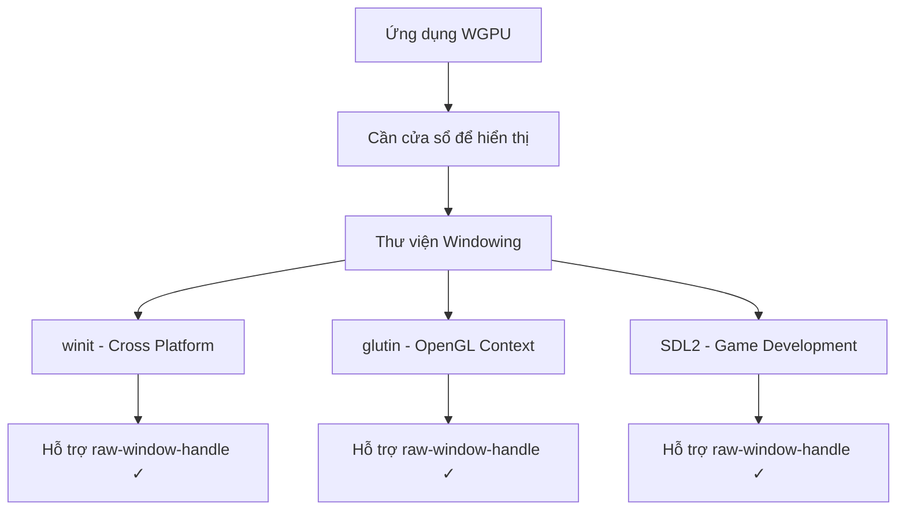
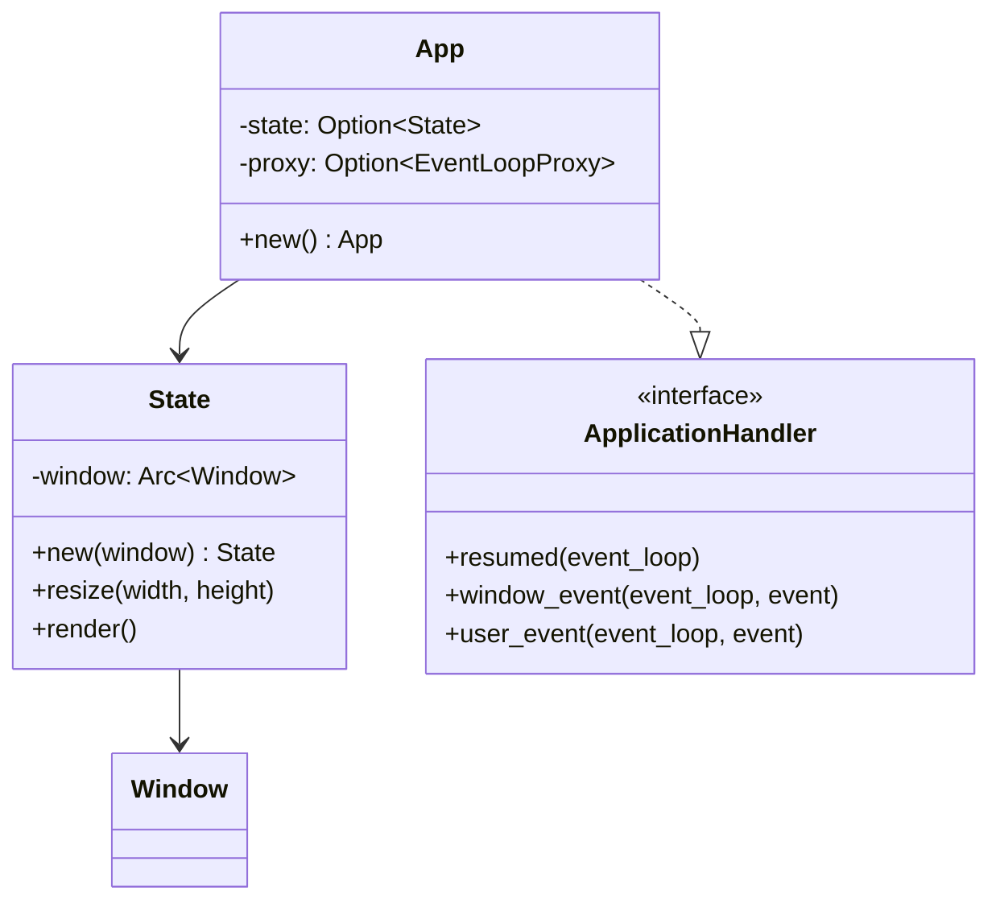
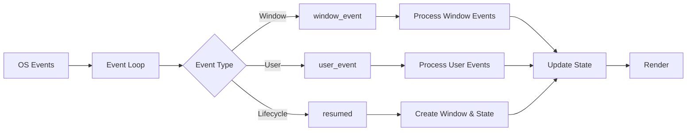
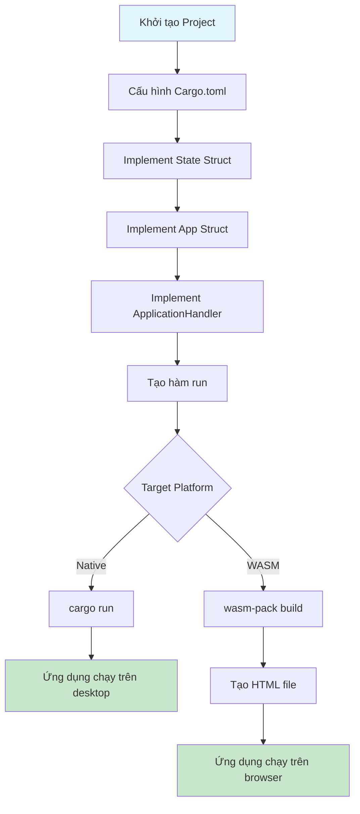

# Bài 1: Tạo Cửa Sổ và Thiết Lập Môi Trường WGPU

<div className="bg-gradient-to-r from-blue-50 to-indigo-100 p-6 rounded-lg border-l-4 border-blue-500 mb-6">
  <h2 className="text-2xl font-bold text-blue-800 mb-2">🎯 Mục Tiêu Bài Học</h2>
  <p className="text-gray-700">Trong bài học này, chúng ta sẽ học cách tạo một cửa sổ cơ bản sử dụng thư viện <strong>winit</strong> và thiết lập môi trường để sử dụng <strong>WGPU</strong>. Đây là bước đầu tiên quan trọng để bắt đầu lập trình đồ họa với Rust.</p>
</div>

## 📚 Kiến Thức Nền Tảng

### Tại Sao Cần Thư Viện Windowing?



<div className="bg-yellow-50 border-l-4 border-yellow-400 p-4 my-4">
  <div className="flex">
    <div className="flex-shrink-0">
      <span className="text-2xl">⚠️</span>
    </div>
    <div className="ml-3">
      <h3 className="text-lg font-medium text-yellow-800">Lưu Ý Quan Trọng</h3>
      <p className="text-yellow-700">Bất kỳ thư viện windowing nào bạn chọn đều phải hỗ trợ crate <strong>raw-window-handle</strong> để có thể làm việc với WGPU.</p>
    </div>
  </div>
</div>

## 🔧 Thiết Lập Dependencies

### Bảng Dependencies Cần Thiết

| Crate | Version | Mục đích | Bắt buộc |
|-------|---------|----------|----------|
| `anyhow` | "1.0" | Xử lý lỗi đơn giản | ✅ |
| `winit` | "0.30" | Tạo và quản lý cửa sổ | ✅ |
| `env_logger` | "0.10" | Logging cho debug | ✅ |
| `log` | "0.4" | API logging | ✅ |
| `wgpu` | "26.0.1" | Graphics API | ✅ |
| `pollster` | "0.3" | Async runtime đơn giản | ✅ |

### Cấu hình Cargo.toml

```toml
[dependencies]
anyhow = "1.0"
winit = { version = "0.30", features = ["android-native-activity"] }
env_logger = "0.10"
log = "0.4"
wgpu = "26.0.1"
pollster = "0.3"

# Cần thiết cho WASM
[lib]
crate-type = ["cdylib", "rlib"]

# Tối ưu hóa cho release
[profile.release]
strip = true
```

<div className="bg-green-50 border-l-4 border-green-400 p-4 my-4">
  <div className="flex">
    <div className="flex-shrink-0">
      <span className="text-2xl">💡</span>
    </div>
    <div className="ml-3">
      <h3 className="text-lg font-medium text-green-800">Tip: Resolver Version 2</h3>
      <p className="text-green-700">WGPU yêu cầu Cargo's feature resolver version 2. Nếu bạn sử dụng Rust 2021 edition, điều này đã được bật mặc định. Với 2018 edition, hãy thêm <code>resolver = "2"</code> vào Cargo.toml.</p>
    </div>
  </div>
</div>

## 🏗️ Kiến Trúc Ứng Dụng

### Sơ Đồ Tổng Quan



## 📝 Implement Code Chi Tiết

### Bước 1: Tạo State Struct

```rust
use std::sync::Arc;
use winit::{
    application::ApplicationHandler, 
    event::*, 
    event_loop::{ActiveEventLoop, EventLoop}, 
    keyboard::{KeyCode, PhysicalKey}, 
    window::Window
};

#[cfg(target_arch = "wasm32")]
use wasm_bindgen::prelude::*;

pub struct State {
    window: Arc<Window>,
}

impl State {
    pub async fn new(window: Arc<Window>) -> anyhow::Result<Self> {
        Ok(Self { window })
    }

    pub fn resize(&mut self, _width: u32, _height: u32) {
        // Sẽ implement trong bài sau
    }
    
    pub fn render(&mut self) {
        self.window.request_redraw();
        // Sẽ có nhiều logic render hơn trong bài sau
    }
}
```

### Bước 2: Tạo App Struct

```rust
pub struct App {
    #[cfg(target_arch = "wasm32")]
    proxy: Option<winit::event_loop::EventLoopProxy<State>>,
    state: Option<State>,
}

impl App {
    pub fn new(
        #[cfg(target_arch = "wasm32")] 
        event_loop: &EventLoop<State>
    ) -> Self {
        #[cfg(target_arch = "wasm32")]
        let proxy = Some(event_loop.create_proxy());
        
        Self {
            state: None,
            #[cfg(target_arch = "wasm32")]
            proxy,
        }
    }
}
```

### Bảng Phân Tích Các Trường của App

| Trường | Kiểu | Mục đích | Platform |
|--------|------|----------|----------|
| `state` | `Option<State>` | Lưu trữ state của ứng dụng | All |
| `proxy` | `Option<EventLoopProxy<State>>` | Gửi events async trên web | WASM only |

## 🔄 Event Handling System

### Sơ Đồ Luồng Events



### Implement ApplicationHandler

#### 1. Resumed Method

```rust
impl ApplicationHandler<State> for App {
    fn resumed(&mut self, event_loop: &ActiveEventLoop) {
        #[allow(unused_mut)]
        let mut window_attributes = Window::default_attributes();

        #[cfg(target_arch = "wasm32")]
        {
            // Cấu hình cho web
            use wasm_bindgen::JsCast;
            use winit::platform::web::WindowAttributesExtWebSys;
            
            const CANVAS_ID: &str = "canvas";
            let window = wgpu::web_sys::window().unwrap_throw();
            let document = window.document().unwrap_throw();
            let canvas = document.get_element_by_id(CANVAS_ID).unwrap_throw();
            let html_canvas_element = canvas.unchecked_into();
            window_attributes = window_attributes.with_canvas(Some(html_canvas_element));
        }

        let window = Arc::new(event_loop.create_window(window_attributes).unwrap());

        #[cfg(not(target_arch = "wasm32"))]
        {
            // Native: Sử dụng pollster để await
            self.state = Some(pollster::block_on(State::new(window)).unwrap());
        }

        #[cfg(target_arch = "wasm32")]
        {
            // Web: Chạy async và gửi kết quả qua proxy
            if let Some(proxy) = self.proxy.take() {
                wasm_bindgen_futures::spawn_local(async move {
                    assert!(proxy
                        .send_event(State::new(window).await.expect("Unable to create state!"))
                        .is_ok())
                });
            }
        }
    }
}
```

### Bảng So Sánh Native vs Web

| Aspect | Native | Web |
|--------|--------|-----|
| Async Handling | `pollster::block_on()` | `wasm_bindgen_futures::spawn_local()` |
| Window Creation | Direct | Through Canvas Element |
| Event Communication | Direct | Through Proxy |
| Dependencies | Minimal | WASM-specific crates |

#### 2. User Event Method

```rust
impl ApplicationHandler<State> for App {
    fn user_event(&mut self, _event_loop: &ActiveEventLoop, mut event: State) {
        #[cfg(target_arch = "wasm32")]
        {
            event.window.request_redraw();
            event.resize(
                event.window.inner_size().width,
                event.window.inner_size().height,
            );
        }
        self.state = Some(event);
    }
}
```

#### 3. Window Event Method

```rust
impl ApplicationHandler<State> for App {
    fn window_event(
        &mut self,
        event_loop: &ActiveEventLoop,
        _window_id: winit::window::WindowId,
        event: WindowEvent,
    ) {
        let state = match &mut self.state {
            Some(state) => state,
            None => return,
        };

        match event {
            WindowEvent::CloseRequested => event_loop.exit(),
            WindowEvent::Resized(size) => state.resize(size.width, size.height),
            WindowEvent::RedrawRequested => state.render(),
            WindowEvent::KeyboardInput {
                event: KeyEvent {
                    physical_key: PhysicalKey::Code(code),
                    state: key_state,
                    ..
                },
                ..
            } => match (code, key_state.is_pressed()) {
                (KeyCode::Escape, true) => event_loop.exit(),
                _ => {}
            },
            _ => {}
        }
    }
}
```

### Bảng Các Window Events Quan Trọng

| Event | Mục đích | Handler Method |
|-------|----------|----------------|
| `CloseRequested` | Người dùng muốn đóng cửa sổ | `event_loop.exit()` |
| `Resized` | Cửa sổ thay đổi kích thước | `state.resize()` |
| `RedrawRequested` | Cần vẽ lại frame | `state.render()` |
| `KeyboardInput` | Nhận input từ bàn phím | Xử lý phím cụ thể |

## 🚀 Chạy Ứng Dụng

### Hàm Run cho Native

```rust
pub fn run() -> anyhow::Result<()> {
    #[cfg(not(target_arch = "wasm32"))]
    {
        env_logger::init();
    }
    #[cfg(target_arch = "wasm32")]
    {
        console_log::init_with_level(log::Level::Info).unwrap_throw();
    }

    let event_loop = EventLoop::with_user_event().build()?;
    let mut app = App::new(
        #[cfg(target_arch = "wasm32")]
        &event_loop,
    );
    event_loop.run_app(&mut app)?;

    Ok(())
}
```

<div className="bg-red-50 border-l-4 border-red-400 p-4 my-4">
  <div className="flex">
    <div className="flex-shrink-0">
      <span className="text-2xl">🚨</span>
    </div>
    <div className="ml-3">
      <h3 className="text-lg font-medium text-red-800">Quan Trọng: env_logger</h3>
      <p className="text-red-700">Luôn luôn gọi <code>env_logger::init()</code> trước khi sử dụng WGPU. Nếu không, khi WGPU gặp lỗi, bạn sẽ chỉ thấy thông báo generic mà không biết lỗi thực sự là gì!</p>
    </div>
  </div>
</div>

## 🌐 Hỗ Trợ Web Assembly

### Dependencies cho WASM

```toml
[target.'cfg(target_arch = "wasm32")'.dependencies]
console_error_panic_hook = "0.1.6"
console_log = "1.0"
wgpu = { version = "26.0.1", features = ["webgl"]}
wasm-bindgen = "0.2"
wasm-bindgen-futures = "0.4.30"
web-sys = { version = "0.3", features = [
    "Document",
    "Window", 
    "Element",
]}
```

### Bảng Phân Tích WASM Dependencies

| Crate | Mục đích | Tầm quan trọng |
|-------|----------|----------------|
| `console_error_panic_hook` | Hiển thị panic trên browser console | Cao |
| `console_log` | Logging trên browser | Cao |
| `wasm-bindgen` | Bridge Rust-JavaScript | Cực cao |
| `wasm-bindgen-futures` | Async support cho WASM | Cao |
| `web-sys` | Web APIs trong Rust | Cao |

### Hàm Entry Point cho Web

```rust
#[cfg(target_arch = "wasm32")]
#[wasm_bindgen(start)]
pub fn run_web() -> Result<(), wasm_bindgen::JsValue> {
    console_error_panic_hook::set_once();
    run().unwrap_throw();
    Ok(())
}
```

## 🔨 Build và Deploy

### Build Commands

```bash
# Native
cargo run

# WASM với wasm-pack
wasm-pack build --target web

# WASM với workspace
wasm-pack build game --target web
```

### HTML Template cho WASM

```html
<!DOCTYPE html>
<html lang="vi">
<head>
    <meta charset="UTF-8">
    <meta name="viewport" content="width=device-width, initial-scale=1.0">
    <title>WGPU Tutorial</title>
    <style>
        * { padding: 0; margin: 0; }
        canvas { 
            background-color: black; 
            width: 100%; 
            height: 100vh; 
        }
    </style>
</head>
<body>
    <canvas id="canvas"></canvas>
    <script type="module">
        import init from "./pkg/your_crate_name.js";
        init().then(() => {
            console.log("WASM Loaded Successfully!");
        });
    </script>
</body>
</html>
```

## 📊 Workflow Tổng Quan



## ✅ Checklist Hoàn Thành

<div className="bg-gray-50 p-4 rounded-lg">
  <h3 className="text-lg font-semibold mb-3">Kiểm tra các bước đã hoàn thành:</h3>
  <ul className="space-y-2">
    <li className="flex items-center"><input type="checkbox" className="mr-2" /> Cấu hình Cargo.toml với đủ dependencies</li>
    <li className="flex items-center"><input type="checkbox" className="mr-2" /> Tạo State struct với window</li>
    <li className="flex items-center"><input type="checkbox" className="mr-2" /> Implement App struct với ApplicationHandler</li>
    <li className="flex items-center"><input type="checkbox" className="mr-2" /> Xử lý window events (close, resize, keyboard)</li>
    <li className="flex items-center"><input type="checkbox" className="mr-2" /> Thiết lập logging với env_logger</li>
    <li className="flex items-center"><input type="checkbox" className="mr-2" /> Test chạy trên native</li>
    <li className="flex items-center"><input type="checkbox" className="mr-2" /> Cấu hình WASM dependencies (optional)</li>
    <li className="flex items-center"><input type="checkbox" className="mr-2" /> Test chạy trên browser (optional)</li>
  </ul>
</div>

## 🎓 Tổng Kết

Trong bài học này, chúng ta đã:

1. **Thiết lập** môi trường phát triển với các dependencies cần thiết
2. **Tạo** kiến trúc cơ bản với State và App structs
3. **Implement** event handling system hoàn chỉnh
4. **Hỗ trợ** cả native và web platforms
5. **Hiểu** được workflow từ code đến ứng dụng chạy được

<div className="bg-blue-50 border border-blue-200 rounded-lg p-6 mt-6">
  <h3 className="text-xl font-bold text-blue-800 mb-3">🚀 Bước Tiếp Theo</h3>
  <p className="text-blue-700">Trong bài tiếp theo, chúng ta sẽ học cách tạo <strong>Surface</strong> và bắt đầu render graphics thực sự với WGPU. Hãy đảm bảo code trong bài này chạy tốt trước khi tiếp tục!</p>
</div>