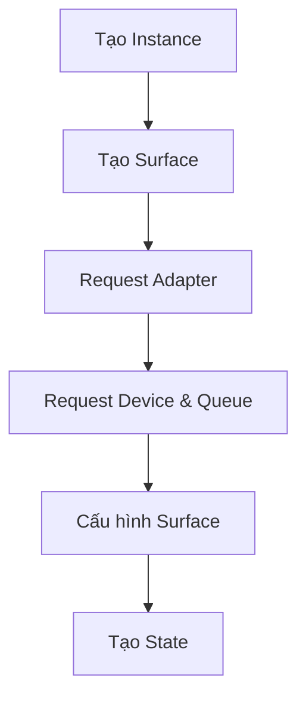
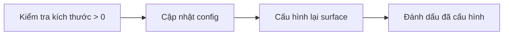
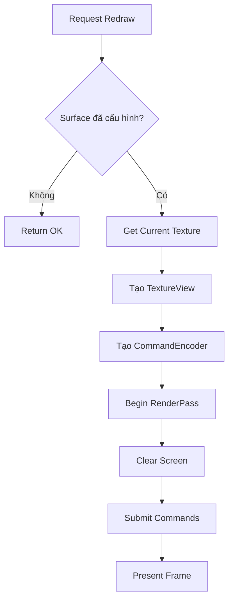

# Bài 2: Surface và Rendering cơ bản

<div className="bg-gradient-to-r from-blue-500 to-purple-600 text-white p-6 rounded-lg mb-6">
<h2 className="text-2xl font-bold mb-2">🎯 Mục tiêu bài học</h2>
<p className="text-lg">Học cách tạo Surface, cấu hình Device và Queue, và thực hiện rendering đầu tiên với WGPU</p>
</div>

## 📋 Tổng quan về Surface

**Surface** là thành phần quan trọng nhất trong WGPU, đóng vai trò như một cầu nối giữa ứng dụng và màn hình hiển thị.

<div className="bg-yellow-50 border-l-4 border-yellow-400 p-4 mb-4">
<h3 className="text-lg font-semibold text-yellow-800 mb-2">💡 Khái niệm cốt lõi</h3>
<p className="text-yellow-700">Surface là phần của cửa sổ mà chúng ta vẽ lên. Nó cần thiết để vẽ trực tiếp lên màn hình.</p>
</div>

## 🏗️ Cấu trúc State cơ bản

Trước tiên, hãy xem xét cấu trúc `State` mà chúng ta sẽ sử dụng:

```rust
pub struct State {
    surface: wgpu::Surface<'static>,
    device: wgpu::Device,
    queue: wgpu::Queue,
    config: wgpu::SurfaceConfiguration,
    is_surface_configured: bool,
    window: Arc<Window>,
}
```

### 📊 Bảng mô tả các thành phần State

| Thành phần | Kiểu dữ liệu | Mô tả | Vai trò |
|------------|--------------|-------|---------|
| `surface` | `wgpu::Surface<'static>` | Bề mặt vẽ | Nơi hiển thị kết quả rendering |
| `device` | `wgpu::Device` | Thiết bị GPU | Tạo tài nguyên và thực thi lệnh |
| `queue` | `wgpu::Queue` | Hàng đợi lệnh | Gửi lệnh đến GPU |
| `config` | `wgpu::SurfaceConfiguration` | Cấu hình surface | Định nghĩa cách surface hoạt động |
| `is_surface_configured` | `bool` | Trạng thái cấu hình | Kiểm tra surface đã được cấu hình |
| `window` | `Arc<Window>` | Cửa sổ ứng dụng | Tham chiếu đến cửa sổ hiển thị |

## 🔧 Khởi tạo State - Phương thức `new()`

### Sơ đồ quy trình khởi tạo



### Bước 1: Tạo Instance và Surface

```rust
async fn new(window: Arc<Window>) -> anyhow::Result<State> {
    let size = window.inner_size();

    // Instance là handle đến GPU
    let instance = wgpu::Instance::new(&wgpu::InstanceDescriptor {
        #[cfg(not(target_arch = "wasm32"))]
        backends: wgpu::Backends::PRIMARY,
        #[cfg(target_arch = "wasm32")]
        backends: wgpu::Backends::GL,
        ..Default::default()
    });

    let surface = instance.create_surface(window.clone()).unwrap();
    // ...
}
```

<div className="bg-blue-50 border-l-4 border-blue-400 p-4 mb-4">
<h4 className="text-lg font-semibold text-blue-800 mb-2">📝 Giải thích Instance</h4>
<ul className="text-blue-700 space-y-1">
<li><strong>Instance:</strong> Điểm khởi đầu khi sử dụng WGPU</li>
<li><strong>Mục đích:</strong> Tạo Adapters và Surfaces</li>
<li><strong>Backends:</strong> Hỗ trợ Vulkan, Metal, DX12, WebGPU</li>
</ul>
</div>

### Bước 2: Request Adapter

```rust
let adapter = instance
    .request_adapter(&wgpu::RequestAdapterOptions {
        power_preference: wgpu::PowerPreference::default(),
        compatible_surface: Some(&surface),
        force_fallback_adapter: false,
    })
    .await?;
```

### 📊 Bảng mô tả RequestAdapterOptions

| Tham số | Kiểu | Mô tả | Giá trị khuyến nghị |
|---------|------|-------|---------------------|
| `power_preference` | `PowerPreference` | Ưu tiên hiệu năng hay tiết kiệm pin | `default()` |
| `compatible_surface` | `Option<&Surface>` | Surface tương thích | `Some(&surface)` |
| `force_fallback_adapter` | `bool` | Bắt buộc dùng software rendering | `false` |

<div className="bg-green-50 border-l-4 border-green-400 p-4 mb-4">
<h4 className="text-lg font-semibold text-green-800 mb-2">💚 PowerPreference Options</h4>
<ul className="text-green-700 space-y-1">
<li><strong>LowPower:</strong> Ưu tiên tiết kiệm pin (GPU tích hợp)</li>
<li><strong>HighPerformance:</strong> Ưu tiên hiệu năng (GPU rời)</li>
<li><strong>Default:</strong> Để WGPU tự chọn phù hợp</li>
</ul>
</div>

### Bước 3: Tạo Device và Queue

```rust
let (device, queue) = adapter
    .request_device(&wgpu::DeviceDescriptor {
        label: None,
        required_features: wgpu::Features::empty(),
        required_limits: if cfg!(target_arch = "wasm32") {
            wgpu::Limits::downlevel_webgl2_defaults()
        } else {
            wgpu::Limits::default()
        },
        memory_hints: Default::default(),
        trace: wgpu::Trace::Off,
    })
    .await?;
```

### 📊 Bảng cấu hình Device

| Tham số | Mô tả | Giá trị mặc định | Ghi chú |
|---------|-------|------------------|---------|
| `label` | Nhãn debug | `None` | Hữu ích khi debug |
| `required_features` | Tính năng yêu cầu | `empty()` | Kiểm tra khả năng hỗ trợ |
| `required_limits` | Giới hạn tài nguyên | Platform dependent | WebGL có giới hạn khắt khe hơn |
| `memory_hints` | Gợi ý quản lý bộ nhớ | `Default` | Tối ưu hóa bộ nhớ |

### Bước 4: Cấu hình Surface

```rust
let surface_caps = surface.get_capabilities(&adapter);
let surface_format = surface_caps.formats.iter()
    .find(|f| f.is_srgb())
    .copied()
    .unwrap_or(surface_caps.formats[0]);

let config = wgpu::SurfaceConfiguration {
    usage: wgpu::TextureUsages::RENDER_ATTACHMENT,
    format: surface_format,
    width: size.width,
    height: size.height,
    present_mode: surface_caps.present_modes[0],
    alpha_mode: surface_caps.alpha_modes[0],
    view_formats: vec![],
    desired_maximum_frame_latency: 2,
};
```

### 📊 Bảng cấu hình SurfaceConfiguration

| Tham số | Mô tả | Ý nghĩa |
|---------|-------|---------|
| `usage` | Cách sử dụng texture | `RENDER_ATTACHMENT` = vẽ lên màn hình |
| `format` | Định dạng màu | sRGB được ưu tiên |
| `width/height` | Kích thước | Theo kích thước cửa sổ |
| `present_mode` | Chế độ hiển thị | VSync và frame rate |
| `alpha_mode` | Chế độ trong suốt | Xử lý kênh alpha |
| `view_formats` | Định dạng view | Chuyển đổi không gian màu |

<div className="bg-red-50 border-l-4 border-red-400 p-4 mb-4">
<h4 className="text-lg font-semibold text-red-800 mb-2">⚠️ Lưu ý quan trọng</h4>
<p className="text-red-700">Đảm bảo width và height không bằng 0, vì điều này có thể làm crash ứng dụng!</p>
</div>

## 🔄 Xử lý thay đổi kích thước - `resize()`

```rust
pub fn resize(&mut self, width: u32, height: u32) {
    if width > 0 && height > 0 {
        self.config.width = width;
        self.config.height = height;
        self.surface.configure(&self.device, &self.config);
        self.is_surface_configured = true;
    }
}
```

### Sơ đồ quy trình resize



## ⌨️ Xử lý sự kiện bàn phím - `handle_key()`

```rust
fn handle_key(&self, event_loop: &ActiveEventLoop, code: KeyCode, is_pressed: bool) {
    match (code, is_pressed) {
        (KeyCode::Escape, true) => event_loop.exit(),
        _ => {}
    }
}
```

### 📊 Bảng xử lý phím tắt

| Phím | Trạng thái | Hành động | Mô tả |
|------|------------|-----------|-------|
| `Escape` | Nhấn | Thoát ứng dụng | Kết thúc event loop |
| Khác | - | Không làm gì | Dự trữ cho tương lai |

## 🎨 Rendering - Phương thức `render()`

Đây là phần quan trọng nhất - nơi diễn ra quá trình vẽ!

### Sơ đồ quy trình rendering



### Bước 1: Kiểm tra và lấy texture

```rust
fn render(&mut self) -> Result<(), wgpu::SurfaceError> {
    self.window.request_redraw();

    // Không thể render nếu surface chưa được cấu hình
    if !self.is_surface_configured {
        return Ok(());
    }
        
    let output = self.surface.get_current_texture()?;
    let view = output.texture.create_view(&wgpu::TextureViewDescriptor::default());
```

### Bước 2: Tạo CommandEncoder

```rust
let mut encoder = self.device.create_command_encoder(&wgpu::CommandEncoderDescriptor {
    label: Some("Render Encoder"),
});
```

<div className="bg-purple-50 border-l-4 border-purple-400 p-4 mb-4">
<h4 className="text-lg font-semibold text-purple-800 mb-2">🎯 CommandEncoder</h4>
<p className="text-purple-700">Tạo buffer lệnh để gửi đến GPU. Hầu hết các framework đồ họa hiện đại đều yêu cầu lệnh được lưu trữ trong buffer trước khi gửi đến GPU.</p>
</div>

### Bước 3: Tạo RenderPass và Clear Screen

```rust
{
    let _render_pass = encoder.begin_render_pass(&wgpu::RenderPassDescriptor {
        label: Some("Render Pass"),
        color_attachments: &[Some(wgpu::RenderPassColorAttachment {
            view: &view,
            resolve_target: None,
            ops: wgpu::Operations {
                load: wgpu::LoadOp::Clear(wgpu::Color {
                    r: 0.1,
                    g: 0.2,
                    b: 0.3,
                    a: 1.0,
                }),
                store: wgpu::StoreOp::Store,
            },
        })],
        depth_stencil_attachment: None,
        occlusion_query_set: None,
        timestamp_writes: None,
    });
}

// Submit commands và present frame
self.queue.submit(std::iter::once(encoder.finish()));
output.present();

Ok(())
```

### 📊 Bảng phân tích RenderPassDescriptor

| Thành phần | Kiểu | Mô tả | Ví dụ |
|------------|------|-------|-------|
| `label` | `Option<&str>` | Nhãn debug | `"Render Pass"` |
| `color_attachments` | `&[Option<RenderPassColorAttachment>]` | Nơi vẽ màu | Texture view |
| `depth_stencil_attachment` | `Option<...>` | Buffer độ sâu | `None` (chưa dùng) |

### 📊 Bảng phân tích RenderPassColorAttachment

| Tham số | Mô tả | Giá trị | Ý nghĩa |
|---------|-------|---------|---------|
| `view` | TextureView đích | `&view` | Nơi vẽ (màn hình) |
| `resolve_target` | Target multisampling | `None` | Không dùng MSAA |
| `load` | Xử lý màu cũ | `Clear(color)` | Xóa với màu xanh |
| `store` | Lưu kết quả | `Store` | Lưu vào texture |

<div className="bg-indigo-50 border-l-4 border-indigo-400 p-4 mb-4">
<h4 className="text-lg font-semibold text-indigo-800 mb-2">🔍 Giải thích Load Operations</h4>
<ul className="text-indigo-700 space-y-1">
<li><strong>Clear:</strong> Xóa với màu chỉ định</li>
<li><strong>Load:</strong> Giữ nguyên nội dung cũ</li>
<li><strong>DontCare:</strong> Không quan tâm nội dung cũ</li>
</ul>
</div>

## 🎮 Tích hợp vào Event Loop

Cập nhật phương thức `window_event()` trong `App`:

```rust
fn window_event(
    &mut self,
    event_loop: &ActiveEventLoop,
    _window_id: winit::window::WindowId,
    event: WindowEvent,
) {
    let state = match &mut self.state {
        Some(state) => state,
        None => return,
    };

    match event {
        WindowEvent::KeyboardInput {
            event: KeyEvent {
                physical_key: PhysicalKey::Code(code),
                state: key_state,
                ..
            },
            ..
        } => state.handle_key(event_loop, code, key_state.is_pressed()),
        
        WindowEvent::RedrawRequested => {
            state.update();
            match state.render() {
                Ok(_) => {}
                Err(wgpu::SurfaceError::Lost | wgpu::SurfaceError::Outdated) => {
                    let size = state.window.inner_size();
                    state.resize(size.width, size.height);
                }
                Err(e) => {
                    log::error!("Unable to render {}", e);
                }
            }
        }
        _ => {}
    }
}
```

### 📊 Bảng xử lý lỗi Surface

| Lỗi | Nguyên nhân | Xử lý | Kết quả |
|-----|-------------|-------|---------|
| `Lost` | Surface bị mất | Resize lại | Khôi phục surface |
| `Outdated` | Surface lỗi thời | Resize lại | Cập nhật surface |
| Khác | Lỗi hệ thống | Log error | Thông báo lỗi |

## 🎨 Kết quả mong đợi

Sau khi hoàn thành, bạn sẽ thấy một cửa sổ với nền màu xanh đậm:

<div className="bg-gradient-to-br from-blue-800 to-blue-600 h-32 rounded-lg flex items-center justify-center text-white font-semibold text-xl">
Cửa sổ với nền màu xanh (RGB: 0.1, 0.2, 0.3)
</div>

## 🔧 Khắc phục sự cố thường gặp

### 📊 Bảng các lỗi thường gặp

| Vấn đề | Triệu chứng | Nguyên nhân | Giải pháp |
|--------|-------------|-------------|-----------|
| Validation Errors | Lỗi khi chạy | Vulkan SDK cũ | Cập nhật SDK >= 1.2.182 |
| Crash khi resize | App đóng đột ngột | Width/Height = 0 | Kiểm tra > 0 |
| Màn hình đen | Không hiển thị gì | Surface chưa cấu hình | Gọi resize() |
| Màu sai | Màu không như mong đợi | Format không sRGB | Chọn format sRGB |

## 💻 Bài tập thực hành

<div className="bg-orange-50 border-l-4 border-orange-400 p-4 mb-4">
<h3 className="text-lg font-semibold text-orange-800 mb-2">🎯 Thử thách</h3>
<p className="text-orange-700">Tạo phương thức <code>handle_mouse_moved()</code> để bắt sự kiện chuột và thay đổi màu clear dựa trên vị trí chuột.</p>
<p className="text-orange-700 mt-2"><strong>Gợi ý:</strong> Sử dụng <code>WindowEvent::CursorMoved</code></p>
</div>

### Hướng dẫn thực hiện:

1. **Thêm trường lưu màu:**
```rust
pub struct State {
    // ... các trường khác
    clear_color: wgpu::Color,
}
```

2. **Tạo phương thức xử lý chuột:**
```rust
fn handle_mouse_moved(&mut self, position: PhysicalPosition<f64>, size: PhysicalSize<u32>) {
    // Chuyển đổi tọa độ chuột thành màu RGB
    let r = (position.x / size.width as f64) as f32;
    let g = (position.y / size.height as f64) as f32;
    let b = 0.5;
    
    self.clear_color = wgpu::Color { r, g, b, a: 1.0 };
}
```

3. **Cập nhật render() để sử dụng màu động:**
```rust
load: wgpu::LoadOp::Clear(self.clear_color),
```

## 📚 Tổng kết

<div className="bg-green-100 border border-green-400 rounded-lg p-6">
<h3 className="text-xl font-bold text-green-800 mb-4">✅ Kiến thức đã học</h3>
<div className="grid md:grid-cols-2 gap-4">
<div className="bg-white p-4 rounded border">
<h4 className="font-semibold text-green-700 mb-2">Khái niệm cốt lõi:</h4>
<ul className="text-green-600 space-y-1">
<li>• Instance và Adapter</li>
<li>• Device và Queue</li>
<li>• Surface và Texture</li>
<li>• CommandEncoder</li>
</ul>
</div>
<div className="bg-white p-4 rounded border">
<h4 className="font-semibold text-green-700 mb-2">Kỹ năng thực hành:</h4>
<ul className="text-green-600 space-y-1">
<li>• Khởi tạo WGPU pipeline</li>
<li>• Cấu hình Surface</li>
<li>• Xử lý sự kiện</li>
<li>• Rendering cơ bản</li>
</ul>
</div>
</div>
</div>

### Chuẩn bị cho bài tiếp theo

Trong bài tiếp theo, chúng ta sẽ học về:
- 🎨 **Shaders**: Viết code chạy trên GPU
- 🔺 **Vertices**: Vẽ các hình học cơ bản
- 🎭 **Render Pipelines**: Tối ưu hóa rendering

<div className="text-center p-6 bg-gray-50 rounded-lg">
<p className="text-lg font-medium text-gray-700">🎉 Chúc mừng bạn đã hoàn thành Bài 2!</p>
<p className="text-gray-600 mt-2">Hãy thực hành bài tập để củng cố kiến thức nhé!</p>
</div>