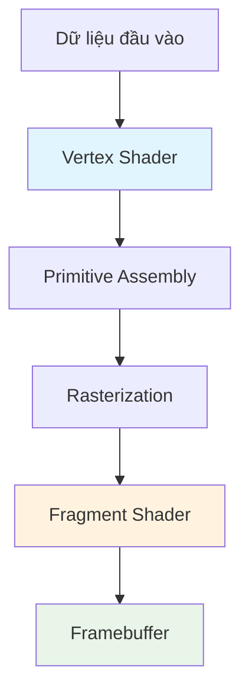
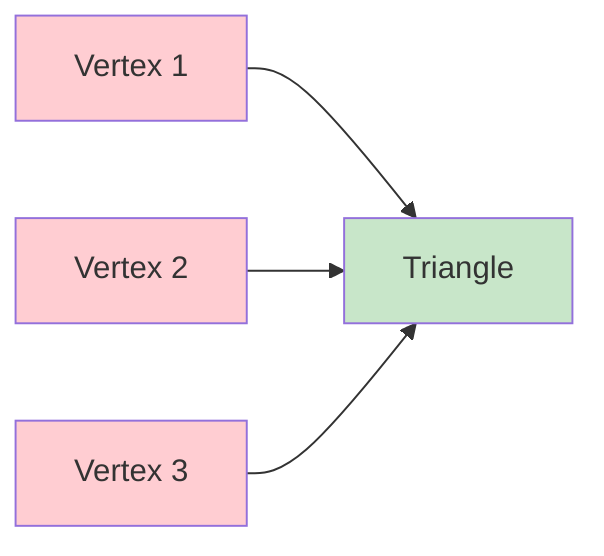
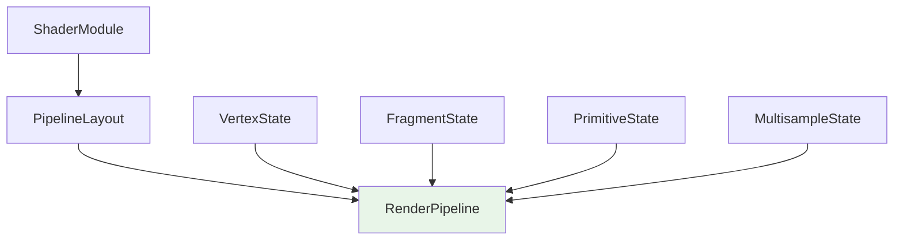
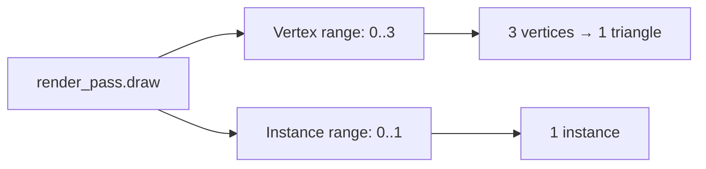

# Bài 3: Pipeline trong WebGPU - Hướng dẫn chi tiết

<div className="bg-gradient-to-r from-blue-50 to-indigo-50 p-6 rounded-lg border-l-4 border-blue-500 mb-8">
  <h2 className="text-2xl font-bold text-gray-800 mb-2">🎯 Mục tiêu bài học</h2>
  <ul className="list-disc pl-6 text-gray-700">
    <li>Hiểu khái niệm Pipeline trong WebGPU</li>
    <li>Nắm vững cách hoạt động của Vertex Shader và Fragment Shader</li>
    <li>Học cách viết shader bằng ngôn ngữ WGSL</li>
    <li>Tạo và sử dụng RenderPipeline để vẽ hình tam giác đầu tiên</li>
  </ul>
</div>

## 1. Pipeline là gì?

<div className="bg-yellow-50 p-4 rounded-lg border border-yellow-200 mb-6">
  <p className="text-gray-800"><strong>💡 Khái niệm:</strong> Pipeline trong WebGPU giống như một dây chuyền sản xuất trong nhà máy. Nó mô tả tất cả các bước mà GPU sẽ thực hiện khi xử lý dữ liệu của bạn.</p>
</div>

Nếu bạn đã từng làm việc với OpenGL và shader programs, thì Pipeline chính là phiên bản mạnh mẽ và hoàn thiện hơn của khái niệm đó.

### So sánh Pipeline vs Shader Program

| Đặc điểm | OpenGL Shader Program | WebGPU Pipeline |
|----------|----------------------|-----------------|
| **Tính năng** | Chỉ định nghĩa vertex & fragment shader | Định nghĩa toàn bộ quá trình render |
| **Cấu hình** | Hạn chế | Tùy chỉnh chi tiết mọi bước |
| **Hiệu suất** | Tốt | Tối ưu hơn |
| **Độ phức tạp** | Đơn giản | Phức tạp nhưng mạnh mẽ |

## 2. Shader - Những chương trình mini trên GPU



### Các loại Shader chính

| Loại Shader | Mục đích | Dữ liệu xử lý |
|-------------|----------|---------------|
| **Vertex Shader** | Xử lý các đỉnh (vertices) | Tọa độ 3D, màu sắc, texture coordinates |
| **Fragment Shader** | Xác định màu sắc pixel | Màu sắc cuối cùng của mỗi pixel |
| **Compute Shader** | Tính toán tổng quát | Bất kỳ dữ liệu nào |

<div className="bg-red-50 p-4 rounded-lg border border-red-200 mb-6">
  <p className="text-red-800"><strong>⚠️ Lưu ý:</strong> WebGL không hỗ trợ Geometry Shader và Tessellation Shader. Chúng thường làm giảm hiệu suất nên nên tránh sử dụng.</p>
</div>

## 3. Vertex và Fragment - Khái niệm cơ bản

### 3.1 Vertex (Đỉnh)

<div className="bg-green-50 p-4 rounded-lg border border-green-200 mb-4">
  <p className="text-green-800"><strong>Vertex</strong> là một điểm trong không gian 3D (hoặc 2D). Các vertex được nhóm lại để tạo thành:</p>
  <ul className="list-disc pl-6 mt-2">
    <li><strong>Đường thẳng:</strong> 2 vertex</li>
    <li><strong>Tam giác:</strong> 3 vertex</li>
  </ul>
</div>



### 3.2 Quá trình Rendering

| Bước | Mô tả | Shader liên quan |
|------|-------|------------------|
| 1. **Vertex Processing** | Biến đổi tọa độ vertex | Vertex Shader |
| 2. **Primitive Assembly** | Ghép vertex thành tam giác | GPU tự động |
| 3. **Rasterization** | Chuyển tam giác thành pixel | GPU tự động |
| 4. **Fragment Processing** | Tô màu từng pixel | Fragment Shader |

## 4. WGSL - WebGPU Shading Language

<div className="bg-blue-50 p-4 rounded-lg border border-blue-200 mb-6">
  <p className="text-blue-800"><strong>WGSL (WebGPU Shading Language)</strong> là ngôn ngữ shader chính thức của WebGPU. Nó được thiết kế để dễ dàng chuyển đổi sang các ngôn ngữ shader khác như SPIR-V, MSL, HLSL, và GLSL.</p>
</div>

### Ưu điểm của WGSL

| Ưu điểm | Mô tả |
|---------|-------|
| **Đa nền tảng** | Chuyển đổi tự động sang ngôn ngữ shader của từng platform |
| **Hiệu suất cao** | Được tối ưu hóa bởi thư viện Naga |
| **Cú pháp rõ ràng** | Dễ học, dễ đọc |
| **Hỗ trợ tốt** | Là ngôn ngữ shader chính thức của WebGPU |

## 5. Viết Shader đầu tiên

Tạo file `shader.wgsl` trong cùng thư mục với `main.rs`:

### 5.1 Vertex Shader

```wgsl
// Vertex shader
struct VertexOutput {
    @builtin(position) clip_position: vec4<f32>,
};

@vertex
fn vs_main(
    @builtin(vertex_index) in_vertex_index: u32,
) -> VertexOutput {
    var out: VertexOutput;
    let x = f32(1 - i32(in_vertex_index)) * 0.5;
    let y = f32(i32(in_vertex_index & 1u) * 2 - 1) * 0.5;
    out.clip_position = vec4<f32>(x, y, 0.0, 1.0);
    return out;
}
```

#### Phân tích từng phần:

| Phần | Mục đích | Giải thích |
|------|----------|------------|
| `struct VertexOutput` | Định nghĩa output của vertex shader | Chứa tọa độ clip_position |
| `@builtin(position)` | Chỉ định tọa độ vertex | Tương đương `gl_Position` trong GLSL |
| `@vertex` | Đánh dấu entry point | Xác định hàm vertex shader |
| `@builtin(vertex_index)` | Index của vertex hiện tại | GPU tự động cung cấp |

<div className="bg-cyan-50 p-4 rounded-lg border border-cyan-200 mb-6">
  <h4 className="font-bold text-cyan-800 mb-2">🔍 Phân tích thuật toán tạo tam giác:</h4>
  <div className="text-cyan-700">
    <p><strong>Vertex 0:</strong> x = 0.5, y = -0.5 (góc dưới phải)</p>
    <p><strong>Vertex 1:</strong> x = -0.5, y = -0.5 (góc dưới trái)</p>
    <p><strong>Vertex 2:</strong> x = 0.5, y = 0.5 (góc trên phải)</p>
  </div>
</div>

### 5.2 Fragment Shader

```wgsl
// Fragment shader
@fragment
fn fs_main(in: VertexOutput) -> @location(0) vec4<f32> {
    return vec4<f32>(0.3, 0.2, 0.1, 1.0);
}
```

#### Phân tích Fragment Shader:

| Thành phần | Giá trị | Ý nghĩa |
|------------|---------|---------|
| `@fragment` | - | Đánh dấu entry point cho fragment shader |
| `@location(0)` | - | Xuất ra color target đầu tiên |
| `vec4<f32>(0.3, 0.2, 0.1, 1.0)` | RGBA | Màu nâu (Red=0.3, Green=0.2, Blue=0.1, Alpha=1.0) |

## 6. Tạo RenderPipeline

### 6.1 Cập nhật struct State

```rust
pub struct State {
    surface: wgpu::Surface<'static>,
    device: wgpu::Device,
    queue: wgpu::Queue,
    config: wgpu::SurfaceConfiguration,
    is_surface_configured: bool,
    // MỚI!
    render_pipeline: wgpu::RenderPipeline,
    window: Arc<Window>,
}
```

### 6.2 Load Shader Module

```rust
let shader = device.create_shader_module(wgpu::ShaderModuleDescriptor {
    label: Some("Shader"),
    source: wgpu::ShaderSource::Wgsl(include_str!("shader.wgsl").into()),
});

// Hoặc sử dụng macro ngắn gọn hơn:
// let shader = device.create_shader_module(wgpu::include_wgsl!("shader.wgsl"));
```

### 6.3 Tạo Pipeline Layout

```rust
let render_pipeline_layout = device.create_pipeline_layout(&wgpu::PipelineLayoutDescriptor {
    label: Some("Render Pipeline Layout"),
    bind_group_layouts: &[],
    push_constant_ranges: &[],
});
```

### 6.4 Tạo RenderPipeline



#### Vertex State Configuration

```rust
vertex: wgpu::VertexState {
    module: &shader,
    entry_point: Some("vs_main"),
    buffers: &[],
    compilation_options: wgpu::PipelineCompilationOptions::default(),
},
```

| Tham số | Giá trị | Mục đích |
|---------|---------|----------|
| `module` | `&shader` | Shader module chứa vertex shader |
| `entry_point` | `"vs_main"` | Tên hàm vertex shader |
| `buffers` | `&[]` | Danh sách vertex buffer (để trống vì dùng built-in) |

#### Fragment State Configuration

```rust
fragment: Some(wgpu::FragmentState {
    module: &shader,
    entry_point: Some("fs_main"),
    targets: &[Some(wgpu::ColorTargetState {
        format: config.format,
        blend: Some(wgpu::BlendState::REPLACE),
        write_mask: wgpu::ColorWrites::ALL,
    })],
    compilation_options: wgpu::PipelineCompilationOptions::default(),
}),
```

##### Color Target State - Bảng cấu hình

| Thuộc tính | Giá trị | Ý nghĩa |
|------------|---------|---------|
| `format` | `config.format` | Định dạng pixel giống surface |
| `blend` | `REPLACE` | Thay thế hoàn toàn pixel cũ |
| `write_mask` | `ALL` | Ghi tất cả kênh màu (RGBA) |

#### Primitive State Configuration

```rust
primitive: wgpu::PrimitiveState {
    topology: wgpu::PrimitiveTopology::TriangleList,
    strip_index_format: None,
    front_face: wgpu::FrontFace::Ccw,
    cull_mode: Some(wgpu::Face::Back),
    polygon_mode: wgpu::PolygonMode::Fill,
    unclipped_depth: false,
    conservative: false,
},
```

##### Primitive State - Bảng chi tiết

| Thuộc tính | Giá trị | Mô tả |
|------------|---------|-------|
| `topology` | `TriangleList` | Mỗi 3 vertex tạo thành 1 tam giác |
| `front_face` | `Ccw` | Tam giác có vertex xếp ngược chiều kim đồng hồ là mặt trước |
| `cull_mode` | `Back` | Loại bỏ mặt sau |
| `polygon_mode` | `Fill` | Tô đầy tam giác |

#### Cấu hình còn lại

```rust
depth_stencil: None,
multisample: wgpu::MultisampleState {
    count: 1,
    mask: !0,
    alpha_to_coverage_enabled: false,
},
multiview: None,
cache: None,
```

| Cấu hình | Mục đích | Giá trị hiện tại |
|----------|----------|------------------|
| `depth_stencil` | Depth testing | `None` (chưa dùng) |
| `multisample.count` | Số lượng sample | 1 (không multisampling) |
| `multiview` | Array texture layers | `None` |
| `cache` | Cache shader compilation | `None` |

## 7. Sử dụng Pipeline trong Render

### 7.1 Cập nhật hàm render()

```rust
// render()
{
    let mut render_pass = encoder.begin_render_pass(&wgpu::RenderPassDescriptor {
        label: Some("Render Pass"),
        color_attachments: &[
            Some(wgpu::RenderPassColorAttachment {
                view: &view,
                resolve_target: None,
                ops: wgpu::Operations {
                    load: wgpu::LoadOp::Clear(wgpu::Color {
                        r: 0.1,
                        g: 0.2,
                        b: 0.3,
                        a: 1.0,
                    }),
                    store: wgpu::StoreOp::Store,
                }
            })
        ],
        depth_stencil_attachment: None,
    });

    // SỬ DỤNG PIPELINE
    render_pass.set_pipeline(&self.render_pipeline);
    render_pass.draw(0..3, 0..1);
}
```

### 7.2 Phân tích lệnh draw



| Tham số | Giá trị | Ý nghĩa |
|---------|---------|---------|
| Vertex range | `0..3` | Vẽ 3 vertex (index 0, 1, 2) |
| Instance range | `0..1` | Vẽ 1 instance của geometry |

<div className="bg-green-50 p-6 rounded-lg border border-green-200 mt-8">
  <h3 className="text-xl font-bold text-green-800 mb-4">🎉 Kết quả</h3>
  <p className="text-green-700">Sau khi chạy code, bạn sẽ thấy một tam giác màu nâu xuất hiện trên màn hình!</p>
</div>

## 8. Bài tập thử thách

<div className="bg-orange-50 p-6 rounded-lg border border-orange-200 mt-8">
  <h3 className="text-xl font-bold text-orange-800 mb-4">🚀 Thử thách</h3>
  <p className="text-orange-700 mb-4">Tạo một pipeline thứ hai sử dụng dữ liệu vị trí của tam giác để tạo màu sắc, sau đó gửi màu này đến fragment shader. Cho phép ứng dụng chuyển đổi giữa hai pipeline khi nhấn phím space.</p>
  
  <div className="bg-white p-4 rounded border-l-4 border-orange-400 mt-4">
    <p className="font-semibold text-orange-800">💡 Gợi ý:</p>
    <ul className="list-disc pl-6 text-orange-700">
      <li>Bạn cần sửa đổi struct <code>VertexOutput</code></li>
      <li>Thêm trường mới để truyền màu sắc từ vertex shader sang fragment shader</li>
      <li>Sử dụng <code>@location(n)</code> để định nghĩa các trường tùy chỉnh</li>
    </ul>
  </div>
</div>

### Cấu trúc VertexOutput mở rộng:

```rust
struct VertexOutput {
    @builtin(position) clip_position: vec4<f32>,
    @location(0) vert_pos: vec3<f32>,  // Vị trí vertex
    @location(1) color: vec3<f32>,     // Màu sắc
}
```

## 9. Tổng kết

### Những kiến thức đã học:

- ✅ **Pipeline:** Chuỗi xử lý dữ liệu trên GPU  
- ✅ **WGSL:** Ngôn ngữ shader của WebGPU  
- ✅ **Vertex Shader:** Xử lý tọa độ vertex  
- ✅ **Fragment Shader:** Xác định màu sắc pixel  
- ✅ **RenderPipeline:** Cấu hình complete pipeline  
- ✅ **Render Pass:** Sử dụng pipeline để vẽ  

### Bước tiếp theo:

Trong bài học tiếp theo, chúng ta sẽ tìm hiểu về **Buffer** - cách lưu trữ và truyền dữ liệu vertex từ CPU sang GPU một cách hiệu quả.

<div className="bg-gray-50 p-4 rounded-lg border border-gray-200 mt-8 text-center">
  <span className="text-gray-600 italic">
    "Mỗi tam giác đều bắt đầu từ ba điểm. Hành trình graphics programming của bạn cũng vậy!" 🔺
  </span>
</div>