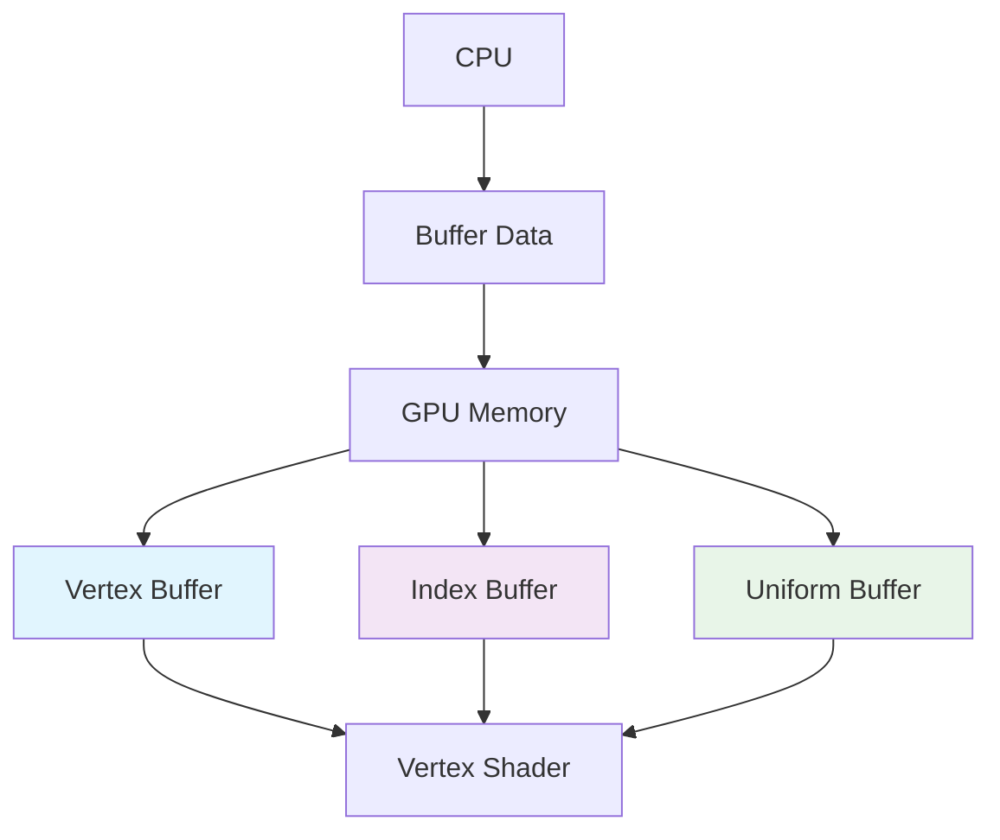
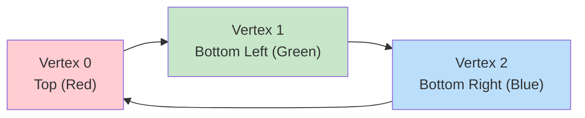
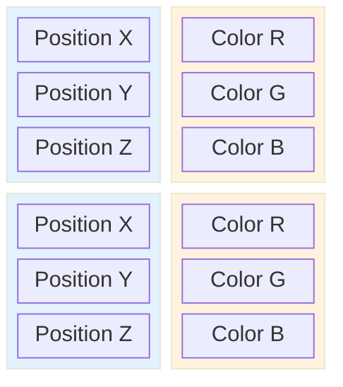
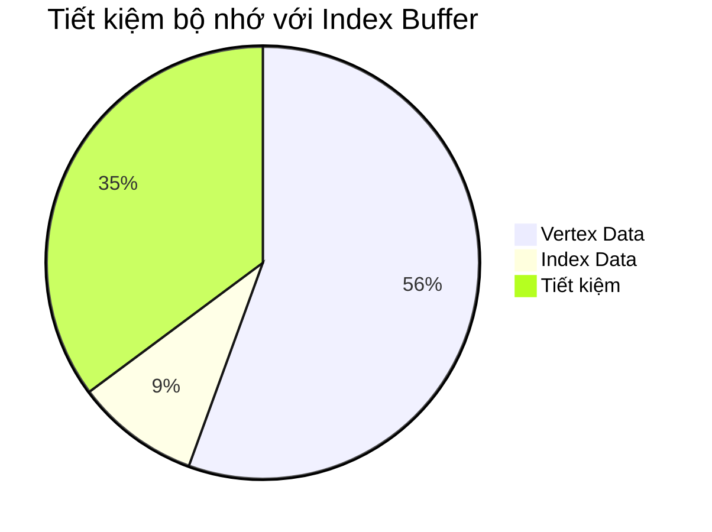
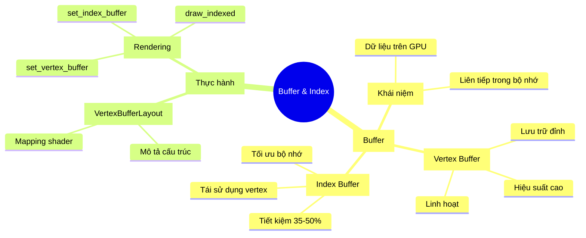

# Bài 4: Hướng dẫn Buffer và Index trong wgpu

<div className="bg-gradient-to-r from-blue-100 to-purple-100 p-6 rounded-lg border-l-4 border-blue-500 mb-8">
  <h2 className="text-2xl font-bold text-blue-800 mb-2">🎯 Mục tiêu bài học</h2>
  <ul className="text-blue-700 space-y-2">
    <li>✅ Hiểu khái niệm Buffer và vai trò trong GPU</li>
    <li>✅ Thành thạo việc tạo và sử dụng Vertex Buffer</li>
    <li>✅ Nắm vững Index Buffer và tối ưu hóa bộ nhớ</li>
    <li>✅ Thực hành tạo các hình phức tạp với Buffer</li>
  </ul>
</div>

## 1. Buffer là gì?

<div className="bg-yellow-50 border border-yellow-200 p-4 rounded-md mb-6">
  <p className="text-yellow-800 font-medium">💡 <strong>Định nghĩa:</strong> Buffer là một khối dữ liệu được lưu trữ trên GPU, đảm bảo dữ liệu được sắp xếp liên tiếp trong bộ nhớ.</p>
</div>

### Đặc điểm của Buffer

| Đặc điểm | Mô tả |
|----------|--------|
| **Vị trí lưu trữ** | Trên GPU (Graphics Processing Unit) |
| **Cấu trúc dữ liệu** | Liên tiếp trong bộ nhớ |
| **Loại dữ liệu** | Struct, mảng, hoặc cấu trúc phức tạp |
| **Ưu điểm** | Truy cập nhanh, hiệu suất cao |



## 2. Vertex Buffer - Bộ đệm đỉnh

### 2.1 Tại sao cần Vertex Buffer?

<div className="bg-red-50 border border-red-200 p-4 rounded-md mb-6">
  <h4 className="text-red-800 font-bold">❌ Vấn đề với cách cũ:</h4>
  <ul className="text-red-700 mt-2 space-y-1">
    <li>• Dữ liệu vertex cố định trong shader</li>
    <li>• Phải biên dịch lại shader khi thay đổi mô hình</li>
    <li>• Hiệu suất kém với đối tượng phức tạp</li>
  </ul>
</div>

<div className="bg-green-50 border border-green-200 p-4 rounded-md mb-6">
  <h4 className="text-green-800 font-bold">✅ Ưu điểm của Vertex Buffer:</h4>
  <ul className="text-green-700 mt-2 space-y-1">
    <li>• Dữ liệu động, linh hoạt</li>
    <li>• Hiệu suất cao</li>
    <li>• Dễ dàng cập nhật và quản lý</li>
  </ul>
</div>

### 2.2 Định nghĩa cấu trúc Vertex

```rust
#[repr(C)]
#[derive(Copy, Clone, Debug, bytemuck::Pod, bytemuck::Zeroable)]
struct Vertex {
    position: [f32; 3],  // Tọa độ x, y, z
    color: [f32; 3],     // Màu sắc r, g, b
}
```

### Giải thích các thuộc tính

| Thuộc tính | Mục đích |
|------------|----------|
| `#[repr(C)]` | Đảm bảo layout bộ nhớ như C |
| `Copy, Clone` | Cho phép sao chép dữ liệu |
| `Debug` | Hỗ trợ in debug |
| `Pod` | "Plain Old Data" - dữ liệu đơn giản |
| `Zeroable` | Có thể khởi tạo bằng zero |

### 2.3 Dữ liệu Vertex mẫu

```rust
const VERTICES: &[Vertex] = &[
    Vertex { position: [0.0, 0.5, 0.0], color: [1.0, 0.0, 0.0] },    // Đỉnh trên - Đỏ
    Vertex { position: [-0.5, -0.5, 0.0], color: [0.0, 1.0, 0.0] },  // Trái dưới - Xanh lá
    Vertex { position: [0.5, -0.5, 0.0], color: [0.0, 0.0, 1.0] },   // Phải dưới - Xanh dương
];
```



### 2.4 Tạo Vertex Buffer

```rust
let vertex_buffer = device.create_buffer_init(
    &wgpu::util::BufferInitDescriptor {
        label: Some("Vertex Buffer"),
        contents: bytemuck::cast_slice(VERTICES),
        usage: wgpu::BufferUsages::VERTEX,
    }
);
```

## 3. VertexBufferLayout - Mô tả cấu trúc Buffer

### 3.1 Khái niệm

<div className="bg-blue-50 border border-blue-200 p-4 rounded-md mb-6">
  <p className="text-blue-800"><strong>VertexBufferLayout</strong> cho GPU biết cách đọc và hiểu dữ liệu trong buffer.</p>
</div>

### 3.2 Cấu trúc VertexBufferLayout

```rust
impl Vertex {
    fn desc() -> wgpu::VertexBufferLayout<'static> {
        wgpu::VertexBufferLayout {
            array_stride: std::mem::size_of::<Vertex>() as wgpu::BufferAddress,
            step_mode: wgpu::VertexStepMode::Vertex,
            attributes: &[
                wgpu::VertexAttribute {
                    offset: 0,
                    shader_location: 0,
                    format: wgpu::VertexFormat::Float32x3,
                },
                wgpu::VertexAttribute {
                    offset: std::mem::size_of::<[f32; 3]>() as wgpu::BufferAddress,
                    shader_location: 1,
                    format: wgpu::VertexFormat::Float32x3,
                }
            ]
        }
    }
}
```

### Giải thích các tham số

| Tham số | Mô tả | Giá trị ví dụ |
|---------|--------|---------------|
| `array_stride` | Khoảng cách giữa các vertex (bytes) | 24 bytes |
| `step_mode` | Chế độ bước (per-vertex/per-instance) | `Vertex` |
| `attributes` | Danh sách thuộc tính của vertex | Position, Color |
| `offset` | Vị trí bắt đầu thuộc tính (bytes) | 0, 12 |
| `shader_location` | Vị trí trong shader | 0, 1 |
| `format` | Định dạng dữ liệu | `Float32x3` |



## 4. Index Buffer - Tối ưu hóa bộ nhớ

### 4.1 Vấn đề với Vertex Buffer thuần túy

<div className="bg-orange-50 border border-orange-200 p-4 rounded-md mb-6">
  <h4 className="text-orange-800 font-bold">⚠️ Vấn đề trùng lặp dữ liệu:</h4>
  <p className="text-orange-700 mt-2">Khi vẽ hình phức tạp, nhiều vertex được sử dụng lại → lãng phí bộ nhớ</p>
</div>

### Ví dụ: Hình ngũ giác

**Không sử dụng Index Buffer:**
```rust
// 9 vertex (nhiều vertex trùng lặp)
const VERTICES: &[Vertex] = &[
    // Triangle 1: A-B-E
    Vertex { position: [-0.0868241, 0.49240386, 0.0], color: [0.5, 0.0, 0.5] }, // A
    Vertex { position: [-0.49513406, 0.06958647, 0.0], color: [0.5, 0.0, 0.5] }, // B
    Vertex { position: [0.44147372, 0.2347359, 0.0], color: [0.5, 0.0, 0.5] }, // E
    // Triangle 2: B-C-E
    Vertex { position: [-0.49513406, 0.06958647, 0.0], color: [0.5, 0.0, 0.5] }, // B (trùng)
    Vertex { position: [-0.21918549, -0.44939706, 0.0], color: [0.5, 0.0, 0.5] }, // C
    Vertex { position: [0.44147372, 0.2347359, 0.0], color: [0.5, 0.0, 0.5] }, // E (trùng)
    // Triangle 3: C-D-E
    Vertex { position: [-0.21918549, -0.44939706, 0.0], color: [0.5, 0.0, 0.5] }, // C (trùng)
    Vertex { position: [0.35966998, -0.3473291, 0.0], color: [0.5, 0.0, 0.5] }, // D
    Vertex { position: [0.44147372, 0.2347359, 0.0], color: [0.5, 0.0, 0.5] }, // E (trùng)
];
```

**Sử dụng Index Buffer:**
```rust
// Chỉ 5 vertex duy nhất
const VERTICES: &[Vertex] = &[
    Vertex { position: [-0.0868241, 0.49240386, 0.0], color: [0.5, 0.0, 0.5] }, // A (0)
    Vertex { position: [-0.49513406, 0.06958647, 0.0], color: [0.5, 0.0, 0.5] }, // B (1)
    Vertex { position: [-0.21918549, -0.44939706, 0.0], color: [0.5, 0.0, 0.5] }, // C (2)
    Vertex { position: [0.35966998, -0.3473291, 0.0], color: [0.5, 0.0, 0.5] }, // D (3)
    Vertex { position: [0.44147372, 0.2347359, 0.0], color: [0.5, 0.0, 0.5] }, // E (4)
];

// Chỉ mục để tạo tam giác
const INDICES: &[u16] = &[
    0, 1, 4,  // Triangle 1: A-B-E
    1, 2, 4,  // Triangle 2: B-C-E
    2, 3, 4,  // Triangle 3: C-D-E
];
```

### So sánh hiệu quả bộ nhớ

| Phương pháp | Vertex Buffer | Index Buffer | Tổng cộng | Tiết kiệm |
|-------------|---------------|--------------|-----------|-----------|
| Không Index | 216 bytes | 0 bytes | **216 bytes** | - |
| Có Index | 120 bytes | 20 bytes | **140 bytes** | **76 bytes (35%)** |



### 4.2 Tạo Index Buffer

```rust
let index_buffer = device.create_buffer_init(
    &wgpu::util::BufferInitDescriptor {
        label: Some("Index Buffer"),
        contents: bytemuck::cast_slice(INDICES),
        usage: wgpu::BufferUsages::INDEX,
    }
);
```

### 4.3 Sử dụng Index Buffer trong rendering

```rust
// Trong hàm render()
render_pass.set_pipeline(&self.render_pipeline);
render_pass.set_vertex_buffer(0, self.vertex_buffer.slice(..));
render_pass.set_index_buffer(self.index_buffer.slice(..), wgpu::IndexFormat::Uint16);
render_pass.draw_indexed(0..self.num_indices, 0, 0..1);
```

### Sự khác biệt giữa các phương thức vẽ

| Phương thức | Mô tả | Khi nào sử dụng |
|-------------|--------|-----------------|
| `draw()` | Vẽ trực tiếp từ vertex buffer | Hình đơn giản, ít vertex |
| `draw_indexed()` | Vẽ qua index buffer | Hình phức tạp, nhiều vertex chung |

## 5. Shader cập nhật

### Vertex Shader

```wgsl
struct VertexInput {
    @location(0) position: vec3<f32>,
    @location(1) color: vec3<f32>,
};

struct VertexOutput {
    @builtin(position) clip_position: vec4<f32>,
    @location(0) color: vec3<f32>,
};

@vertex
fn vs_main(model: VertexInput) -> VertexOutput {
    var out: VertexOutput;
    out.color = model.color;
    out.clip_position = vec4<f32>(model.position, 1.0);
    return out;
}
```

### Fragment Shader

```wgsl
@fragment
fn fs_main(in: VertexOutput) -> @location(0) vec4<f32> {
    return vec4<f32>(in.color, 1.0);
}
```

## 6. Hiệu chỉnh màu sắc (Color Correction)

<div className="bg-purple-50 border border-purple-200 p-4 rounded-md mb-6">
  <h4 className="text-purple-800 font-bold">🎨 Vấn đề không gian màu:</h4>
  <p className="text-purple-700 mt-2">Màu hiển thị khác với màu mong muốn do sự khác biệt giữa không gian màu sRGB và Linear.</p>
</div>

### So sánh không gian màu

| Không gian màu | Đặc điểm | Sử dụng |
|----------------|----------|---------|
| **sRGB** | Theo độ sáng tương đối | Màn hình, hình ảnh |
| **Linear** | Theo độ sáng thực tế | GPU, tính toán |

### Công thức chuyển đổi

```
linear_color = ((srgb_color / 255 + 0.055) / 1.055) ^ 2.4
```

**Ví dụ:**
- sRGB: (188, 0, 188) → #BC00BC
- Linear: (0.503, 0.0, 0.503)

## 7. Bài tập thực hành

<div className="bg-green-50 border border-green-200 p-4 rounded-md mb-6">
  <h4 className="text-green-800 font-bold">🎯 Thử thách:</h4>
  <p className="text-green-700 mt-2">Tạo một hình phức tạp hơn tam giác (ít nhất 4 tam giác) sử dụng vertex buffer và index buffer. Thêm tính năng chuyển đổi giữa hai chế độ bằng phím Space.</p>
</div>

### Gợi ý thực hiện

1. **Thiết kế hình:** Chọn hình 6 cạnh, 8 cạnh, hoặc ngôi sao
2. **Tính toán vertex:** Xác định tọa độ các đỉnh
3. **Tạo index:** Chia thành các tam giác
4. **Xử lý input:** Phím Space để chuyển đổi
5. **Tối ưu:** So sánh hiệu suất hai phương pháp

### Ví dụ hình lục giác

```rust
const HEXAGON_VERTICES: &[Vertex] = &[
    // Tâm
    Vertex { position: [0.0, 0.0, 0.0], color: [1.0, 1.0, 0.0] },
    // 6 đỉnh xung quanh
    Vertex { position: [0.5, 0.0, 0.0], color: [1.0, 0.0, 0.0] },
    Vertex { position: [0.25, 0.433, 0.0], color: [0.0, 1.0, 0.0] },
    Vertex { position: [-0.25, 0.433, 0.0], color: [0.0, 0.0, 1.0] },
    Vertex { position: [-0.5, 0.0, 0.0], color: [1.0, 0.0, 1.0] },
    Vertex { position: [-0.25, -0.433, 0.0], color: [0.0, 1.0, 1.0] },
    Vertex { position: [0.25, -0.433, 0.0], color: [1.0, 1.0, 1.0] },
];

const HEXAGON_INDICES: &[u16] = &[
    0, 1, 2,  // Triangle 1
    0, 2, 3,  // Triangle 2  
    0, 3, 4,  // Triangle 3
    0, 4, 5,  // Triangle 4
    0, 5, 6,  // Triangle 5
    0, 6, 1,  // Triangle 6
];
```

## 8. Tóm tắt bài học



<div className="bg-gray-50 border border-gray-200 p-6 rounded-lg mt-8">
  <h3 className="text-xl font-bold text-gray-800 mb-4">📚 Kiến thức đã học</h3>
  <div className="grid md:grid-cols-2 gap-4">
    <div className="space-y-2">
      <h4 className="font-semibold text-gray-700">Lý thuyết:</h4>
      <ul className="text-sm text-gray-600 space-y-1">
        <li>• Khái niệm Buffer và ứng dụng</li>
        <li>• Vertex Buffer và cấu trúc vertex</li>
        <li>• Index Buffer và tối ưu hóa</li>
        <li>• VertexBufferLayout</li>
      </ul>
    </div>
    <div className="space-y-2">
      <h4 className="font-semibold text-gray-700">Thực hành:</h4>
      <ul className="text-sm text-gray-600 space-y-1">
        <li>• Tạo và sử dụng vertex buffer</li>
        <li>• Implement index buffer</li>
        <li>• Cập nhật shader cho buffer</li>
        <li>• Tối ưu hóa hiệu suất</li>
      </ul>
    </div>
  </div>
</div>