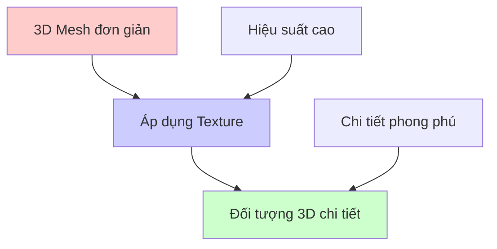
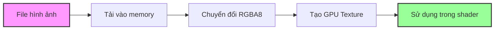
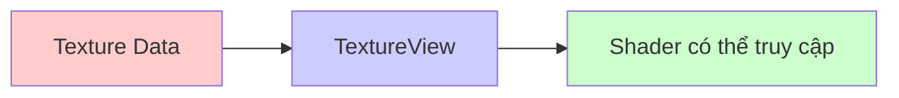
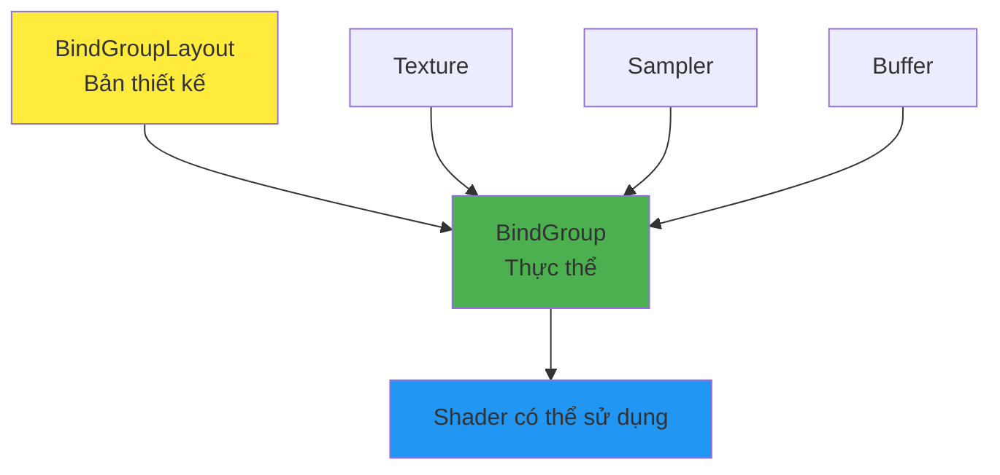
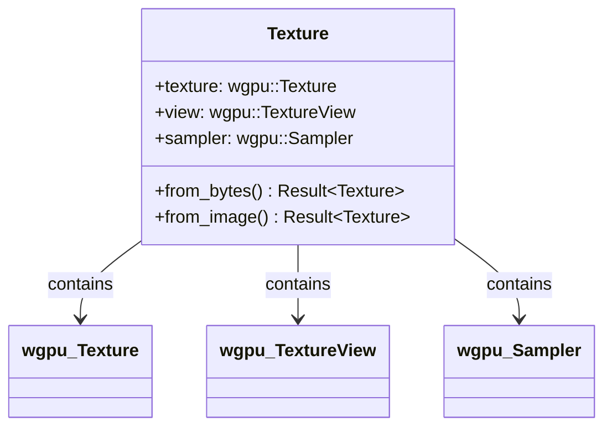
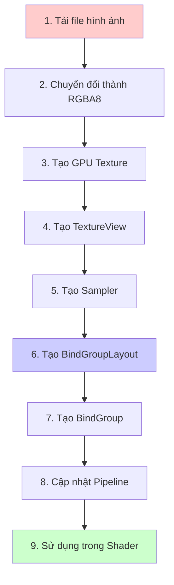

# Bài 5: Hướng dẫn Textures và Bind Groups trong WebGPU

<div className="bg-gradient-to-r from-blue-50 to-indigo-50 p-6 rounded-lg border-l-4 border-blue-500 mb-8">
  <h2 className="text-2xl font-bold text-blue-900 mb-4">🎯 Mục tiêu bài học</h2>
  <ul className="space-y-2 text-blue-800">
    <li>✅ Hiểu khái niệm Texture và ứng dụng trong đồ họa 3D</li>
    <li>✅ Học cách tải và xử lý hình ảnh từ file</li>
    <li>✅ Nắm vững cách sử dụng TextureView và Sampler</li>
    <li>✅ Làm chủ BindGroup và PipelineLayout</li>
    <li>✅ Thực hành tạo một ứng dụng hiển thị texture hoàn chỉnh</li>
  </ul>
</div>

## 1. Giới thiệu về Textures

### 1.1 Texture là gì?

**Texture** là hình ảnh được áp lên bề mặt các đối tượng 3D để tạo ra chi tiết và độ sống động. Thay vì vẽ hàng triệu tam giác để tạo chi tiết, chúng ta có thể sử dụng texture để "lừa" mắt người xem.



### 1.2 Các loại Texture phổ biến

| Loại Texture | Mục đích | Ví dụ |
|--------------|----------|--------|
| **Diffuse Map** | Màu sắc cơ bản của vật liệu | Màu gỗ, màu da |
| **Normal Map** | Chi tiết bề mặt (độ gồ ghề) | Vết nứt, vân gỗ |
| **Specular Map** | Độ bóng/phản chiếu | Kim loại, nhựa |
| **Bump Map** | Độ nhấp nhô nhỏ | Độ nhám của bề mặt |

<div className="bg-yellow-50 border-l-4 border-yellow-400 p-4 my-6">
  <p className="text-yellow-800"><strong>📝 Lưu ý:</strong> Trong bài học này, chúng ta sẽ tập trung vào <strong>Diffuse Texture</strong> - loại texture cơ bản nhất để hiển thị màu sắc.</p>
</div>

## 2. Chuẩn bị và tải hình ảnh

### 2.1 Cài đặt thư viện cần thiết

Thêm vào `Cargo.toml`:

```toml
[dependencies.image]
version = "0.24"
default-features = false
features = ["png", "jpeg"]

[dependencies]
anyhow = "1.0"
```

### 2.2 Quy trình tải texture



### 2.3 Code tải texture cơ bản

```rust
// Tải hình ảnh từ file
let diffuse_bytes = include_bytes!("happy-tree.png");
let diffuse_image = image::load_from_memory(diffuse_bytes).unwrap();
let diffuse_rgba = diffuse_image.to_rgba8();

// Lấy kích thước hình ảnh
use image::GenericImageView;
let dimensions = diffuse_image.dimensions();
```

## 3. Tạo GPU Texture

### 3.1 Cấu hình Texture Descriptor

| Tham số | Ý nghĩa | Giá trị thường dùng |
|---------|---------|-------------------|
| `size` | Kích thước texture | width × height × 1 |
| `format` | Định dạng pixel | `Rgba8UnormSrgb` |
| `usage` | Cách sử dụng | `TEXTURE_BINDING \| COPY_DST` |
| `dimension` | Loại texture | `D2` (2D) |

```rust
let texture_size = wgpu::Extent3d {
    width: dimensions.0,
    height: dimensions.1,
    depth_or_array_layers: 1, // 2D texture nên depth = 1
};

let diffuse_texture = device.create_texture(&wgpu::TextureDescriptor {
    size: texture_size,
    mip_level_count: 1,
    sample_count: 1,
    dimension: wgpu::TextureDimension::D2,
    format: wgpu::TextureFormat::Rgba8UnormSrgb,
    usage: wgpu::TextureUsages::TEXTURE_BINDING | wgpu::TextureUsages::COPY_DST,
    label: Some("diffuse_texture"),
    view_formats: &[],
});
```

### 3.2 Ghi dữ liệu vào Texture

<div className="bg-green-50 border border-green-200 rounded-lg p-4 my-4">
  <h4 className="text-green-800 font-semibold mb-2">💡 Mẹo quan trọng</h4>
  <p className="text-green-700">Sử dụng <code>write_texture</code> thay vì tạo buffer trung gian để tối ưu hiệu suất!</p>
</div>

```rust
queue.write_texture(
    wgpu::TexelCopyTextureInfo {
        texture: &diffuse_texture,
        mip_level: 0,
        origin: wgpu::Origin3d::ZERO,
        aspect: wgpu::TextureAspect::All,
    },
    &diffuse_rgba,
    wgpu::TexelCopyBufferLayout {
        offset: 0,
        bytes_per_row: Some(4 * dimensions.0), // 4 bytes per pixel (RGBA)
        rows_per_image: Some(dimensions.1),
    },
    texture_size,
);
```

## 4. TextureView và Sampler

### 4.1 TextureView - "Cửa sổ" nhìn vào Texture



```rust
let diffuse_texture_view = diffuse_texture.create_view(&wgpu::TextureViewDescriptor::default());
```

### 4.2 Sampler - Bộ lấy mẫu Texture

Sampler quyết định cách "lấy màu" từ texture khi được yêu cầu tại một tọa độ cụ thể.

#### Bảng các tham số Sampler quan trọng:

| Tham số | Mô tả | Tùy chọn |
|---------|-------|----------|
| **Address Mode** | Xử lý tọa độ ngoài [0,1] | `ClampToEdge`, `Repeat`, `MirrorRepeat` |
| **Mag Filter** | Lọc khi texture lớn hơn pixel | `Linear`, `Nearest` |
| **Min Filter** | Lọc khi texture nhỏ hơn pixel | `Linear`, `Nearest` |

<div className="grid grid-cols-1 md:grid-cols-3 gap-4 my-6">
  <div className="bg-blue-50 p-4 rounded border">
    <h5 className="font-bold text-blue-900">ClampToEdge</h5>
    <p className="text-sm text-blue-700">Lặp lại pixel biên</p>
  </div>
  <div className="bg-green-50 p-4 rounded border">
    <h5 className="font-bold text-green-900">Repeat</h5>
    <p className="text-sm text-green-700">Lặp lại texture</p>
  </div>
  <div className="bg-purple-50 p-4 rounded border">
    <h5 className="font-bold text-purple-900">MirrorRepeat</h5>
    <p className="text-sm text-purple-700">Lặp lại và lật ngược</p>
  </div>
</div>

```rust
let diffuse_sampler = device.create_sampler(&wgpu::SamplerDescriptor {
    address_mode_u: wgpu::AddressMode::ClampToEdge,
    address_mode_v: wgpu::AddressMode::ClampToEdge,
    address_mode_w: wgpu::AddressMode::ClampToEdge,
    mag_filter: wgpu::FilterMode::Linear,    // Mượt mà khi phóng to
    min_filter: wgpu::FilterMode::Nearest,   // Sắc nét khi thu nhỏ
    mipmap_filter: wgpu::FilterMode::Nearest,
    ..Default::default()
});
```

## 5. BindGroup - Nhóm tài nguyên

### 5.1 Khái niệm BindGroup



### 5.2 Tạo BindGroupLayout

| Binding | Resource Type | Shader Stage | Mục đích |
|---------|---------------|--------------|----------|
| 0 | Texture | Fragment | Lưu trữ hình ảnh |
| 1 | Sampler | Fragment | Lấy mẫu màu |

```rust
let texture_bind_group_layout = device.create_bind_group_layout(&wgpu::BindGroupLayoutDescriptor {
    entries: &[
        // Binding 0: Texture
        wgpu::BindGroupLayoutEntry {
            binding: 0,
            visibility: wgpu::ShaderStages::FRAGMENT,
            ty: wgpu::BindingType::Texture {
                multisampled: false,
                view_dimension: wgpu::TextureViewDimension::D2,
                sample_type: wgpu::TextureSampleType::Float { filterable: true },
            },
            count: None,
        },
        // Binding 1: Sampler
        wgpu::BindGroupLayoutEntry {
            binding: 1,
            visibility: wgpu::ShaderStages::FRAGMENT,
            ty: wgpu::BindingType::Sampler(wgpu::SamplerBindingType::Filtering),
            count: None,
        },
    ],
    label: Some("texture_bind_group_layout"),
});
```

### 5.3 Tạo BindGroup thực tế

```rust
let diffuse_bind_group = device.create_bind_group(&wgpu::BindGroupDescriptor {
    layout: &texture_bind_group_layout,
    entries: &[
        wgpu::BindGroupEntry {
            binding: 0,
            resource: wgpu::BindingResource::TextureView(&diffuse_texture_view),
        },
        wgpu::BindGroupEntry {
            binding: 1,
            resource: wgpu::BindingResource::Sampler(&diffuse_sampler),
        }
    ],
    label: Some("diffuse_bind_group"),
});
```

## 6. Cập nhật Vertex Structure

### 6.1 Thay đổi từ color sang texture coordinates

| Thuộc tính cũ | Thuộc tính mới | Loại dữ liệu |
|---------------|----------------|--------------|
| `color: [f32; 3]` | `tex_coords: [f32; 2]` | 2D coordinates |

```rust
#[repr(C)]
#[derive(Copy, Clone, Debug, bytemuck::Pod, bytemuck::Zeroable)]
struct Vertex {
    position: [f32; 3],
    tex_coords: [f32; 2], // Thay thế color
}
```

### 6.2 Cập nhật VertexBufferLayout

```rust
impl Vertex {
    fn desc() -> wgpu::VertexBufferLayout<'static> {
        use std::mem;
        wgpu::VertexBufferLayout {
            array_stride: mem::size_of::<Vertex>() as wgpu::BufferAddress,
            step_mode: wgpu::VertexStepMode::Vertex,
            attributes: &[
                // Position
                wgpu::VertexAttribute {
                    offset: 0,
                    shader_location: 0,
                    format: wgpu::VertexFormat::Float32x3,
                },
                // Texture coordinates
                wgpu::VertexAttribute {
                    offset: mem::size_of::<[f32; 3]>() as wgpu::BufferAddress,
                    shader_location: 1,
                    format: wgpu::VertexFormat::Float32x2, // 2D thay vì 3D
                },
            ]
        }
    }
}
```

### 6.3 Định nghĩa vertices mới với texture coordinates

<div className="bg-orange-50 border-l-4 border-orange-400 p-4 my-4">
  <p className="text-orange-800"><strong>⚠️ Chú ý về tọa độ texture:</strong></p>
  <ul className="list-disc list-inside text-orange-700 mt-2">
    <li>Tọa độ (0,0) ở góc trên-trái của texture</li>
    <li>Tọa độ (1,1) ở góc dưới-phải của texture</li>
    <li>Trục Y của texture ngược với trục Y của world coordinate</li>
  </ul>
</div>

```rust
const VERTICES: &[Vertex] = &[
    Vertex { position: [-0.0868241, 0.49240386, 0.0], tex_coords: [0.4131759, 0.00759614], }, // A
    Vertex { position: [-0.49513406, 0.06958647, 0.0], tex_coords: [0.0048659444, 0.43041354], }, // B
    Vertex { position: [-0.21918549, -0.44939706, 0.0], tex_coords: [0.28081453, 0.949397], }, // C
    Vertex { position: [0.35966998, -0.3473291, 0.0], tex_coords: [0.85967, 0.84732914], }, // D
    Vertex { position: [0.44147372, 0.2347359, 0.0], tex_coords: [0.9414737, 0.2652641], }, // E
];
```

## 7. Cập nhật Shader

### 7.1 Vertex Shader

```wgsl
// Vertex shader
struct VertexInput {
    @location(0) position: vec3<f32>,
    @location(1) tex_coords: vec2<f32>,
}

struct VertexOutput {
    @builtin(position) clip_position: vec4<f32>,
    @location(0) tex_coords: vec2<f32>,
}

@vertex
fn vs_main(model: VertexInput) -> VertexOutput {
    var out: VertexOutput;
    out.tex_coords = model.tex_coords;
    out.clip_position = vec4<f32>(model.position, 1.0);
    return out;
}
```

### 7.2 Fragment Shader

```wgsl
// Fragment shader
@group(0) @binding(0)
var t_diffuse: texture_2d<f32>;
@group(0) @binding(1)
var s_diffuse: sampler;

@fragment
fn fs_main(in: VertexOutput) -> @location(0) vec4<f32> {
    return textureSample(t_diffuse, s_diffuse, in.tex_coords);
}
```

### 7.3 Giải thích các decorator

| Decorator | Ý nghĩa |
|-----------|---------|
| `@group(0)` | Tương ứng với tham số đầu tiên trong `set_bind_group(0, ...)` |
| `@binding(0)` | Tương ứng với `binding: 0` trong BindGroupLayout |
| `@binding(1)` | Tương ứng với `binding: 1` trong BindGroupLayout |

## 8. Cập nhật Pipeline và Render

### 8.1 Cập nhật PipelineLayout

```rust
let render_pipeline_layout = device.create_pipeline_layout(&wgpu::PipelineLayoutDescriptor {
    label: Some("Render Pipeline Layout"),
    bind_group_layouts: &[&texture_bind_group_layout], // Thêm bind group layout
    push_constant_ranges: &[],
});
```

### 8.2 Sử dụng BindGroup trong render

```rust
// Trong hàm render()
render_pass.set_pipeline(&self.render_pipeline);
render_pass.set_bind_group(0, &self.diffuse_bind_group, &[]); // Thiết lập bind group
render_pass.set_vertex_buffer(0, self.vertex_buffer.slice(..));
render_pass.set_index_buffer(self.index_buffer.slice(..), wgpu::IndexFormat::Uint16);
render_pass.draw_indexed(0..self.num_indices, 0, 0..1);
```

## 9. Tối ưu hóa: Tạo module Texture

### 9.1 Cấu trúc module `texture.rs`



### 9.2 Implementation hoàn chỉnh

```rust
// src/texture.rs
use image::GenericImageView;
use anyhow::*;

pub struct Texture {
    #[allow(unused)]
    pub texture: wgpu::Texture,
    pub view: wgpu::TextureView,
    pub sampler: wgpu::Sampler,
}

impl Texture {
    pub fn from_bytes(
        device: &wgpu::Device,
        queue: &wgpu::Queue,
        bytes: &[u8], 
        label: &str
    ) -> Result<Self> {
        let img = image::load_from_memory(bytes)?;
        Self::from_image(device, queue, &img, Some(label))
    }

    pub fn from_image(
        device: &wgpu::Device,
        queue: &wgpu::Queue,
        img: &image::DynamicImage,
        label: Option<&str>
    ) -> Result<Self> {
        let rgba = img.to_rgba8();
        let dimensions = img.dimensions();

        let size = wgpu::Extent3d {
            width: dimensions.0,
            height: dimensions.1,
            depth_or_array_layers: 1,
        };
        
        let texture = device.create_texture(&wgpu::TextureDescriptor {
            label,
            size,
            mip_level_count: 1,
            sample_count: 1,
            dimension: wgpu::TextureDimension::D2,
            format: wgpu::TextureFormat::Rgba8UnormSrgb,
            usage: wgpu::TextureUsages::TEXTURE_BINDING | wgpu::TextureUsages::COPY_DST,
            view_formats: &[],
        });

        queue.write_texture(
            wgpu::TexelCopyTextureInfo {
                aspect: wgpu::TextureAspect::All,
                texture: &texture,
                mip_level: 0,
                origin: wgpu::Origin3d::ZERO,
            },
            &rgba,
            wgpu::TexelCopyBufferLayout {
                offset: 0,
                bytes_per_row: Some(4 * dimensions.0),
                rows_per_image: Some(dimensions.1),
            },
            size,
        );

        let view = texture.create_view(&wgpu::TextureViewDescriptor::default());
        let sampler = device.create_sampler(&wgpu::SamplerDescriptor {
            address_mode_u: wgpu::AddressMode::ClampToEdge,
            address_mode_v: wgpu::AddressMode::ClampToEdge,
            address_mode_w: wgpu::AddressMode::ClampToEdge,
            mag_filter: wgpu::FilterMode::Linear,
            min_filter: wgpu::FilterMode::Nearest,
            mipmap_filter: wgpu::FilterMode::Nearest,
            ..Default::default()
        });

        Ok(Self { texture, view, sampler })
    }
}
```

## 10. Bài tập thực hành

<div className="bg-indigo-50 border border-indigo-200 rounded-lg p-6 my-6">
  <h3 className="text-xl font-bold text-indigo-900 mb-4">🚀 Thử thách cho bạn</h3>
  <div className="space-y-3 text-indigo-800">
    <p><strong>Cấp độ Cơ bản:</strong></p>
    <ul className="list-disc list-inside ml-4 space-y-1">
      <li>Tạo thêm một texture khác và chuyển đổi giữa hai texture khi nhấn phím Space</li>
      <li>Thử nghiệm với các filter mode khác nhau (Linear vs Nearest)</li>
    </ul>
    
    <p><strong>Cấp độ Nâng cao:</strong></p>
    <ul className="list-disc list-inside ml-4 space-y-1">
      <li>Tạo một hệ thống quản lý nhiều texture</li>
      <li>Thử nghiệm với address mode Repeat để tạo hiệu ứng lặp texture</li>
      <li>Tạo animation chuyển đổi texture mượt mà</li>
    </ul>
  </div>
</div>

## 11. Tóm tắt kiến thức

### Quy trình hoàn chỉnh sử dụng Texture:



### Các khái niệm quan trọng cần nhớ:

| Khái niệm | Vai trò | Quan hệ |
|-----------|---------|---------|
| **Texture** | Lưu trữ dữ liệu hình ảnh trên GPU | Dữ liệu thô |
| **TextureView** | Cung cấp cách truy cập Texture | Giao diện truy cập |
| **Sampler** | Định nghĩa cách lấy mẫu từ Texture | Phương thức truy cập |
| **BindGroup** | Nhóm tài nguyên để shader sử dụng | Container |
| **BindGroupLayout** | Định nghĩa cấu trúc BindGroup | Bản thiết kế |

<div className="bg-green-50 border border-green-200 rounded-lg p-4 mt-8">
  <h4 className="text-green-800 font-semibold mb-2">🎉 Chúc mừng!</h4>
  <p className="text-green-700">Bạn đã hoàn thành bài học về Textures và BindGroups. Bây giờ bạn có thể tạo ra những đối tượng 3D sống động với hình ảnh thực tế!</p>
</div>

---

*Bài học tiếp theo: Camera và Uniform Buffers - Học cách điều khiển góc nhìn trong không gian 3D*