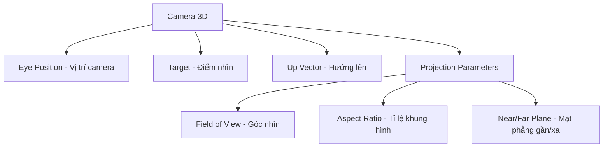
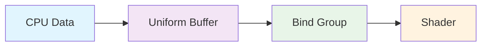
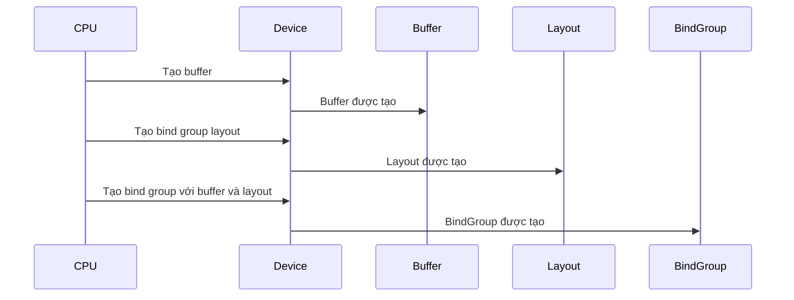
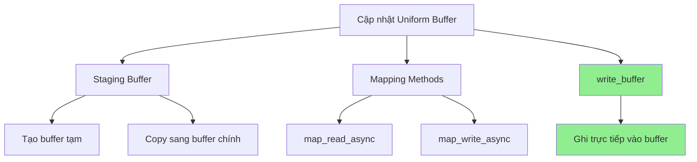
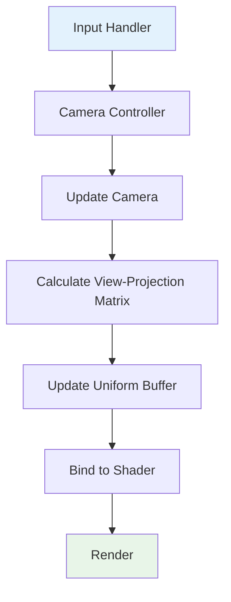

# Bài 6: Uniform Buffers và Camera 3D trong WGPU

<div className="bg-gradient-to-r from-blue-100 to-purple-100 p-6 rounded-lg shadow-md mb-8">
  <h2 className="text-2xl font-bold text-gray-800 mb-4">🎯 Mục tiêu học tập</h2>
  <ul className="list-disc list-inside text-gray-700 space-y-2">
    <li>Hiểu về hệ thống camera 3D và ma trận view-projection</li>
    <li>Học cách sử dụng Uniform Buffers để truyền dữ liệu vào shader</li>
    <li>Tạo và quản lý bind groups cho uniform buffers</li>
    <li>Xây dựng hệ thống điều khiển camera cơ bản</li>
  </ul>
</div>

## 📚 1. Giới thiệu về Camera 3D

Mặc dù các bài trước có vẻ như làm việc trong không gian 2D, nhưng thực tế chúng ta đã làm việc trong không gian 3D! Điều này giải thích tại sao cấu trúc `Vertex` có `position` là một mảng 3 số float thay vì chỉ 2. Chúng ta không thể nhìn thấy tính chất 3D vì đang nhìn từ phía trước.

### Khái niệm cơ bản về Camera



## 🔧 2. Cài đặt thư viện toán học

Trước khi bắt đầu, chúng ta cần thêm thư viện `cgmath` để xử lý các phép toán ma trận:

```toml
[dependencies]
# các dependency khác...
cgmath = "0.18"
```

<div className="bg-yellow-50 border-l-4 border-yellow-400 p-4 my-4">
  <div className="flex">
    <div className="flex-shrink-0">
      <span className="text-yellow-800 text-lg">⚠️</span>
    </div>
    <div className="ml-3">
      <span className="text-sm text-yellow-800 block">
        <strong>Lưu ý:</strong> cgmath là thư viện toán học phổ biến cho game development, 
        giúp xử lý vector, ma trận và các phép biến đổi 3D.
      </span>
    </div>
  </div>
</div>

## 🎥 3. Xây dựng cấu trúc Camera

### 3.1. Định nghĩa Camera struct

```rust
struct Camera {
    eye: cgmath::Point3<f32>,      // Vị trí camera
    target: cgmath::Point3<f32>,   // Điểm camera nhìn tới
    up: cgmath::Vector3<f32>,      // Vector hướng lên
    aspect: f32,                   // Tỉ lệ khung hình
    fovy: f32,                     // Góc nhìn theo chiều dọc
    znear: f32,                    // Mặt phẳng gần
    zfar: f32,                     // Mặt phẳng xa
}
```

### 3.2. Ma trận chuyển đổi hệ tọa độ

| Hệ tọa độ | X | Y | Z | Mô tả |
|-----------|---|---|---|-------|
| OpenGL | -1 đến +1 | -1 đến +1 | -1 đến +1 | Hệ tọa độ chuẩn |
| WGPU/DirectX | -1 đến +1 | -1 đến +1 | 0 đến +1 | Hệ tọa độ WGPU |

```rust
#[rustfmt::skip]
pub const OPENGL_TO_WGPU_MATRIX: cgmath::Matrix4<f32> = cgmath::Matrix4::from_cols(
    cgmath::Vector4::new(1.0, 0.0, 0.0, 0.0),
    cgmath::Vector4::new(0.0, 1.0, 0.0, 0.0),
    cgmath::Vector4::new(0.0, 0.0, 0.5, 0.0),
    cgmath::Vector4::new(0.0, 0.0, 0.5, 1.0),
);
```

### 3.3. Phương thức tạo ma trận view-projection

```rust
impl Camera {
    fn build_view_projection_matrix(&self) -> cgmath::Matrix4<f32> {
        // 1. Ma trận view - di chuyển thế giới đến vị trí camera
        let view = cgmath::Matrix4::look_at_rh(self.eye, self.target, self.up);
        
        // 2. Ma trận projection - tạo hiệu ứng chiều sâu
        let proj = cgmath::perspective(cgmath::Deg(self.fovy), self.aspect, self.znear, self.zfar);
        
        // 3. Kết hợp và chuyển đổi hệ tọa độ
        return OPENGL_TO_WGPU_MATRIX * proj * view;
    }
}
```

## 📦 4. Uniform Buffers - Truyền dữ liệu vào Shader

### 4.1. Khái niệm Uniform Buffer



<div className="bg-blue-50 border border-blue-200 rounded-lg p-4 my-6">
  <h3 className="text-lg font-semibold text-blue-800 mb-2">💡 Uniform Buffer là gì?</h3>
  <div className="text-blue-700">
    Uniform Buffer là một vùng bộ nhớ chứa dữ liệu mà mọi vertex shader và fragment shader 
    có thể truy cập. Dữ liệu này không thay đổi trong suốt quá trình vẽ một primitive.
  </div>
</div>

### 4.2. Tạo CameraUniform struct

```rust
#[repr(C)]
#[derive(Debug, Copy, Clone, bytemuck::Pod, bytemuck::Zeroable)]
struct CameraUniform {
    // Chuyển Matrix4 thành mảng 4x4 f32 để tương thích với bytemuck
    view_proj: [[f32; 4]; 4],
}

impl CameraUniform {
    fn new() -> Self {
        use cgmath::SquareMatrix;
        Self {
            view_proj: cgmath::Matrix4::identity().into(),
        }
    }

    fn update_view_proj(&mut self, camera: &Camera) {
        self.view_proj = camera.build_view_projection_matrix().into();
    }
}
```

### 4.3. Bảng so sánh các loại Buffer

| Loại Buffer | Mục đích | Usage Flags | Tần suất cập nhật |
|-------------|----------|-------------|-------------------|
| Vertex Buffer | Lưu trữ vertex data | `VERTEX` | Ít thay đổi |
| Index Buffer | Lưu trữ index data | `INDEX` | Ít thay đổi |
| Uniform Buffer | Lưu trữ uniform data | `UNIFORM \| COPY_DST` | Thường xuyên |

## 🔗 5. Bind Groups và Bind Group Layouts

### 5.1. Quy trình tạo Bind Group



### 5.2. Tạo Camera Buffer và Bind Group

```rust
// Tạo uniform buffer
let mut camera_uniform = CameraUniform::new();
camera_uniform.update_view_proj(&camera);

let camera_buffer = device.create_buffer_init(
    &wgpu::util::BufferInitDescriptor {
        label: Some("Camera Buffer"),
        contents: bytemuck::cast_slice(&[camera_uniform]),
        usage: wgpu::BufferUsages::UNIFORM | wgpu::BufferUsages::COPY_DST,
    }
);

// Tạo bind group layout
let camera_bind_group_layout = device.create_bind_group_layout(&wgpu::BindGroupLayoutDescriptor {
    entries: &[
        wgpu::BindGroupLayoutEntry {
            binding: 0,
            visibility: wgpu::ShaderStages::VERTEX,
            ty: wgpu::BindingType::Buffer {
                ty: wgpu::BufferBindingType::Uniform,
                has_dynamic_offset: false,
                min_binding_size: None,
            },
            count: None,
        }
    ],
    label: Some("camera_bind_group_layout"),
});

// Tạo bind group
let camera_bind_group = device.create_bind_group(&wgpu::BindGroupDescriptor {
    layout: &camera_bind_group_layout,
    entries: &[
        wgpu::BindGroupEntry {
            binding: 0,
            resource: camera_buffer.as_entire_binding(),
        }
    ],
    label: Some("camera_bind_group"),
});
```

## 🎮 6. Shader Integration

### 6.1. Cập nhật Vertex Shader

```wgsl
// Vertex shader
struct CameraUniform {
    view_proj: mat4x4<f32>,
};

@group(1) @binding(0) // group(1) vì texture là group(0)
var<uniform> camera: CameraUniform;

struct VertexInput {
    @location(0) position: vec3<f32>,
    @location(1) tex_coords: vec2<f32>,
}

struct VertexOutput {
    @builtin(position) clip_position: vec4<f32>,
    @location(0) tex_coords: vec2<f32>,
}

@vertex
fn vs_main(model: VertexInput) -> VertexOutput {
    var out: VertexOutput;
    out.tex_coords = model.tex_coords;
    // Áp dụng ma trận view-projection
    out.clip_position = camera.view_proj * vec4<f32>(model.position, 1.0);
    return out;
}
```

### 6.2. Bảng binding groups

| Group | Binding | Loại | Mục đích |
|-------|---------|------|----------|
| 0 | 0 | Texture | Texture diffuse |
| 0 | 1 | Sampler | Sampler cho texture |
| 1 | 0 | Uniform Buffer | Camera data |

## 🕹️ 7. Camera Controller

### 7.1. Thiết kế hệ thống điều khiển

<div className="bg-green-50 border border-green-200 rounded-lg p-4 my-6">
  <h3 className="text-lg font-semibold text-green-800 mb-2">🎯 Mục tiêu Camera Controller</h3>
  <ul className="text-green-700 space-y-1">
    <li>• Di chuyển camera trong không gian 3D</li>
    <li>• Xoay camera quanh target</li>
    <li>• Zoom in/out bằng cách di chuyển gần/xa target</li>
    <li>• Xử lý input từ bàn phím</li>
  </ul>
</div>

### 7.2. CameraController Implementation

```rust
struct CameraController {
    speed: f32,
    is_forward_pressed: bool,
    is_backward_pressed: bool,
    is_left_pressed: bool,
    is_right_pressed: bool,
}

impl CameraController {
    fn new(speed: f32) -> Self {
        Self {
            speed,
            is_forward_pressed: false,
            is_backward_pressed: false,
            is_left_pressed: false,
            is_right_pressed: false,
        }
    }

    fn process_events(&mut self, event: &WindowEvent) -> bool {
        match event {
            WindowEvent::KeyboardInput {
                event: KeyEvent {
                    state,
                    physical_key: PhysicalKey::Code(keycode),
                    ..
                },
                ..
            } => {
                let is_pressed = *state == ElementState::Pressed;
                match keycode {
                    KeyCode::KeyW | KeyCode::ArrowUp => {
                        self.is_forward_pressed = is_pressed;
                        true
                    }
                    KeyCode::KeyA | KeyCode::ArrowLeft => {
                        self.is_left_pressed = is_pressed;
                        true
                    }
                    KeyCode::KeyS | KeyCode::ArrowDown => {
                        self.is_backward_pressed = is_pressed;
                        true
                    }
                    KeyCode::KeyD | KeyCode::ArrowRight => {
                        self.is_right_pressed = is_pressed;
                        true
                    }
                    _ => false,
                }
            }
            _ => false,
        }
    }

    fn update_camera(&self, camera: &mut Camera) {
        use cgmath::InnerSpace;
        let forward = camera.target - camera.eye;
        let forward_norm = forward.normalize();
        let forward_mag = forward.magnitude();

        // Tránh glitch khi camera quá gần target
        if self.is_forward_pressed && forward_mag > self.speed {
            camera.eye += forward_norm * self.speed;
        }
        if self.is_backward_pressed {
            camera.eye -= forward_norm * self.speed;
        }

        let right = forward_norm.cross(camera.up);

        // Tính toán lại sau khi di chuyển forward/backward
        let forward = camera.target - camera.eye;
        let forward_mag = forward.magnitude();

        if self.is_right_pressed {
            // Giữ khoảng cách đến target không đổi khi xoay
            camera.eye = camera.target - (forward + right * self.speed).normalize() * forward_mag;
        }
        if self.is_left_pressed {
            camera.eye = camera.target - (forward - right * self.speed).normalize() * forward_mag;
        }
    }
}
```

### 7.3. Bảng điều khiển

| Phím | Hành động | Mô tả |
|------|-----------|-------|
| W / ↑ | Forward | Di chuyển về phía target |
| S / ↓ | Backward | Di chuyển ra xa target |
| A / ← | Left | Xoay camera sang trái |
| D / → | Right | Xoay camera sang phải |

## 🔄 8. Update Loop và Buffer Management

### 8.1. Các phương pháp cập nhật buffer



### 8.2. Implementation update loop

```rust
fn update(&mut self) {
    // Cập nhật camera dựa trên input
    self.camera_controller.update_camera(&mut self.camera);
    
    // Cập nhật uniform buffer
    self.camera_uniform.update_view_proj(&self.camera);
    
    // Ghi dữ liệu vào buffer
    self.queue.write_buffer(
        &self.camera_buffer, 
        0, 
        bytemuck::cast_slice(&[self.camera_uniform])
    );
}
```

### 8.3. So sánh các phương pháp cập nhật buffer

| Phương pháp | Ưu điểm | Nhược điểm | Khi nào dùng |
|-------------|---------|------------|--------------|
| Staging Buffer | Hiệu suất cao, GPU optimized | Phức tạp, cần copy | Dữ liệu lớn, ít cập nhật |
| Mapping | Kiểm soát tốt | Async, phức tạp | Cần đọc/ghi đặc biệt |
| write_buffer | Đơn giản, trực tiếp | Kém hiệu suất cho dữ liệu lớn | Dữ liệu nhỏ, thường cập nhật |

## 🎯 9. Render Pass Integration

### 9.1. Cập nhật render pass

```rust
// Trong hàm render()
render_pass.set_pipeline(&self.render_pipeline);
render_pass.set_bind_group(0, &self.diffuse_bind_group, &[]); // Texture
render_pass.set_bind_group(1, &self.camera_bind_group, &[]);  // Camera - MỚI!
render_pass.set_vertex_buffer(0, self.vertex_buffer.slice(..));
render_pass.set_index_buffer(self.index_buffer.slice(..), wgpu::IndexFormat::Uint16);

render_pass.draw_indexed(0..self.num_indices, 0, 0..1);
```

### 9.2. Pipeline Layout Update

```rust
let render_pipeline_layout = device.create_pipeline_layout(
    &wgpu::PipelineLayoutDescriptor {
        label: Some("Render Pipeline Layout"),
        bind_group_layouts: &[
            &texture_bind_group_layout,  // group(0)
            &camera_bind_group_layout,   // group(1) - MỚI!
        ],
        push_constant_ranges: &[],
    }
);
```

## 🏁 10. Kết quả và Demo

<div className="bg-gradient-to-r from-green-100 to-blue-100 p-6 rounded-lg shadow-md">
  <h3 className="text-xl font-bold text-gray-800 mb-4">✅ Kết quả đạt được</h3>
  <div className="grid grid-cols-1 md:grid-cols-2 gap-4">
    <div>
      <h4 className="font-semibold text-gray-700">Trước khi có Camera:</h4>
      <ul className="text-sm text-gray-600 mt-2">
        <li>• Hình ảnh phẳng, không có chiều sâu</li>
        <li>• Không thể thay đổi góc nhìn</li>
        <li>• Tỉ lệ bị méo</li>
      </ul>
    </div>
    <div>
      <h4 className="font-semibold text-gray-700">Sau khi có Camera:</h4>
      <ul className="text-sm text-gray-600 mt-2">
        <li>• Hình ảnh 3D có chiều sâu</li>
        <li>• Có thể di chuyển và xoay camera</li>
        <li>• Tỉ lệ chính xác</li>
        <li>• Trải nghiệm tương tác</li>
      </ul>
    </div>
  </div>
</div>

## 🎯 11. Thử thách (Challenge)

<div className="bg-orange-50 border-l-4 border-orange-400 p-4">
  <div className="flex">
    <div className="flex-shrink-0">
      <span className="text-orange-800 text-xl">🏆</span>
    </div>
    <div className="ml-3">
      <h3 className="text-lg font-medium text-orange-800">Thử thách: Model tự xoay</h3>
      <p className="mt-2 text-sm text-orange-700">
        Làm cho model tự động xoay độc lập với camera. 
        <strong>Gợi ý:</strong> Bạn sẽ cần một ma trận khác cho việc này.
      </p>
      <div className="mt-3">
        <strong className="text-orange-800">Hướng dẫn:</strong>
        <ol className="list-decimal list-inside text-sm text-orange-700 mt-1">
          <li>Tạo một ma trận model riêng biệt</li>
          <li>Cập nhật ma trận này theo thời gian</li>
          <li>Nhân ma trận model với view-projection trong shader</li>
        </ol>
      </div>
    </div>
  </div>
</div>

## 📋 12. Tóm tắt kiến thức

### 12.1. Các khái niệm chính đã học

| Khái niệm | Định nghĩa | Ứng dụng |
|-----------|------------|----------|
| Camera 3D | Định nghĩa điểm nhìn trong không gian 3D | Tạo góc nhìn cho scene |
| View Matrix | Ma trận biến đổi từ world space sang camera space | Đặt camera ở vị trí mong muốn |
| Projection Matrix | Ma trận tạo hiệu ứng chiều sâu | Tạo perspective hoặc orthographic |
| Uniform Buffer | Vùng bộ nhớ chứa dữ liệu cho shader | Truyền dữ liệu từ CPU sang GPU |
| Bind Group | Nhóm các resource được bind vào shader | Tổ chức và quản lý resource |

### 12.2. Workflow tổng quan



<div className="bg-gray-50 border border-gray-200 rounded-lg p-6 mt-8">
  <h3 className="text-lg font-semibold text-gray-800 mb-4">🎓 Bài học tiếp theo</h3>
  <p className="text-gray-700">
    Trong bài tiếp theo, chúng ta sẽ học về <strong>Instance Rendering</strong> - 
    kỹ thuật vẽ nhiều object giống nhau một cách hiệu quả, và <strong>Depth Testing</strong> 
    để xử lý đúng thứ tự các object trong không gian 3D.
  </p>
</div>